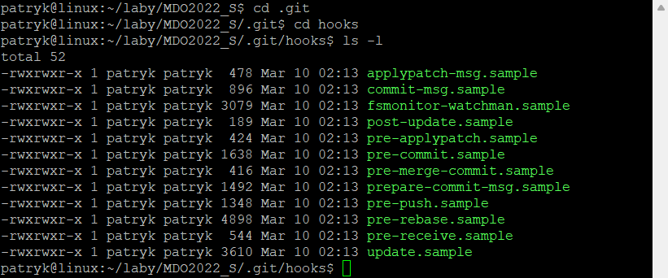
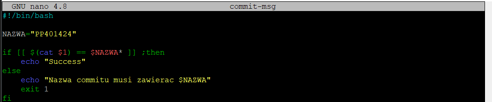
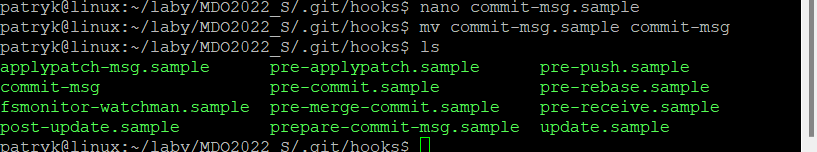
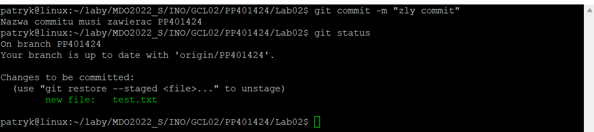
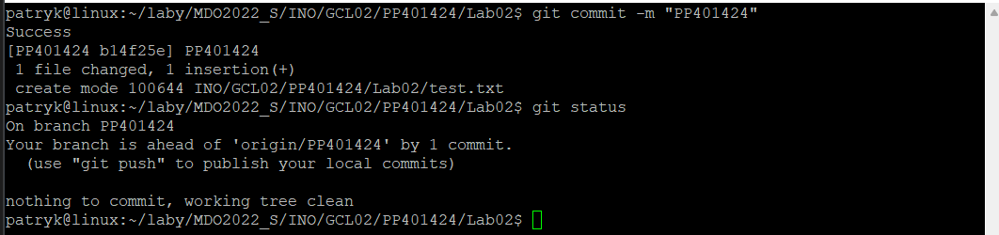
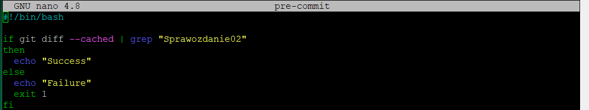
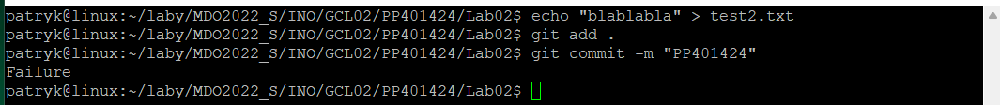
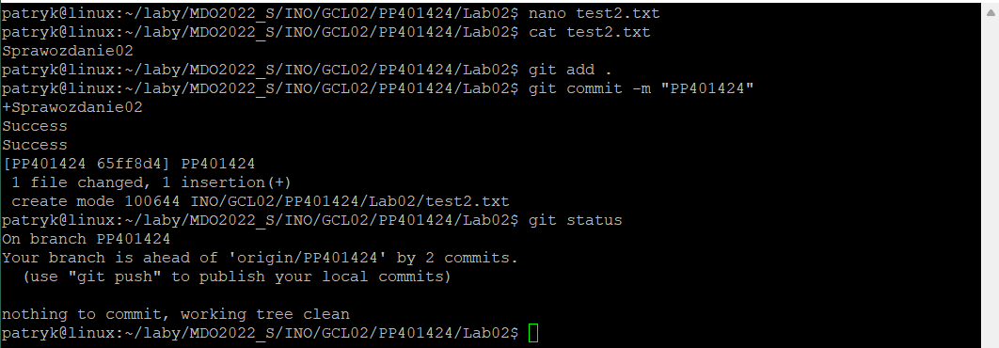

# Sprawozdanie 02
### 14.03.2022
---
**Podpunkt 1**

Najpierw przechodzę do ukrytego katalogu `.git`, a następnie do podkatalogu `hooks`

Edytuję plik `commit-msg.sample`, tak aby skrypt w nim zawarty sprawdzał tytuł commita jest odpowiedni

Zmieniam nazwę pliku z `commit-msg.sample` na `commit-msg`

Działanie skryptu dla niepoprawnych wartości:

Działanie skryptu dla wartości `PP401424`:

Następnie przechodzę do stworzenia drugiego skryptu, którego zadaniem będzie sprawdzenie czy w treści commita jest zawarty numer labu. Postępuje podobnie jak przy poprzednim skrypcie, ale tym razem edytuję plik `pre-commit.sample`

Zmieniam jego nazwę z `pre-commit.sample` na `pre-commit`. Następnie próbuję zrobić commita dla wartości niepoprawnej

I to samo lecz tym razem dla poprawnych wartości

