# Sprawozdanie 02
### 14.03.2022
---
## **Podpunkt 1 i 2**

Najpierw przechodzê do ukrytego katalogu `.git`, a nastêpnie do podkatalogu `hooks`


Edytujê plik `commit-msg.sample`, tak aby skrypt w nim zawarty sprawdza³ tytu³ commita jest odpowiedni


Zmieniam nazwê pliku z `commit-msg.sample` na `commit-msg`


Dzia³anie skryptu dla niepoprawnych wartoœci:


Dzia³anie skryptu dla wartoœci `PP401424`:


Nastêpnie przechodzê do stworzenia drugiego skryptu, którego zadaniem bêdzie sprawdzenie czy w treœci commita jest zawarty numer labu. Postêpuje podobnie jak przy poprzednim skrypcie, ale tym razem edytujê plik `pre-commit.sample`


Zmieniam jego nazwê z `pre-commit.sample` na `pre-commit`. Nastêpnie próbujê zrobiæ commita dla wartoœci niepoprawnej


I to samo lecz tym razem dla poprawnych wartoœci


---

## **Podpunkt 3**

W celu wykazania pracy poprzez ssh sprawdzam status OpenSSH servera poprzez

```shell
$ sudo systemctl status ssh
```

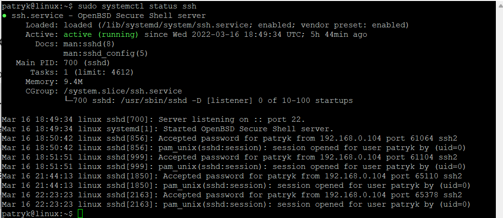

Sprawdzam ip do po³¹czenia siê przez ssh

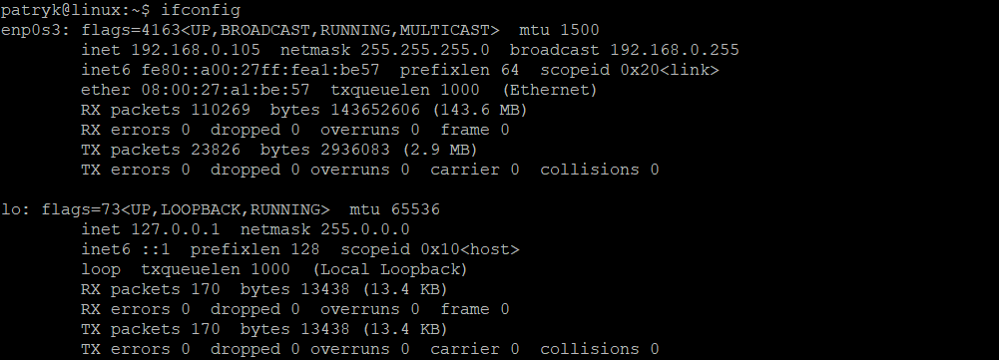

£¹czê siê przez program `PuTTY` z maszyn¹ wirtualn¹ i siê logujê

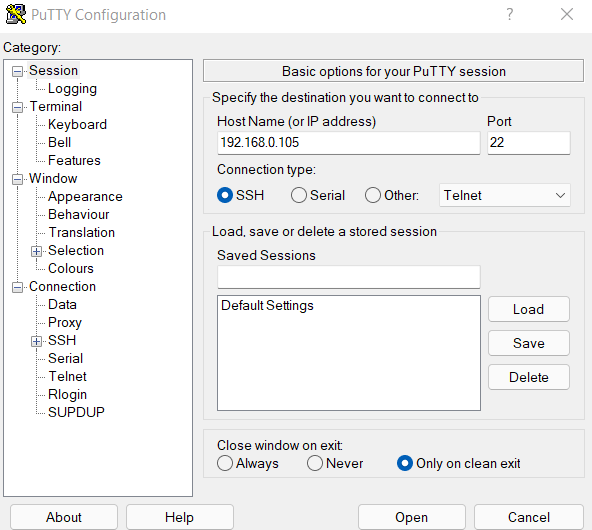

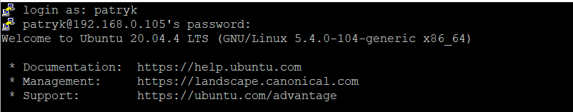

Nastêpnie przechodzê do instalacji dockera. W tym celu aktualizuje listy paczek z repozytoriów

```shell
sudo apt-get update
```

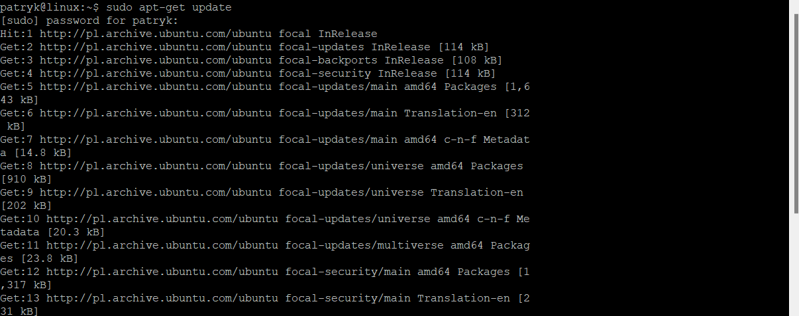

Doinstalowa³em szereg wymaganych dependencji

```shell
$ sudo apt-get install \
>     ca-certificates \
>     curl \
>     gnupg \
>     lsb-release
>     
```

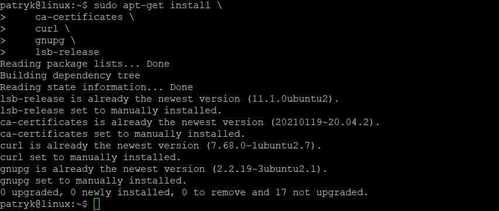

Doda³em oficjalne klucze GPG dockera

```shell
curl -fsSL https://download.docker.com/linux/ubuntu/gpg | sudo gpg --dearmor -o /usr/share/keyrings/docker-archive-keyring.gpg
```

Ustawi³em repozytorium na `stable`

```shell
echo \
  "deb [arch=$(dpkg --print-architecture) signed-by=/usr/share/keyrings/docker-archive-keyring.gpg] https://download.docker.com/linux/ubuntu \
  $(lsb_release -cs) stable" | sudo tee /etc/apt/sources.list.d/docker.list > /dev/null
```

Na koniec zainstalowa³em **Docker Engine**

```shell
 $ sudo apt-get update
 $ sudo apt-get install docker-ce docker-ce-cli containerd.io
```

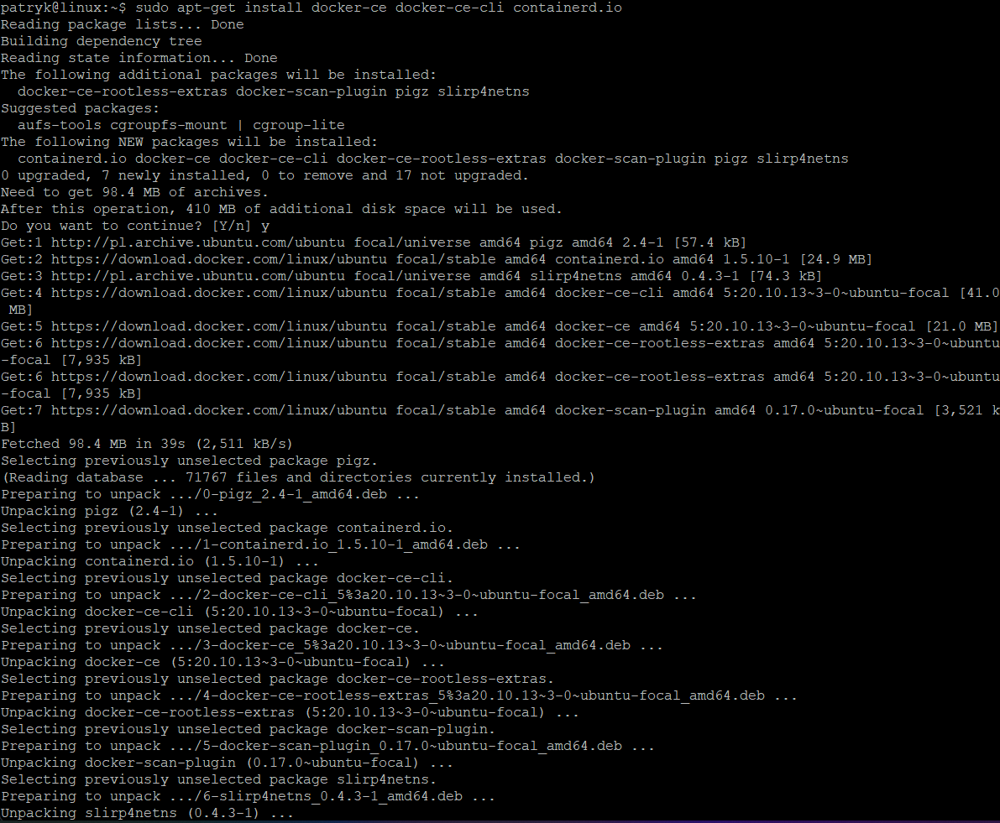

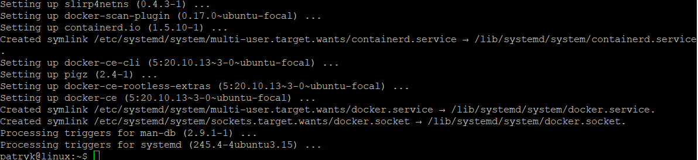

---

## **Podpunkt 4**

Uruchamiam œrodowisko dockera

```shell
$ sudo service docker start
```

Sprawdzam dzia³anie

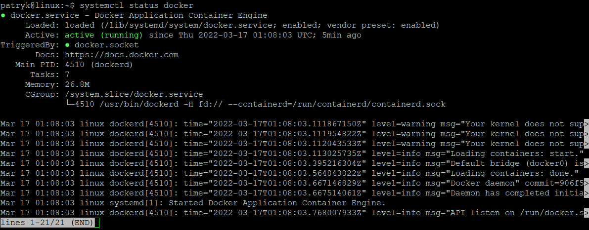

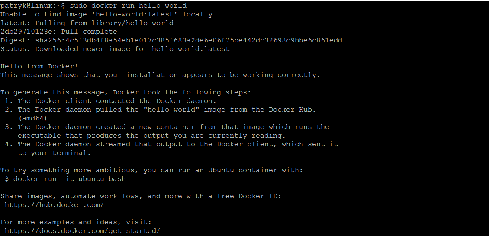

Nastêpnie pobra³em i uruchomi³em obraz linuxa

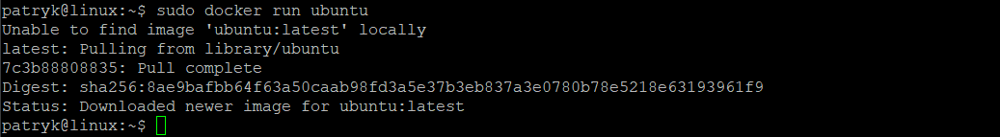

Sprawdzono pobran¹ wersjê obrazu Ubuntu

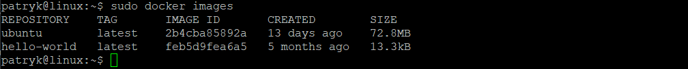

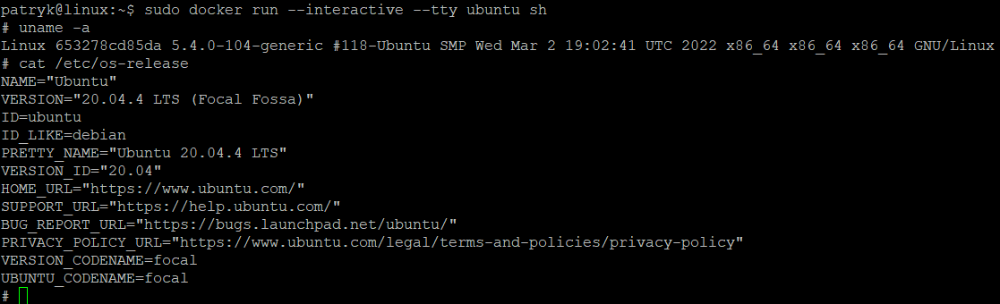

---

## **Podpunkt 5**

Za³o¿y³em konto w serwisie **Docker Hub**

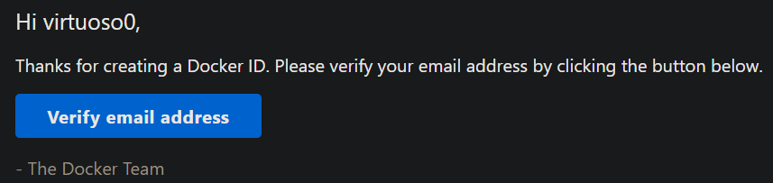

