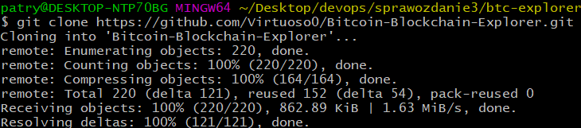
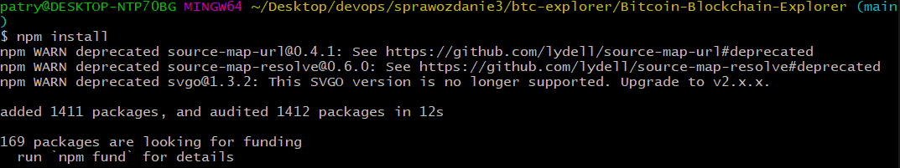
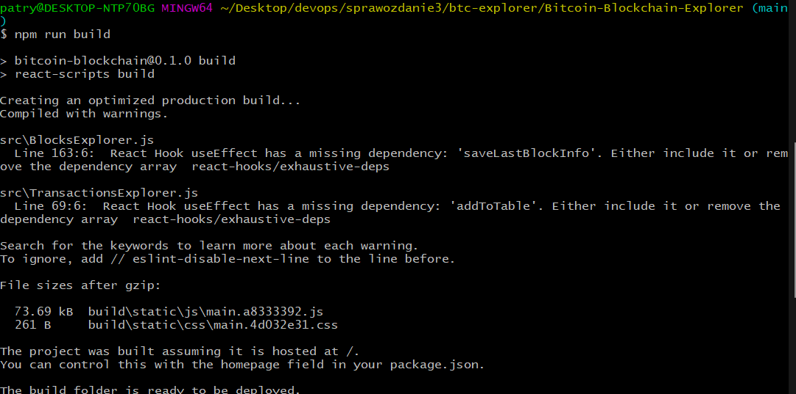
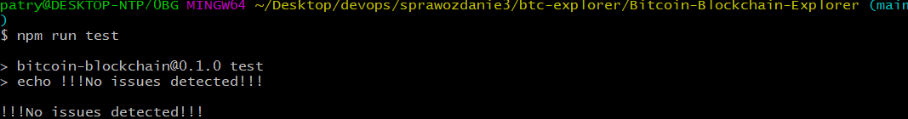

# Sprawozdanie 3
### 27.03.2022
---
## **Wybór oprogramowania na zajęcia**

Wybranym przeze mnie programem jest moja autorska implementacja prostego eksploratora bloków w sieci bitcoin. Projekt został napisany za pomocą React'a, dlatego będę pracował z obrazem node'a.

Na początku sklonowałem repozytorium na maszynę z windowsem.

Doinstalowałem wymagane zależności

Zbudowałem projekt

Puściłem testy

## **Przeprowadzenie buildu w kontenerze**

Pobrałem obraz node

Powtarzam czynności z punktu pierwszego ale tym razem w kontenerze

Wchodzę do kontenera i klonuje repo

Pobieram pakiety

Robie builda

Sprawdzam testy

## **Dockerfile**

Aby zautomatyzować powyższe kroki tworzę dwa pliki dockerfile. Jeden z nich tworzy obraz aż do builda. Drugi na podstawię utworzonego wcześniej obrazu odpala dodatkowo testy.

Pliki dockerfile:

Odpalam pierwszego dockerfila

Odpalam drugiego dockerfila

Tworze dodatkowy image do którego dodałem `npm run start` aby kontener nie zakańczał od razu swojej pracy. Dzięki tek komendzie hostuje on storne na localhost.

Po wpisaniu `docker ps -a` widzimy go jako aktywny kontener

