# Sprawozdanie 4
### 01.04.2022
---
## Zachowywanie stanu

Rozpoczynam od stworzenia dwóch woluminów `volin` oraz `volout`

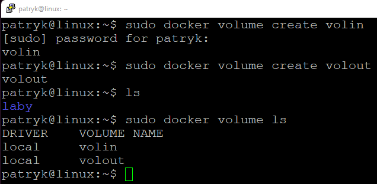

Wyświetlam szczegóły o woluminach znajdując potrzebna informacją do dalszej części sprawozdania

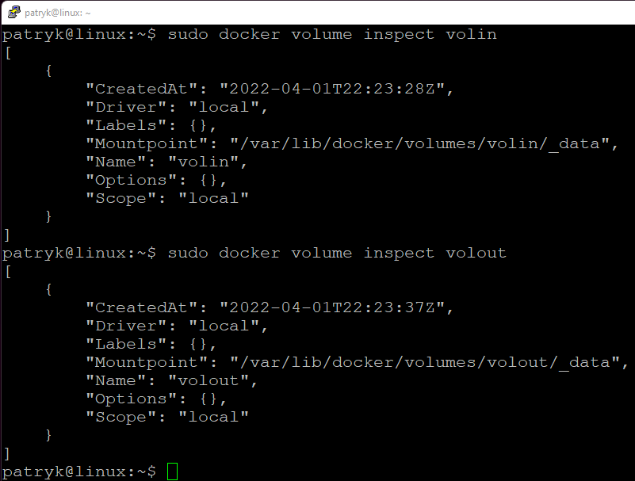

Odpalam kontener wraz z zamontowanymi `volume`

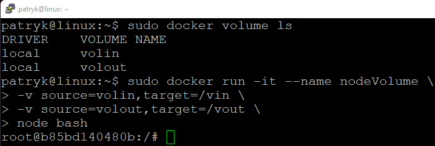

Po wpisaniu `ls` widzimy utworzone katalogi `vin` i `vout`

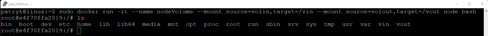

Klonuję repozytorium na wolumin wejściowy `volin`

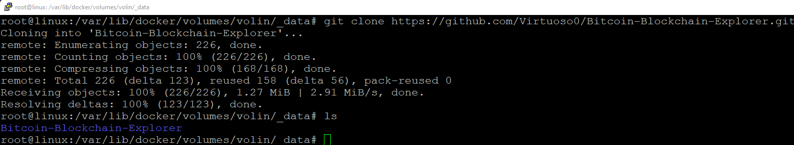

Widok sklonowanego repo z wnętrza kontenera

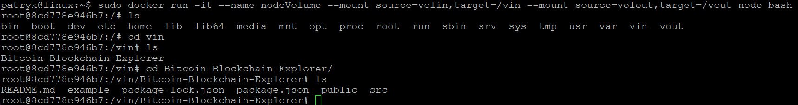

Pobieram potrzebna zależności

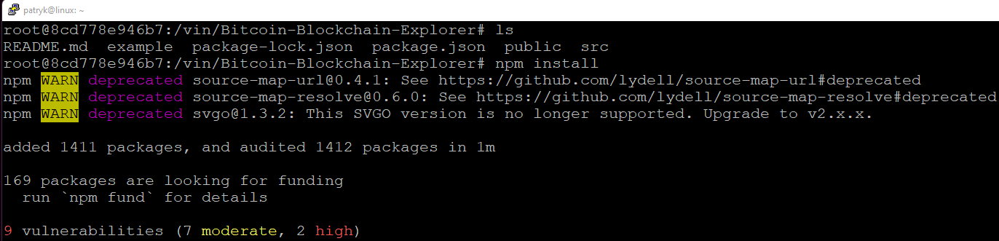

Buduję projekt

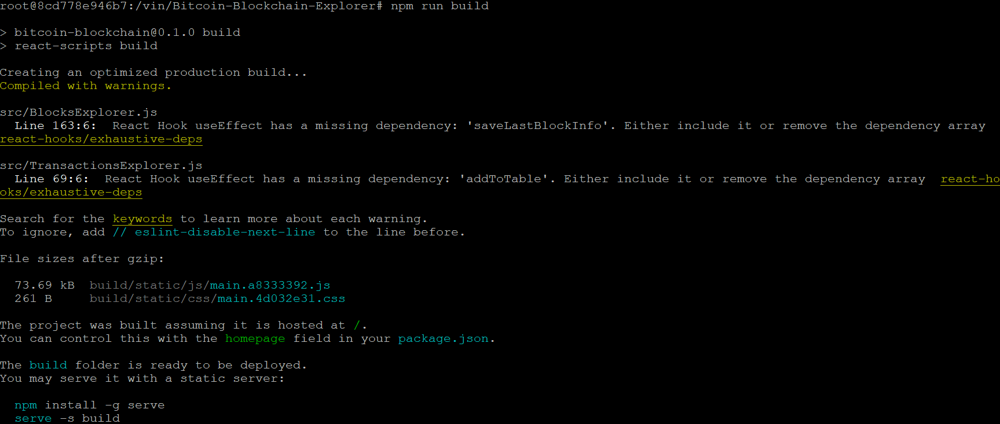

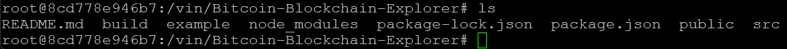

Skopiowałem powstały folder `build` do katalogu `vout`

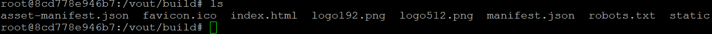

Po wyłączeniu kontenera pliki z woluminu wyjściowego się zachowały

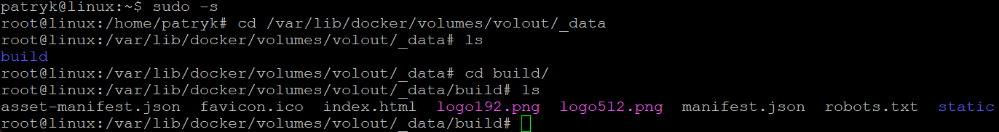

## Eksponowanie portu

Na początku musiałem znaleźć odpowiedni obraz dockerowy z ipref3. Pobrałem go za pomocą `docker pull networkstatic/iperf3` a następnie uruchomiłem 

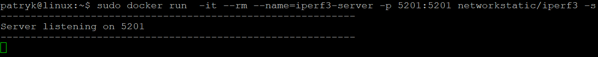

Sprawdzam nasłuchujące porty 

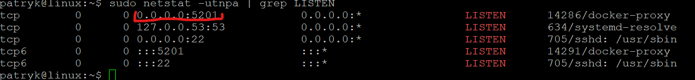

Sprawdzam IP serwera 

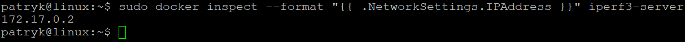

Łączę się z serwerem z drugiego kontenera 

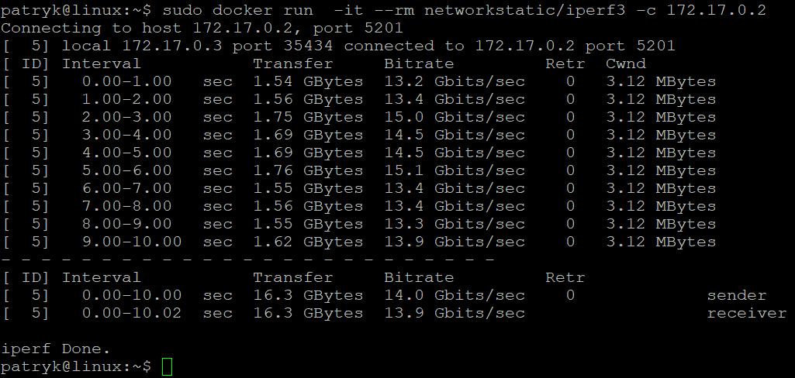

Instaluje ipref3 na hoscie

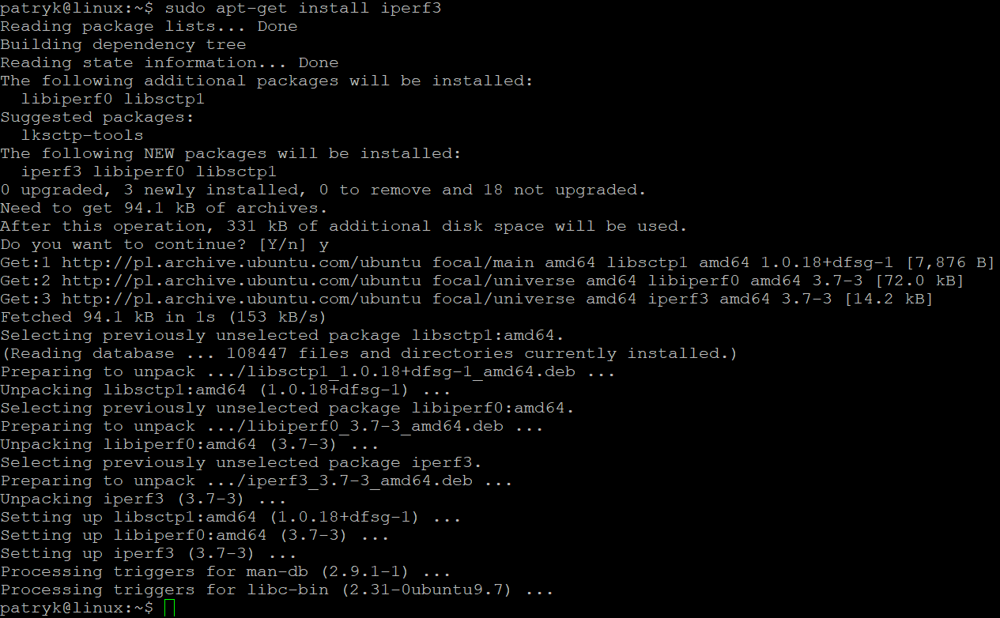

Łącze się z hosta

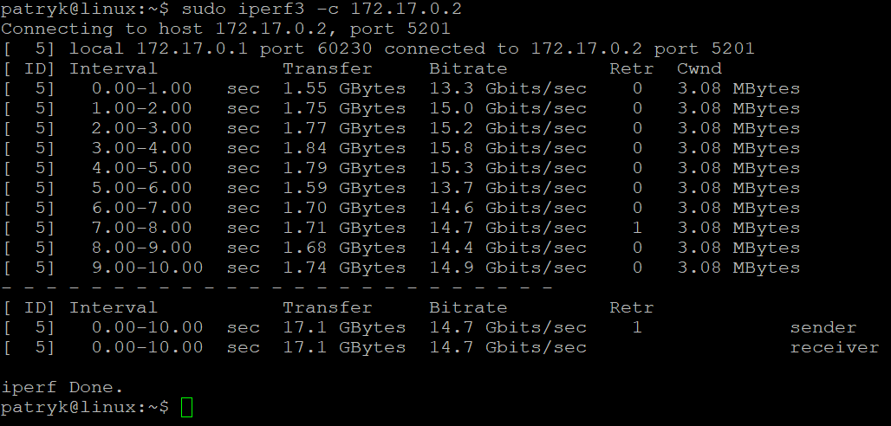

Logi z serwera

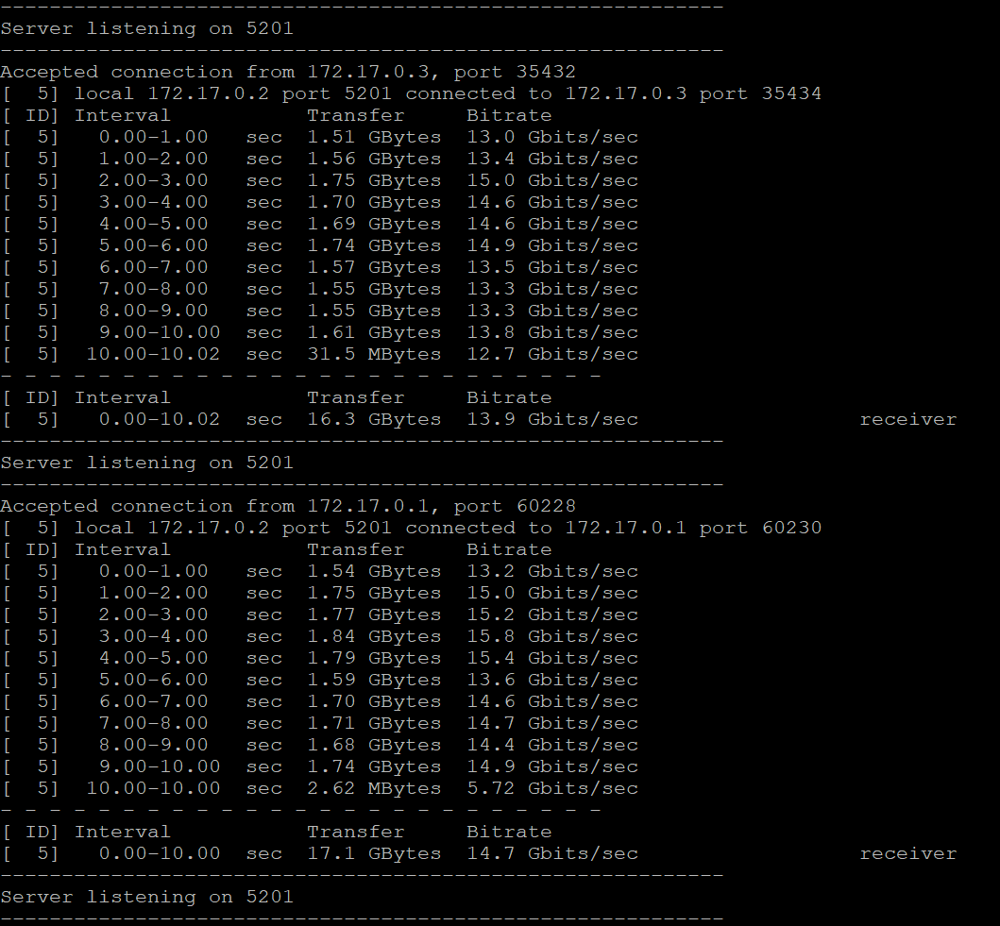

## Instancja Jenkins

Zapoznaję się z dokumentacją

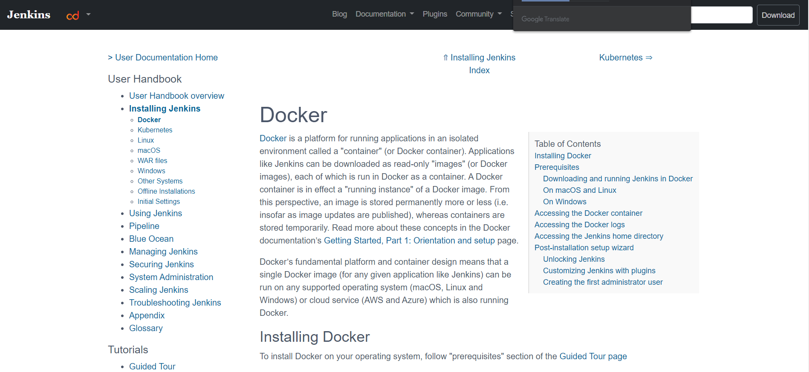

Tworzę nową sieć dockerową

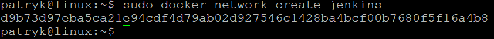

Następnie przeprowadzam instalacje postępując zgodnie z dokumentacją

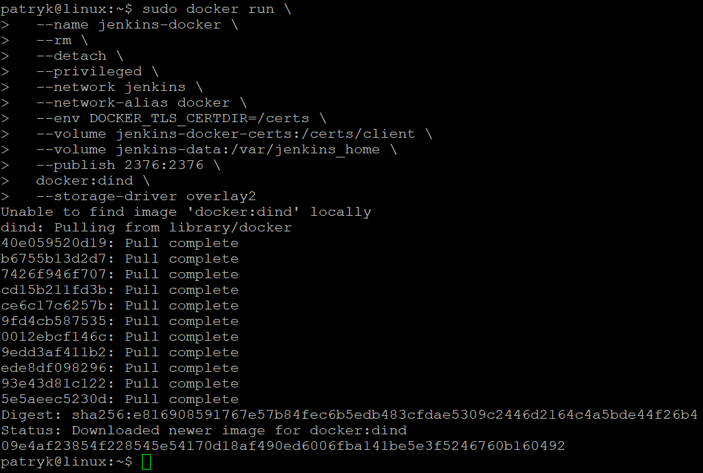

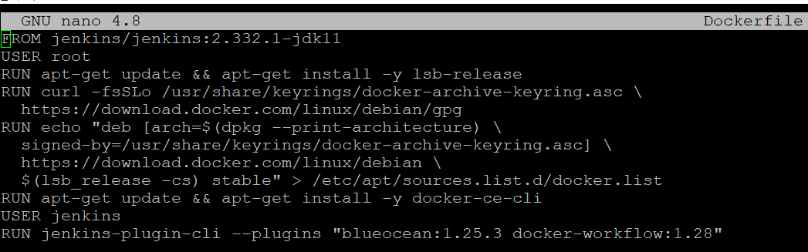

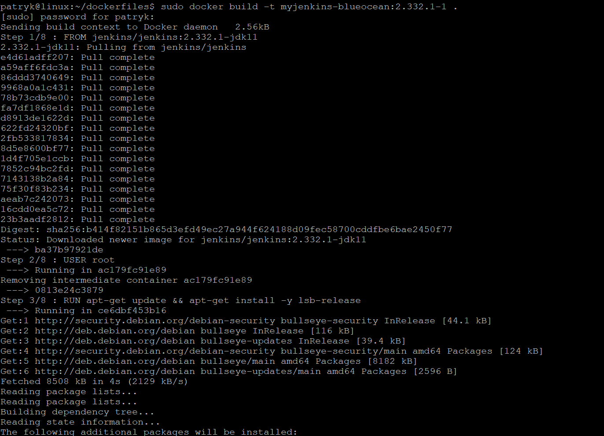

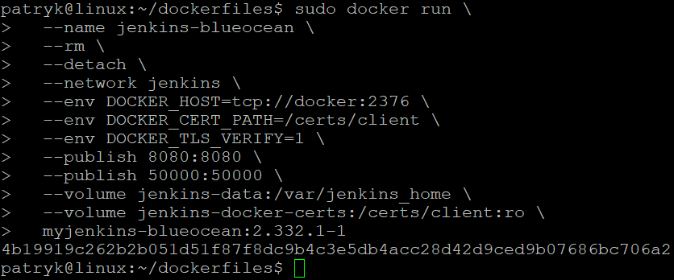

Pokazuję praktycznie, że instancja jest uruchomiona

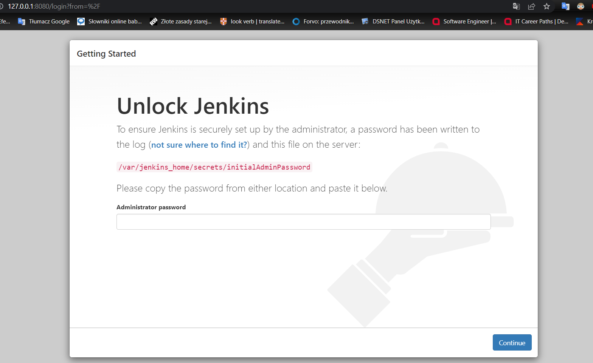

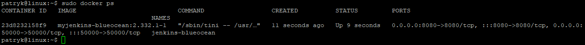

Odczytuje hasło

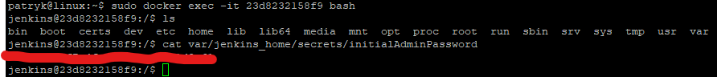

Instaluje zalecane wtyczki

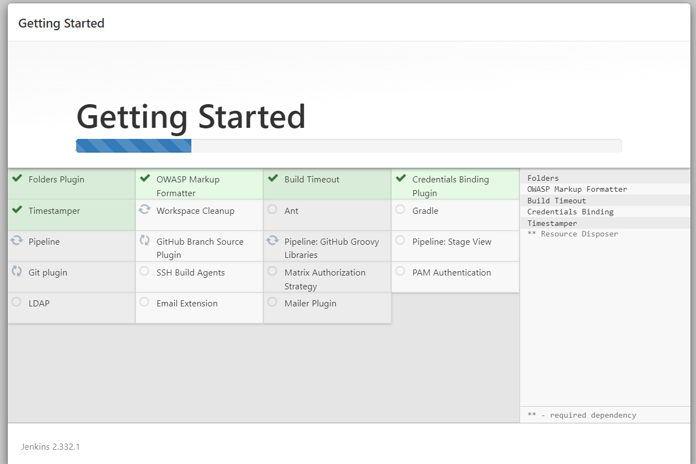

Ekran logowania

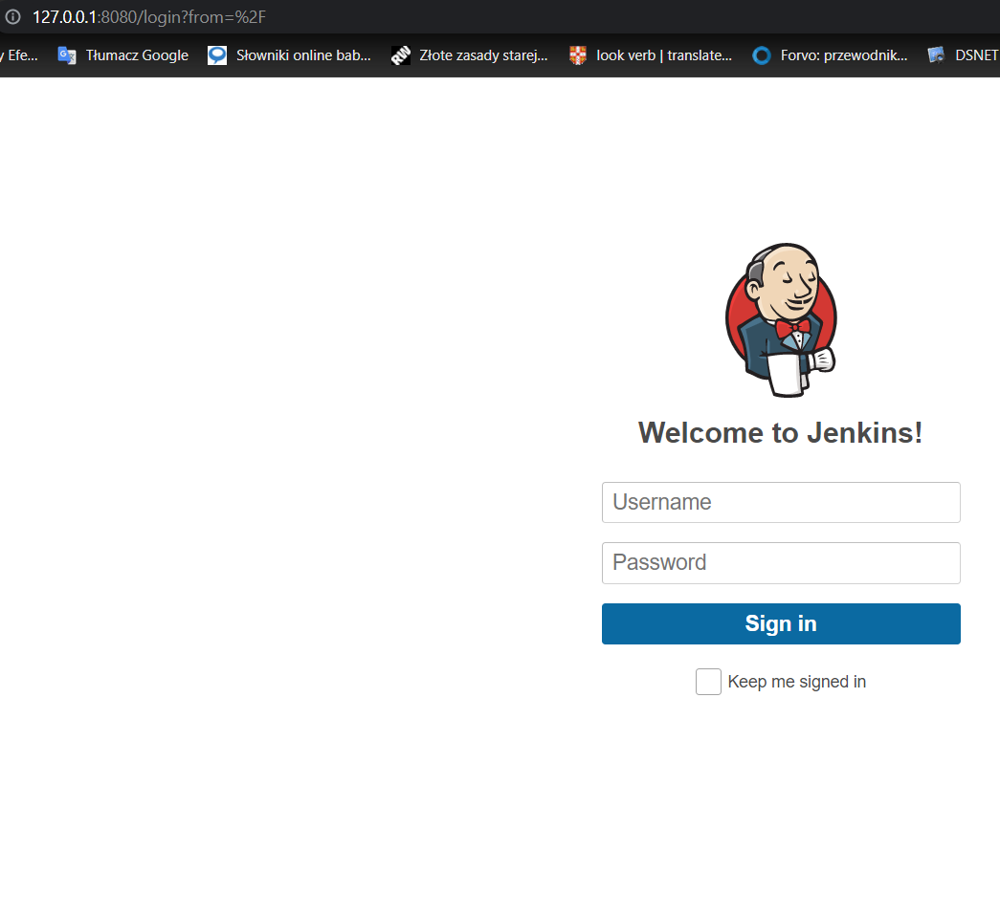