# Sprawozdanie
### 27.05.2022
---
## Przygotowanie wdrożeń nienadzorowanych dla platform z pełnym OS

Wybieram plik instalacyjny Fedory

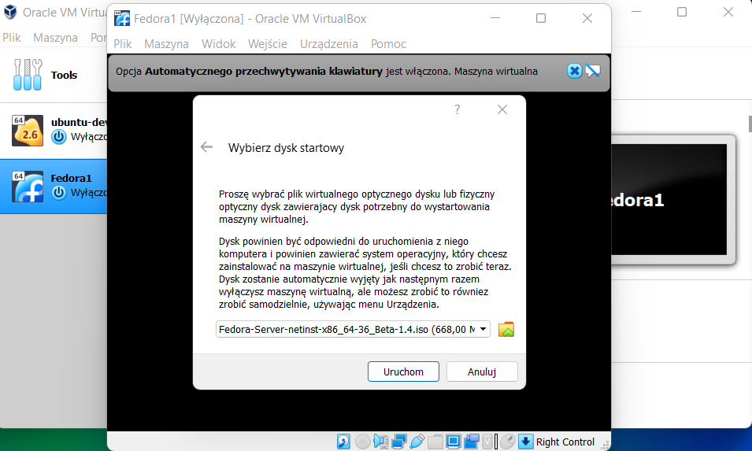

Wstępne sprawdzenie

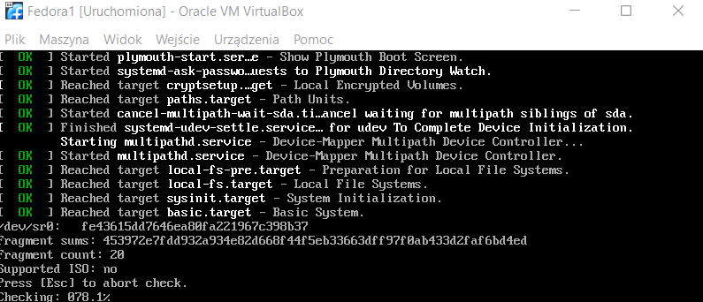

Zostawiam domyślnie język polski

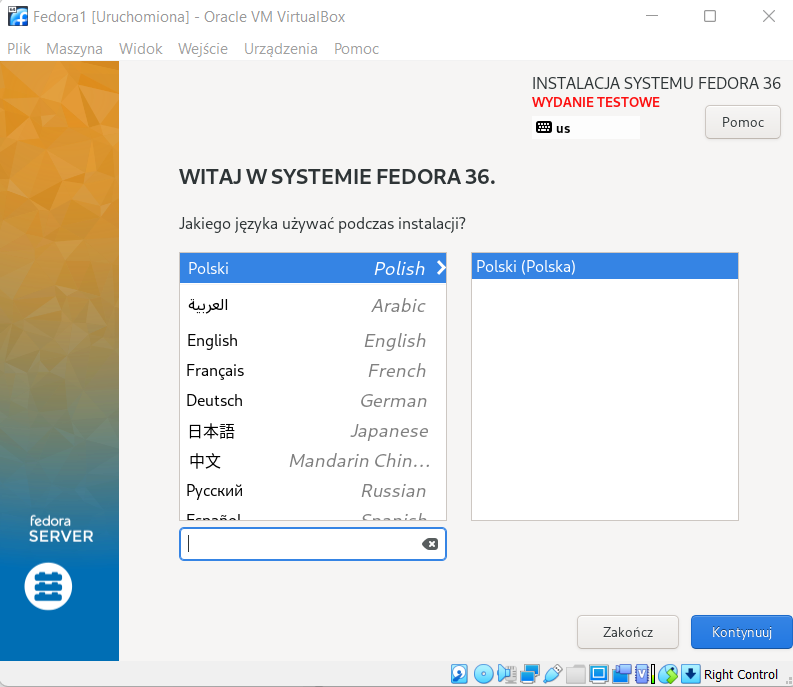

Konfiguruję konto roota i użytkownika

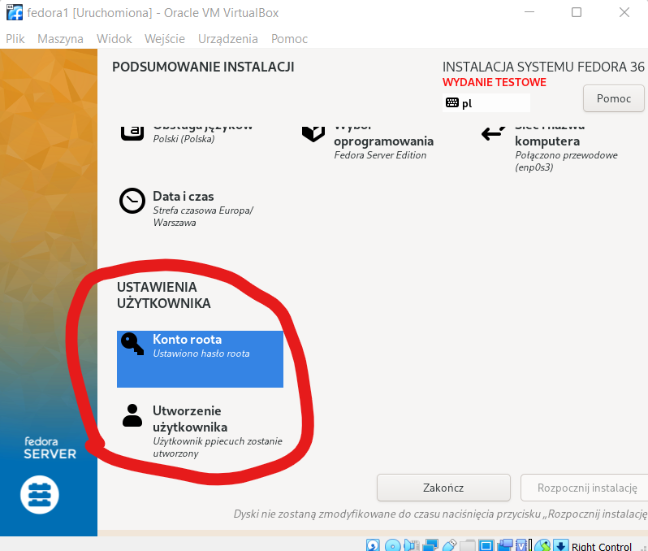

Konfiguruję miejsce docelowe instalacji

Wybieram opcje minimalnej 

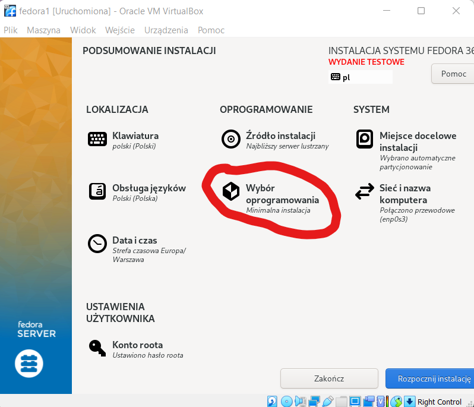

Instalacja zakończyła się powodzeniem :)

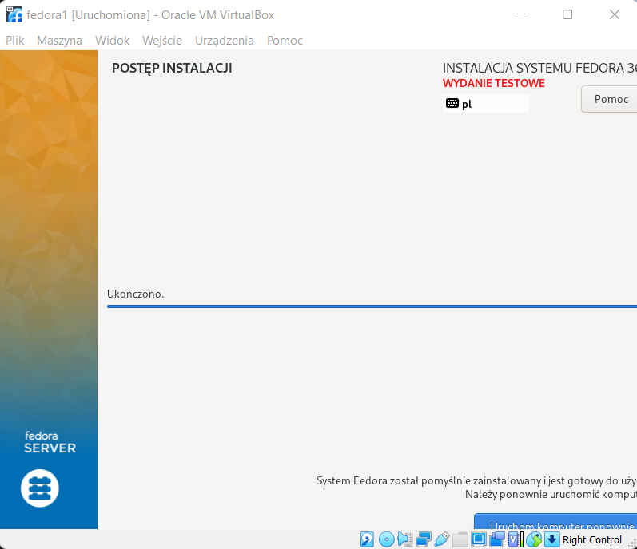

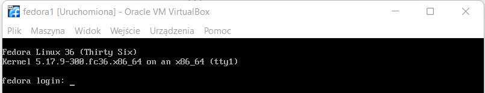

Po zalogowaniu na roota widzimy plik `anaconda-ks.cfg`, który posłuży do automatycznej instalacji

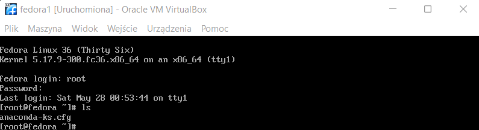

Dla ułatwienia komunikacji między Fedorą a Windowsem konfiguruje połączenie SSH. W tym celu pobieram odpowiednie pakiety i ustawiam w VB przekierowanie portu

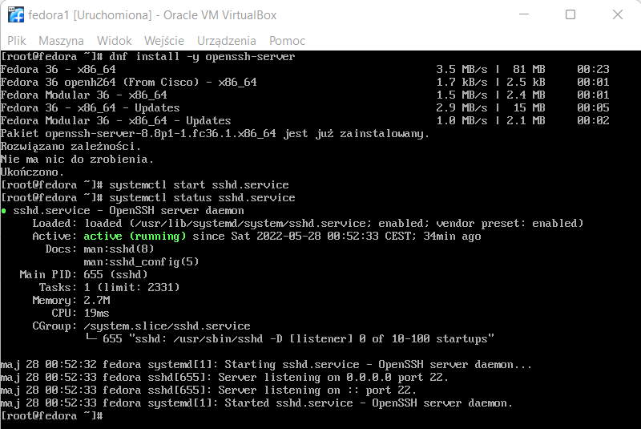

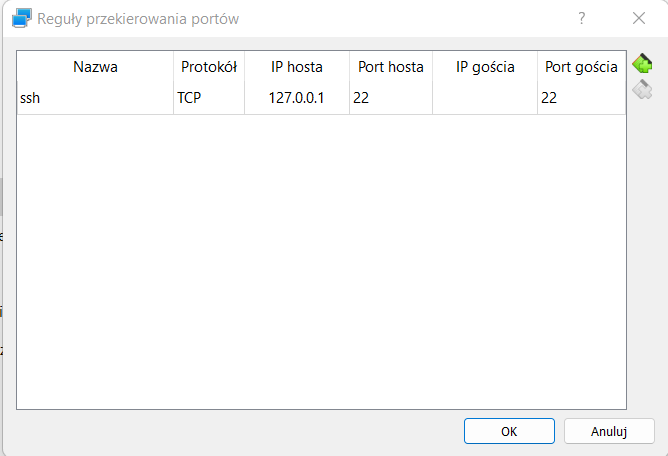

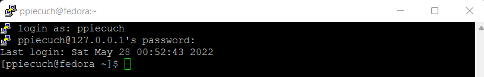

Następnie instaluję drugą Fedore, która posłuży za serwer http. Instalacje i konfiguracje przeprowadzam ze znalezionego poradnika

Polecenia:

`dnf install httpd`  
`dnf group install "Web Server"`  
`systemctl start httpd`  
`systemctl enable httpd`  
`firewall-cmd --add-service=http --add-service=https --permanent`  
`firewall-cmd --reload`

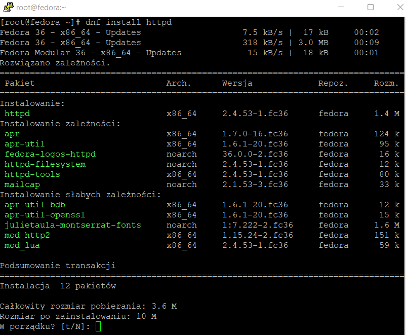

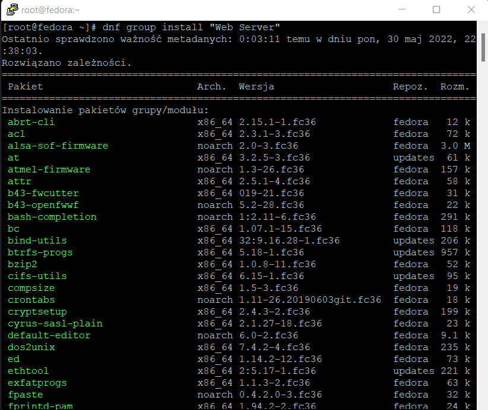

Wrzucam artefakt z pipelinu do odpowiedniego katalogu

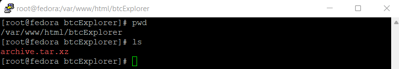

Działający serwer hostujący plik

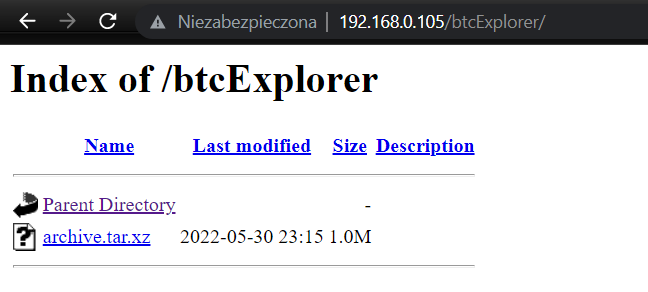

## Instalacja nienadzorowana

Za pomocą `winscp` przenoszę plik `anaconda-ks.cfg` na Windowsa w celu łatwiejszej jego edycji. Edytuję go w następujący sposób:

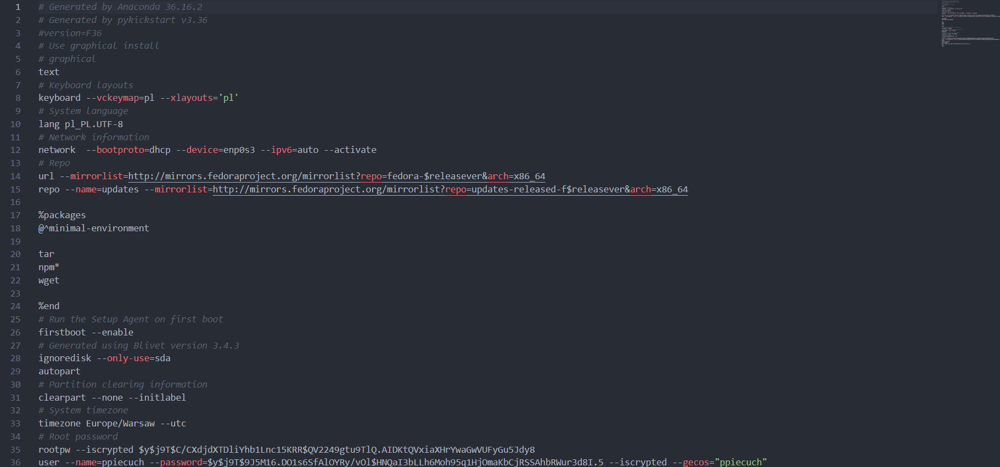

Kopiuje tak przygotowany plik na githuba

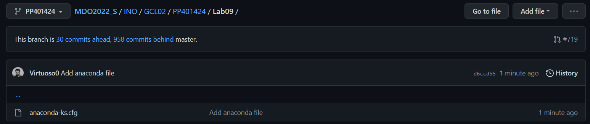

Należy pamiętać, aby korzystać z opcji `raw` w celu pobrania 'czystego' pliku tekstowego zamiast pliku html.

`https://raw.githubusercontent.com/InzynieriaOprogramowaniaAGH/MDO2022_S/PP401424/INO/GCL02/PP401424/Lab09/anaconda-ks.cfg`

Przy instalacji podaje powyższą ścieżkę i odpalam instalacje

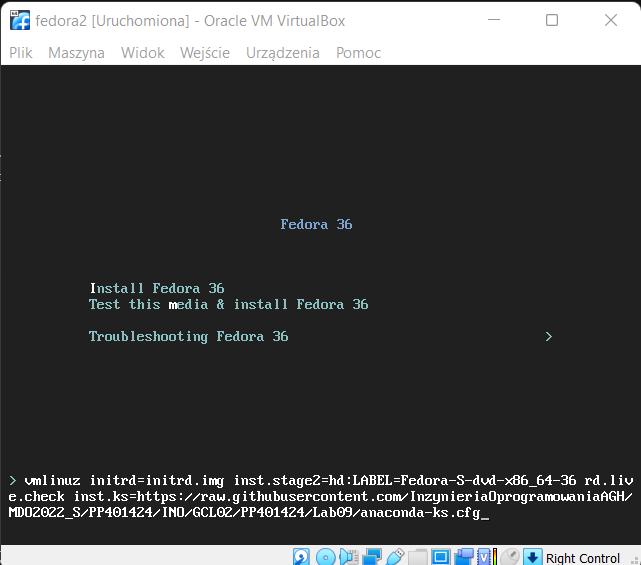

Instalacja zakończyła się sukcesem 

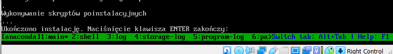

Efekt instalacji:

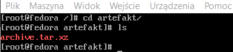