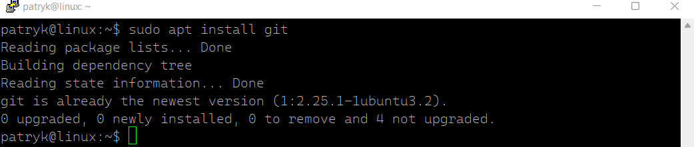
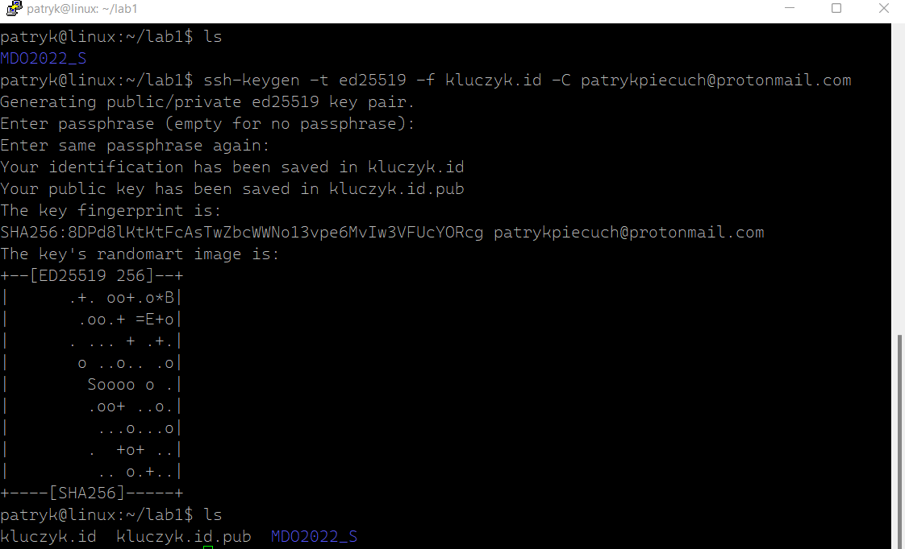
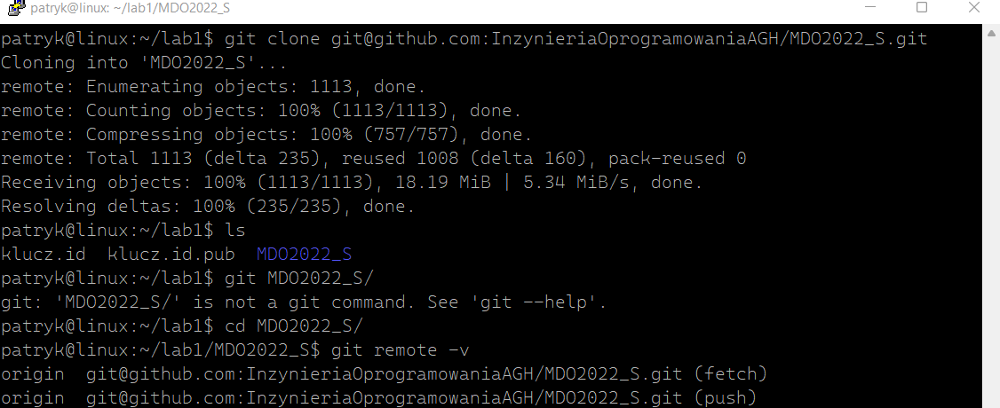
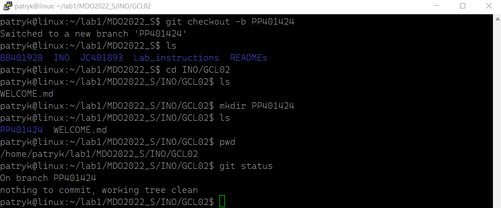

# Sprawozdanie 1
### 07.03.2022r.

System kontroli wersji Git oraz narzędzie służące do obsługi kluczy SSH jest domyślnie instalowane przy instalacji systemu linux Ubuntu server, dlatego nie było konieczności instalowania ich manualnie.

Klonuję repozytorium za pomocą protokołu **HTTPS**.

Generuję nowy klucz **SSH**.

Sprawdzam klucz publiczny oraz sprawdzam jego poprawność poprzez wygenerowanie go za pomocą klucza prywatnego.

Następnie generuję drugi klucz i sprawdzam go w ten sam sposób. Obydwa klucze zostały zabezpieczone hasłem.

Dodaje klucz publiczny do konta na **Github**.

Ponadto dodaje klucz prywatny do **`ssh-agent`**

Narzędzie **Git** mam już skonfigurowane.

Klonuje repozytorium za pomocą **SSH**. Operacja się udała co świadczy o poprawnym wygenerowaniu i dodaniu kluczy.

Przełączam się na gałąź **`main`**.

Następnie przełączam się na gałąź mojej grupy **`INO-GCL02`**.

Tworzę gałąź **`PP401424`**, która wychodzi od gałęzi grupy, oraz tworzę odpowiedni katalog.

Dodaje sprawozdanie oraz zatwierdzam zmiany za pomocą `git add .`

Tworzę commit z komentarzem.

Wysyłam zmiany do zdalnego repozytorium.