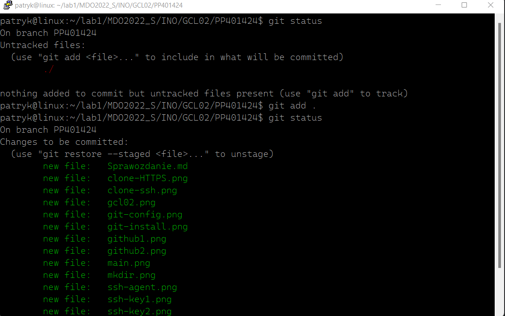

# Sprawozdanie 1
### 07.03.2022r.

System kontroli wersji Git oraz narzêdzie s³u¿¹ce do obs³ugi kluczy SSH jest domyœlnie instalowane przy instalacji systemu linux Ubuntu server, dlatego nie by³o koniecznoœci instalowania ich manualnie.

Klonujê repozytorium za pomoc¹ protoko³u **HTTPS**.

Generujê nowy klucz **SSH**.

Sprawdzam klucz publiczny oraz sprawdzam jego poprawnoœæ poprzez wygenerowanie go za pomoc¹ klucza prywatnego.

Nastêpnie generujê drugi klucz i sprawdzam go w ten sam sposób. Obydwa klucze zosta³y zabezpieczone has³em.

Dodaje klucz publiczny do konta na **Github**.

Ponadto dodaje klucz prywatny do **`ssh-agent`**

Narzêdzie **Git** mam ju¿ skonfigurowane.

Klonuje repozytorium za pomoc¹ **SSH**. Operacja siê uda³a co œwiadczy o poprawnym wygenerowaniu i dodaniu kluczy.

Prze³¹czam siê na ga³¹Ÿ **`main`**.

Nastêpnie prze³¹czam siê na ga³¹Ÿ mojej grupy **`INO-GCL02`**.

Tworzê ga³¹Ÿ **`PP401424`**, która wychodzi od ga³êzi grupy, oraz tworzê odpowiedni katalog.

Dodaje sprawozdanie oraz zatwierdzam zmiany za pomoc¹ `git add .`

Tworzê commit z komentarzem.

Wysy³am zmiany do zdalnego repozytorium.

