# Sprawozdanie
### 22.04.2022
---
## Przygotowujemy pipeline!

 - **Kontener Jenkins i DIND skonfigurowany według instrukcji dostawcy oprogramowania**

Kontener z Jenkinsem i DIND'em został zainstalowany i skonfigurowany według dokumentacji z oficjalnej strony dostawcy oprogramowania na poprzednich laboratoriach, co zostało udokumentowane w sprawozdaniu, dlatego nie widzę sensu w powtarzaniu tych czynności. 

Docker-in-Docker znany jako DIND to kontener, który uruchamia kolejny kontener sam w sobie. Oznacza to, że instancja Dockera wewnątrz kontenera jest w stanie budować kontenery, a także je uruchamiać.

Kontener z Jenkinsem (`myjenkins-blueocean:2.332.1-1`) zawiera system odpowiadający za Web UI oraz operatora Jenkinsa. Możemy połączyć się z nim przez `localhost` na porcie `8080`.

Odpalam dwa kontenery - pierwszy z DIND'em:

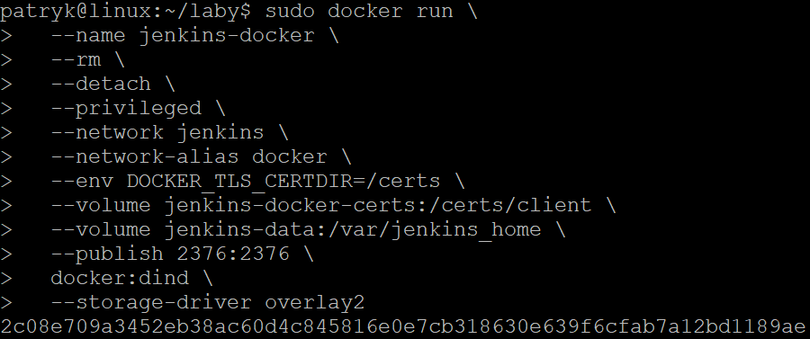

Drugi z Jenkinsem:

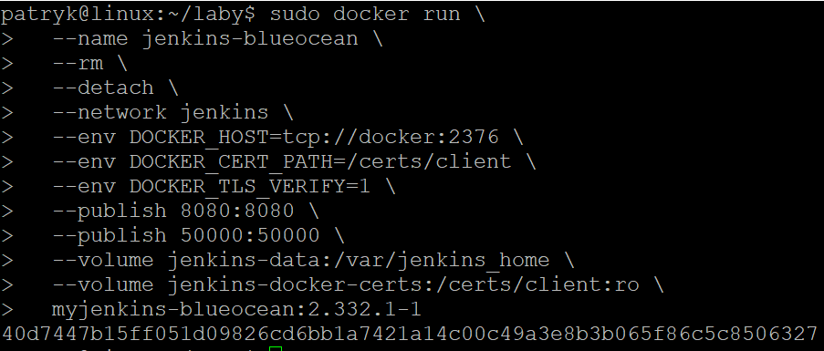

Jak widzimy obydwa kontenery działają:

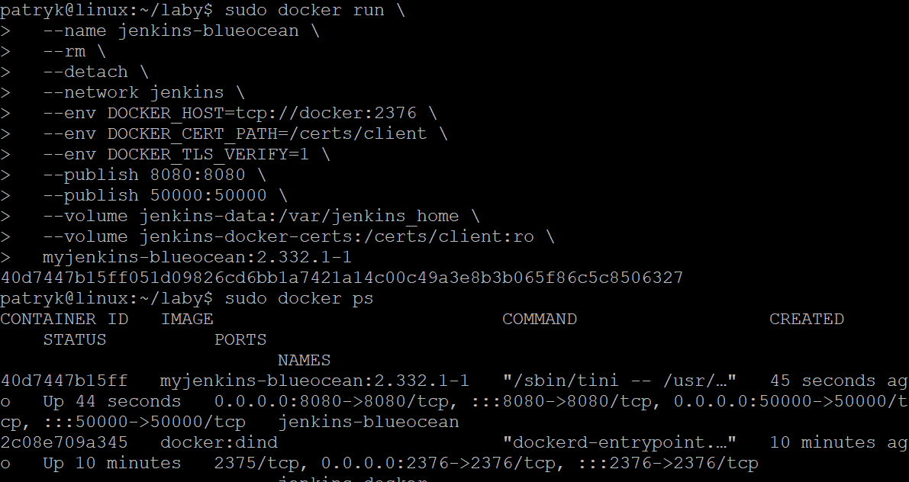

 - **Pliki Dockerfile wdrażające instancję Jenkinsa załączone w repozytorium przedmiotowym pod ścieżką i na gałęzi według opisu z poleceń README**

Wszystkie potrzebne pliki Dockerfile zostały umieszczone na gałęzi `PP401424` w katalogu `Lab05`. Ponadto został tam stworzony plik `Jenkinsfile` zawierający instrukcje pipelinu.

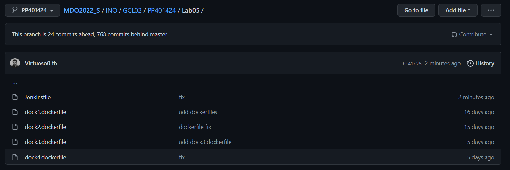

 - **Zdefiniowany wewnątrz Jenkinsa obiekt projektowy „pipeline”, realizujący następujące kroki:Build, Test, Deploy, Publish**

Przed rozpoczęciem właściwych kroków pipelinu Jenkins klonuje zdalne repozytorium przedmiotu `MDO2022_S` w celu pobrania Dockerfilów oraz Jenkinsfila, które są potrzebne w dalszym przebiegu pipelinu. Pliki te znajdują się w `INO/GCL02/PP401424/Lab05/`. W tym celu tworzymy nowy obiekt projektowy `pipeline` o nazwie `rurka1`. **Konfiguracja:**

Ustawiamy dwa parametry `ProgramName` oraz `Version`, które będą odpowiedzialne za nazwę ostatecznego archiwum programu.

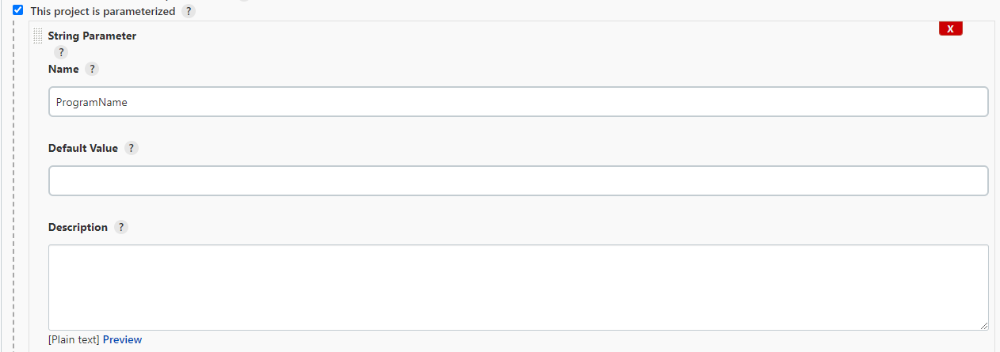

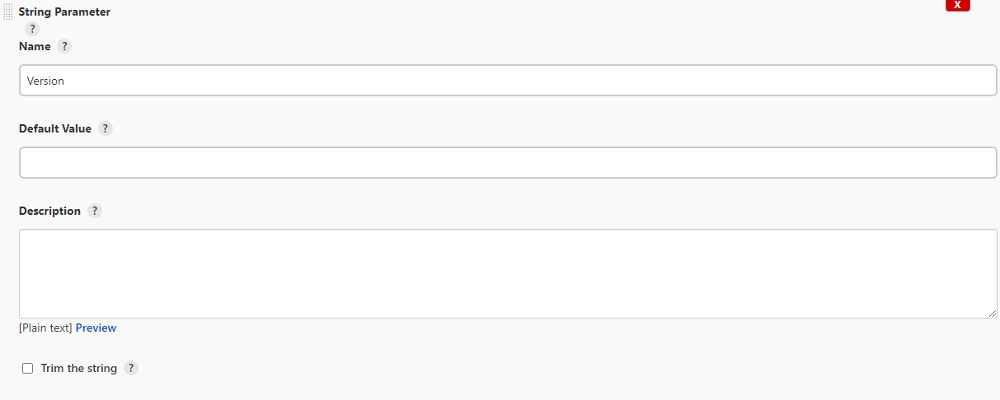

Następnie ustawiam definicję pipelinu na `Pipeline script from SCM`

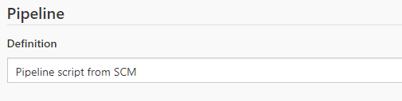

Potem konfigurujemy `SCM` ustawiając URL repozytorium, odpowiedni branch w tym repozytorium oraz ścieżkę do naszego `Jenkinsfila`

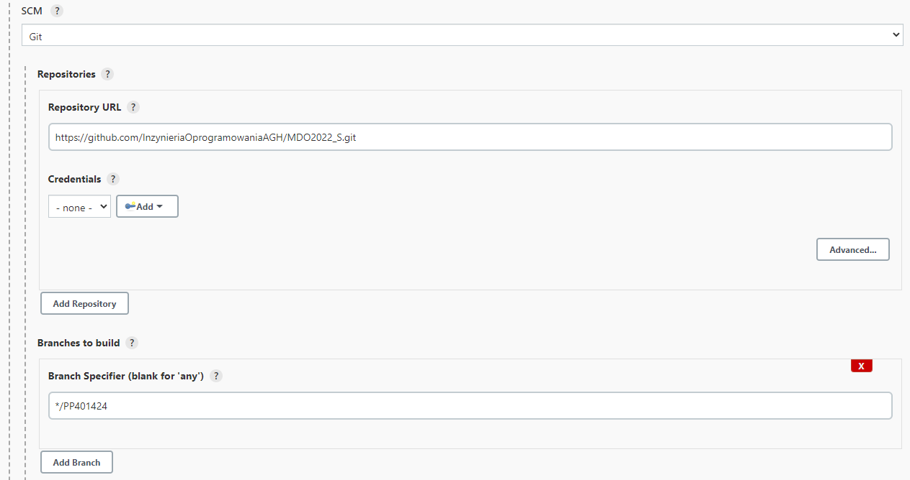

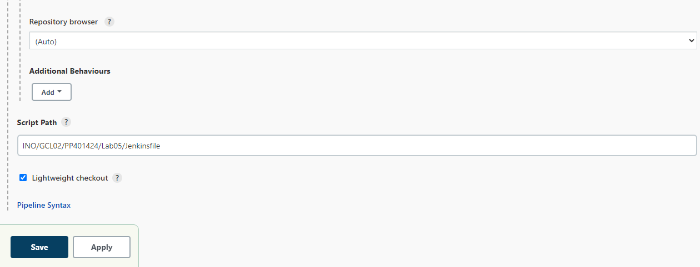

**------------------build------------------**

W kroku `Build` tworzymy obraz `builder` na podstawię obrazu `node`. W tym celu klonujemy repozytorium z naszym projektem i przełączamy się na odpowiednią gałąź. Dzięki poprzedniej konfiguracji jenkins robi to za nas automatycznie.

W sklonowanym repo pod ścieżką `INO/GCL02/PP401424/Lab05` znajduje się plik `dock1.dockerfile`, który tworzy nam wspomniany wcześniej obraz `builder`. Celem tego obrazu jest pobranie wymaganych dependencji poprzez polecenie `npm install` oraz stworzenie zbuildowanych plików które będą nam potrzebne później poprzez polecenie `npm run build`. 

**Nasze zbuildowane pliki będą 'wyciągnięte' z tego kontenera w następnych krokach, dlatego nie podłączam woluminu**

Fragment `Jenkinsfila` odpowiedzialnego za krok `Build`:

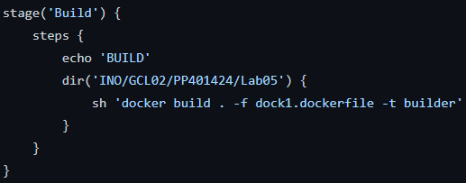

Fragment `Dockerfila` odpowiedzialnego za krok `Build`:

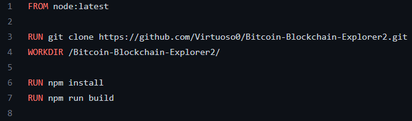

**------------------tests------------------**

Krok testowania polega na utworzeniu obrazu `tester`, który przeprowadzi testy sprawdzające poprawność działania programu. Obraz ten będzie tworzony na podstawię poprzednio utworzonego obrazu `builder`.

Fragment `Jenkinsfila` odpowiedzialnego za krok `Tests`:

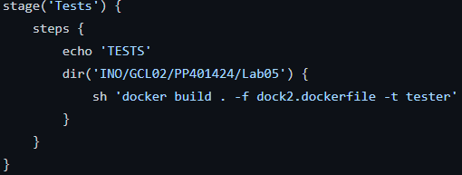

Fragment `Dockerfila` odpowiedzialnego za krok `Tests`:

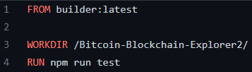

**------------------deploy------------------**

Do kroku `deploy` potrzebne będą nam zbuildowane pliki z buildera. W tym celu uruchamiam obraz `builder` z podłączonym woluminem, na który kopiowany jest folder `build`. Ścieżka tego woluminu znajduje się wewnątrz jenkinsa i prowadzi do jego `workspace`, gdzie znajduje się folder naszego pipelinu `rurka1` oraz sklonowane repo. 

Następnie tworzymy obraz `deploy`, który będzie hostował nasze zbuildowane pliki. Moim wyborem był obraz oparty o `nginx:stable-alpine` ze wzglądu na łatwość konfiguracji. Do jego poprawnego działania wystarczy skopiować folder `build`, który uprzednio wyciągnęliśmy z `buildera`, do `/usr/share/nginx/html`.

Po stworzeniu obrazu odpalamy obraz `deploy` podając mu ścieżkę do folderu build. Ponadto ustawiamy przekierowanie portu z 80, na którym domyślnie działa `nginx` na port 3000, dzięki czemu możemy wejść na naszą hostowaną stronę poprzez `localhost`.

Po odpaleniu tego kontenera zdecydowałem się na natychmiastowe jego wyłączanie tak aby pipeline nie czekał w nieskończoność na zakończenie jego pracy.

Fragment `Jenkinsfila` odpowiedzialnego za krok `Deploy`:

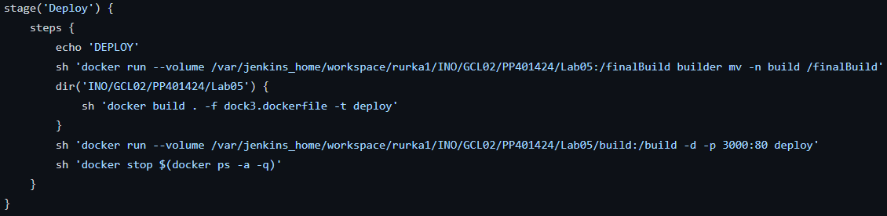

Fragment `Dockerfila` odpowiedzialnego za krok `Deploy`:

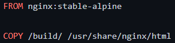

**------------------publish------------------**

Ostatnim krokiem jest publikacja naszej aplikacji. Z powodu trudności z publikacją na npm zdecydowałem się zapakować mój `build` do archiwum.

Pipeline posiada parametry służące do nadania odpowiedniej nazwy dla ostatecznego archiwum:

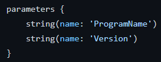

Podajemy je podczas próby uruchomienia pipelinu:

 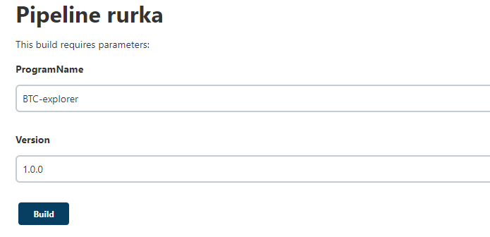

Ale ze względu na różnego rodzaju trudności nie byłem w stanie poprawnie nazwać archiwum (odmowa dostępu podczas zmiany nazwy pliku oraz brak możliwości zmiany praw dostępu). Próbowałem dodawać argumenty podczas buildu obrazu `publisher`, ale też mi się nie powiodło :(

Dlatego program ma nazwę `archive.tar.xz`

Fragment `Jenkinsfila` odpowiedzialnego za krok `Publish`:

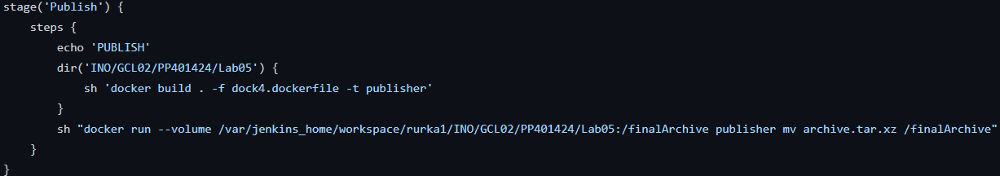

Fragment `Dockerfila` odpowiedzialnego za krok `Publish`:

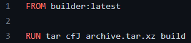

Dla sprawdzenia wchodzimy do 'wnętrza' jenkinsa i widzimy, że archiwum `archive.tar.xz` tam jest:

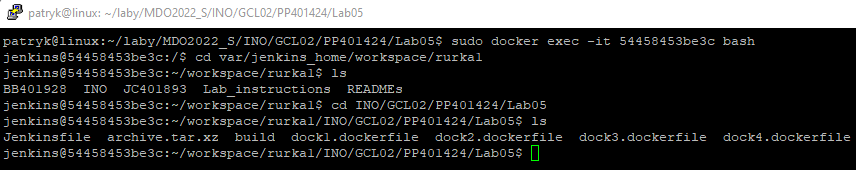

## Logi z przebiegu pipelinu

Sklonowanie repo przedmiotu przez jenkinsa:

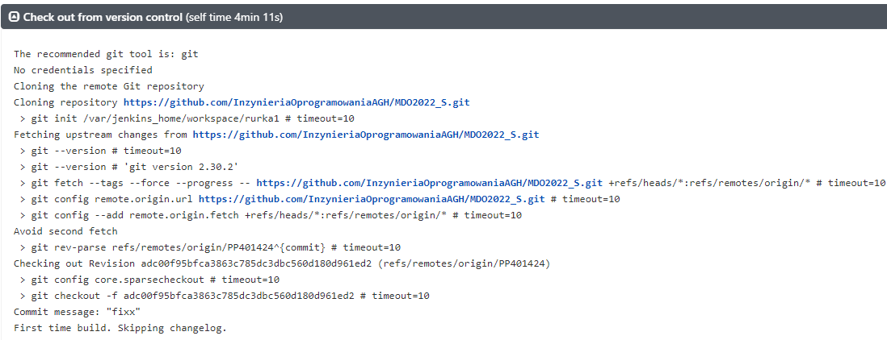

**------------------build------------------**

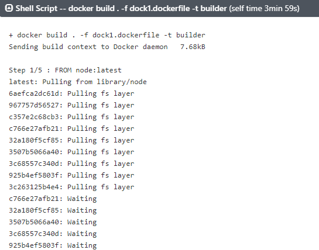

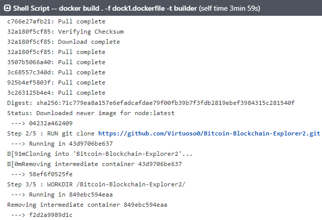

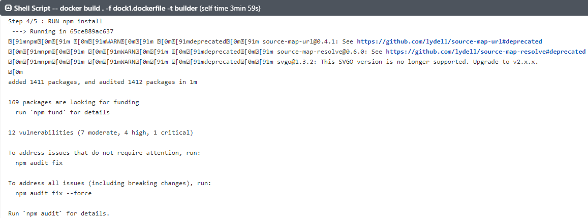

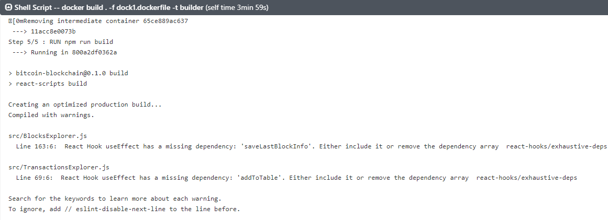

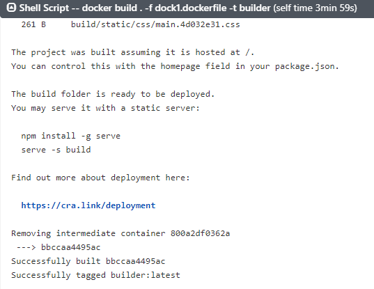

**------------------tests------------------**

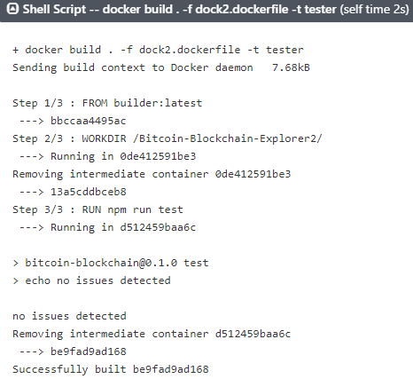

**------------------deploy------------------**

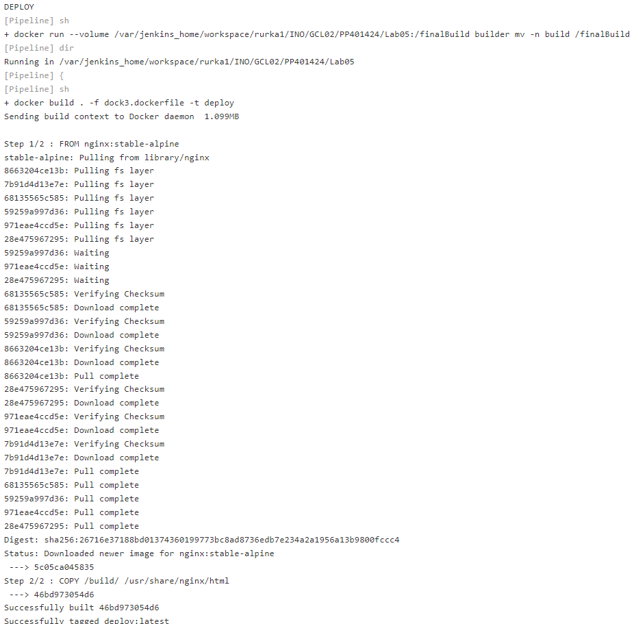

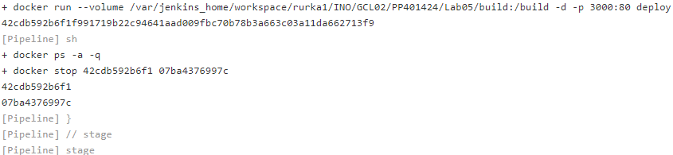

**------------------publish------------------**

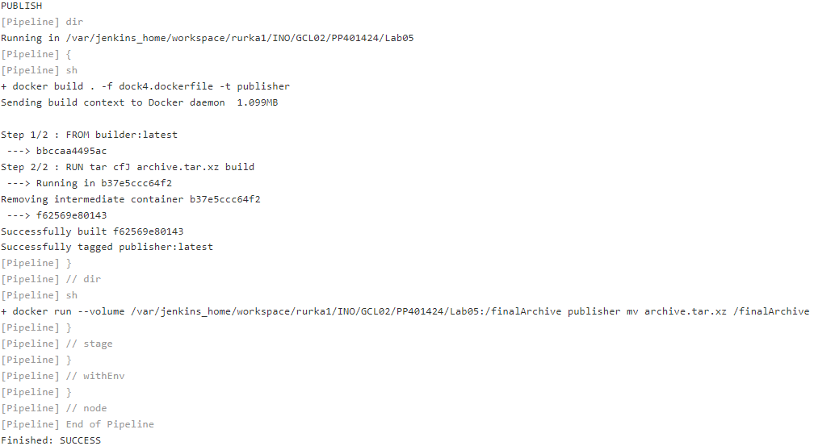

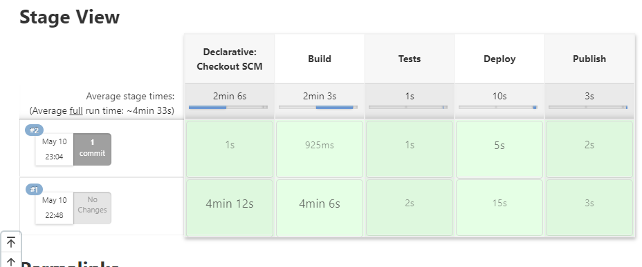
