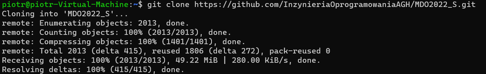
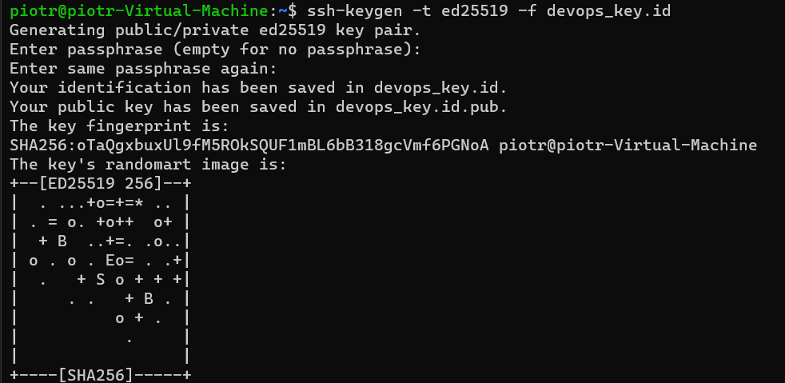
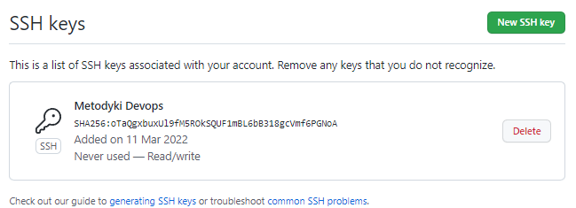
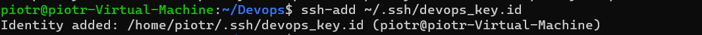
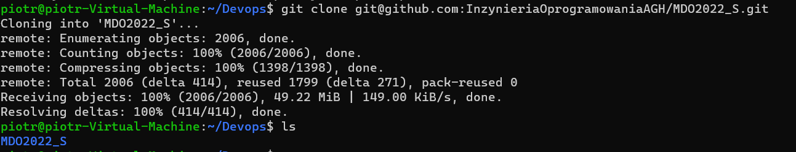
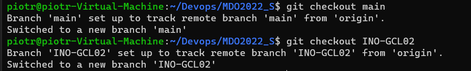
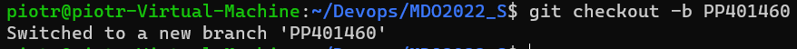

# Sprawozdanie z laboratorium nr. 1
## Piotr Pyka

Na początku zainstalowano gita

Klonowanie po https

Wygenerowano klucz ssh ed25519 przy pomocy ssh-keygen.

Wygenerowano drugi klucz ssh ecdsa tym razem zabezpieczony hasłem

Na ponizszym screennie widać jak działa zabezpieczanie hasłem

Dodano klucz publiczny jednej z par kluczy ssh do konta github

Dodano prywatny klucz jednej z par kluczy ssh do agenta ssh

Sklonowano repozytrium po ssh

Przełączono się na gałąź main, a potem na gałąź INO-GCL02

Stworzono nowy branch o nazwie PP401460

Następnie utworzono katalog PP401460 a w nim katalog Lab01

