# Piotr Pyka Lab02

## Przygotowanie git hooks

W celu sprawdzania commit messageów zmodyfikowano plik `.git/hooks/commit-msg`

Skrypt sprawdzający czy tytuł commita nazywa się PP401460 oraz czy w treści commita pada numer labu.

Ścieżka do pliku z messagem znajduje się w argv[1]. Plik ten wczytujemy, splitujemy po nowej lini sprawdzając czy pierwsza część to 401460 oraz czy w drugiej części znajduje się wyrażenie 'Lab02'.

``` python
#!/usr/bin/python3

import sys
from subprocess import check_output

# Collect the parameters
commit_msg_filepath = sys.argv[1]

lab_no = 'Lab02'
correct_title = '401460'

with open(commit_msg_filepath, 'r') as f:
    content = f.read()
    try:
        print(content)
        [title, desc] = content.split('\n',1)
        # cannot unpack
    except ValueError as error:
        print(f"commit-msg: ERROR! Use -m 'title' -m 'description' format")
        sys.exit(1)
    if title != correct_title or not lab_no in desc:
        print(f"commit-msg: ERROR! The commit message must contain {lab_no} and have '{correct_title}' as title")
        sys.exit(1)
```


## Przygotowanie środowiska Dockerowego
- Zapewnienie dostępu do maszyny wirtualnej przez ssh

Na maszynie Ubutnu działa demon sshd

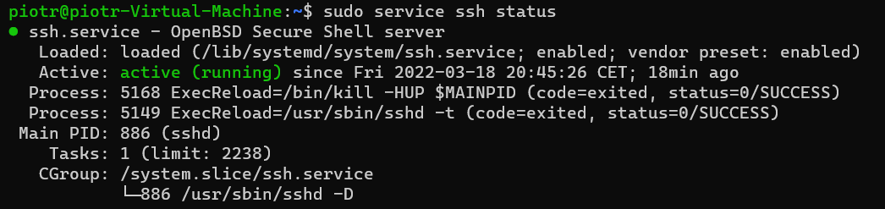

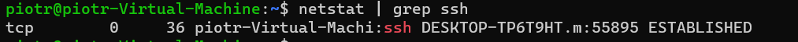

- Zainstalowano środowisko dockerowe

Zaktualizowano indeksy apt a następnie pobrano kilka pakietów

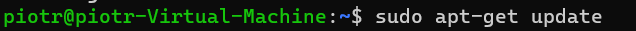
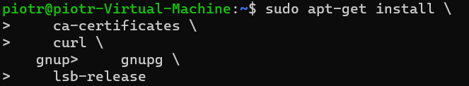

Dodano klucz GPG Dockera

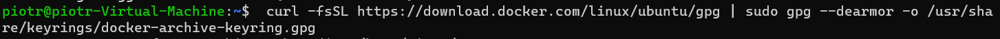

Ustawiono by sciągane zostało repozytorium w wersji stable

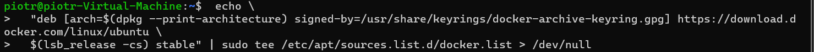

Na końcu zainstalowano Docker Engine za pomocą apt

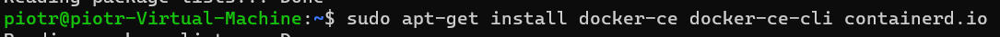

## Działanie środowiska

- Sprawdzenie działania - sprawdzenie z definicji

Demon dockera jest aktywny

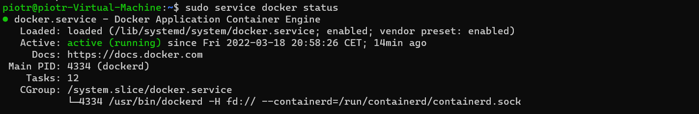


- Sprawdzenie działania - sposób praktyczny

Pobranie obrazu Debiana

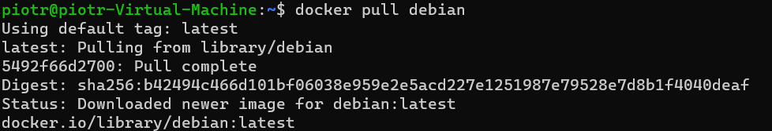

Z racji, iż pierwszym procesem uruchamianym w kontenerze jest bash, aby kontener nie kończył odrazu pracy należy dodać standardowe wejście oraz terminal przy pomocy flag --interactive oraz --tty. 

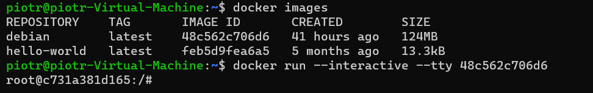

Wyświetlenie numeru wersji wewnątrz kontenera

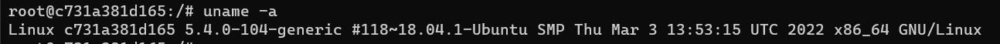

Jest to to samo jądro co w przypadku maszyny wirtualnej Ubuntu na której zainstalowany jest Docker.

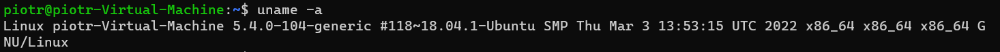

Na końcu założono konto na DockerHub
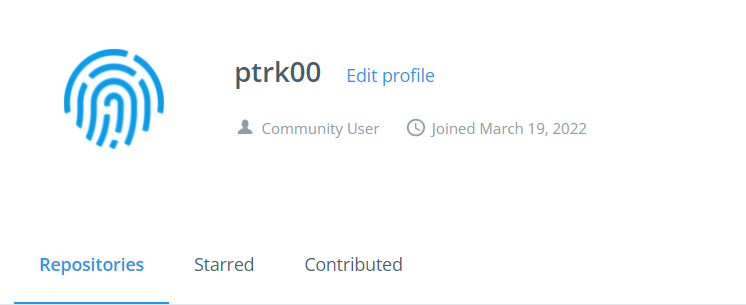

link do profilu -> https://hub.docker.com/u/ptrk00