## Piotr Pyka
## Sprawozdanie z laboratorium nr 3 

### Wybranie repozytorium

Na początku wybrano repozytorium gita

`https://github.com/adsr/mle`

Jest to terminalowy edytor tekstu.

Projekt ten
 - posiada licencje `Apache`
 - posiada skrypt Makefile ktory pozwala na uruchomienie buildu
 - posiada zdefiniowane testy które można uruchomić jako jeden z targetów Makefile
 

## 1. Wybór oprogramowania
### Budowanie projektu

Najpierw zainstalowano wyamgane zależności

`sudo apt-get install git build-essential libtool automake`

Sklonowano repozytorium

`git clone --recursive https://github.com/adsr/mle.git`

Następnie wykonano build 

`cd mle`

`make mle_vendor=1`

Zbudowana została binarka

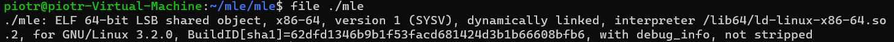

Działanie programu

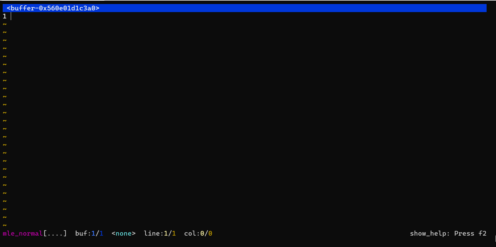

### Uruchomienie testów

Przed urchomieniem testów należało pobrać kilka dodatkowych zależności

`sudo apt-get install uthash-dev liblua5.3-dev libpcre3-dev`

Urchiomienie testów

`make test`

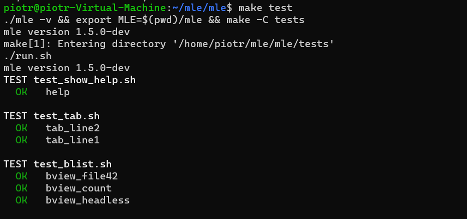

...

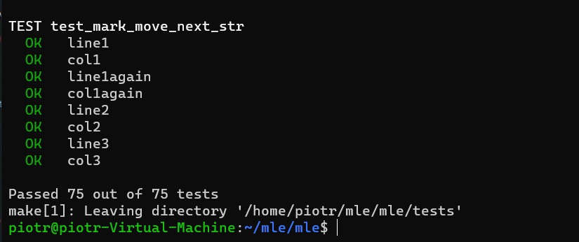

Jak widać wszytskie testy wykonały się pomyślnie

## 2. Przeprowadzenie buildu w kontenerze

Pobrano kontener ubuntu

`docker pull ubuntu`

Następnie uruchomiono kontener podłanczając się jednocześnie TTY

`docker run -it ubuntu`

Następnie zaopatrzono kontener we wszystkie wstępne wymagania

`apt update`

`apt-get install git build-essential libtool automake`

Sklonowano repozyorium

`git clone --recursive https://github.com/adsr/mle.git`

Uruchomiono build

`cd mle && make mle_vendor=1`

Zbudowano binarke
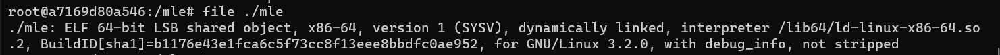

Przed uruchomieniem testów zaciągnięto konieczne zależności

`apt-get install uthash-dev liblua5.3-dev libpcre3-dev`

i uruchomiono testy

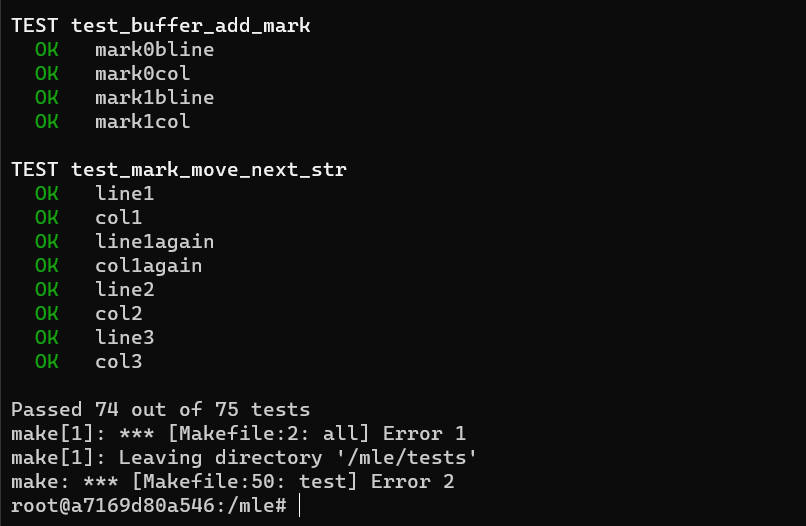

Niestety jeden z testów nie przechodził. Po analizie kodu źródłowego można było przypuszczać, że problem leży w kodowaniu. Problem został później rozwiązany poprzez ustalenie odpowiedniego kodowania znaków.


Dockerfile dla obrazu dla kontenera z buildem

``` Dockerfile
FROM ubuntu:latest

RUN apt update
RUN apt-get -y install git build-essential libtool automake 

RUN git clone --recursive https://github.com/adsr/mle.git
WORKDIR mle
RUN make mle_vendor=1
```
Obraz bazuje na ubuntu (`FROM ubuntu:latest`). Przez uruchominiem make aktualizujemy
liste pakietów i następnie dociągamy konieczne zależności. Wymagana jest tu flaga -y, która powoduje, nie jest wymagany input od użytkownika potwierdzający instalacje. 
Uruchomienie dowolnego polecnia basha następuje poprzez wykorzystanie `RUN`.
Następnie kolnujemy repozytorium wraz z submodułami (`--recursive`). Poprzez `WORKDIR` ustawiamy working directory dla następnych poleceń `RUN`.
Na końcu przeprowadzamy build poprzez Makefile.

Powyższy dockerfile powodował, że nie wszystkie testy przechodziły. Po ustawieniu odpowiedenigo kodowania wszytskie testy zostały zaliczone.

``` Dockerfile
FROM ubuntu:latest

RUN apt update
RUN apt-get -y install git build-essential libtool automake

RUN apt-get -y install locales
RUN locale-gen en_US.UTF-8
ENV LANG en_US.UTF-8
ENV LANGUAGE en_US:en
ENV LC_ALL en_US.UTF-8

RUN git clone --recursive https://github.com/adsr/mle.git
WORKDIR mle
RUN make mle_vendor=1
```
Instalujemy dodoatkowy package, a następnie ustawiamy odpowiednie zmienne środowiskowe przy pomocy `ENV`.

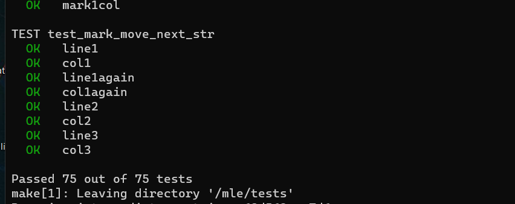

Budowanie obrazu

`docker build -t mle .`

Dockerfile wykonywujący test (bazuje on na pierwszym kontenerze)

``` Dockerfile
FROM mle:latest
ARG DEBIAN_FRONTEND=noninteractive
ENV TZ=Europe/Warsaw
RUN apt-get install -y uthash-dev liblua5.3-dev libpcre3-dev
RUN make test
```

Podczas tworzenia obrazu, w momencie instalacji jednego z package'a należało wybrać poprzez input w terminalu odpowiednią strefe czasową. Powodowało to niepowodzenie builda. Problem ten rozwiązano wykorzystując `ARG DEBIAN_FRONTEND=noninteractive`. Ubuntu wykorzystuje configuracje zwaną `debconf`. Zmieniono frontend `debconf'a` poprzez zadanie zmiennej środowiskowej `DEBIAN_FRONTEND` na `noninteractive`. Jest to spowodowane faktem, iż żadna interakcja z użytkownikiem nie jest pożądana podczas budowania obrazu. `ARG` definiuje zmienną którą użytkownik może przesłać do procesu budowania przy pomocy `docker build`. Dodatkowo ustwiono odpowiednią zmienną środowiskową która ustala strefą czasową.

## 3. Działanie kontenera

Zbudowane obrazy

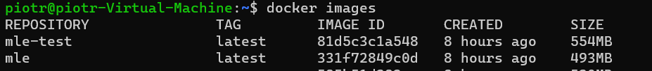

Wykonując

`docker run -it mle`

Możemy podłączyć się do kontenera i uruchomić nasz właściwy target.

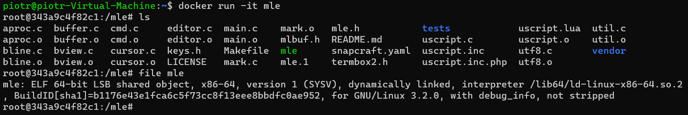

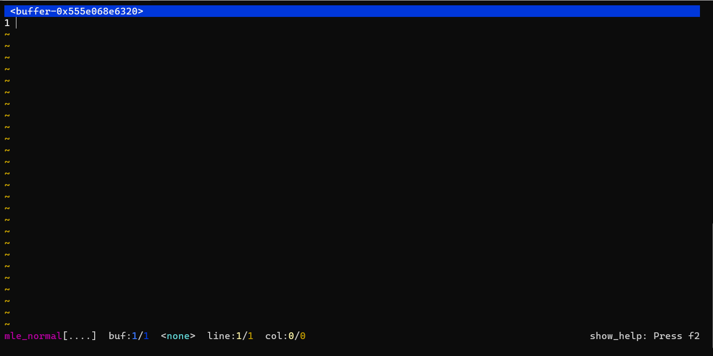

Jak widać program działa poprawnie.

Wykonując 

`docker run -it mle-test`

a następnie

`make test`

Uruchamiane są testy, które wszytskie kończą się powowdzeniem.

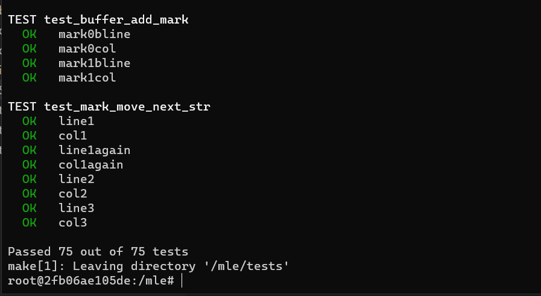