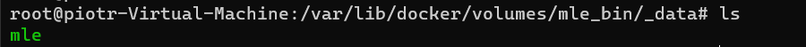
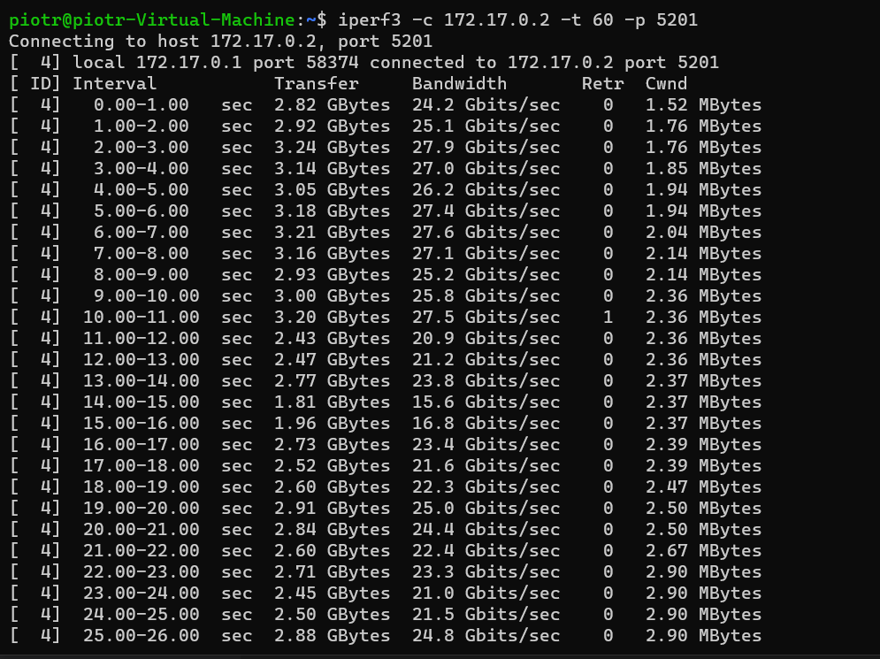
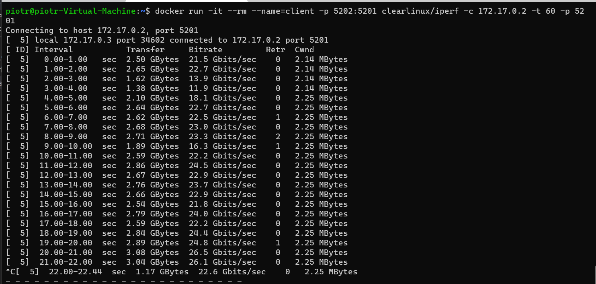
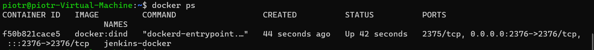
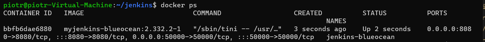
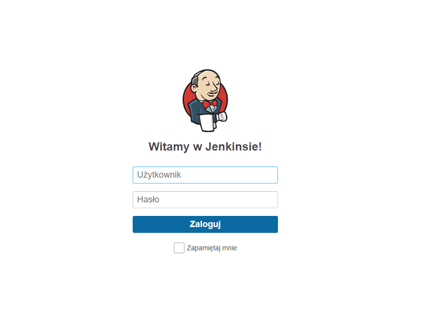

## Piotr Pyka
## Sprawozdanie z laboratorium nr 4

### Zachowywanie stanu
Na początku przygotowany wolumin wyjściowy i wejściowy

W woluminie wejściowym będzie znajdywało się repozytorium gitowe
`docker volume create mle_src`

W woluminie wyjściowym znajdzie się zbudowany plik binarny
`docker volume create mle_bin`

Następnie pobrano repozytorium z gita do woluminu wejściowego

`cd /var/lib/docker/volumes/mle_src/_data`

`git clone --recursive https://github.com/adsr/mle.git`

Następnie uruchomiono bazowy kontener ubuntu na którym zostanie uruchomiony proces budowania. Do kontenera
doczepiono dwa woluminy.

`docker run -it --mount source=mle_src,destination=/mle_src --mount source=mle_bin,destination=/mle_bin ubuntu`

Następnie dociągnięto wymagane zależności

`apt update && apt-get install build-essential libtool automake locales`

`locale-gen en_US.UTF-8`

`export LANG=en_US.UTF-8 LANGUAGE=en_US:en LC_ALL=en_US.UTF-8`

Oraz rozpoczęto build
`cd mle_src/mle && make mle_vendor=1`

Zbudowana binarke przeniesiono na wolumin wyjsciowy
`mv ./mle ../../mle_bin/`



### Eksopnowanie portu

uruchomiono kontener wraz z serwerem 

`docker run -it --rm --name=srv -p 5201:5201 clearlinux/iperf -s`

następnie ustalono adres ip kontenera

`docker inspect srv`

oraz podłączono się do kontenera z zewnątrz (z maszyny wirtualnej linuksa)

`iperf3 -c 172.17.0.2 -t 60 -p 5201`

uzyskana przepustowosc



następnie powtórzono poprzednie kroki tylko tym razem komunikacja odbywała się na poziomie kontener-kontener

uruchomiono kontener klienta 

`docker run -it --rm --name=client -p 5202:5201 clearlinux/iperf -c 172.17.0.2 -t 60 -p 5201`




### instalacja Jenkins

Zgodnie z dokumentacją, utworzono wirtualną sieć

`docker network create jenkins`

a następnie urchuomiono obraz docker:dind

`docker run --name jenkins-docker --rm --detach \
  --privileged --network jenkins --network-alias docker \
  --env DOCKER_TLS_CERTDIR=/certs \
  --volume jenkins-docker-certs:/certs/client \
  --volume jenkins-data:/var/jenkins_home \
  --publish 2376:2376 \
  docker:dind --storage-driver overlay2`

Uruchomiony kontener



Następnie utworzono Dockerfile z zawartością
taką jak w dokumentacji

```docker
FROM jenkins/jenkins:2.332.2-jdk11
USER root
RUN apt-get update && apt-get install -y lsb-release
RUN curl -fsSLo /usr/share/keyrings/docker-archive-keyring.asc \
  https://download.docker.com/linux/debian/gpg
RUN echo "deb [arch=$(dpkg --print-architecture) \
  signed-by=/usr/share/keyrings/docker-archive-keyring.asc] \
  https://download.docker.com/linux/debian \
  $(lsb_release -cs) stable" > /etc/apt/sources.list.d/docker.list
RUN apt-get update && apt-get install -y docker-ce-cli
USER jenkins
RUN jenkins-plugin-cli --plugins "blueocean:1.25.3 docker-workflow:1.28"
```

A następnie zbudowano obraz z powyższego Dockerfilea

`docker build -t myjenkins-blueocean:2.332.2-1 .`

Na końcu uruchomiono kontener

```
docker run --name jenkins-blueocean --rm --detach \
  --network jenkins --env DOCKER_HOST=tcp://docker:2376 \
  --env DOCKER_CERT_PATH=/certs/client --env DOCKER_TLS_VERIFY=1 \
  --publish 8080:8080 --publish 50000:50000 \
  --volume jenkins-data:/var/jenkins_home \
  --volume jenkins-docker-certs:/certs/client:ro \
  myjenkins-blueocean:2.332.2-1
```

  

W celu odczytania domyślnego hasła podłączono się do kontenera

  `docker exec -it jenkins-blueocean /bin/bash`

A następnie przeczytano plik z hasłem

  `cat /var/jenkins_home/secrets/initialAdminPassword`

Ekran logowania do Jenkinsa

  
  