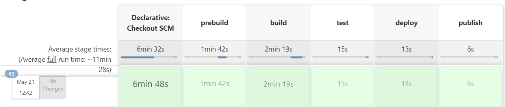
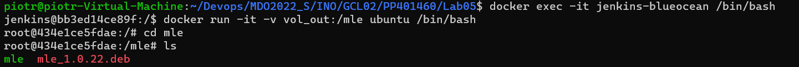
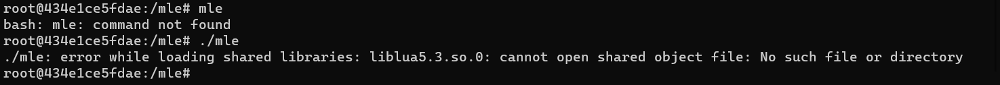
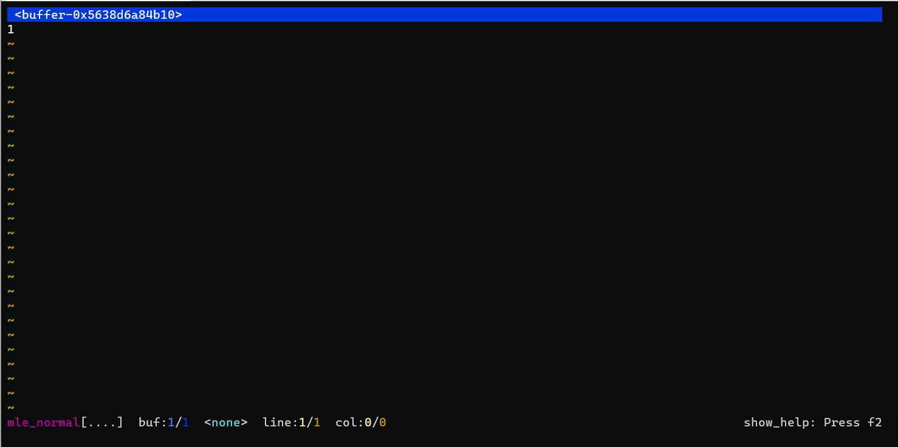
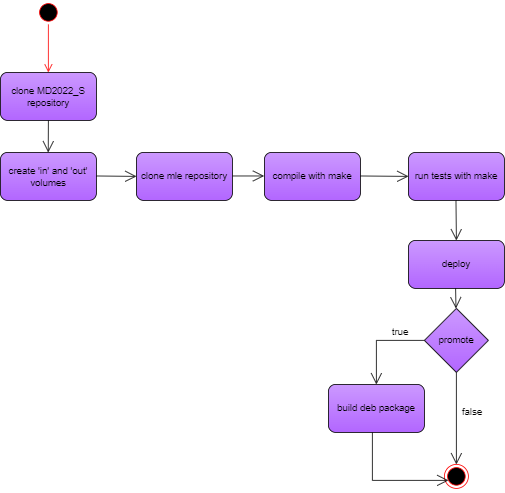
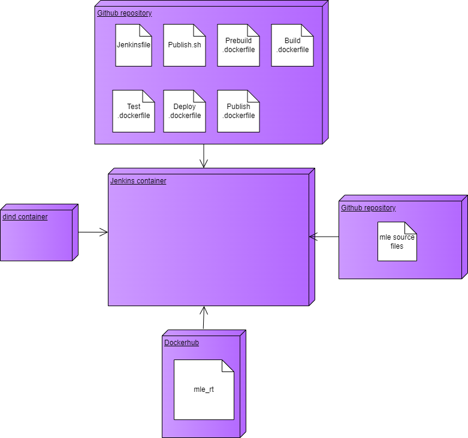

# Sprawozdanie z projektu z Jenkinsa
### Piotr Pyka

## Motywacja

Pipeline automatyzuje proces budowania, testowania, wdrażania oraz publikowania wytwarzanego oprogramowania. Jest to zbiór kroków które muszą zostać wykonane przed wydaniem nowej wersji oprogramowania.

Aplikacja będzie uruchamiana/budowana/testowana jako kontener. Do konteneryzacji będziemy wykorzystywać dockera. Konteneryzacja zapewnia przenośność, izolowane środowisko, skalowalność oraz znacznie większą wydajność w porównaniu do wirtualizacji.

## Budowany projekt 

Budowany projekt dostępny jest pod linkiem.

`https://github.com/adsr/mle`

Jest to terminalowy edytor tekstu napisany w języku `C`. Jego budowa oraz testowanie bazują na `Makefile`.

## Jenkins pipeline

Przed właściwym korzystaniem z pipelineu konieczna jest uruchomienie dwóch kontenerów `jenkins-docker` oraz `jenkins-blueocean` zgodnie z dokumentacją. 

### Checkout scm

Krok ten jest wykonywany automatycznie, polega na zaciągnięciu projektu z zdalnego repozytorium. W tym repozytorium znajdują się wszytskie potrzebne pliki dockerfile, plik definiujący pipeline i ewentualnie inne pliki wymagane przez pipeline. 

### Prebuild

Celem tego kroku jest przygotowanie środowiska, w którym będzie można przeprowadzić proces budowania projektu. Ten stage tworzy dwa woluminy: wejściowy oraz wyjściowy. Woluminy pozwolą nam na komunikacje między kontenerami, komunikacja ta będzie polegać na dostępie do odpowiednich plików. Na woluminie wejściowym odłożone zostanie sklonowane z zewnątrz repozytorium, a na woluminie wyjściowym będą odkładane artefakty powstałe w procesie stageu `build` oraz `publish`.

``` Jenkinsfile
   stage('prebuild') {
            steps {
                dir('INO/GCL02/PP401460/Lab05') {
                    sh '''
                        echo 'Creating \'out volume\' and \'in volume\'...'
                        docker volume create vol_in
                        docker volume create vol_out 
                        echo 'Prebuilding ...'
                        docker build -t prebuilder -f ./Prebuild.dockerfile .
                        docker run --rm --mount source=vol_in,destination=/mle_src prebuilder 
                    '''
                }
            }
```

Utworzone zostają dwa wspomniane woluminy. Następnie przeprowadzona zostaje budowa obrazu. Flaga `-t` pozwala na nadanie nazwy budowanemu obrazowi, a flaga `-f` wskazuje na odpowiedni dockerfile. Kolejnym krokiem jest uruchomienie obrazu - staje się on teraz kontenerem. Celem dla którego kontener jest uruchamiany jest wykorzystanie woluminów. Dzięki fladze `--mount` podpinamy wolumin `vol_in` który będzie widoczny w kontenerze pod katalogiem `/mle_src`. Flaga `--rm` sprawia, że kontener po wykonaniu swojej pracy zostanie usunięty.  

``` docker
FROM ubuntu:latest

RUN apt-get update && apt-get install -y git
CMD ["sh", "-c",  "git clone --recursive https://github.com/adsr/mle.git && cp -r mle /mle_src"]
```

Dockerfile bazuje na kontenerze ubuntu, nie ma sensu bazować na czymś większym gdyż głównym celem jest sklonowanie repozytorium. Dyrektywa `RUN` określa krok który zostanie wykonany podczas procesu budowy obrazu. W tym przypadku najpierw aktualizujemy listę packageów poprzez `apt-get update` a następnie instalujemy gita. Kolejnym celem będzie sklonowanie repozytorium na wolumin wejściowy, dostęp do woluminów mamy dopiero podczas uruchamiania kontenera za pomocą `docker run`. Z tego powodu nie możemy użyć tutaj `RUN` gdyż podczas budowania obrazu wolumin nie jest dostępny. Dyrektywa `CMD` wykonuje instrukcje, gdy kontener zostanie uruchomiony (czyli gdy mamy już dostęp do naszych woluminów) z tego powodu klonowanie repozytorium następuje właśnie wewnątrz tej dyrektywy. W celu wykorzystania kilku instrukcji powłoki wykorzystujemy `CMD ["sh", "-c", command1 && command2 && ...]`. Repozytorium jest klonowane do wewnętrznego filesystemu kontenera a następnie kopiowane na wolumin który widoczny jest w kontenerze pod `/mle_src`.

### Build

Celem tego kroku jest zbudowanie artefaktu. W naszym przypadku tym artefaktem będzie jeden plik binarny (będący właściwym programem).


```
       stage('build') {
            steps {
                dir('INO/GCL02/PP401460/Lab05') {
                    sh '''
                        echo 'Building ...'
                        docker build -t builder -f ./Build.dockerfile .
                        docker run --mount source=vol_out,destination=/build --mount source=vol_in,destination=/mle_src --name tmp builder
                        docker commit tmp builder
                        docker rm tmp
                    '''
                }
            }
        }
```

Najpierw budowany jest obraz `builder`, następnie uruchamiany jest kontener bazujący na tym obrazie. Zostają podpięte pod niego dwa woluminy - wejściowy i wyjściowy.

``` docker
FROM ptrk00/mle_rt

RUN apt-get -y install build-essential libtool automake 

CMD ["sh", "-c", "cd /mle_src/mle && make && mkdir /mle_out && cp -r /mle_src/mle /mle_out && cp ./mle /build && make clean_quick"]
```
Obraz builda bazuje na obrazie będącym wymaganym runtimem dla aplikacji. Został on wcześniej zbudowany i opublikowany na dockerhub. Dodatkowo instalujemy wszystkie `build dependencies`, czyli zależności, które potrzebne są nam tylko na etapie budowania aplikacji. Na końcu dokonujemy budowania projektu przy pomocy narzędzia `Makefile`. Z racji, iż następny stage `test` będzie wymagał skompilowanych plików (a tak dokładnie będzie ich wymagał `Makefile`) cały katalog z wszystkimi skompilowanymi plikami zostaje przekopiowany z wolumina do nowego katalogu wewnątrz kontenera. Ponieważ te operacje dzieją się w momencie gdy działa kontener, nie wystarczy, że później będziemy bazować na obrazie `buildera` w przypadku kontenera `tester`, te zmiany nie będą w nim widoczne. Zbudowana binarka zostaje odłożona na wolumin `vol_out` a na woluminie `vol_in` zostaje wykonana dyrektywa `Makefile` która oczyszcza katalog ze zbudowanych artefaktów.

```
    docker run --mount source=vol_out,destination=/build --mount source=vol_in,destination=/mle_src --name tmp builder
                        docker commit tmp builder
                        docker rm tmp
```

Rozwiązaniem może być zapisanie aktualnego stanu kontenera (z katalogiem `/mle_out`) do nowego obrazu (albo raczej nadpisanie aktualnego obrazu `buildera`). Kontener tworzony przy pomocy `docker run` zostaje nazwany `tmp` aby można było się do niego łatwo odnosić. Następnie przy pomocy instrukcji `docker commit` zapisujemy stan kontenera `tmp` do obrazu `builder`. Na końcu niszczymy kontener `tmp`. Gdyby nie zrobić tej czynności to ponowe uruchomienie pipelinu nie byłoby możliwe gdyż kontener o nazwie `tmp` by istniał (tylko byłby wstrzymany).

Obraz zawierający runtime aplikacji
``` docker
FROM ubuntu:latest

RUN apt-get update
RUN apt-get -y install locales
RUN locale-gen en_US.UTF-8
ENV LANG=en_US.UTF-8
ENV LANGUAGE en_US:en
ENV LC_ALL en_US.UTF-8

ENV LANG=en_US.UTF-8
ARG DEBIAN_FRONTEND=noninteractive
ENV TZ=Europe/Warsaw
RUN apt-get install -y uthash-dev liblua5.3-dev libpcre3-dev
```

Instalowane są odpowiednie biblioteki oraz ustawiane są odpowiednie zmienne środowiskowe. Obraz jest umieszczony na `Dockerhub`.


Wyizolowanie obrazu z runtimem jest o tyle dobre, że będzie on potrzebny zarówno przy budowaniu jak i deployowaniu. Zatem w momencie wykonywania `deploy` obraz ten będzie już ściągnięty i nie trzeba będzie ponownie instalować zależności. 

### Test

Celem tego stageu jest wykonanie wszystkich dostępnych testów naszej aplikacji. 

```
        stage('test') {
            steps {
                dir('INO/GCL02/PP401460/Lab05') {
                    sh '''
                        echo 'Testing ...'
                        docker build -t tester -f ./Test.dockerfile .
                    '''
                }
            }
        }
```

Podczas tego stageu tylko budujemy właściwy obraz.

``` docker
FROM builder:latest
WORKDIR /mle_out/mle
RUN make test
```
Obraz ten bazuje na obrazie `buildera`. Dzięki ustawieniu `WORKDIR` na `/mle_out/mle` wszystkie komendy typu `RUN` czy `CMD` będą uruchamiane w tym katalogu. Ostatnia linijka pliku uruchamia testy.

### Deploy

Celem tego stageu jest wdrożenie aplikacji, czyli uruchomienie jej w odpowiednim środowisku. U nas środowiskiem będzie zwykłe Ubutnu które zawiera odpowiednie biblioteki będące runtimem aplikacji.

```
     stage('deploy') {
            steps {
                dir('INO/GCL02/PP401460/Lab05') {
                    sh '''
                        echo 'Deploying ...'
                        docker build -t deployer -f ./Deploy.dockerfile .
                        docker run --rm -v vol_out:/build deployer 
                    '''
                }
            }
        }
```
Krok ten wykorzystuje binarkę odłożoną na wolumin wyjściowy co nastąpiło podczas kroku `build`. Najpierw budujemy odpowiedni obraz, następnie uruchamiamy z odpowiednio podpiętymi woluminami.

``` docker
FROM ptrk00/mle_rt


ENTRYPOINT ["/bin/bash", "-c",  "cp /build/mle usr/bin && mle"]
```

Obraz bazuje na runtime dostępnym jako obraz `mle_rt`. Przy pomocy `ENTRYPOINT` ustawiamy by punktem wejścia dla konenera było uruchomienie naszej binarki. Wcześniej jeszcze kopiujemy ją z wolumina do `/usr/bin` gdzie znajdują się pliki binarne.

#### Deploy a linkowanie bibliotek

Początkowo cała aplikacja (trochę nieświadomie) była budowana statycznie, tzn. kod wymaganych bibliotek został wpleciony do kodu wykonywanego pliku binarnego. W tym przypadku dla kroku `deploy` wystarczyło by bazowym kontenerem było ubuntu. Pokazuje to, że to w jaki sposób budujemy aplikacje wpływa na deployment. Dla binarki linkowanej statycznie środowisko uruchomieniowe (minimalne środowisko uruchomieniowe) będzie inne (mniejsze) niż dla binarki linkowanej dynamicznie.


### Publish

Celem tego kroku jest nadanie numeru wersji programu oraz opublikowanie artefaktu w jakiejś przyjaznej dla końcowego użytkownika formie. W naszym przypadku artefakt zostanie opublikowany jako pakiet debianowy.

```
    parameters {
        string(name: 'VERSION', defaultValue: '1.0.0', description: 'Version number')
        booleanParam(name: 'PROMOTE', defaultValue: false, description: 'Determines if artifact should be published')
    }
```
Pipeline zawiera dwa parametry. Parametr `PROMOTE` który określa czy w danym wykonaniu pipelinu ma zostać opublikowany artefakt, oraz `VERSION` który określa numer wersji ewentualnie publikowanego artefaktu.

```
       stage('publish') {
            when {expression {return params.PROMOTE}}
            steps {
                dir('INO/GCL02/PP401460/Lab05') {
                    sh '''
                        echo 'Publishing ...'
                        docker build -t publisher -f ./Publish.dockerfile .
                        docker run -e VERSION --rm --mount source=vol_out,destination=/publish publisher 
                    '''
                }
            }
        }
```

Krok `publish` zostanie wykonany tylko gdy zostanie zaznaczony parametr `PROMTOE`. Budujemy odpowiedni obraz a następnie uruchamiamy kontener. Do kontenera przekazujemy wolumin wyjściowy na który zostanie odłożony pakiet debianowy, oraz parametr `VERSION` który będzie widoczny w kontenerze jako zmienna środowiskowa.

``` docker
FROM ubuntu:latest

RUN mkdir -p mle/DEBIAN
RUN mkdir -p mle/usr/bin

COPY ./Publish.sh /
ENTRYPOINT ["sh", "./Publish.sh"]
```

Kontener bazuje na ubuntu - nie potrzeba nam nic większego, tworzymy strukturę katalogów wymaganą do zbudowania pakietu debianowego, kopiujemy skrypt `Publish.sh` do kontenera a na końcu za pomocą `ENTRYPOINT` ustawiamy by w momencie uruchomienia kontenera został wykonany skrypt `Publish.sh`.

Skrypt `Publish.sh`

``` sh
#!/bin/sh

echo "Package: mle \n\
Version: ${VERSION} \n\
Maintainer: Piotr \n\
Architecture: all \n\
Description: mle package \n\
Depends: uthash-dev, liblua5.3-dev, libpcre3-dev" > mle/DEBIAN/control

cp /publish/mle mle/usr/bin/mle
dpkg-deb --build mle
cp mle.deb /publish
mv /publish/mle.deb /publish/mle_"${VERSION}".deb

```

Skrypt tworzy odpowiedni plik konfiguracyjny wykorzystując przy tym zmienną środowiskową `VERSION`, kopiuje plik wykonywalny z wolumina do wewnętrznego filesystemu kontenera, buduje pakiet, przenosi go na wolumin i na końcu zmienia jego nazwę tak by wykorzystywała ona odpowiedni numer wersji.


#### Forma opublikowanego artefaktu

Forma w jakiej publikowany jest artefakt zależy od przeznaczenia aplikacji, tego na jakim systemie ma ona działać itp. W naszym przypadku zdecydowano się zbudować debian package (chciałem podjąć się próby zbudowania instalatora, a Ubuntu było systemem na którym pracuje). Oczywiście w przypadku innych rodzin Linuxa należałoby zbudować inną odpowiednią forme packageu, jednak tworzenie każdego możliwego instalatora pod każdą wersje linuxa nie wydaje się rozsądnym wyjściem. Możliwym rozwiązaniem jest udostępnienie pliku `.tar` zawierającym wszystko to co potrzebne do zbudowania instalatora dla dystrybucji wersji linuxa. Tworzeniem takich instalatorów zajmą się w przyszłości specjalni opiekunowie czy po prostu jakieś osoby które mają takie umiejętności i jest im to potrzebne.

### Pełny kod pipelinu

```
pipeline {
    agent any
    parameters {
        string(name: 'VERSION', defaultValue: '1.0.0', description: 'Version number')
        booleanParam(name: 'PROMOTE', defaultValue: false, description: 'Determines if artifact should be published')
    }

    stages {
        stage('prebuild') {
            steps {
                dir('INO/GCL02/PP401460/Lab05') {
                    sh '''
                        echo 'Creating \'out volume\' and \'in volume\'...'
                        docker volume create vol_in
                        docker volume create vol_out 
                        echo 'Prebuilding ...'
                        docker build -t prebuilder -f ./Prebuild.dockerfile .
                        docker run --rm --mount source=vol_in,destination=/mle_src prebuilder 
                    '''
                }
            }
        }
        stage('build') {
            steps {
                dir('INO/GCL02/PP401460/Lab05') {
                    sh '''
                        echo 'Building ...'
                        docker build -t builder -f ./Build.dockerfile .
                        docker run --mount source=vol_out,destination=/build --mount source=vol_in,destination=/mle_src --name tmp builder
                        docker commit tmp builder
                        docker rm tmp
                    '''
                }
            }
        }
        stage('test') {
            steps {
                dir('INO/GCL02/PP401460/Lab05') {
                    sh '''
                        echo 'Testing ...'
                        docker build -t tester -f ./Test.dockerfile .
                    '''
                }
            }
        }
        stage('deploy') {
            steps {
                dir('INO/GCL02/PP401460/Lab05') {
                    sh '''
                        echo 'Deploying ...'
                        docker build -t deployer -f ./Deploy.dockerfile .
                        docker run --rm -v vol_out:/build deployer 
                    '''
                }
            }
        }
        stage('publish') {
            when {expression {return params.PROMOTE}}
            steps {
                dir('INO/GCL02/PP401460/Lab05') {
                    sh '''
                        echo 'Publishing ...'
                        docker build -t publisher -f ./Publish.dockerfile .
                        docker run -e VERSION --rm --mount source=vol_out,destination=/publish publisher 
                    '''
                }
            }
        }
    }
}
```

### Poprawne działanie pipelinu



### Przykładowe wykorzystanie zbudowanego finalnego artefaktu

Najpierw uruchamiamy pipeline i czekamy na opublikowanie pakietu debianowego. Następnie podłączamy się do kontenera z jenkinsem (czyli do środowiska w którym wykonywały się kroki pipelinu)

`docker exec -it jenkins-blueocean /bin/bash`

Uruchamiamy nowy kontener z czystym ubuntu podpinając wolumin wyjściowy na którym znajduje się zbudowany package.

`docker run -it -v vol_out:/mle ubuntu /bin/bash`

Wchodzimy do katalogu z odłożonymi artefaktami

`cd /mle`

W katalogu znajduje się plik binarny oraz pakiet debianowy z zadanym numerem wersji.




Pliku binarnego nie da się uruchomić z katalogu w którym się znajduje, tym bardziej nie da się go uruchomić z dowolnego miejsca w systemie. Powodem jest oczywiście brak zainstalowanych zależności, oraz fakt, iż program nie jest odłożony w odpowiednie miejsce w systemie czyli takie gdzie powinny znajdować się tego typu pliki wykonywalne (takim miejscem może być np. /usr/bin) 



W celu rozwiązania właśnie tych problemów zbudowaliśmy wcześniej instalator. Wykonując

`apt-get update && apt-get install -f -y ./mle_1.0.22.deb`

instalujemy nasz program. 

Po pomyślnej instalacji jesteśmy w stanie uruchomić program z dowolnego miejsca w systemie przy pomocy

`mle`




## Diagramy UML

## Diagram aktywności



## Diagram wdrożenia




## Wnioski / Podsumowanie
* Zależności wymagane podczas procesu `build` oraz `deploy` na ogół są różne - niektóre zależności są wymagane tylko podczas budowania aplikacji. Z tego powodu obraz dla procesu `deploy` nie bazuje na obrazie dla procesu `build`. Obraz `deploy` zawiera tylko to co potrzebne do uruchomienia aplikacji, na ogół będzie oznaczało to mniejszy rozmiar obrazu dla tego kroku niż dla kroku `build`
* Środowisko w kroku `deploy` zależy od procesu budowanie aplikacji. Przykładowo zależy od tego czy biblioteki linkowaliśmy statycznie czy dynamicznie.
* Krok publish pozwala na dystrybucje naszej aplikacja w postaci która będzie odpowiednia dla użytkownika. W zależności od sytuacji może to być instalator czy nawet archiwum z skompilowanymi plikami.
* Krok `publish` nadaje numer wersji oprogramowaniu które jest redystrybuowalne. Nie chcemy wykonywać tego kroku przy każdym uruchomieniu pipeline, z tego powodu parametryzujemy proces budowania tak by ten krok zachodził tylko wtedy gdy tego jawnie zażądamy. 