# Sprawozdanie Piotr Wilkosz 404121

## Zadania do wykonania
**1. Zainstaluj klienta Git i obsługę kluczy SSH**
   
Na każdym z trzech przygotowanych urządzeń posiadam już klienta git oraz narzędzia pozwalające na obsługę kluczy SSH. Dla wykazania ich obecności przedstawiam scieżkę poleceniem ```which```.

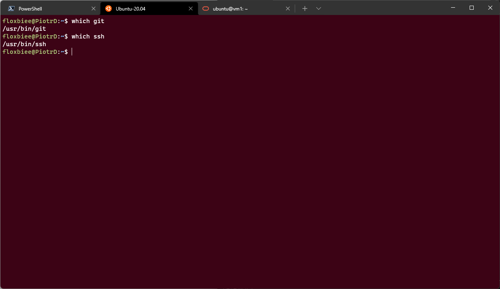

**2. Sklonuj repozytorium https://github.com/InzynieriaOprogramowaniaAGH/MDO2022_S za pomocą HTTPS**

Klonuję repozytorium poprzez HTTPS. Używam do tego polecenia ```git clone``` oraz adresu HTTPS.

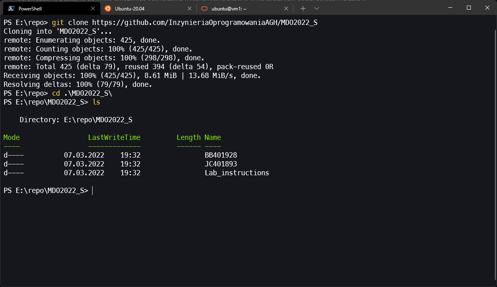

**3. Upewnij się w kwestii dostępu do repozytorium jako uczestnik i sklonuj je za pomocą utworzonego klucza SSH**
   **- Utwórz dwa klucze SSH, inne niż RSA, w tym co najmniej jeden zabezpieczony hasłem**

Przy pomocy polecenia ```ssh-keygen``` tworzę dwa klucze. Pierwszy z kluczy jest bez hasła. Drugi z nich posiada ustawione hasło. Tworze klucz Ed25519, a więc EdDSA. 

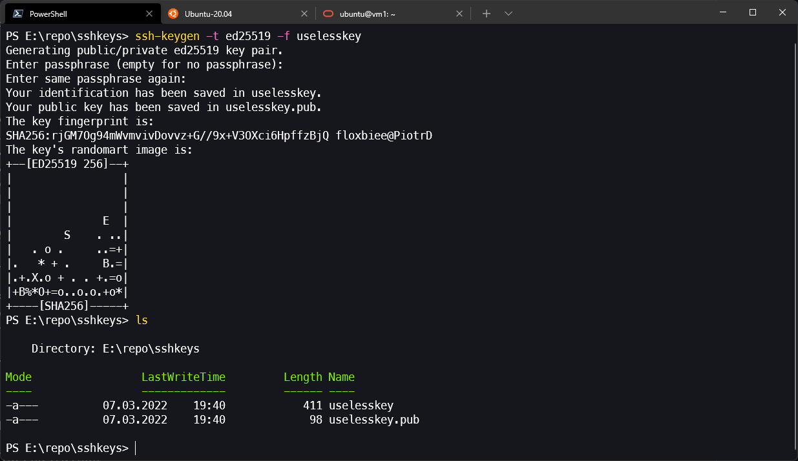

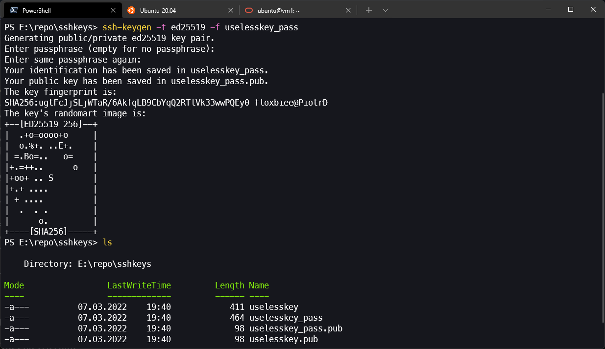

  **- Skonfiguruj klucz SSH jako metodę dostępu do GitHuba**

  Dodaję klucz jako medę dostępu do GitHub. 

  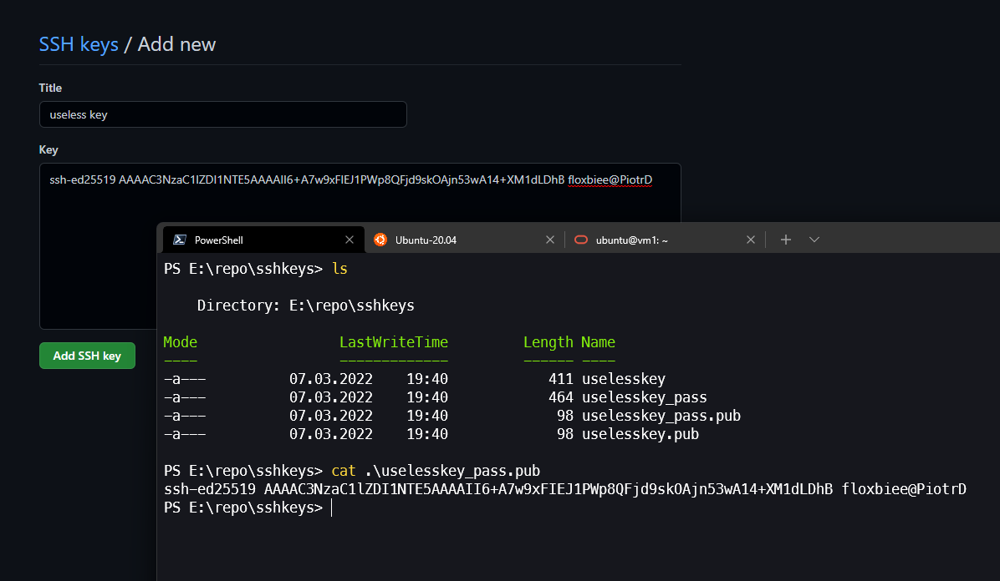

  Wyświetlam dodane klucze. Ostatni z dodanych kluczy jest dodanym w ramach wykonywanego zadania kluczem.

  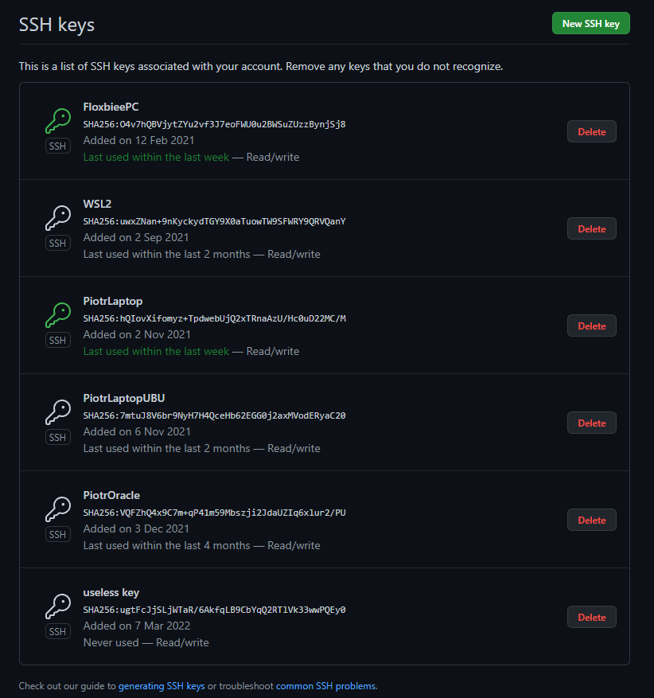

  **- Sklonuj repozytorium z wykorzystaniem protokołu SSH**

Klonuję repozytorium z użyciem protokołu SSH. Używam do tego polecenie ```git clone``` z podanym adresem ssh.

**4. Przełącz się na gałąź ```main```, a potem na gałąź swojej grupy (pilnuj gałęzi i katalogu!)**

Przy użyciu polecenie ```git checkout``` przełączam gałąź na main, a następnie na gałąź grupy **INO-GCL02**.

  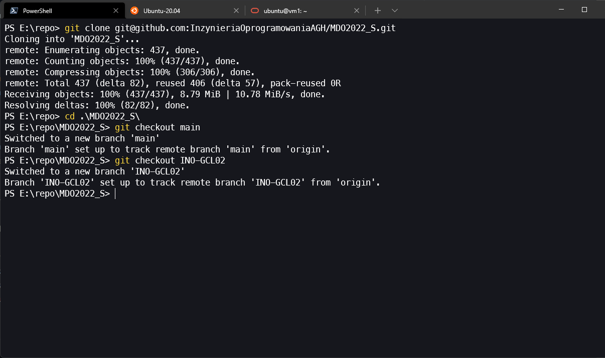

**5. Utwórz gałąź o nazwie "inicjały & nr indeksu" np. ```KD232144```. Miej na uwadze, że odgałęziasz się od brancha grupy!**

Poprzez polecenie ```git checkout``` z przełącznikiem -b tworzę nowego brancha o nazwie odpowiadającej moim inicjałom ***PW*** oraz numerowi indexu ***404121***.

  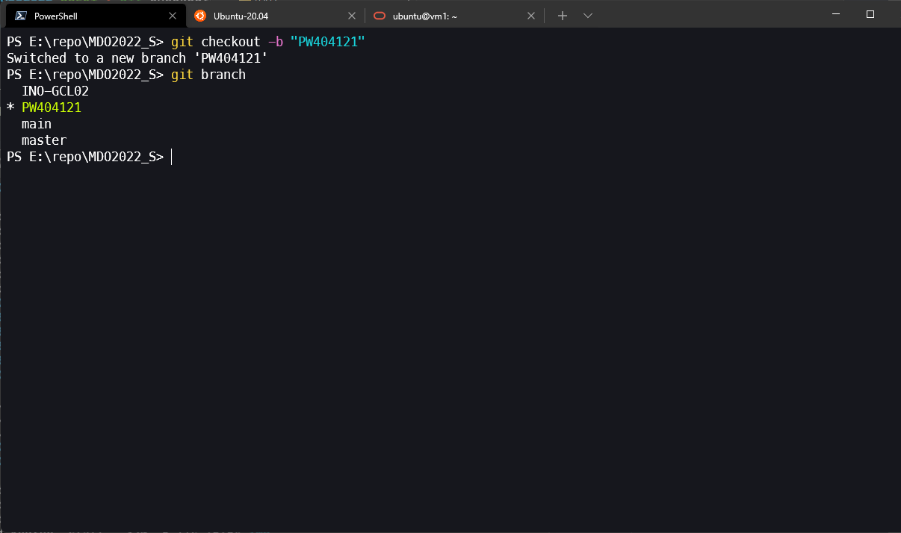

**6. Rozpocznij pracę na nowej gałęzi**
   **- W katalogu właściwym dla grupy utwórz nowy katalog, także o nazwie "inicjały & nr indeksu" np. ```KD232144```**
   **- W nowym katalogu dodaj plik ze sprawozdaniem**
   **- Dodaj zrzuty ekranu (jako inline)**

Tworzę nowy katalog oznaczony moimi inicjałami oraz numerem indexu. Umieszczam w nim katalog przeznaczony na wykonywane właśnie zadania, w którym tworzę pusty(póki co) plik tekstowy o rozszerzeniu Markdown. Do jego edycji używam edytora Visual Studio Code z odpowiednim rozszerzeniem.


  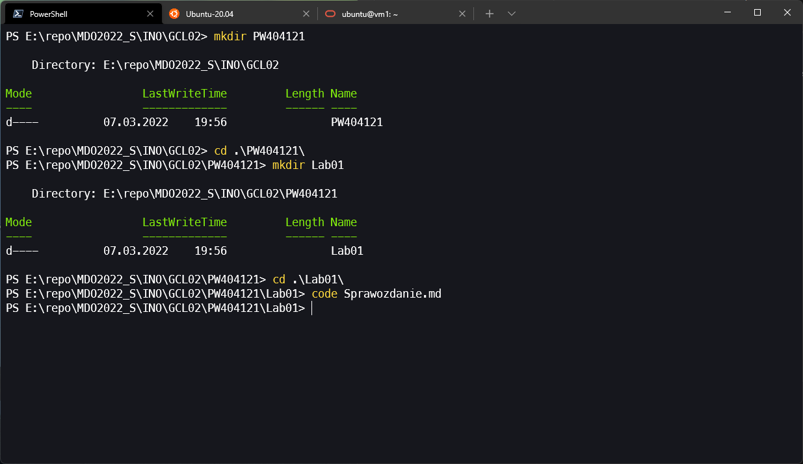

   **- Wyślij zmiany do zdalnego źródła**

Wysyłam zmiany na zdalne repozytorium. Dokonuję tego poprzez zrobienie commita poprzez polecenie ```git commit```, a następnie wypchnięciego na remote poleceniem ```git push``` poprzedzone wcześniejszym ustawieniem upstreama.

  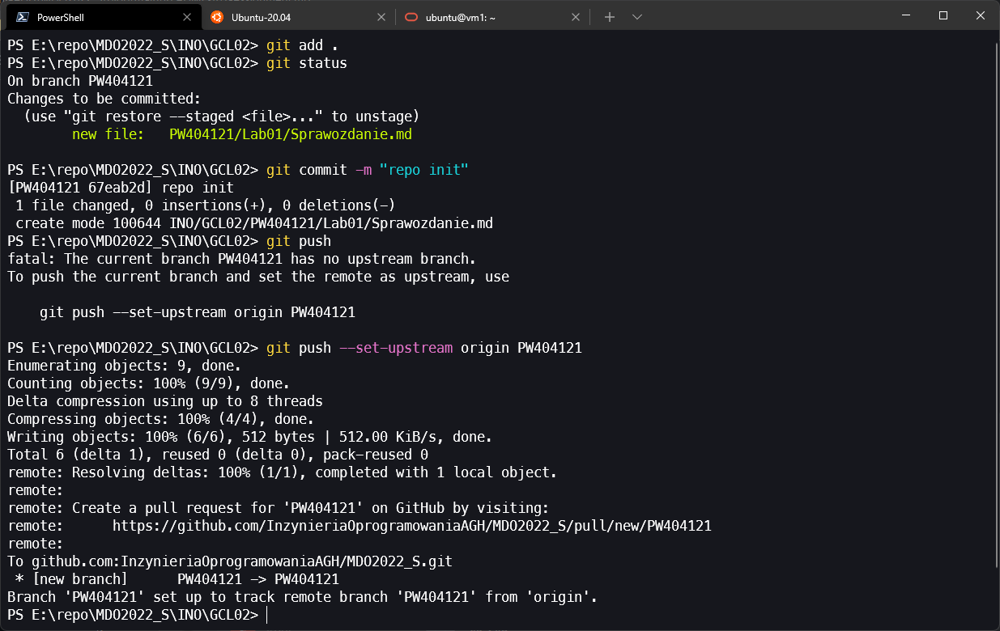

   **- Spróbuj wciągnąć swoją gałąź do gałęzi grupowej**

Dokonuję próby zmergowania tworzonego brancha z branchem grupy. Używam do tego polecenia ```git merge```. Ze względu iż branch grupowy jest na remote branchem typu protected nastepuje odmowa bezpośredniego merga.

  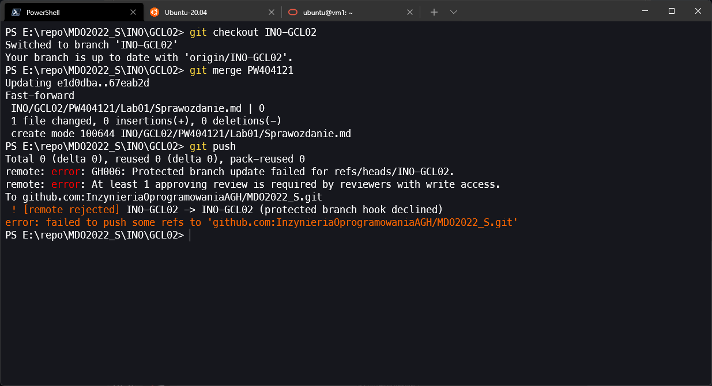

   **- Zaktualizuj sprawozdanie i zrzuty o ten krok i wyślij aktualizację do zdalnego źródła (na swojej gałęzi)**

Commituje i pushuje skończone sprawozdanie.


**7. Wystaw Pull Request do gałęzi grupowej**

Po zakończeniu tworzenia sprawozdnia wysyłam pull requesta do brancha grupowego. Na zrzucie ekranu dane przykładowe(jedynie do screena).

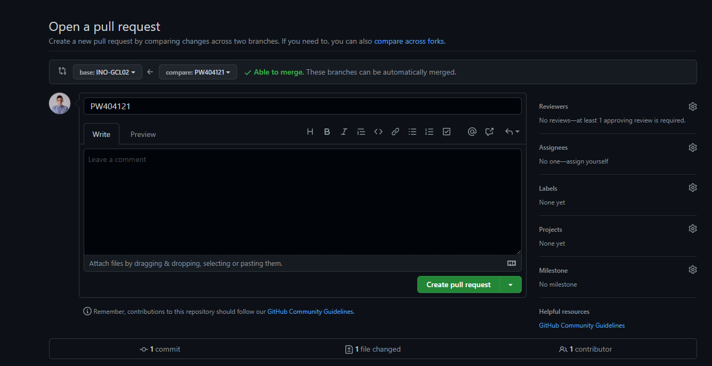

**8. Zgłoś zadanie (Teams assignment - jeżeli dostępne)**

N/A