#  Piotr Wilkosz - 404121
## Sprawozdanie 2


**1. Przygotuj git hook, który rozwiąże najczęstsze problemy z commitami**
   
   * **hook sprawdzający, czy tytuł commita nazywa się ```<inicjały><numer indeksu>```**
   * **hook sprawdzający, czy w treści commita pada numer labu, właściwy dla zadania**

      W katalogu ``` \.git\hooks\ ``` kopiuję przykładowe hooki, a następnie dokonuję modyfikacji tych które będą używane w aktulanym zadaniu.

      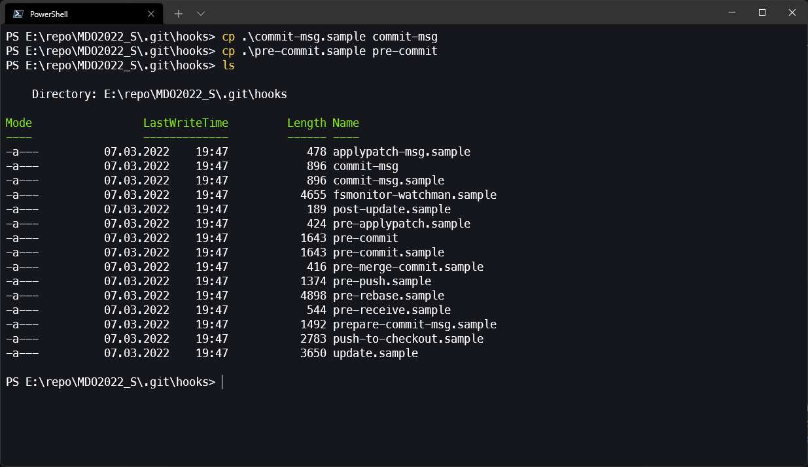

      Do napisania skryptów używam shella. Na początku definiuję zmienne dekoracyjne w celu atrakcyjnego przedstawienia wyników działania poprzez w zalezności od wyniku wyświetleniu go w pogrubionym czerwonym lub zielonym kolorze.
      
      ```bash
      REDBOLD='\033[0;31;1m'
      GREENBOLD='\033[0;32;1m'
      NORMAL='\033[0m'
      ```

      Kolejno tworzę skrypt na sprawdzanie tytułu commita. Dokonuję tego w hooku commit-msg, który jest wykonywany w trakcie tworzenia wiadomości commita. W argumencie ```$1``` znajduje się treść wiadomości. W skrypcie poprzez funkcję test porównuję wartość zmiennej i sprawdzam czy zawiera ona wartosć ```PW404121``` będąca konkatenacją inicjału oraz numeru indeksu. W zależności od uzyskanego wyniku wyświetlam odpowiednią informację.

      ```bash
      echo -e "\nTesting commit message..."

      if test $(cat $1) = PW404121
      then
        echo -e "${GREENBOLD}Commit message is equal PW404121 ${NORMAL}\n"
      else
        echo -e "${REDBOLD}Commit message is NOT equal PW404121 ${NORMAL}\n"
        exit 1
      fi
      ``` 

      W kolejnym skrypcie, w którym należy sprawdzić treść commita postepuję podobnie. Tym razem poprzez ```git deff``` z przełącznikiem ```cached``` sprawdzam czy w przygotowanych do zcommitowania zmianach zawiera się wartość ```/Lab02/```. W wyniku takiego działania commit zostanie zaakceptowany gdy zostaną dokonane zmiany w katalogu aktualnych laboratoriów. Tym razem modyfikowany był hook ```pre-commit```, który jest wykonywany przed utworzeniem wiadomości.

      ```bash
      echo -e "\nTesting commit content..."

      if git diff --cached | grep "/Lab02/"
      then
        echo -e  "${GREENBOLD}Commit contain current laboratory number - 02 ${NORMAL}\n"
      else
        echo -e "${REDBOLD}Commit does NOT contain current laboratory number - 02 ${NORMAL}\n"
        exit 1
      fi
      ``` 

      Po napisaniu skryptów przechodzę do testów. Dla każdego z przypadków tworzę dowolny plik w wybranym katalogu a następnie commituję z wybranym tytułem. Nastepnie poprzez ```git cherry -v``` sprawdzam lokalne commity.

      Testy:
          
      * Przypadek 1: katalog ```Lab01```, inny tytuł

      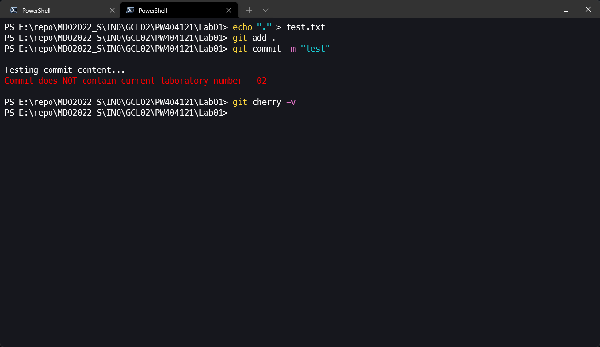

      * Przypadek 2: katalog ```Lab02```, inny tytuł

      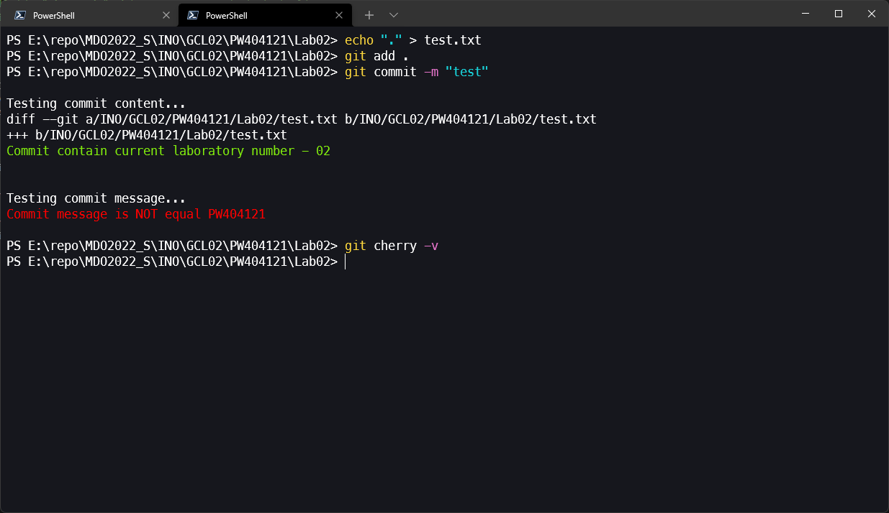

      * Przypadek 3: katalog ```Lab02```, tytuł ```PW404121```

      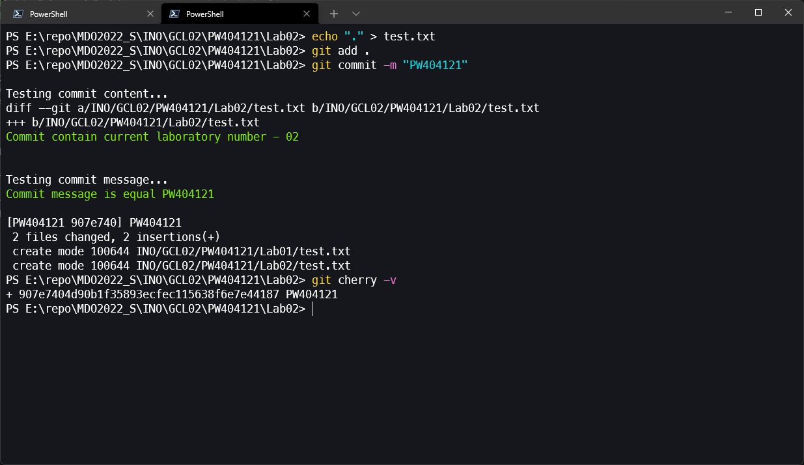

      W trzecim przypadku widzimy, że wszystkie wartości logiczne w hookach były pozytywne. Zmiany zostały zacommitowane.


**2. Umieść hook w sprawozdaniu w taki sposób, aby dało się go przejrzeć**

  Hooki zostaly umieszczone w katalogu ```/Lab02/```, ich treści znajdują się też inline w sprawozdaniu powyżej

**3. Rozpocznij przygotowanie środowiska Dockerowego**
   
   * **zapewnij dostęp do maszyny wirtualnej przez zdalny terminal (nie "przez okienko")`**
        
        Posiadam dostęp do maszyny cloudowej poprzez SSH. Dostęp maszyny na WSL2 posiadam lokalnie. Do obu z nich używam Windows Terminala. 

   * **jeżeli nie jest stosowane VM (np. WSL, Mac, natywny linux), wykaż ten fakt dokładnie**

        W ramach laboratoriów zamierzam używać Ubuntu na Oracle Cloud. Ze względu iż jest on w archiktekturze arm64 co może powodować pewne problemy przygotowałem też środowisko na WSL2. Dla obu z maszyn wykazuję ten fakt poprzez polecenie ```uname -a```, gdzie znajdziemy istotne informacje. Zrzuty w kroku poniżej.
        
   * **zainstaluj środowisko dockerowe w stosowanym systemie operacyjnym**

   Posiadam już przygotowane środowisko dockerowe wiec nie przygotowywuję go kolejny raz. Na zrzucie na obu maszynach uruchamiam hello-world'a aby wykazać działanie.

   Hello world na Ubuntu 20.04 arm64 na Oracle Cloud:
  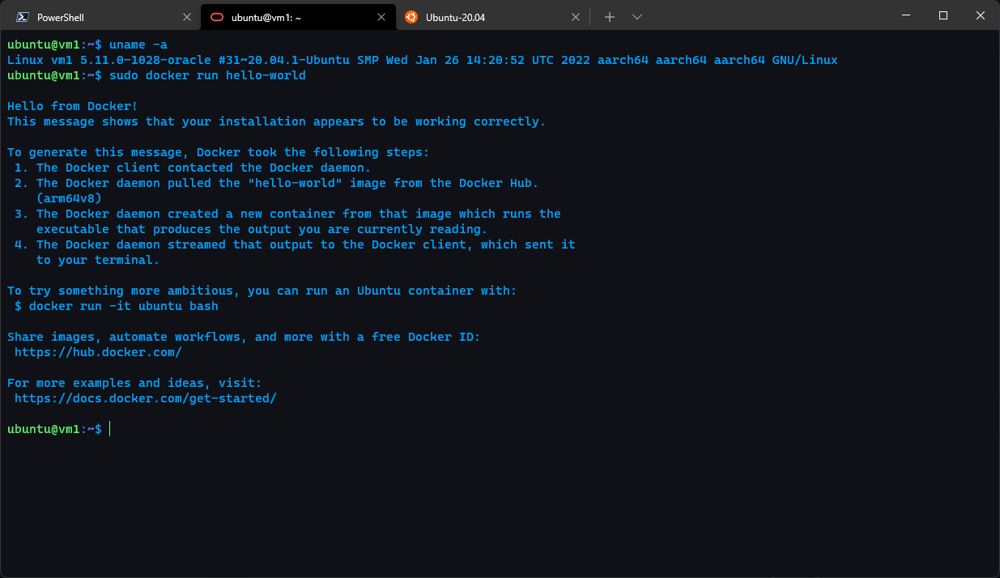

   Hello world na Ubuntu 20.04 x64 na WSL2:
  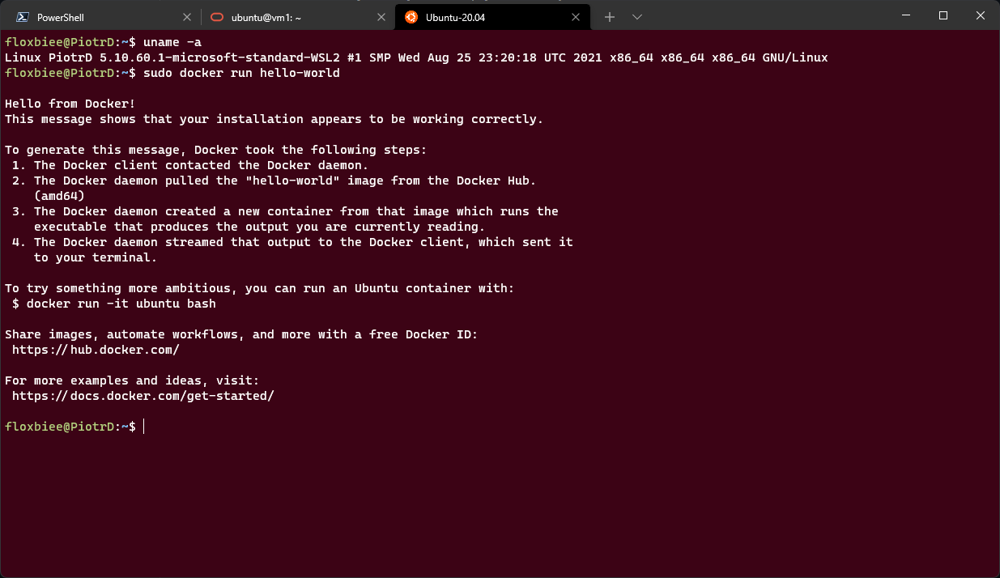

**4. Działanie środowiska**

   * **wykaż, że środowisko dockerowe jest uruchomione i działa (z definicji):**
        
        Wykazuję z definicji poprzez sprawdzenie statusu procesów poprzez polecenie ```ps``` z przełącznikiem ```-aux```. Poprzez ```grep``` szukam słowa docker. Jak można zauważyc na maszynie jest proces ```dockerd``` oraz ```containerd```.

        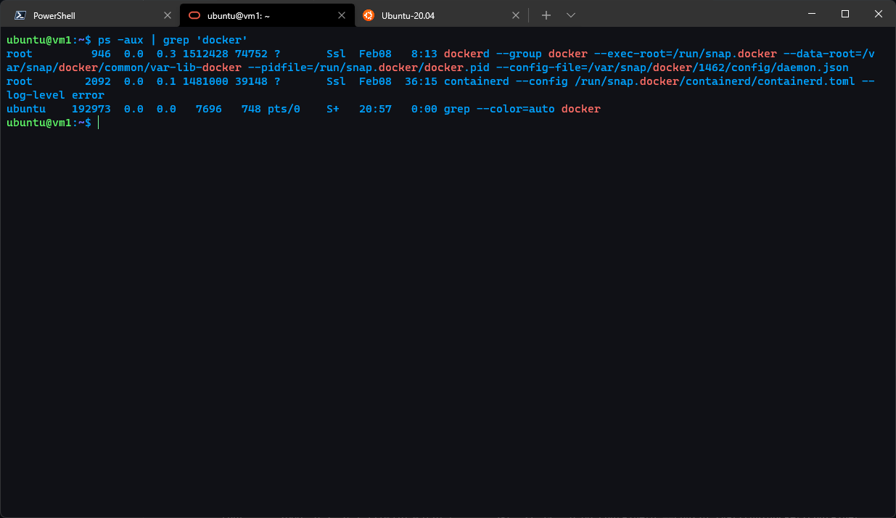
   * **wykaż działanie z sposób praktyczny (z własności):**
      * **pobierz obraz dystrybucji linuksowej i uruchom go**
      * **wyświetl jego numer wersji**

        Wykazuję działanie poprzez pobranie obrazu i uruchomienie systemu ```Fedora``` poprzez ```docker run```. Następnie sprawdzam wersję poprzez ```docker images```. Jak można zauważyć wersja jest "najnowsza".
        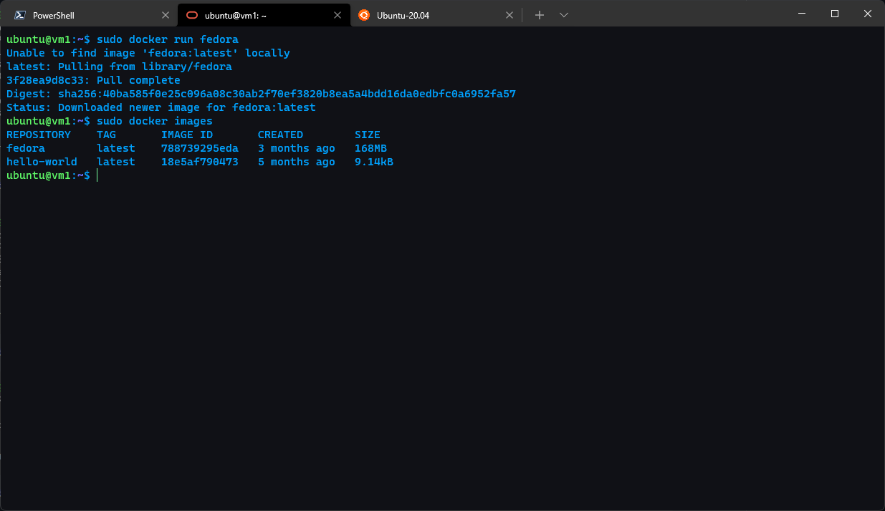

         W celu sprawdzenia dokładnej wersji wywołuję w kontenerze ```cat /etc/os-release```. Z uzyskanych wyników można stwierdzić, że dokładna wersja systemu to ```Fedora 35```.

        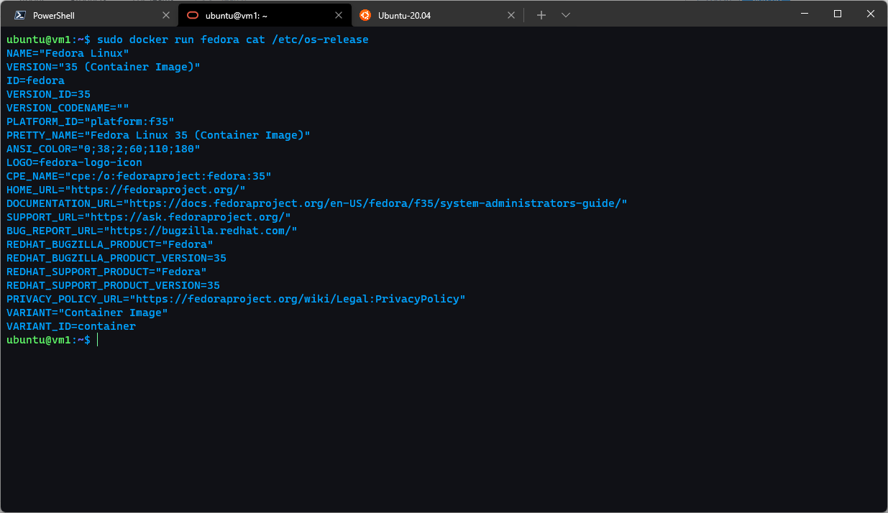

**5. Załóż konto na Docker Hub**

Zakładam konto z podstawowym personalnym planem.

  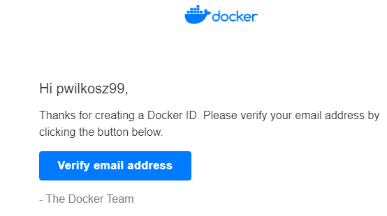

  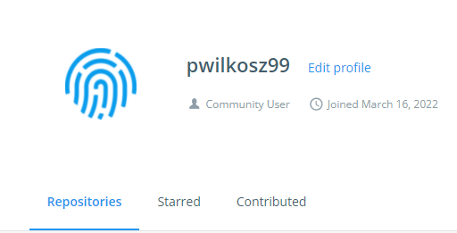
