#  Piotr Wilkosz - 404121
## Sprawozdanie 3

### Wybór oprogramowania na zajęcia

Wybranym przeze mnie projektem jest strona ```nodejs.org```. Repozytorium jest projektem  tworzonym przez społeczność na otwartej licencji(https://github.com/nodejs/nodejs.org).

* **Znajdź repozytorium z kodem dowolnego oprogramowania, które:**
	* **dysponuje otwartą licencją  ✔️**
	* **jest umieszczone wraz ze swoimi narzędziami Makefile tak, aby możliwe był uruchomienie w repozytorium czegoś na kształt ```make build``` oraz ```make test```. Środowisko Makefile jest dowolne. Może to być automake, meson, npm, maven, nuget, dotnet, msbuild... ✔️**
	* **Zawiera zdefiniowane i obecne w repozytorium testy, które można uruchomić np. jako jeden z "targetów" Makefile'a. Testy muszą jednoznacznie formułować swój raport końcowy (gdy są obecne, zazwyczaj taka jest praktyka)  ✔️**
* **Sklonuj niniejsze repozytorium, przeprowadź build programu (doinstaluj wymagane zależności)**

  Klonuję repozytorium. Używam polecenia ```git clone```.

    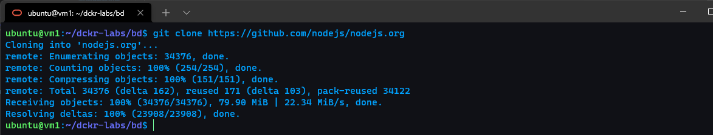

  Nastepnie instaluję zależności(```npm install```)

    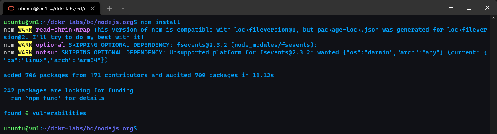

  Na końcu buduję projekt(```npm run build```)

    


* **Uruchom testy jednostkowe dołączone do repozytorium**
  
  Uruchamiam testy jednostkowe(i nie tylko) poprzez ```npm test```

    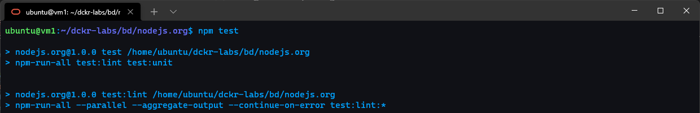


### Przeprowadzenie buildu w kontenerze

1. **Wykonaj kroki build i test wewnątrz wybranego kontenera bazowego. Tj. wybierz "wystarczający" kontener, np ```ubuntu``` dla aplikacji C lub ```node``` dla Node.js**
	* **uruchom kontener**
        
      Wybranym kontenerem do tego projektu jest oczywiście kontener ```Node```. Rozpoczynam od uruchomienia kontenera.  Używam do tego polecenia ```docker run```. Użyłem przełącznika ```-it``` aby uruchomić interaktywny terminal. Słowo ```bash``` na końcu użyte w celu użycia terminala na bashu(defaultowo jest to node). ```-p``` użycie w celu wypuszczenia(i przekierowania) określonego portu.

        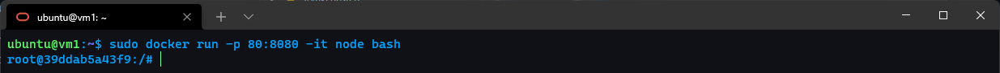
        
    * **podłącz do niego TTY celem rozpoczęcia interaktywnej pracy**
      
      ⬆️
    * **sklonuj repozytorium**
      
      Używam polecenia ```git clone``` w celu sklonowania repozytorium. Następnie przechodzę do katalogu poprzez ```cd```.

        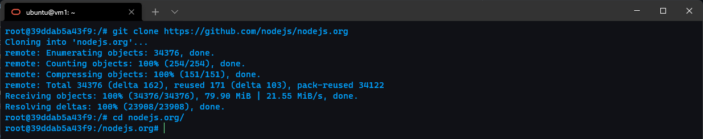
  	* **zaopatrz kontener w wymagania wstępne (jeżeli proces budowania nie robi tego sam)**

      W celu zapatrzenia w wymagania wstępne uruchamiam ```npm install```. 

        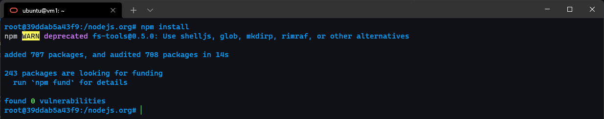

  	* **uruchom build**

      Uruchamiam builda poprzez ```npm run build```.

        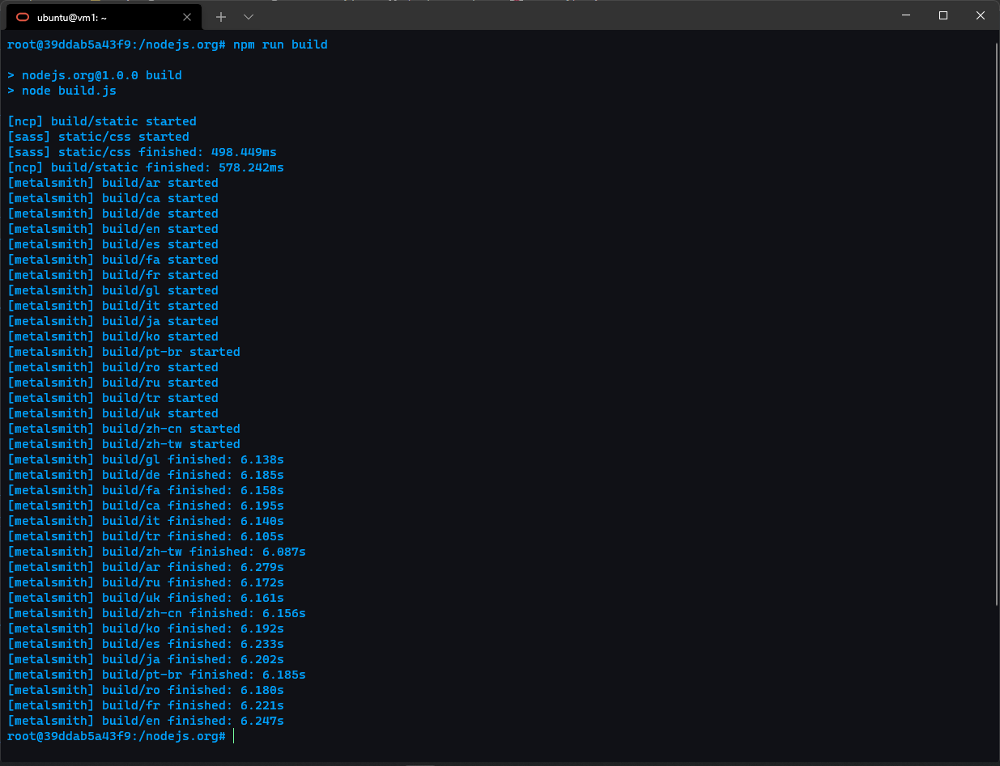
  	* **uruchom testy**

      Uruchamiam testy poprzez ```npm test```. Przedstawiam zruty z początku i podsumowania

        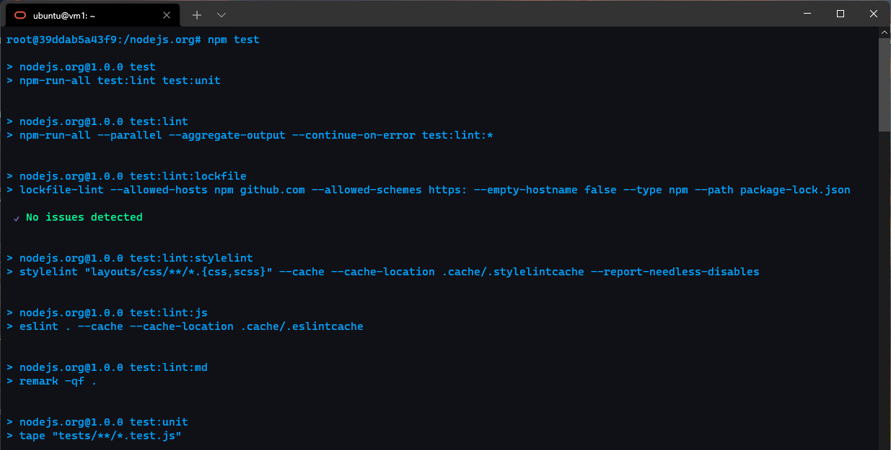
        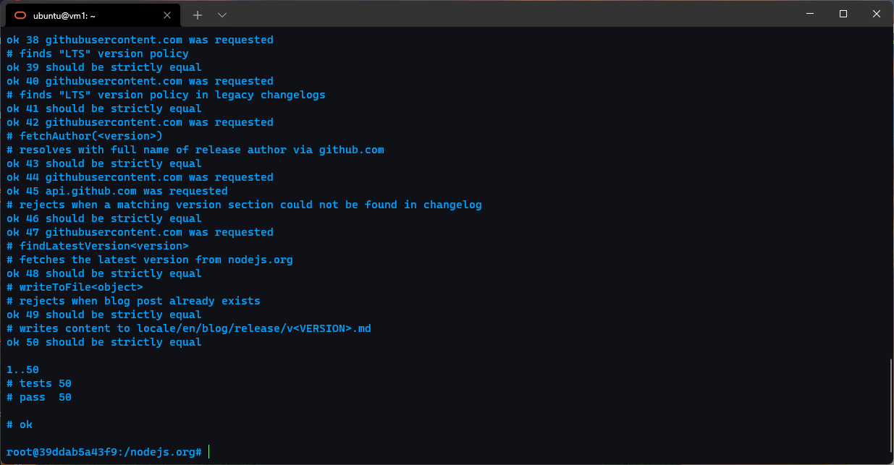
2. **Stwórz dwa pliki Dockerfile automatyzujące kroki powyżej, z uwzględnieniem następujących kwestii**
	* **Kontener pierwszy ma przeprowadzać wszystkie kroki aż do builda**
  
      Na początku wybierany jest najnowszy obraz kontenera Noda poprzez ```FROM```. Kolejno kopiowane jest repozytorium, polecenie gitowe uruchamiane poprzez ```RUN```. Git znajduje się już w obrazie Node. Następnie zmieniana jest ścieżka robocza poprzez ```WORKDIR```. Dalej instalowane są zależności i uruchamiany build polecenia uruchamiane poprzez ```RUN```.

        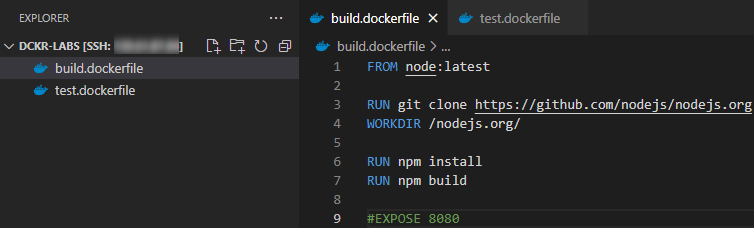
	* **Kontener drugi ma bazować na pierwszym i wykonywać testy**
  
      Na początku wybierany jest najnowszy obraz stworzonego wcześniej obrazu. Kolejno zmieniana jest scieżka i uruchamiane testy.

        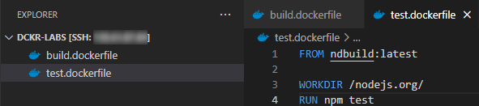
3. **Wykaż, że kontener wdraża się i pracuje poprawnie. Pamiętaj o różnicy między obrazem a kontenerem. Co pracuje w takim kontenerze?**

  Na początku wykazuję działania dockerfile do builda. Buduję poprzez polecenie ```docker build```. Przełączniki ```-f``` w celu wyboru dockerfile(nazwa to nie Dockerfile). ```-t``` wybrane w celu wskazania nazwy końcowej obrazu. W celu wykazania przedstawiam dwa zrzuty na których widać konkretne kroki dockerfila oraz rezultat końcowy.

  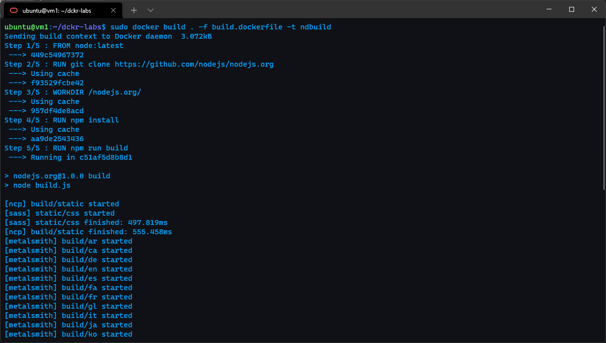
  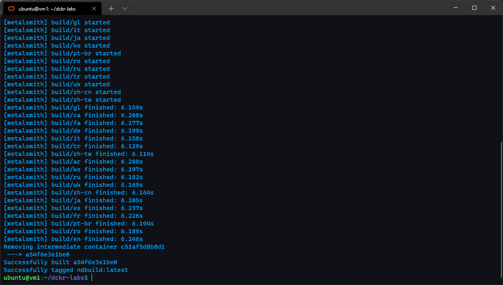

  Po zbudowaniu uruchamiam dockerfila z testami. Przedstawiam kroki i wyniki koncowe testów. Wszystko zakończone pozytywnie.

  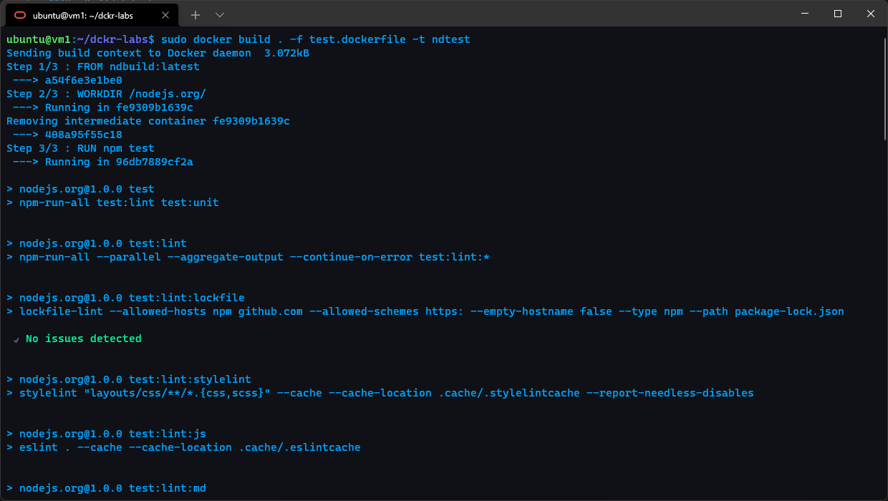
  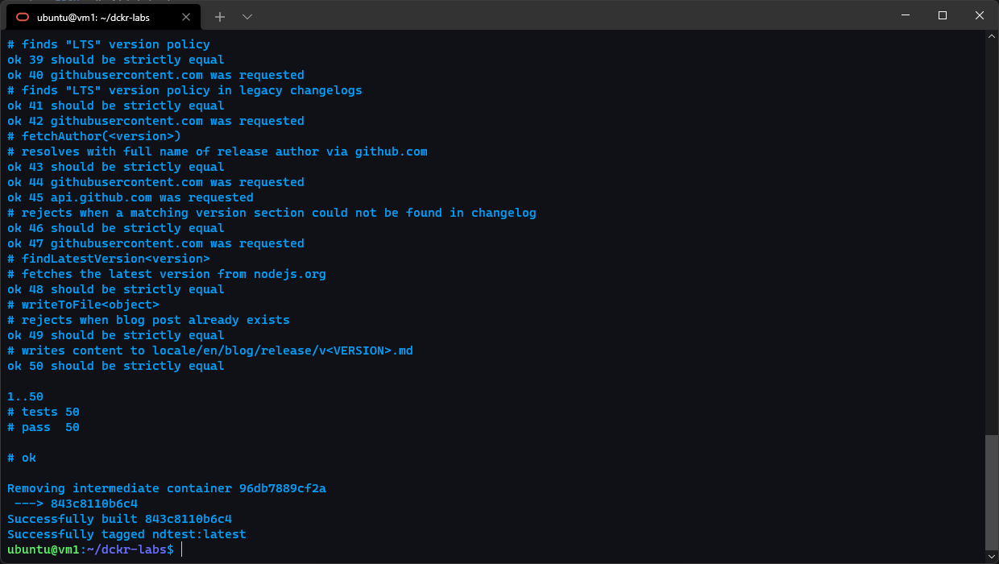

  Po zakończeniu procesu wykazuję powstałe obrazy poleceniem ```docker images```.

  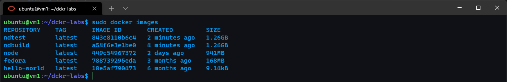

  Na końcu w celu wykazania poprawności działania uruchamiam obraz. Publikuję porty i wykazuję działania w praktyce. Zadania były wykonywane na maszynie wirtualnej z domeną więc po uruchomieniu poprzez ```npm start``` na porcie 8080 widoczny jest efekt końcowy a więc strona Noda.

  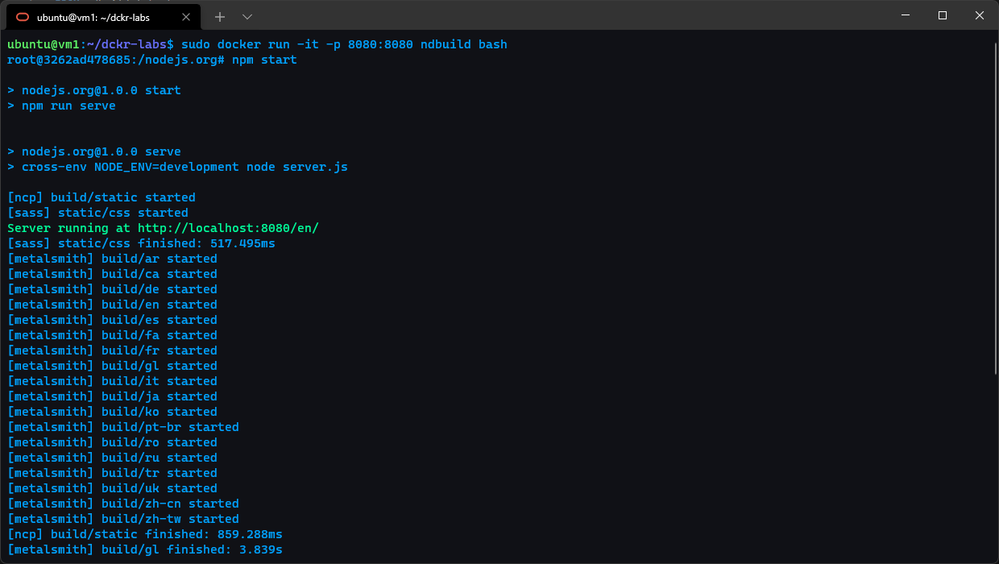

  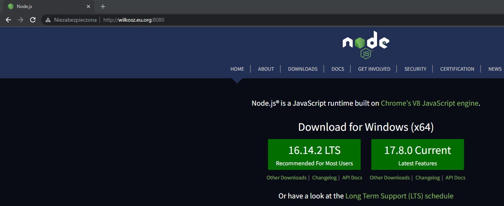