#  Piotr Wilkosz - 404121
## Sprawozdanie 3

### Zachowywanie stanu
* **Przygotuj woluminy wejściowy i wyjściowy, o dowolnych nazwach, i podłącz je do kontenera bazowego, z którego rozpoczynano poprzednio pracę**
  
  Rozpoczynam od stworzenia dwóch woluminów wejściowego oraz wyjściowego o nazwach odpowiednio ```volin``` oraz ```volout```. Używam do tego polecenia ```docker volume create```. Przełącznik ```--name``` użyty w celu nadania nazwy.

  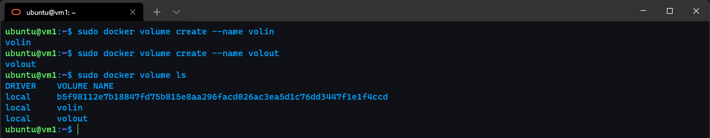

  W celu wyświetlenia szczegółów o woluminie używam polefcenia ```docker volume inspect```. W ten sposób dokonuję inspecji, dzięki której mogę znaleźć takie informacje jak np. punkt montowania.

  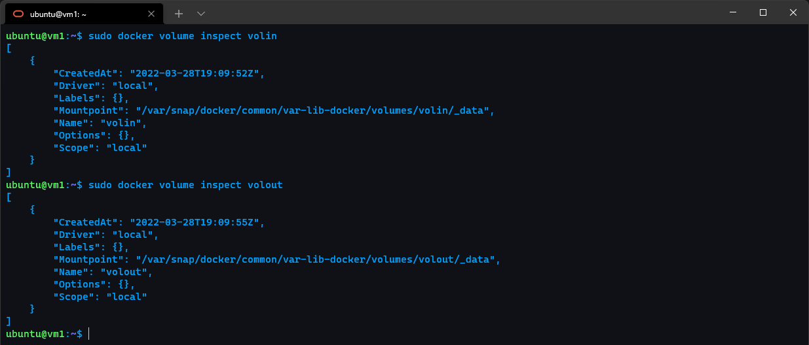

  Ze względu na zalecnie braku gita zmieniam używany kontener bazowy. Zamiast ```node:latest``` wybieram ```node:slim```, który jest jego odchudzoną wersją. Z tego powodu nie znajdziemy tam takich narzędzi jak np. git. Poza tym jest czterokrotnie mniejszy.

   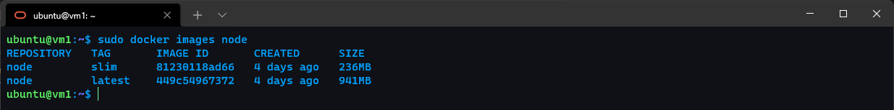

* **Uruchom kontener, zainstaluj niezbędne wymagania wstępne (jeżeli istnieją), ale *bez gita***

   Uruchamiam kontener. Jednocześnie montuję oba volume. Do uruchomienia uzywam polecenia ```docker run```. W celu zamontowania volume używam przełącznka ```-v``` w formacie ```[nazwa volume]```:/```[punkt montowania w konterzene]```. Poza tym ```-it``` uzyte w celu interaktywnego terminalu. Nazwa nadana poprzez ```--name``` oraz słowo ```bash``` w celu terminala bashoego a nie node.

   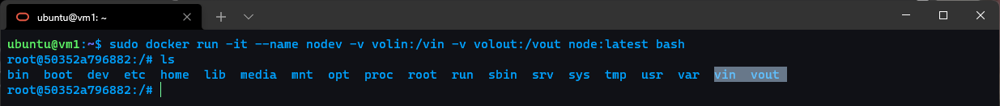

   Na kolejny zrzucie ekranu wykazuję zamontowanie woluminów w konterze.
   

   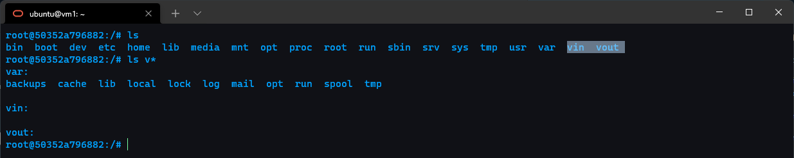

   Do aktualnego repozytorium i wybranego obrazu dockerowego nie potrzebuje innych wymagań wstepnych(wystarczy npm install).
   
* **Sklonuj repozytorium na wolumin wejściowy**

   Klonuję repozytorium na wolumin wejściowy ```volin```. Aby zgodnie z treścią zadania nastąpił bezpośredni clone, a nie clone i kopia wchodzę na zamontnowany na hoście volume jako root i tam używam polecenia ```git clone```. Używam ścieżki, która została wyświetlona w poprzednich zrzutach.

   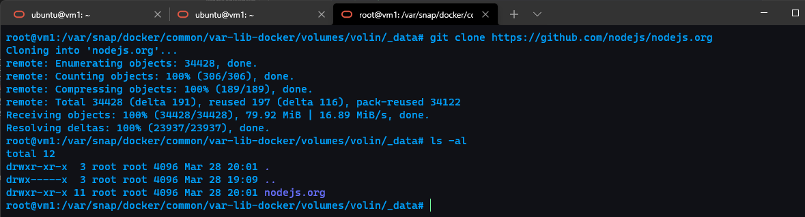

   Poniżej wylistowane repo w zamontowanym volume z poziomu konteneru.

   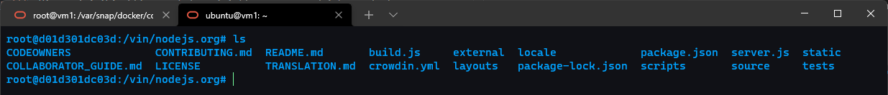

* **Uruchom build w kontenerze**

   W celu budowania w pełni na kontenerze kopiuję katalog bezpośrednio na kontener.

   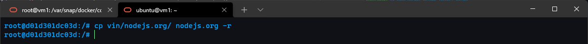

   Kolejno instaluję dependencję poprzez ```npm ci```, akronim clean-install.

   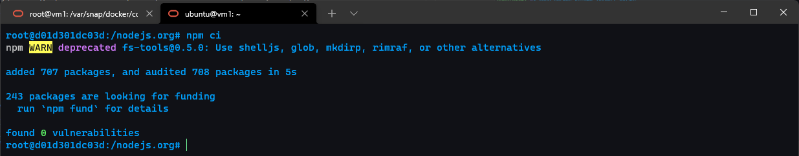

   Na końcu uruchamiam builda poprzez ```npm run build```

   

* **Zapisz powstałe/zbudowane pliki na woluminie wyjściowym**

   Po zbudowaniu powstałe pliki przenoszę na wolumin wyjściowy ```vout```. Następnie listuję jego zawartość. 

   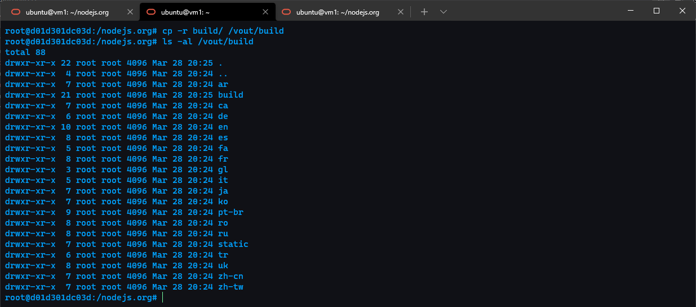

   Dla potwierdzenia listuję katalog z poziomu hosta.

   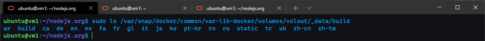

### Eksponowanie portu
* **Uruchom wewnątrz kontenera serwer iperf (iperf3)**

   Na początku poszukuję odpowiedniego obrazu dockerowego z iperfem. Wskazywany na zajęciach obraz od ```clearlinux``` nie posiada wersji na arm64. W związku tym znajduję na dockerhubie odpowiednią wersję alternatywną. Jest ona oparta na alpinie.

   Uruchamiam serwer poprzez ```docker run``` z znalezionym obrazem od ```taoyou```. Używam znacznika ```-p```, akronim publish do publikowania wybranego portu, w tym przypadku 5021. Oprócz tego ```-it``` użyte do interaktywnego terminala oraz ```--rm``` do wywalenia obrazu po zamknięciu.

   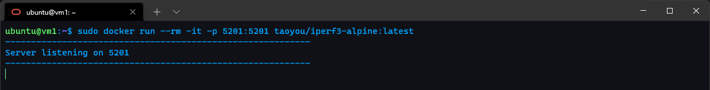

* **Połącz się z nim z drugiego kontenera, zbadaj ruch**

   Na początku sprawdzam czy server nasłuchuje. Używam do tego polecenia ```netstat``` i grepuje nasłuchujące porty.

   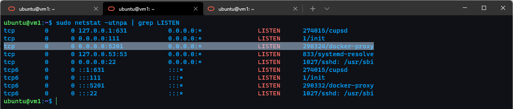

   Przechodzę do łączenia się z drugiego kontenera. Podobnie jak poprzednio uruchamiam kontener. Tym razem jako input przesyłam przełacznik z iperfa ```-c```, który pozwala na działanie jako client. Poprzez ```--time``` wybieram czas, jest to 20 sekund. Połączenie zostaje nawiązane. Wyniki poniżej.

   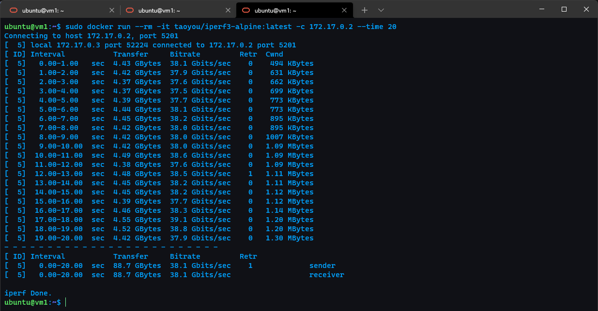

* **Połącz się spoza kontenera (z hosta i spoza hosta)**

   Przechodzę do połączenia spoza kontenera. Jako piewsze sprawdzam połączenie z hosta(urządzenia na którym stoi docker, a więc cloduowa VM)

   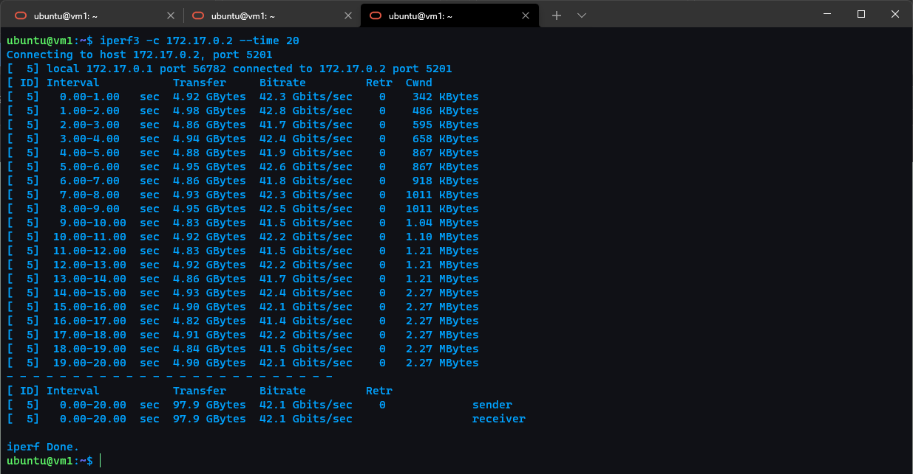

   Jako kolejne testuję połączenie spoza hosta. Tym razem testuje z prywatnego komputera spoza sieci cloudowej z systemem Windows 11, na którym jest Ubuntu WSL2. Aby dokonać połączenia publikuję na przekierowanym porcie 80, ze względu na przygotowane już polityki na firewallu. 

   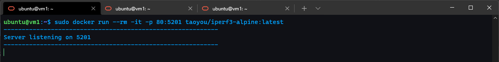

   Kolejno dokonuję testów już z poziomu Ubuntu. Stosuję taki sam czas jak w poprzednich testach. Używam ustalonego już wcześniej portu 80.

   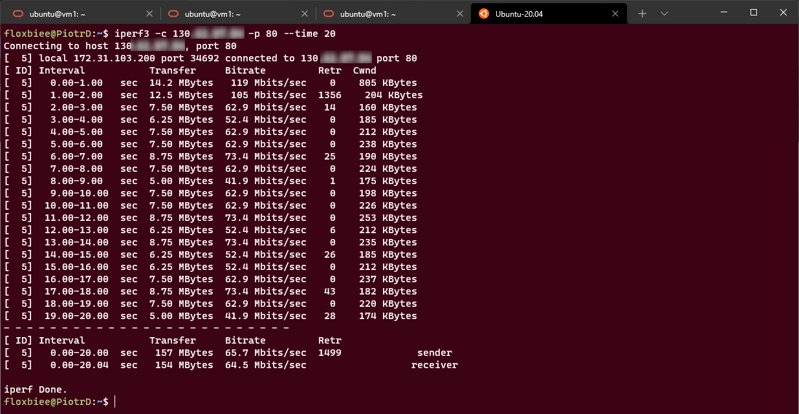

* **Przedstaw przepustowość komunikacji lub problem z jej zmierzeniem (wyciągnij log z kontenera)**

   Dokonuję porównania przepustowości komunikacji. Pobieram log z kontenera poprzez ```docker log```. Ze względu, iż testy były intensywne, a więc z różnymi argumentami i częstym CTRL-C lepsze do porównania będą zrobione screenshoty.

   

   W celu przedstawienia przepustowości komuniacji zamieszczam poniżej porównanie w postaci wykresu. Porównuję ilość przetransferowanych danych w czasie 20 sekund.

   

   Uzyskane wyniki były wynikami spodziwanymi. Najwyższą przepustowość uzyskano pomiędzy hostem i kontenerem. Wynik o niecałe 10% mniejszy uzyskano pomiędzy dwoma odrębnymi kontenerami. Najwyższy czas z wiadomych względów uzyskano z komputera zewnętrznego. Był on o kilka rzędów jednostek niższy.

### Instancja Jenkins
* **Zapoznaj się z dokumentacją  https://www.jenkins.io/doc/book/installing/docker/**
  
   ✔️

* **Przeprowadź instalację skonteneryzowanej instancji Jenkinsa z pomocnikiem DIND**

   Rozpoczynam instalację. Jako pierwszę tworzę nową sieć dockerową poprzez polecenie ```docker network create```. Podaję jako argumenty nazwę sieci, która będzie używana w kontenerach. W tym przypadku nazwa sieci to ```jenkins```.

   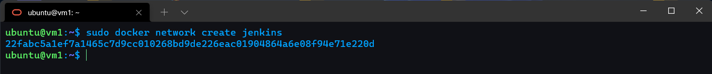

   Następnie zgodnie z instrukcją pobieram i uruchamiam obraz DIND kontenera. Używam znacznika ```--detach``` do uruchomienia kontenera jako demona. Używam znacznika ```--name``` do podania nazwy kontenera. Znacznik ```---privileged``` pozwala na użycie wszystkich uprawnień. Używam znacznika ```--network``` do podania nazwy sieci, która będzie używana w kontenerach. Znacznik ```--network-alias``` pozwala na podanie aliasu sieci, który będzie używany w kontenerach. Przełącznik ```--env``` pozwala na podanie zmiennych środowiskowych, które będą używane w kontenerach. Dodaję również volumy. ```---storage-driver``` pozwala na użycie właściwego mechanizmu zapisu danych.

   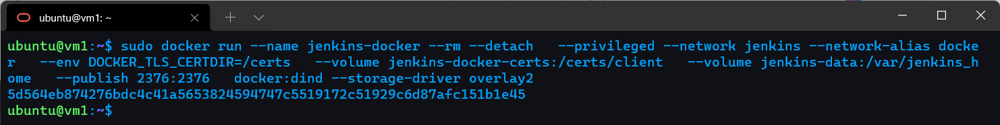

   Kolejno tworzę plik Dockerfile. Używam znacznika ```FROM``` do wskazania, ze kontener będzie dziedziczył z obrazu ```jenkins/jenkins:2.33.1-jdk11```. Poprzez USER określam użytkownika - roota. Używam znacznika ```RUN``` do wykonania polecenia w kontenerze.

   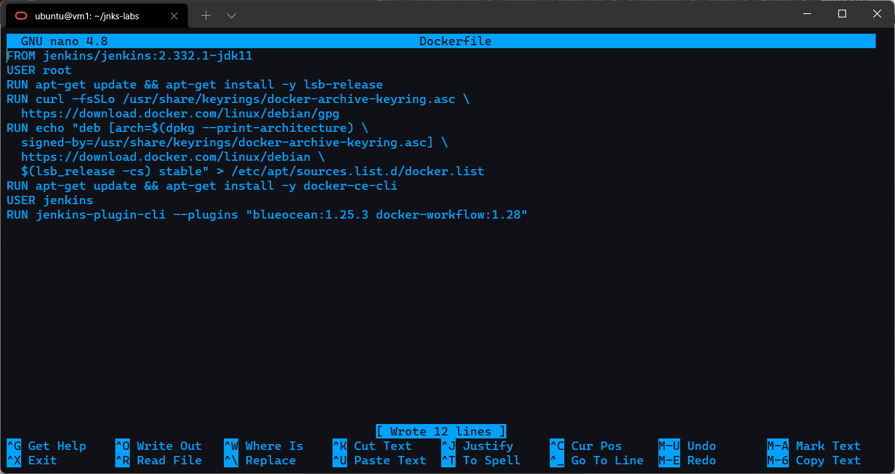

   Na końcu uruchamiam builda. Poprzez ```-t``` podaję nazwę obrazu, który będzie stworzony.

   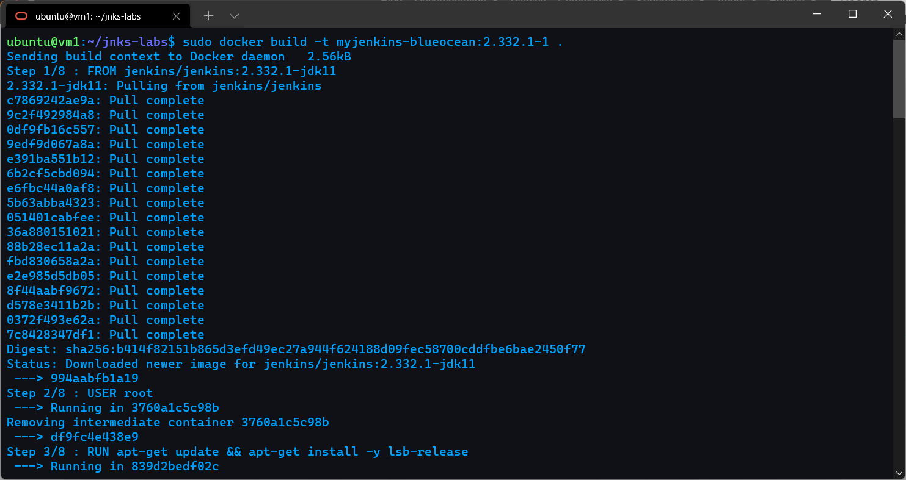

   Zakończenie procesu budowania. Pomimo problemów z połączeniem budowanie zakonczone z powodzeniem.

   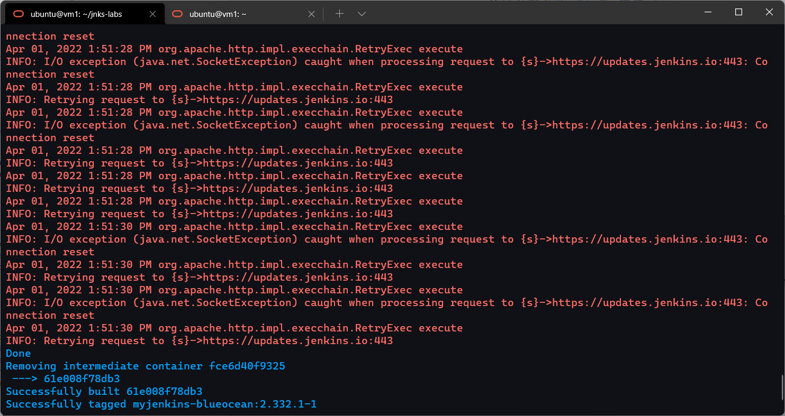

   Na końcu uruchamiam powstały stworzony obraz. Publikuję go port 8080 oraz 50000.

   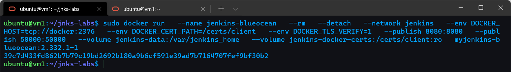

* **Zainicjalizuj instację, wykaż działające kontenery, pokaż ekran logowania**

   Na początku pokazuję praktycznie, że instancja jest uruchomiona. Wchodzę na adres(localhost, u mnie wypuszczony na zewnątrz) na porcie 8080 i pokazuję ekran powitalny jenkinsa.

   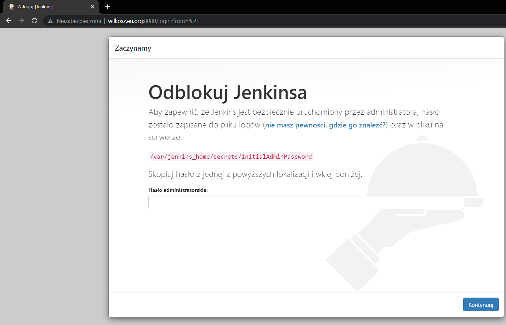

   Zgodnie z tym znajduję hasło. Poleceniem ```docker exec``` uruchamiam na aktywnym kontenerze interaktywny terminal z bashem. Poleceniem ```cat``` odczytuje hasło.

   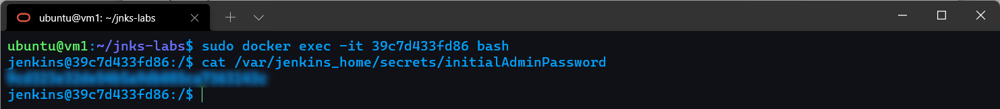

   Następnie już po zalogowaniu pobieram potencjalnie przydatne wtyczki.

   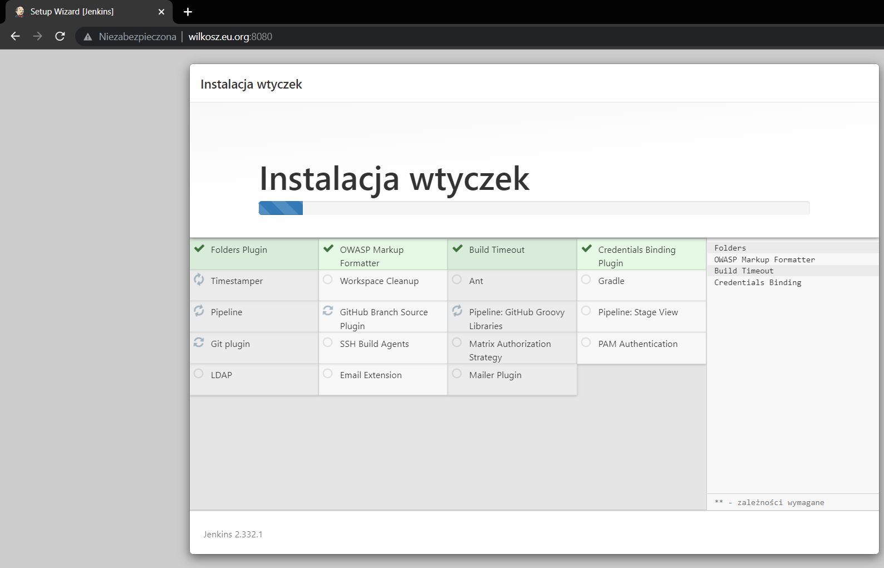

   W celu potwierdzenia pokazuję, że kontenery działają. Używam polecenia ```docker ps```.

   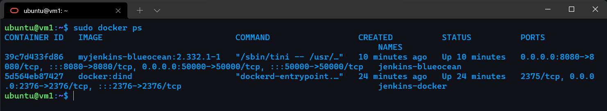

   Oraz pokazuję ekran logownia.

   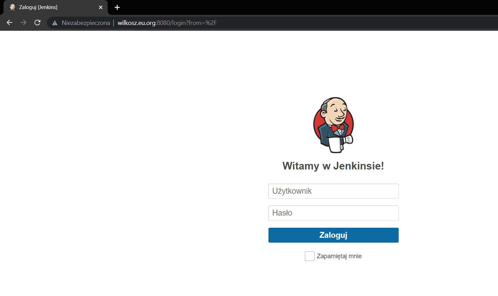