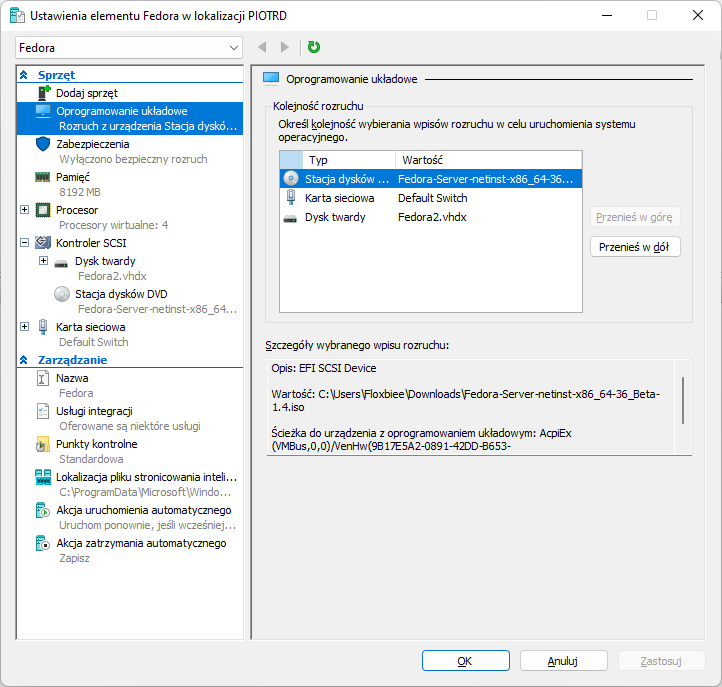
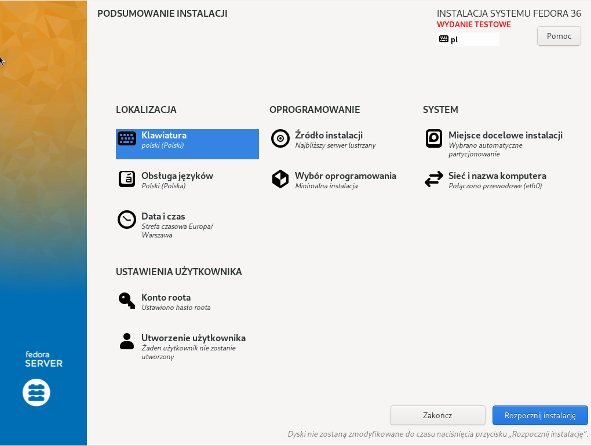
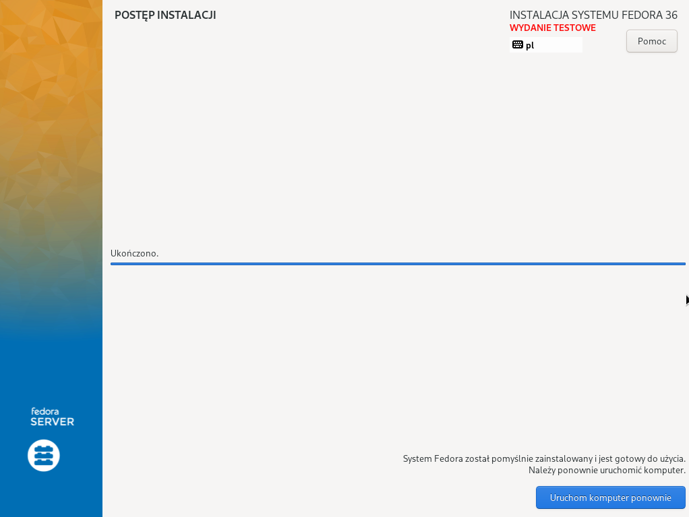
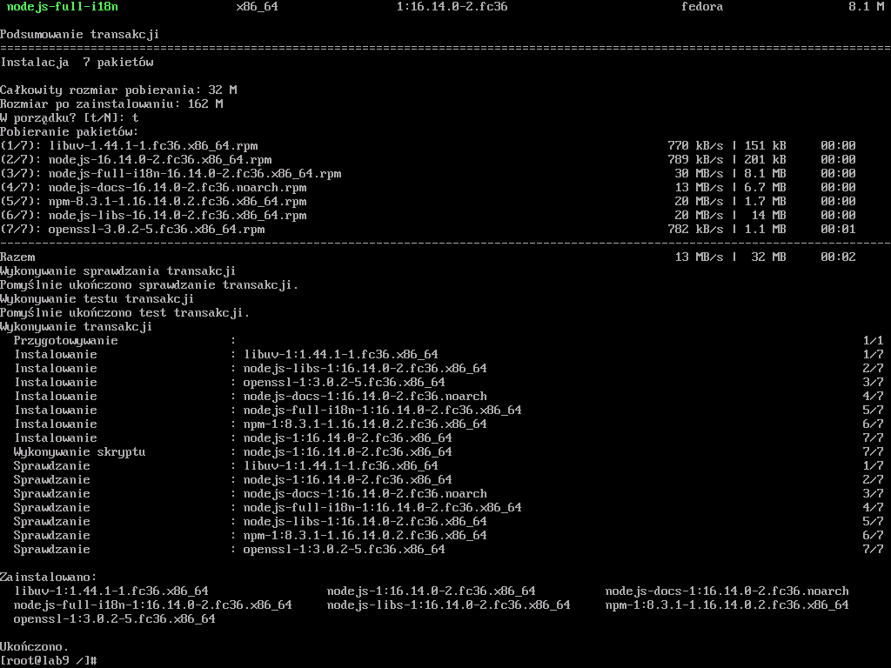
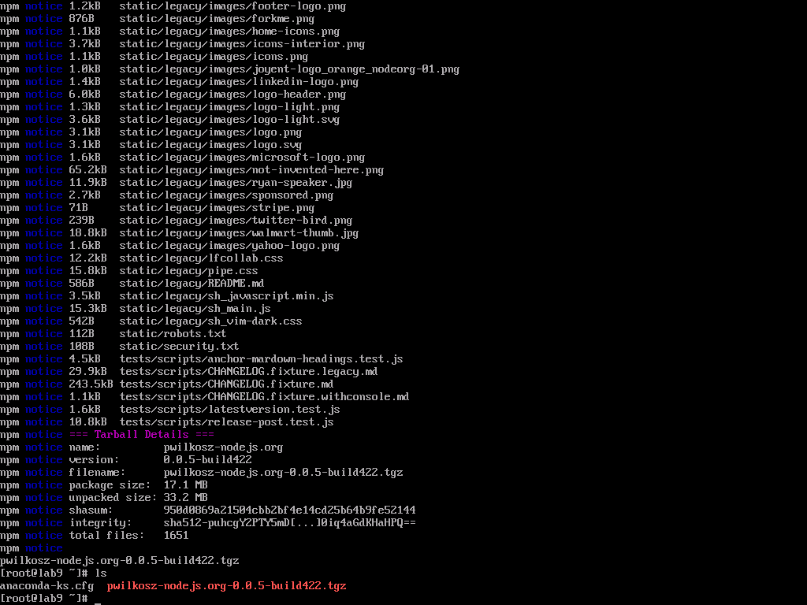
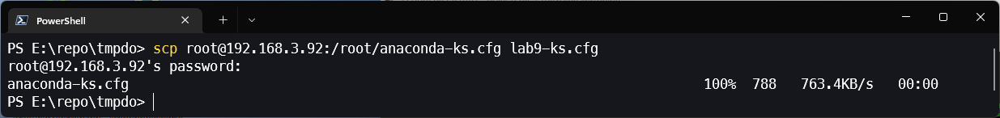
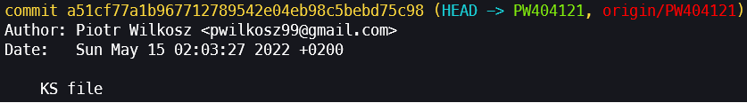
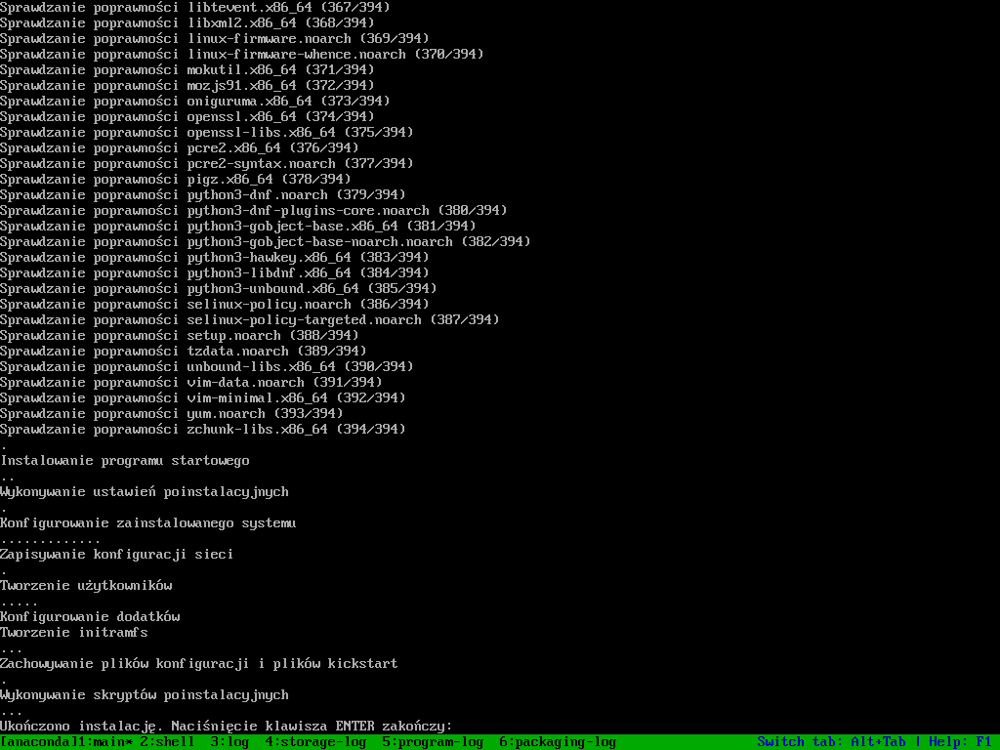
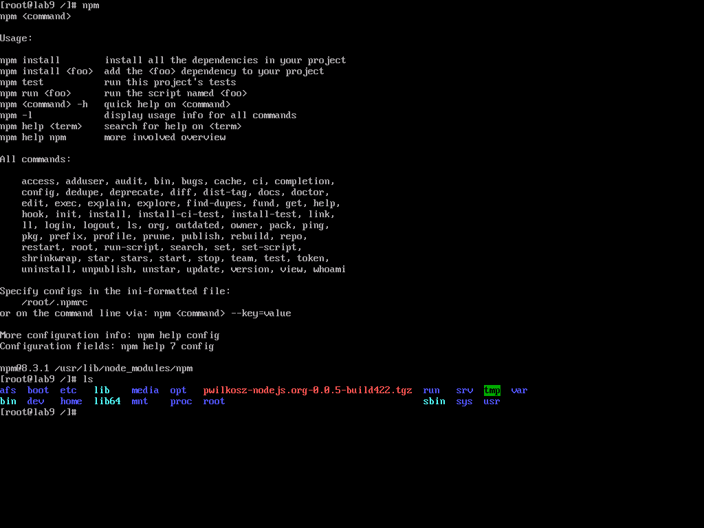

#  Piotr Wilkosz - 404121
## Sprawozdanie 9

### Przygotowanie systemu pod uruchomienie
* **Przeprowadź instalację systemu Fedora w VM, skonfiguruj użytkowników (użyj haseł, które można bezkarnie umieścić na GitHubie!), sieć, wybierz podstawowy zbiór oprogramowania, optymalnie bez GUI**
  
   Instalacji dokonuje poprzez Hyper-V. 

   

   Ustawiam wspomniane w instrukcji ustawienia i instaluję system

   

   

* **Przeprowadź drugą instalację systemu Fedora w VM - celem drugiego systemu będzie wyłącznie serwowanie repozytorium przez HTTP**

   Pomijam ten krok. Uważam, że pakiet znajdujacy się w npm registry można uznać pod względem działania za "serwer HTTP". W ten sposób rola serwowania repozytorium pozostaje spełniona.

* **Umieść artefakty z projektu na serwerze HTTP**

   Jak wyżej. Proces umieszczania znajduje się w ostatnim kroku w Jenkinsowym pipelinie. 

* **Na zainstalowanym systemie wykonaj zbiór poleceń umożliwiających pobranie artefaktu, zapisz polecenia**

   Na początku poprzez polecenie ``yum install npm`` instaluję npm.

   

   Później w celu pokazania pobrania artefaktu pobieram paczkę z npm registry. Używam polecenia ``npm pack`` z nazwą swojego pakietu.

   

# Zakres rozszerzony


* **Skonfiguruj pipeline tak, by upload na serwer HTTP następował automatycznie**

   W zwiazku z tym, że publikuję artefakt w npm registry ten krok został juz wykonany w ramach poprzednich laboratoriów. Upload dokonywany jest poprzez polecenie ``npm publish`` w ostatnim stage pipelina.

   ```groovy
   stage('Publish') {
               agent {
                  docker {
                     image 'node'
                     args '-v vol-in:/vi -v vol-out:/vo'
                  }
               }
               when { branch "CI" }
               steps {
                  dir('pckg/$BUILD_NUMBER') {
                           script{
                              env.VERSION = sh( script: "npm view . version",returnStdout: true).trim()
                              echo "VERSION: ${env.VERSION}"
                           }
                           sh 'ls . -al'                    
                           withEnv(["TOKEN=${NPMJS_TOKEN}"]) {
                              sh 'echo "//registry.npmjs.org/:_authToken=${TOKEN}" >> ~/.npmrc'
                           }
                           sh 'git config --global user.email "pwilkosz99@gmail.com"'
                           sh 'git config --global user.name "PWilkosz"'
                           withEnv(["TOKEN=${GH_TOKEN}"]) {
                              sh 'git config remote.origin.url "https://${TOKEN}@github.com/PWilkosz99/nodejs.org.git"'
                           }
                           withEnv(["VER=${VERSION}"]){
                              sh 'npm version ${VER}-build$BUILD_NUMBER'
                              sh 'git tag -a "${VER}-build$BUILD_NUMBER" -m "${VER}-build$BUILD_NUMBER"'
                           }
                           sh 'npm publish'
                           sh 'git push --tags'
                  }
                  sh 'ls'
               }
         }
   ```

* **Jeżeli artefaktem jest plik RPM, serwer HTTP powinien serwować repozytorium (createrepo)**

   Artefaktem nie jest plik RPM.

### Instalacja nienadzorowana

* **Zlokalizuj plik odpowiedzi z instalacji**

   Plik odpowiedzi anaconda-ks.cfg został zlokalizowany. Z zainstalowanego systemu wyciągam go poprzez scp.

   

* **Dodaj do niego elementy odpowiedzialne za wszystkie potrzebne dependencje**

   Elementy zwiazane z instalacją npm wykonywane są pooprzez pobranie packietu w umieszczonych repozytorów. Instalacja dependencji i pobranie package dokonuję w procedurze ``%post`` jako skrypty poinstalacyjne.
   
   ```bash
   %packages

   @^minimal-environment
   npm*

   %end
   ```

   ```bash
   %post

   npm i pwilkosz-nodejs.org
   npm pack pwilkosz-nodejs.org

   %end
   ```
*  **Zdefiniuj repozytoria (co najmniej OS i aktualizacje, najlepiej też depednecje, optymalnie także repozytorium z własnym oprogramowaniem)**

   Definiuję repozytoria. Zmieniam typ instalacji na textowy.

   ```bash
   # Use graphical install
   text
   ```

   ```bash
   # Repo
   url --mirrorlist=http://mirrors.fedoraproject.org/mirrorlist?repo=fedora-$releasever&arch=x86_64 
   repo --name=updates --mirrorlist=http://mirrors.fedoraproject.org/mirrorlist?repo=updates-released-f$releasever&arch=x86_64
   ```

* **Dodaj proces pobierania artefaktu**

   Dla wykazania obecności pobieranych plików pobrania dokonuję poprzez ``npm pack`` w zastosowaniu wykazanym powyżej.

### Infrastructure as a code

* **Umieść plik odpowiedzi w repozytorium**

   Umieszczam plik.

   

* **Połącz plik odpowiedzi z ISO instalacyjnym**

   Edytuję parametry uruchomieniowe. A następnie rozpoczynam proces instalacji

   

   Instalacja przebiegła pomyślnie

   

   Potwierdzenie można zobaczyć poprzez obecność wpisanych w pliku odpowiedzi pakietów oraz pobraniego package. Przyszłościowo zmieniłbym ścieżkę pobierania gdyż ta nie jest do końca optymalna.

   
