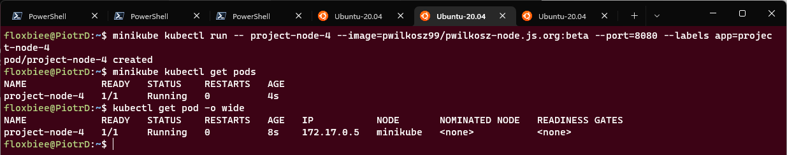
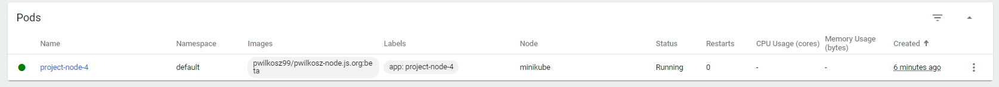
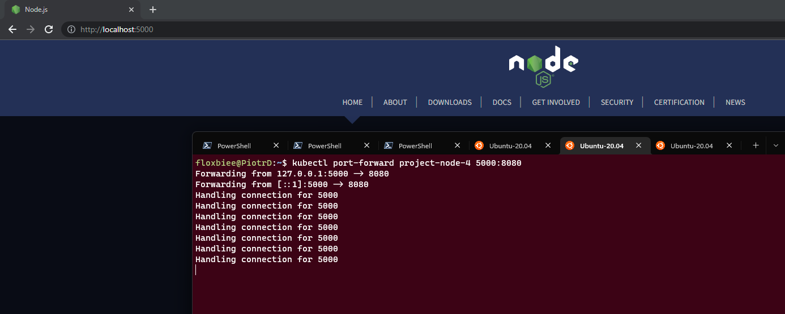
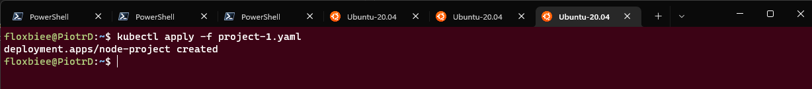
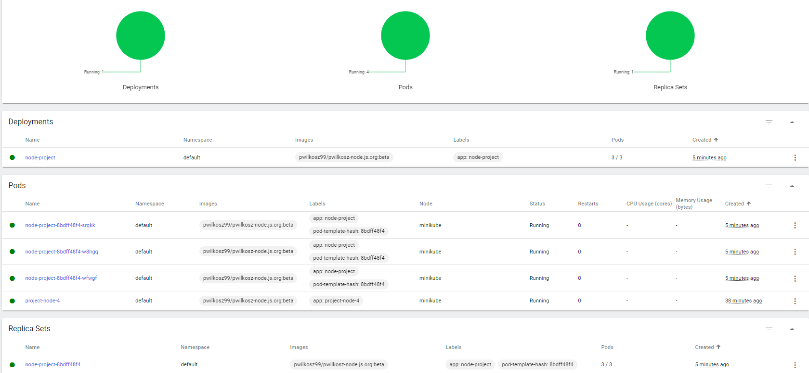

#  Piotr Wilkosz - 404121
## Sprawozdanie 11

### Instalacja klastra Kubernetes

Na początku dokonuję instalacji klastra. Dokonuję tego z oficjalnej strony producenta. Ze względu na liczne problemy i wynikające z tego przeprowadzane testy dokonuję tego łącznie dla 3 platform - Windows, Linux ARM64 oraz x64. Na zrzuach ekranu prezentuję na instalację na Ubuntu x64.


Kolejno uruchamiam minikube zaopatruję się w polecenie kubectl.


Nastepnie uruchamian kubernetesa i wykazuję działający z nim kontener poprzez ``docker ps``.


Następnie uruchamiam i prezentuję dashboard.


### Analiza posiadanego kontenera

Na podstawie posiadanego dockerfile tworzę obraz. Następnie wypycham go na docker hub w zwiazku z wynikłymi kompilacjami.

Nie używam w tym przypadku artefaktu z pipelina gdyż zgodnie z wymaganiami jest on wypychany na npm registry. Dodatko pracuję na kilku platformach wieć zmiana w tym przypadku była by mocno problematycza.


Nastepnie wykazuję że aplikacja pracuje jako kontener. Jej zawartość wyprowadzam na porcie 5000.


   
### Uruchamianie oprogramowania

Kolejno podejmuję próbę uruchomienia na stosie k8s. Niestety na tym etapie napotkałem na problemy które ~~uniemożliwiły mi kontynuację zadania~~ udało się już rozwiązać. 

<details>
  <summary>Detale byłego problemu</summary>

  ```
Związane są one z błędem ``CrashLoopBackOff`` podczas uruchamiania obrazu. Problem ten występuje w przypadku uruchamiania każdego obrazu opartego na Node, również przy czystym node:latest, na każdej z trzech uzywanych platform. Inne obrazy nie związane z NodeJS działają poprawnie.```


W związku z tym pozostała cześć zadania zostanie wykonana razem z kolejnymi etapami, po rozwiązaniu problemu.
  ```
</details>

Rozwiązaniem było uruchomienie servera bezpośrednio  poprzez ```node``` z paramterami z package.json zamiast ```npm start```.

Uruchomienie poda nastąpiło poniższym poleceniem, w którym specyfikuję używany obraz znadjujacy się na docker hub'ie we wskazanej wersji - ```beta```. Dodatkowo określam port i etykiety. Kolejno wyświetlam status podów poprzez cli oraz dashboard.





Kolejno przy pomocy polecenia ``kubectl port forward`` wyprowadzam port 8080 na port lokalny 5000 i wykazuję poprawne działanie aplikacji.


 
### Przekucie wdrożenia manualnego w plik wdrożenia (wprowadzenie)

Rozpoczynam tworznie pliku YAML. Defniuję 3 repliki. Ustawiam obraz z wypchniętą wcześniej wersją aplikacji. Wyprowadzam port 8080.

```yaml
apiVersion: apps/v1
kind: Deployment
metadata:
  name: node-project
  labels:
    app: node-project
spec:
  replicas: 3
  selector:
    matchLabels:
      app: node-project
  template:
    metadata:
      labels:
        app: node-project
    spec:
      containers:
      - name: node-project-container
        image: pwilkosz99/pwilkosz-node.js.org:beta
        ports:
        - containerPort: 8080
```

Następnie wywołuje polecenie ```kubectl apply```



Po jego uruchomieniu w dashbordzie można zauważyć powstanie nowego deplotemnu. Powstaje jeden nowy replica set, zawierajacy 3 pody. Wraz z uruchomionym poporzednim pojedynczym podem łączenie uruchomione są 4 pody.

