#  Piotr Wilkosz - 404121
## Sprawozdanie 11

### Instalacja klastra Kubernetes

Na początku dokonuję instalacji klastra. Dokonuję tego z oficjalnej strony producenta. Ze względu na liczne problemy i wynikające z tego przeprowadzane testy dokonuję tego łącznie dla 3 platform - Windows, Linux ARM64 oraz x64. Na zrzuach ekranu prezentuję na instalację na Ubuntu x64.

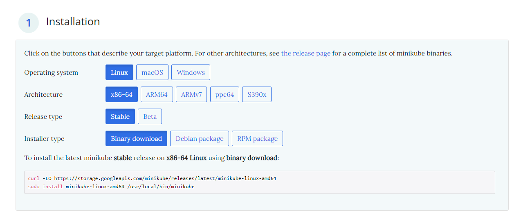

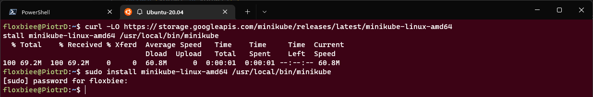

Kolejno uruchamiam minikube zaopatruję się w polecenie kubectl.

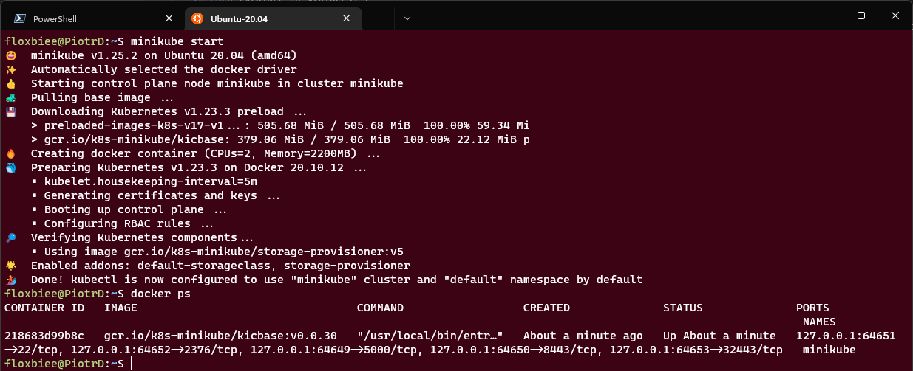

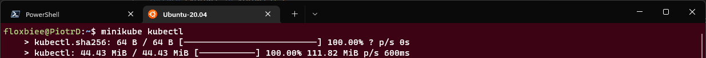

Nastepnie uruchamian kubernetesa i wykazuję działający z nim kontener poprzez ``docker ps``.

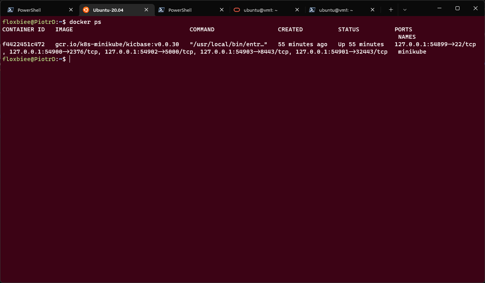

Następnie uruchamiam i prezentuję dashboard.

### Analiza posiadanego kontenera

Na podstawie posiadanego dockerfile tworzę obraz. Następnie wypycham go na docker hub w zwiazku z wynikłymi kompilacjami.

Nie używam w tym przypadku artefaktu z pipelina gdyż zgodnie z wymaganiami jest on wypychany na npm registry. Dodatko pracuję na kilku platformach wieć zmiana w tym przypadku była by mocno problematycza.

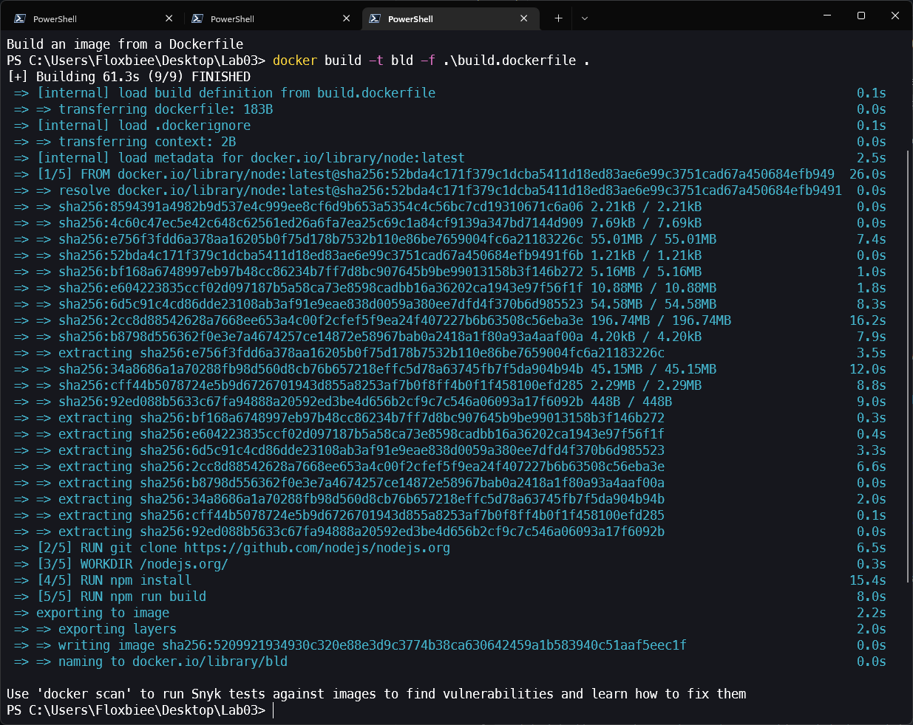

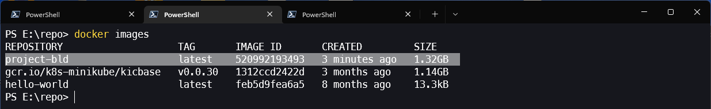

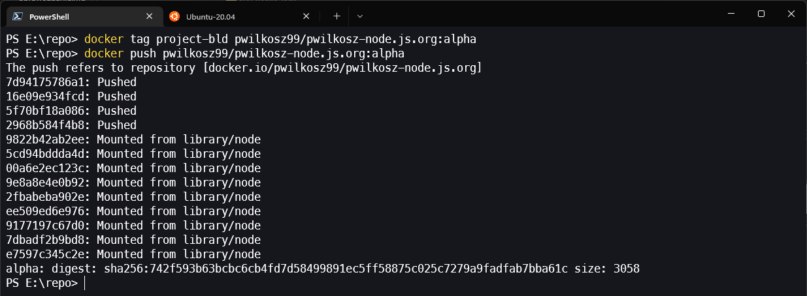

Nastepnie wykazuję że aplikacja pracuje jako kontener. Jej zawartoś wyprowadzam na porcie 5000.

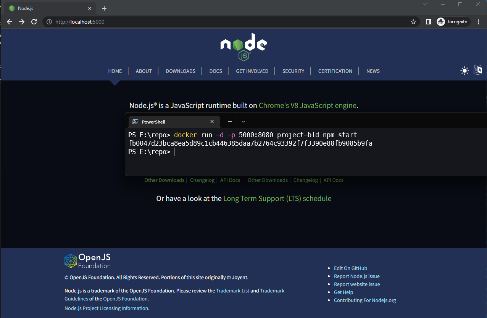
   
### Uruchamianie oprogramowania

Kolejno podejmuję próbę uruchomienia na stosie k8s. Niestety na tym etapie napotkałem na problemy które uniemożliwiły mi kontynuację zadania. Związane są one z błędem ``CrashLoopBackOff`` podczas uruchamiania obrazu. Problem ten występuje w przypadku uruchamiania każdego obrazu opartego na Node, również przy czystym node:latest, na każdej z trzech uzywanych platform. Inne obrazy nie związane z NodeJS działają poprawnie.

W związku z tym pozostała cześć zadania zostanie wykonana razem z kolejnymi etapami, po rozwiązaniu problemu.

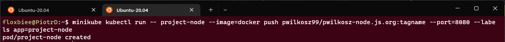

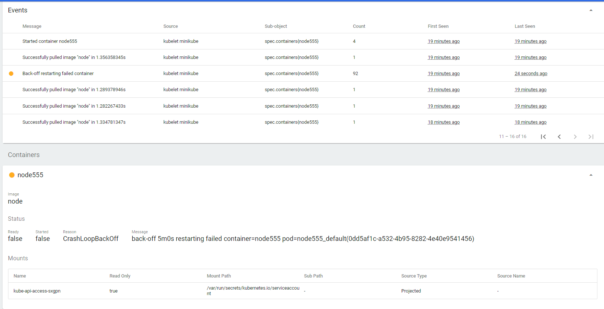
 
### Przekucie wdrożenia manualnego w plik wdrożenia (wprowadzenie)

#TODO