#  Piotr Wilkosz - 404121
## Sprawozdanie 11

### Konwersja wdrożenia ręcznego na wdrożenie deklaratywne YAML

Po poprzednich zajęciach posiadam przygotowany plik YAML, określający wdrożenie.

Modyfikuję go tak aby używane były 4 repliki. W tym celu modyfikuję parametr ```replicas``` w ```spec``` i wprowadzam w nim liczbę ```4```.

```yaml
apiVersion: apps/v1
kind: Deployment
metadata:
  name: node-project
  labels:
    app: node-project
spec:
  replicas: 4
  selector:
    matchLabels:
      app: node-project
  template:
    metadata:
      labels:
        app: node-project
    spec:
      containers:
      - name: node-project-container
        image: pwilkosz99/pwilkosz-node.js.org:beta
        ports:
        - containerPort: 8080
```

Następnie rozpoczynam wdrożenie za pomocą ```kubectl apply```.

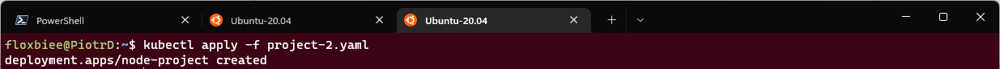

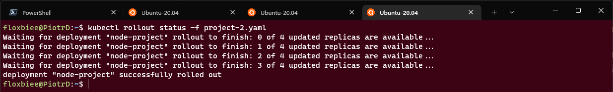

Status wdrożenia sprawdzam poprzez ```kubectl rollout status```.

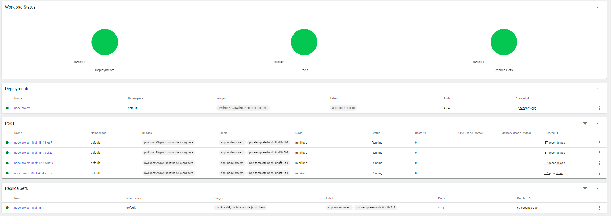

Po poprawnym wdrożeniu można zauważyć ilość podów projektu równą 4.

### Przygotowanie nowego obrazu

Przygotowuję nowe obrazy do wdrożenia.

W obrazie pierwszym modyfikuję layout strony w celu wyświetlenia innej zawartośći niż standardowa. Zmodyfikowany obraz wypycham na docker hub z tagiem ```modified```.

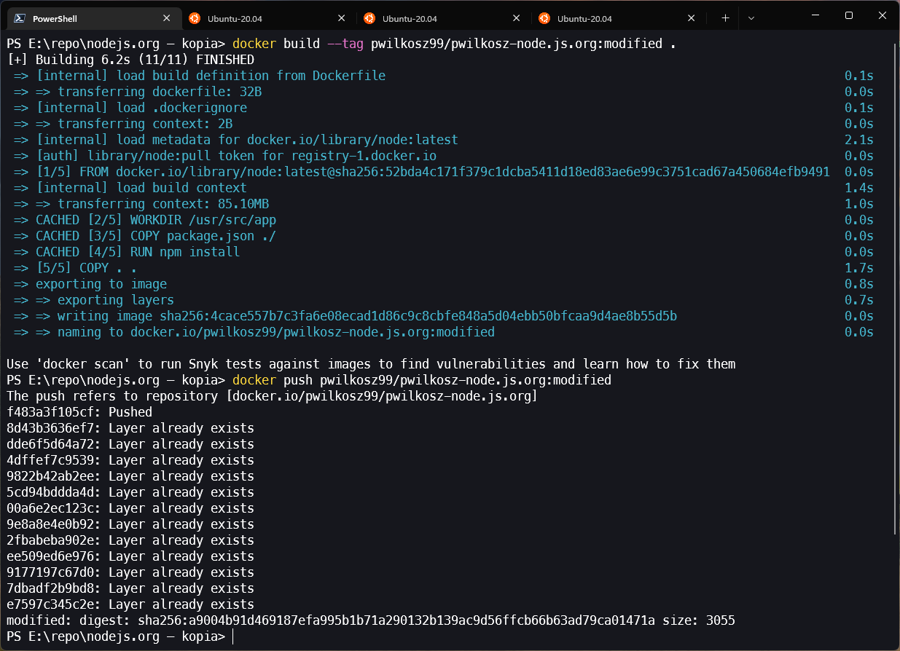

W drugim obrazie usuwam kluczowe skrypty w celu sprawienia by jego uruchomienie kończyło sie błędem. Pushuje na dockerhub z tagiem ```faulty```.

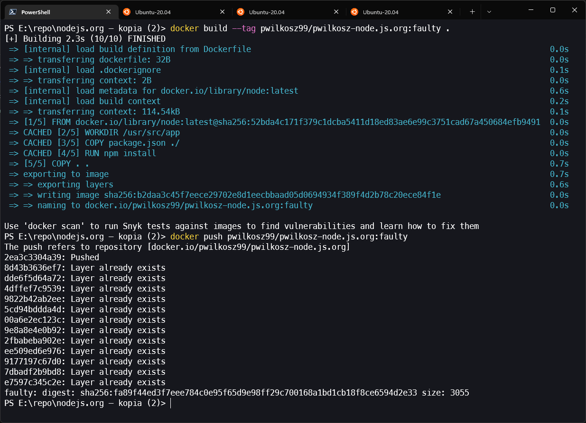

W celu wykazania uruchamiam kontener lokalnie i otrzymuje bład z Noda. 

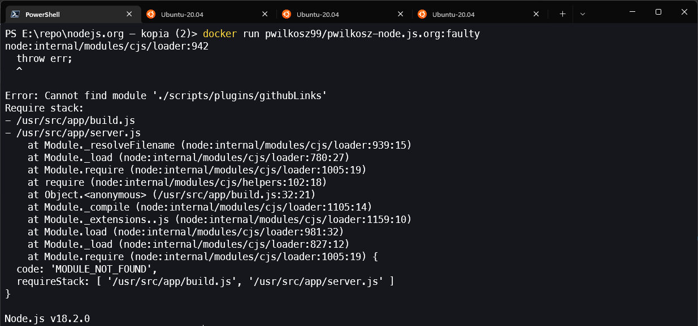

### Zmiany w deploymencie

Dokonuję ponownych wdrożeń z kolejną modyfikacją następujących zmian:

- zwiększam liczbę replik do 12(było 4)

```yaml
  replicas: 12
```

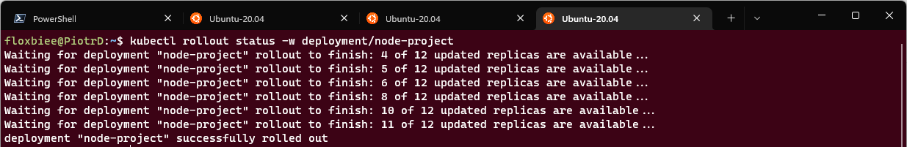

- zmiejszam liczbę replik do 1

```yaml
  replicas: 1
```
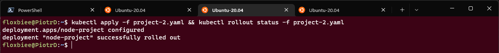

- zmniejszam liczbę replik do 0

```yaml
  replicas: 0
```

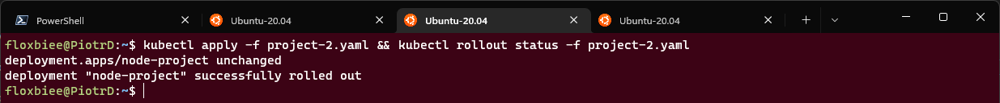

- Zastosowuję nową wersję obrazu

```yaml
  image: pwilkosz99/pwilkosz-node.js.org:modified
```

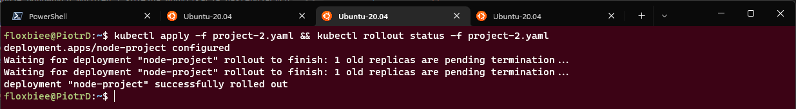

- Zastosowuję starszą wersję obrazu

```yaml
  image: pwilkosz99/pwilkosz-node.js.org:beta
```

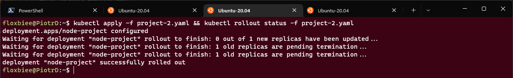

Nastepnie przechodzę do etapu przywracanie poprzednich wersji wdrożeń. Używam do tego poleceń ```kubectl rollout history``` w celu wyświetlenia histori wersji oraz ```undo``` w celu powrotu do poprzedniej wersji. Do powrotu do konkretnej rewizji używam przełącznika ```-to-revision=2```.

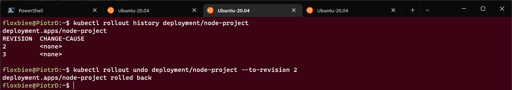

### Kontrola wdrożenia

W następnym etapie tworzę prosty skrypt w shellu który sprawdza czy wdrożenie zostało zakończone w określonym czasie - 60s. Wykorzystuję do tego funkcję ```timeout``` z parametrem będącym ilością sekund oraz komendę bolkującą ```kubectl rollout status```, poprzez której zakończenie jestem w stanie się upewnić czy wdrożenie zostało zakończone. Nastepnie przy pomocy if'a sprwdzam co zwrócił timeout. Jeśli jest to 0 to uznaję wdrozęnie za zakończone w czasie - "zdążyło się wdrożyć". Jeśli nie to wyświetlam komunikat o błędzie.


```sh
kubectl apply -f project-2.yaml
timeout 60 kubectl rollout status deployment/node-project
if [ $? -eq 0 ]
then
    echo "Deployed successfully"
else
    echo "Something went wrong"
fi
```

Na zrzucie wyświetlam przykładowe wdrozenie z ilością replik równą kolejno 5 oraz 1000. W drugim przypadku "nie zdążyło" się wdrożyć w czasie 60s.

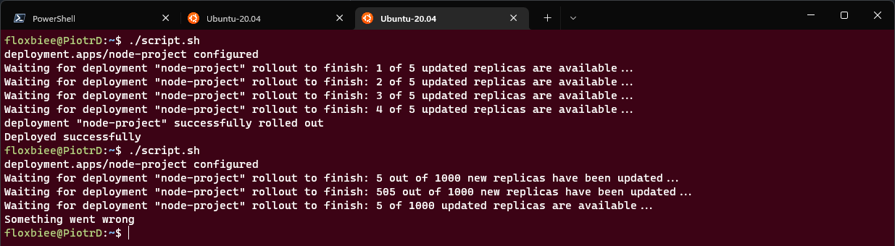

### Strategie wdrożenia

Kolejno przygotowywuję wersje wdrożenia stosując odmienne strategie wdrożeń

* Recreate

```yaml
  strategy:
    type: Recreate
```

Zgodnie z tą stragią stara wersja jest zabijana i następuje wdrożenie nowej wersji. Testy wdrożenia przeprowadzam na 5 replikach. Na zrzutach przedstawiam wyniki polecenia ```rollout status``` oraz status podów w konkretnych etapach.


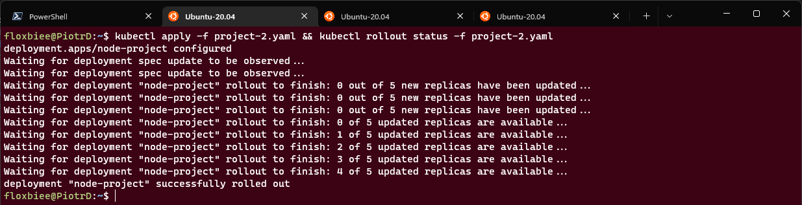

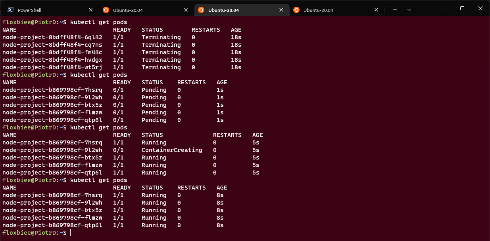

Jak można zauważyć na poczatku istniejące pody zostały zabite, a nastepnie zostały uruchomione nowe zawierające nową wersję programu.

* Recreate

```yaml
  strategy:
    type: RollingUpdate
    rollingUpdate:
      maxSurge: 2
      maxUnavailable: 0 
```

Poprzez wdrożenie zdefiniowane za pomocą strategii typu Recreate nastepuje zakończenie działania uruchomnionych podów, a następnie ich uruchomienie. W tym przypadku nastepuje to w sposób progresywny. Poprzez etykietę ```maxSurge``` określany jest ilość podów które mogą zostać dodane w określonym czasie, a poprzez ```maxUnavaliabe``` ilość podów które mogą być niedostępne w czasie wdrożenia. W moim przypadku wybrałem kolejno liczbę 2 oraz 0, a więc w jednostce czasu mogę mieć 2 maksymalnie 2 nadmiarowe pody.

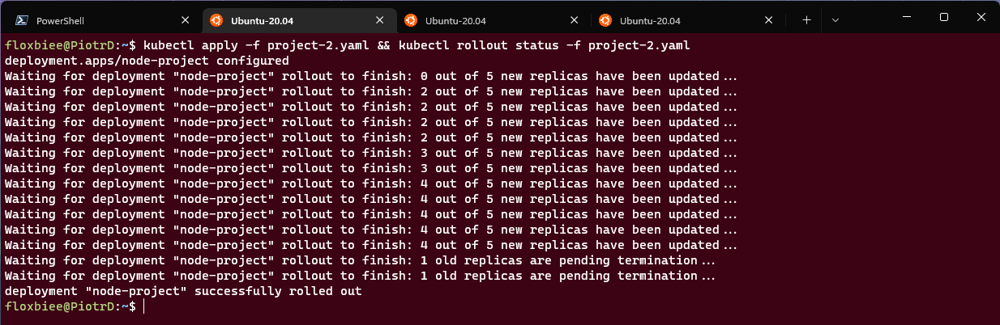

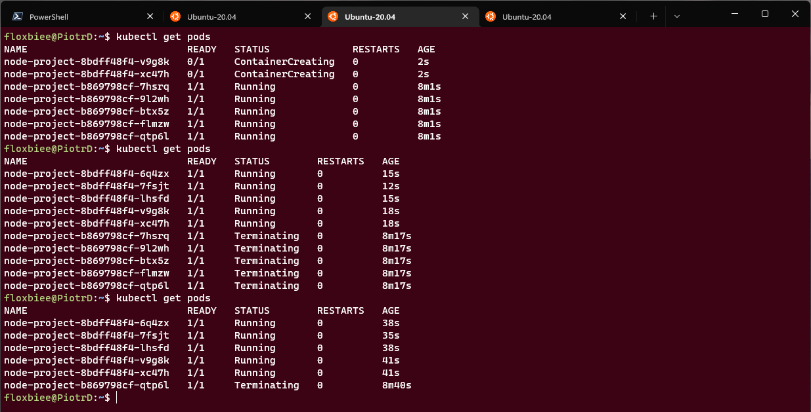

Jak można zauważyc na załączonych zrzutach nastepowało progresywne zabijanie podów w taki sposób by liczba nadmiarowych podów nie przkroczyła liczby określonej w ```maxSurge```. W związku z tym przy pierwszym sprawdzeniu przy pomocy polecneia ```get pods``` były obecne tylko 2 nowopowstałe pody.

* Canary

```yaml
    labels:
      app: node-project
      version: "2.0"
```

Strategia wdrażania canary polega na wdrażaniu nowych wersji aplikacji obok stabilnych wersji produkcyjnych. W teście dokonuję zmiany wersji i obrazu. Nastepnie dokonywane jest wdrożenie w którym postęująco pody z starą wersją programu zastępowane są nowymi.

  
 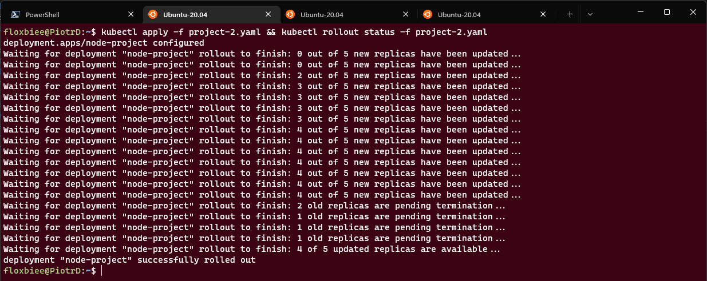

 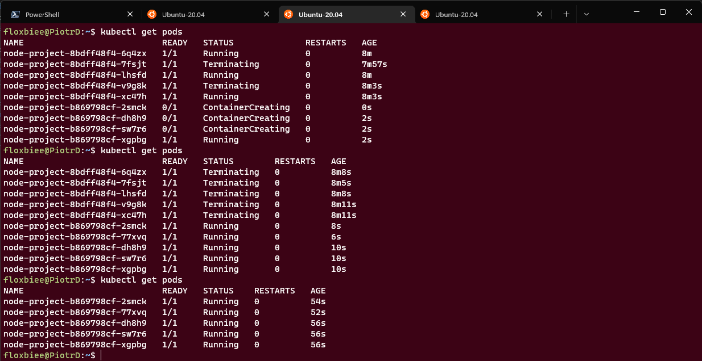


 