#  Piotr Wilkosz - 404121
## Sprawozdanie - pipeline

Na początku zadania potwierdzam, że kontener Jenkins i DIND został skonfigurowany według instrukcji dostawcy oprogramowania. Instalacja ta była tematem laboratoriów nr. 4, w których sprawozdaniu została szczegółowo opisana więc pomijam jej dokładny opis. Pliki ``Dockerfile`` wdrażajace Jenkinsa umieszczam w katalogu ``jenkins``.

Kolejno przechodzę do własciwej części zadania. Tworzony przezemnie pipeline jest pipelinem typu multibranch, ze względu na możliwość rozróżnienia różnych gałęzi o kokretnym działaniu w projekcie.

Pipeline ten składa się z 5(6) kroków. Jest pipelinem deklaratywnym. Jego efektem końcowym jest deploy do npm. W sprawozdaniu umieszczam omawiane części jenkinsfile. Pełna jego wersja znajduje się w rezpotorium w katalogu z zadaniem.

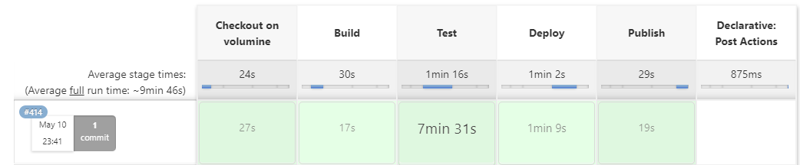

## Definicja pipeline - struktura projektu

Pipeline jest pipelinem typu multibranch. Swoje główne działanie skupiam o gałezi o nazwie ``CI``. 

Pipeline poprzez webhook nasłuchuje na POST od GitHuba z informacją o zmianach na repozytorium, a dokładniej pushu. W ten sposób poprzez wypchnięcie zmian na repozytorium uruchamiany zostaje pipeline z najnowszymi zmianami.

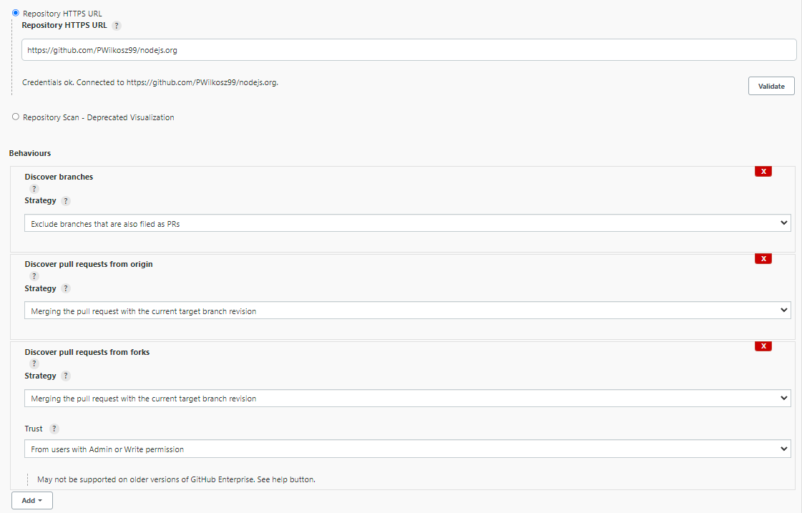
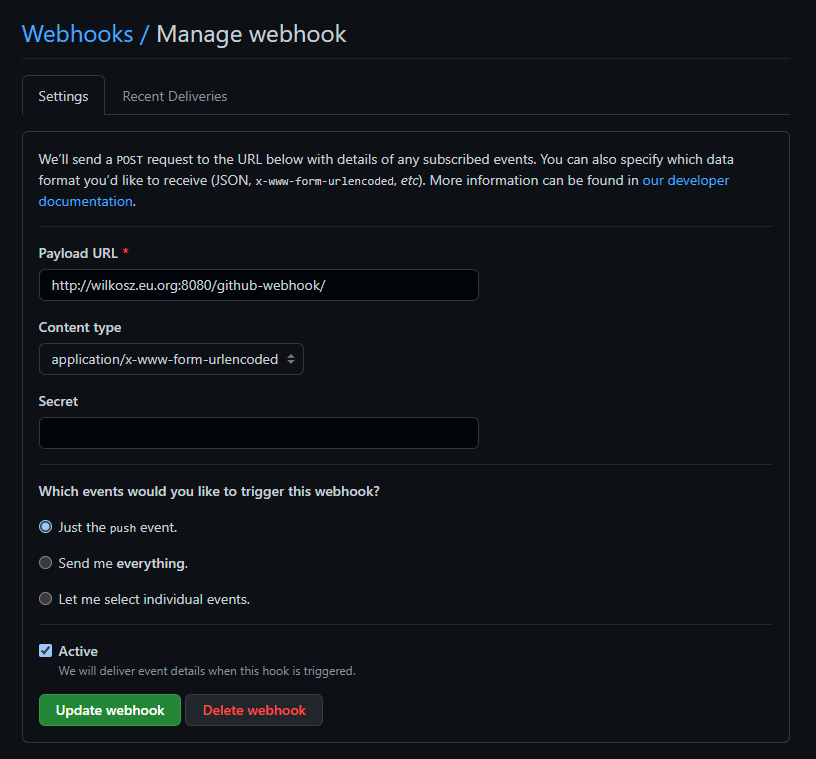

Źródłem Jenkinsfila jest znajdujący się na repozytorium Jenkinsfile, znajdujący się w katalogu CI. Jest on pobierany automatycznie w trakcie uruchamiania pipeline.

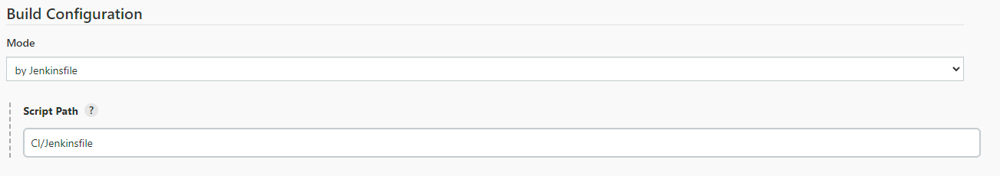

Tworzony pipeline jest pipelinem deklaratywnym. Na początku definiuje brak domyślnego agenta, w celu jego wyboru na etapie każdego kroku. Kolejno przechodzę do tworzenia kolejnych występujących po sobie sekwencyjnie kroków. Na końcu, po zakończeniu działania pipeline wywoływana jest sekcja post.

```groovy
pipeline {
    agent none

    stages {
        ...
    }
    post{
        ...
    }
}
```


## Stage 1: Checkout on volumine
W pierwszym kroku pipelinu następuje pobranie kodu z SCM'a, którym w tym przypadku jest GitHub. Pobieranym projektem jest fork oryginalnego projektu ``nodejs.org``.  Checkout dokonywany jest poprzez wbudowaną w Jenkinsa funkcjonalność ``checkout scm``. Ze względu iż tworzę projekt w modelu multi-branch, celowo unikam ``git clone``. Międzyinnymi z tego powodu checkout dokonywany jest w workspace jenkinsa a nie np. poprzez docker build na Dockerfile. Kolejnym aspektem wyboru takiego rozwiazania jest konieczność skorzystania z voluminów, czego nie jestem w stanie dokonać w trakcie budowania obrazu. Podsumowaując na tym etapie tworzę dwa woluminy wejściowy i wyjściowy poprzez ``docker volume create``, kolejno usuwam z workspace potencjalne pliki-śmieci. Następnie uruchamiam tymczasowy kontener z obrazem Alpine. Kontener ten tworzony jest jako detached,w celu pracy w tle. Do kontenera podpinam wolumin wejsciowy. Na kontenerze uruchominy jest ``tail -f /dev/null``, by żył pomimo argumentu ``--rm``.

Kolejno nastepuje checkout z scm, ustawionego w konfiguracji pipeline w jenkinsie. Następnie listuje elementy, w celu ułatwienia poszukiwania potencjalnego błędu w logach, w podobnym celu wyświetlam package.json projektu. Następnie usuwam zbyteczne i problematyczne katalogi. Kolejno kopiuję aktualny katalog roboczy, czyli okreslony wcześniej ``scm_cp`` do katalogu oznaczonego numerem builda w voluminie wejściowym. Na końcu stopuję kontener ``dummy``. Jego jedynym celem było skopiowanie repozytorium na wolumin wejściowy.

Analizowany krok znajduje się w bloku try-catch. Celem takiego rozwiązanie jest zabicie kontenera ``dummy`` w przypadku błędu w trakcie wykonania kodu. W przypadku złapania błędu wyświetlany jest specjalny komunikat i stopowany jest kontener. Wyrzucany jest też błąd by pipeline został zakończony. Celem takiego rozwiązania jest uniknięcie sytuacji w kolejny build próbuje uruchomić kontener ``dummy``, a on już isntnieje z powodu błędu w wcześniejszym buildzie. W aktulanym stage'u używany jest dowolny agent.

```groovy
stage('Checkout on volumine') {
            agent any
            steps {
                script {
                    try {
                        sh 'docker volume create vol-in'
                        sh 'docker volume create vol-out'
                        sh 'rm * -r'
                        sh 'docker volume ls'

                        sh 'docker run -d --rm --name dummy -v vol-in:/vi alpine tail -f /dev/null'
                        dir('scm_cp') {
                            checkout scm
                            sh 'ls -al'
                            sh 'rm .git .github -r'
                            sh 'cat package.json'
                            sh 'docker cp . dummy:/vi/$BUILD_NUMBER'
                            sh 'docker stop dummy'
                        }
                    } catch (Exception e) {
                        sh 'docker stop dummy'
                        echo 'Stopping dummy container...'
                        throw new Exception(e.toString())
                    }
                }
            }
        }
```

## Stage 2: Build
W kroku build używany jest agent dockerowy z imagem node. Domyślnie jest to latest, a więc najnowsza stabilna wersja. Jako argumenty podane są trzy woluminy: wejściowy, wyjściowy i odwołanie do katalogu roboczego jenkinsa. Na początku listuję pliki zawarte w katalogu oznaczonym wykonywanym właśnie numerem builda, w celu potencjalnego rozwiazywania błędów. Kolejno w katalogu ``BLD`` kopiuję zawartość katalogu roboczego do aktualnego katalogu. Następnie instaluję potrzebne pakiety npm i uruchamiam build. Listuję elementy po zbudowaniu i wyprowadzam powstałe pliki do katalogu pckg w katalogu roboczym jenkinsa. 

W tym miejscu napotykam na problem kopiowania do volumina wyjściowego.  Pomimo kilkunastogodzinowych prób nie udało się rozwiazać tego problemu. Ze względu iż kontener znajduje się w DIND, mam problem z nadaniem praw dostępu spoza roota do katalogu wyjściowego, więc ``cp . /vo -r`` będzie skukowało błędem. W tym miejscu mógłbym zastosować workaround i zadziałać podobnie jak w przypadku kopiowania do volumina wyjściowego, ale w tym momencie mija się to z celem i wszelakie zalety zastosowania tego rozwiazania są tracone. Ze względów bezpieczeństwa uważam również, że ``-u root`` nie jest rozwiazaniem.

```groovy
 stage('Build') {
            agent {
                docker {
                    image 'node'
                    args '-v vol-in:/vi -v vol-out:/vo -v $WORKSPACE:/output'

                }
            }
            steps {
                sh 'ls /vi/$BUILD_NUMBER -al'
                dir('BLD') {
                    sh 'cp /vi/$BUILD_NUMBER/ . -r'
                    sh 'npm install --save --legacy-peer-deps'
                    sh 'npm run build'
                    sh 'ls -al'
                    sh 'cp . /output/pckg -r'
                }
            }
        }
```

## Stage 3: Test
W tym kroku działam różnież na obrazie z nodem. Na obecnych plikach z katalogu BLD uruchamiam testy. Uruchamiam jest "manualnie", test za testem zamiast pojedynczego ``npm test`` w celu ułatwienia poszukiwania potencjalnego błędu poprzez atomowe operacje. Uruchamiane są dwa typy testów - testy jednostkowe oraz testy lintowe sprawdzające składnie.

```groovy
stage('Test') {
            agent {
                docker {
                    image 'node'
                    args '-v vol-in:/vi -v vol-out:/vo'

                }
            }
            steps {

                dir('BLD') {
                    sh 'npm run test:lint:md'
                    sh 'npm run test:lint:stylelint'
                    sh 'npm run test:lint:lockfile'
                    sh 'npm run test:html'
                    sh 'npm run test:unit'
                }
            }
        }
```

## Stage 4: Deploy
Krok ten również wykonywany jest na obrazie node. Na tym etapie miałem spory problem z podjęciem decyzji o sposobie jego wykonania. Z racji iż analizowanym projektem jest webpage nodowy, kwestia ta stała się lekko złożona. Problemem stała się też weryfikacja czy wdrożenie przebiegło pomyślnie. Kolejną ważną kwestią było tez to czy serwer ma zostać uruchomiony czy zakończony po pewnym czasiem. Pod względem analizowanego projektu uznałem, że należytym rozwiazaniem będzie jednak zakończenie go. Docelowe wdrożenie potencjalnie odbyłoby się poza DIND. W celu deployu na docelową maszynę skorzystałbym na przykład z programu rsync w celu synchronizacji danych i wdrożenia na docelowym sprzęcie, jednakże nie jest to tematem tych laboratoriów i tego nie robię.

W tym zadaniu problem ten rozwiązałem w sposób w którym objemuję cały krok w bloku try-catch. Nastepnie uruchamiam standardowe ``npm start``, które objęte jest blokiem ``timeout`` z czasem jednej minuty. Sprawia to, że jeśli wcześniej nie zostanie napotkany błąd to po jednej minucie zostanie wysłany sygnał interrupt. Takie działanie sprawia iż jestem w stanie rozpoznać wyzwolony błąd i na tej podstawie podjąć decyzje o kontynuacji lub zakonczeniu działania pipelina z błędem. Aby tego dokonać w bloku catch łapię błąd i poprzez instrukcję ``if`` porównuję go z wzorcowym błędem wyzwolonym poprzez interrupt z timeoutu. Na tej podstawie jeśli błąd był inny to zakańczam działanie pipelina z błędem. Jeśli zaś jest to  ``org.jenkinsci.plugins.workflow.steps.FlowInterruptedException`` to kontynuję działanie po wyświetleniu odpowiedniego komunikatu.

```groovy
stage('Deploy') {
            agent {
                docker {
                    image 'node'
                    args '-v vol-in:/vi -v vol-out:/vo'
                }
            }
            steps {

                dir('BLD') {
                    script {
                        try {
                            timeout(time: 1, unit: 'MINUTES') {
                                sh 'npm start'
                            }
                        } catch (Exception e) {
                            echo e.toString()
                            if (e.toString() == "org.jenkinsci.plugins.workflow.steps.FlowInterruptedException") {
                                echo 'Deployed successfully!'
                            } else {
                                throw new Exception(e.toString())
                            }
                        }
                    }
                }
            }
        }
```

## Stage 5: Publish
Analizowanym projektem był webpage node, a więc zgodnie z zaleceniami z zajęć dokonuję deploy poprzez npm. 
W tym celu w katalogu po buildzie(docelowo miał być tu volumin vol-out), przygotowanym do deployu poprzez skrypt sprawdzam wersję, która znajduje się w package.json. Na tym etapie ``version`` jest parametrem. Będzie mi to potrzebne w celu dopisania do deployowanej wersji numeru builda do npma i git taga. Nastepnie dla pewności listuję katalog. Kolejno poprzez ustawioną wcześniej zmienną środowiskoą ``NPMJS_TOKEN`` zawierającą token autoryzacyjny do npm registry dokonuję autoryzacji w kontenerze. Nastepnie dokonuję standardowej konfiguracji emaila i name z gita(potrzebne w celu nadania taga). Wykonanie tego kroku zależne jest od nazwy brancha. Poprzez instrukcję ``when`` sprawdzam czy branch ma nazwę ``CI``(na tym etapie wybrana początkowo nazwa staje się dość myląca). Jeśli ma to wykonuję publish na npm registry i otagowanie. W przeciwnym wypadku nie.


Następnie przy pomocy zmiennej środowiskowej ustawiam origin gita. Dokonuję tego poprzez wygenerowany access token do GitHub API. Na tym etapie może zapytać dlaczego nie przez SSH. Powodem wyboru tokenu jest bardziej szczegółowy model uprawnień. W ten sposób mogę zapewnić wystarczające uprawnienia do wykonania na scmie i w przypadku nieautoryzowanego dostępu do jenkinsa uniknąć nadużycia na repozytorium. Model ten sprawia też że pipeline staje się praktycznie przenośny i po ustawieniu zmiennych środowiskowych można go uruchomić na dowolnym sprzęcie.

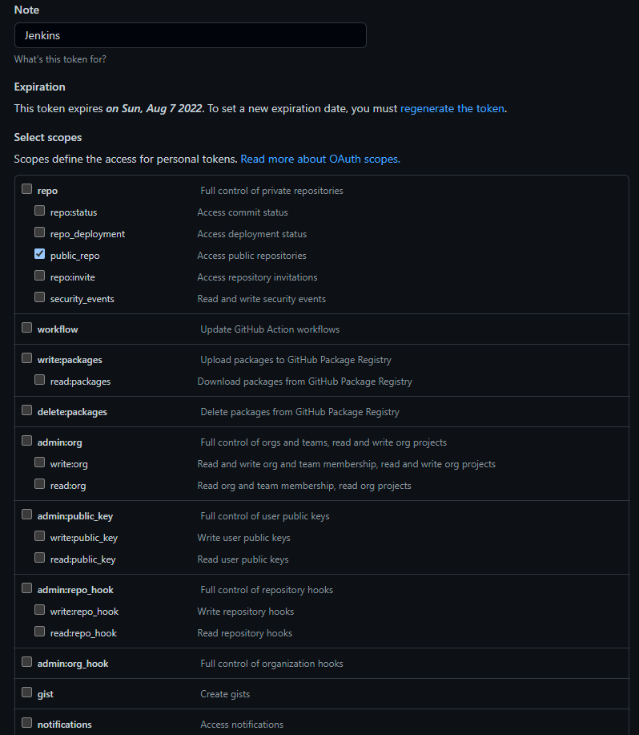

Na końcu publikuję pakiet npm i wypycham tagi.

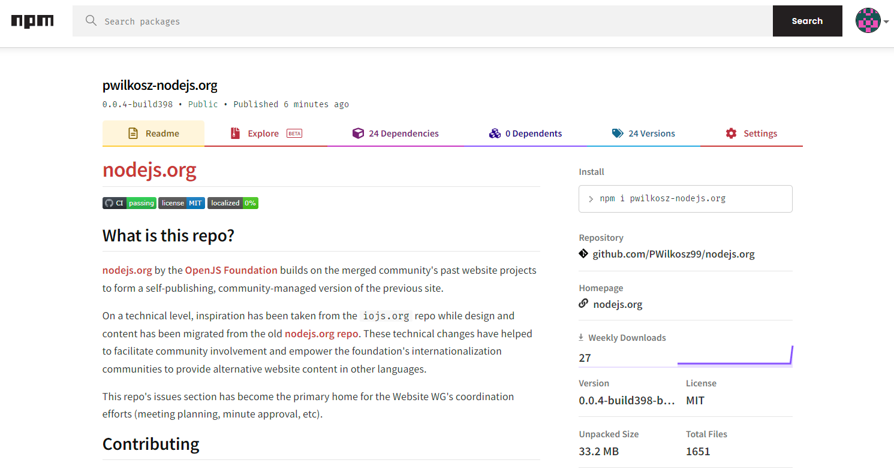

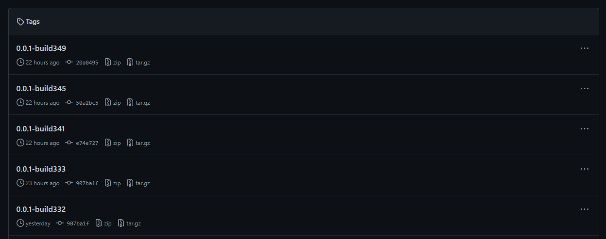

W tym kroku parametryzuje 2 elementy:
- ``branch name``, na jego podstawie podejmuję decyzje o wykonaniu stage'a, zgodnie z logiką działania przedstawioną w instrukcji trakuję go jako paramtetr ``promote``. Uważam, że w tym projekcie,  w modelu multibranch push(merge) do gałęzi produkcyjnej jest wystarczajacym parametrem do wykonania stage'a - publikacji.
- ``version``, pobierana z npm, użyta w celu otagowania.

```groovy
stage('Publish') {
            agent {
                docker {
                    image 'node'
                    args '-v vol-in:/vi -v vol-out:/vo'
                }
            }
            when { branch "CI" }
            steps {
                dir('pckg/$BUILD_NUMBER') {
                        script{
                            env.VERSION = sh( script: "npm view . version",returnStdout: true).trim()
                            echo "VERSION: ${env.VERSION}"
                        }
                        sh 'ls . -al'                    
                        withEnv(["TOKEN=${NPMJS_TOKEN}"]) {
                            sh 'echo "//registry.npmjs.org/:_authToken=${TOKEN}" >> ~/.npmrc'
                        }
                        sh 'git config --global user.email "pwilkosz99@gmail.com"'
                        sh 'git config --global user.name "PWilkosz"'
                        withEnv(["TOKEN=${GH_TOKEN}"]) {
                            sh 'git config remote.origin.url "https://${TOKEN}@github.com/PWilkosz99/nodejs.org.git"'
                        }
                        withEnv(["VER=${VERSION}"]){
                            sh 'npm version ${VER}-build$BUILD_NUMBER'
                            sh 'git tag -a "${VER}-build$BUILD_NUMBER" -m "${VER}-build$BUILD_NUMBER"'
                        }
                        sh 'npm publish'
                        sh 'git push --tags'
                }
                sh 'ls'
            }
        }
```

## Stage POST
Jako element post, w przypadku błędu poprzez ``failure`` realizuję kolejny element instrukcji do projektu, a więc informuję o powodzeniu lub niepowodzeniu przejścia. Dokonuję tego poprzez wysłanie emaila. Według mojej opinii powiadamianie w taki sposób o pozytywnym przejściu jest zbyteczne. W zwiazku z tym wysyłam maila jedynie w przypadku błędu. Dokonuję tego poprzez odpowienie ustawienie pluginu ``Email Extension`` w ustawieniach jenkinsa a nastepnie wywołania funkcji emailtext wraz z odpowiednimi parametrami zawierającymi informacje m. in. o nazwie zadania, numeru builda, czy url do aktualnego builda. Do wysyłania maili używam SMTP Gmaila. Gdyby realizowany był realny produkcyjny projekt maile wysyłałbym z smtp z swojej domeny jednkaże na etapie robienia tego zadanie wydaje mi się to zbyteczne.

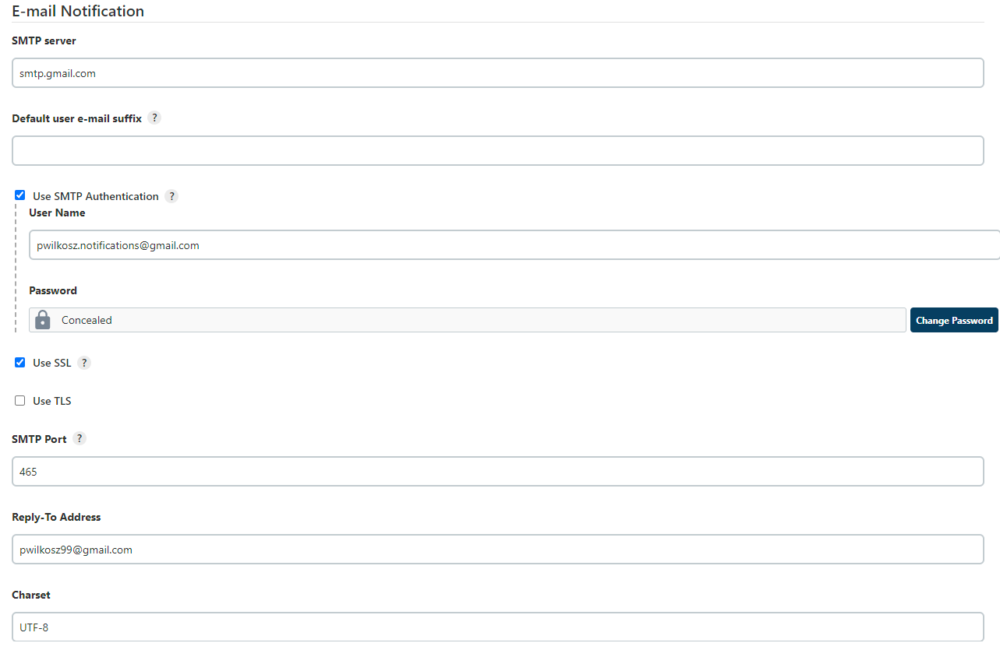

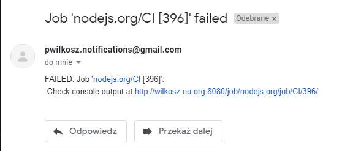

```groovy
 post{
        failure{
                emailext subject: "Job '${env.JOB_NAME} [${env.BUILD_NUMBER}]' failed",
                body: "FAILED: Job '${env.JOB_NAME} [${env.BUILD_NUMBER}]':\n Check console output at ${env.BUILD_URL}",
                to: 'pwilkosz99@gmail.com'
        }
    }
```

## Diagramowanie UML

### Diagram aktywności

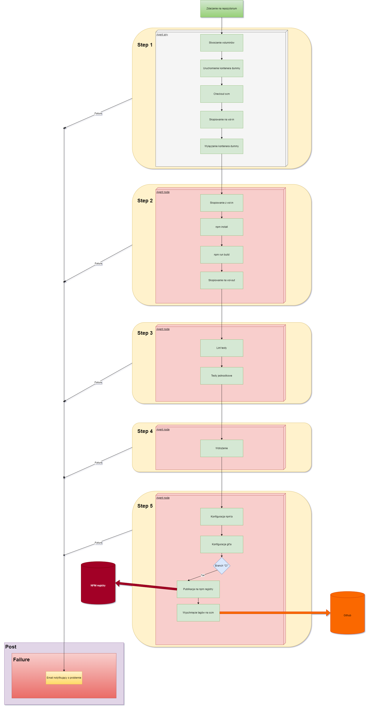

### Diagram wdrożenia

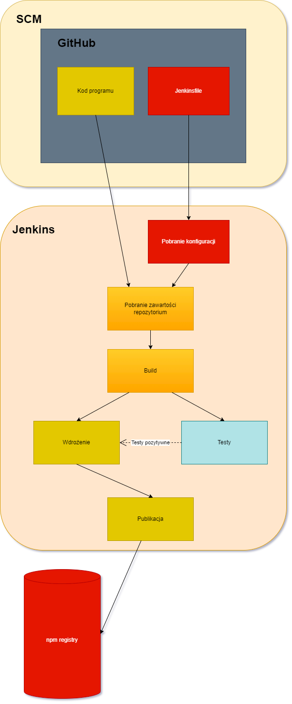

## Podsumowanie

Podsumowując stworzony przezemnie model pipeline trochę odbiega od projektów tworzonych w ramach początkowych zajęć laboratoryjnych. Nie wykorzystuję w nim stworzonych Dockerfile. Te same zadania wykonuję w Jenkinsfile. Powodem takiego rozwiązania jest fakt iż taki wybór jest w mojej opini bardziej optymalny pod względem problematyki aktualnego projektu. Nie potrzebuję obrazu z dependencjami gdyż tą kwestję w wzorowy sposób zapewnia npm. Początkowo podjąłem próbę oparcia swojego pipelina o budowę obrazów z Dockerfile(szkielet rozwiązania w katalogu ``deprecated``), przy jednoczesnym zastosowaniu zalet skryptowego jenkinsfile, ale na drodze do rozwiazania problemu staneły woluminy.