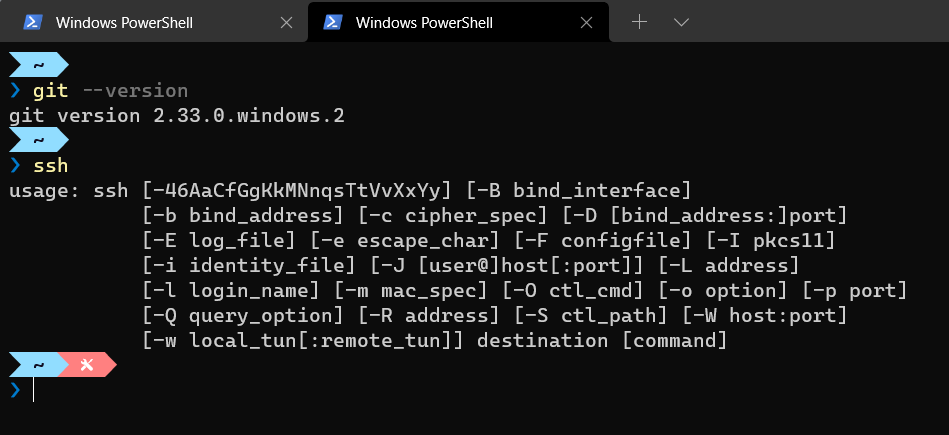
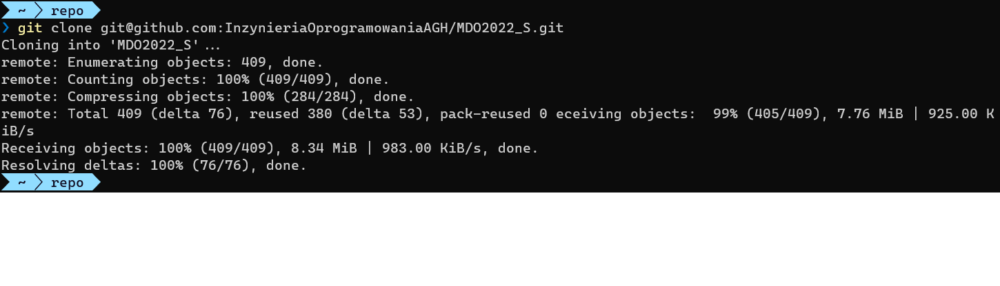
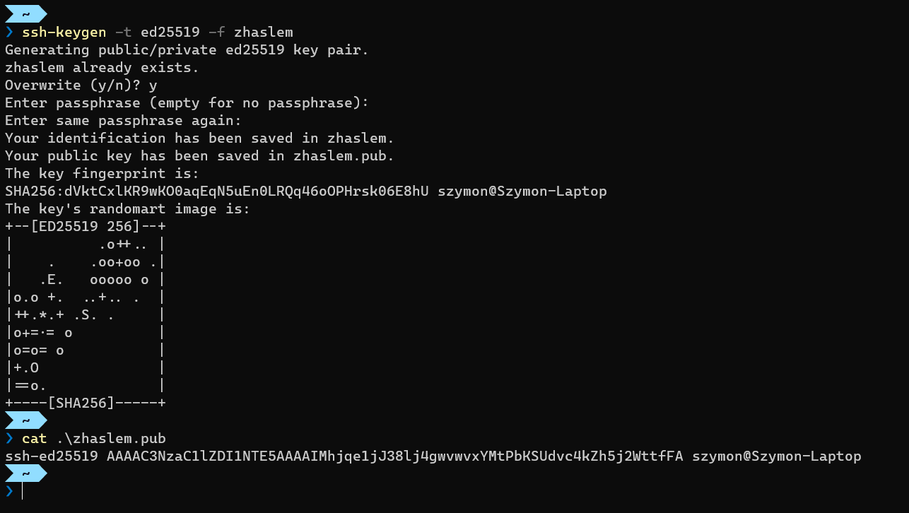
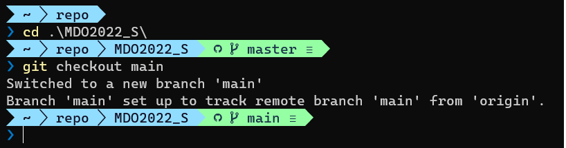
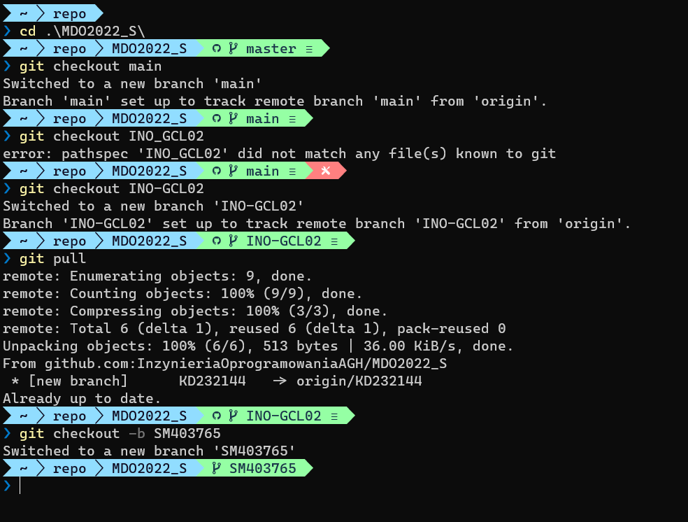
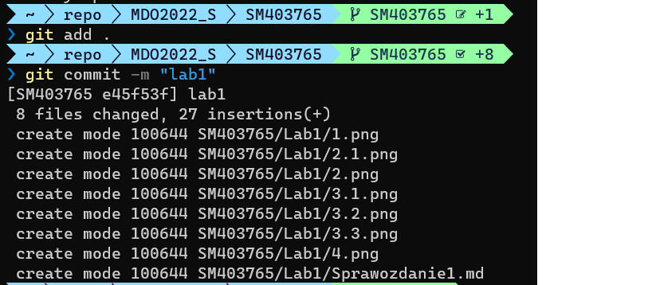
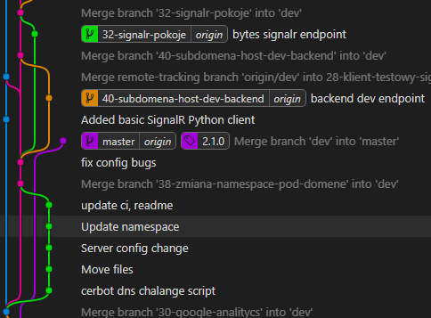
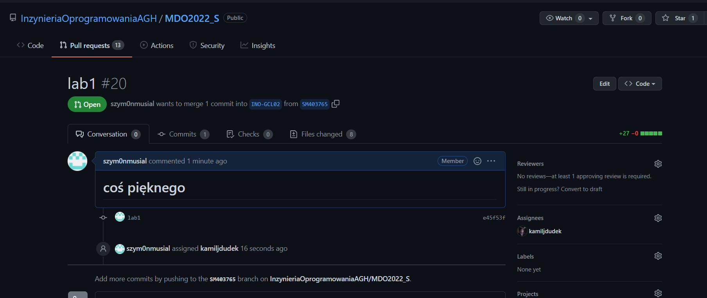
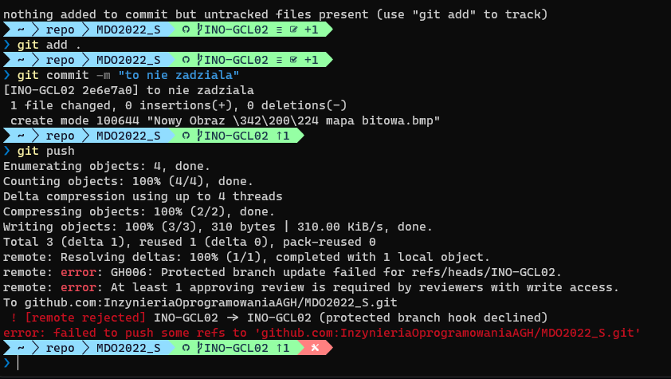

# Narzędzia
## Zainstaluj klienta Git i obsługę kluczy SSH

Pracując z repozytorium, systemem kontroli wersji, git, ściągnąłem kopię repozytorium zdalnego z serwisu GitHub. Ściągania można dokonywać przy użyciu protokołu ssh oraz https.

W przypadku pobierania, komunikacji z repozytorium protokołem https jestem zobowiązany podać dane logowania do serwisu. lepszym pomysłem oraz bezpieczniejszym jest użycie par kluczy prywatnego oraz publicznego.

Do wykonania tego kroku potrzebowałem klienta ssh, który był zainstalowany w systemie Win 11. Natomiast klient git został pobrany, a jego ścieżka do pliku wykonywalnego została wskazana w zmiennej środowiskowej path

```bash
> $Env:Path
# ...
C:\Program Files\Git\bin;
# ...

```



<figcaption align = "center">Zrzut 1. Zainstalowany SSH, oraz Git</figcaption>

## Sklonuj repozytorium 


<figcaption align = "center">Zrzut 2. Klonowanie repozytorium</figcaption>

# Protokół SSH

## Upewnij się w kwestii dostępu do repozytorium jako uczestnik i sklonuj je za pomocą utworzonego klucza SSH

Protokół ssh wypchał dawny nieszyfrowany protokół telnet, protokół https zawiera szyfrowanie aczkolwiek wymaga on podania hasła, gdzie często czynnikiem będącym luką w zabezpieczeniach jest czynnik ludzki. SSH wymaga kluczy których to złamanie (zw. z liczbami pierwszymi) wymaga zbyt dużej ilości czasu.

Klucz publiczny jest udostępniany, natomiast prywatny nie może zostać udostępniony. Kompromitacja klucza prywatnego doprowadza do uzyskania dostępu do zasobów. Dane przesyłane przez protokół są szyfrowane przy użyciu tego klucza dlatego odszyfrowanie ich wymaga pary.


<figcaption align = "center">Zrzut 3. Klucz bez hasła</figcaption>


<figcaption align = "center">Zrzut 4. Klucz z hasłem</figcaption>


<figcaption align = "center">Zrzut 5. Klucze publiczne w serwisie</figcaption>

# Branche

## Przełącz się na gałąź main, a potem na gałąź swojej grupy 

Dzieląc pracę zespołu każdy pracuje na swojej lokalnej kopii kodu, wychodzi on z najczęściej aktualnej branchy, pracuje na niej, tworzy zmiany commity. Równoległa praca na 1 branchy powodowała by konflikty oraz wymagała częstej aktualizacji jeśli ktoś wypchnął zmiany.

Pracując na swojej branchy nie powoduje konfliktów, aczkolwiek po skończeniu brancha merguje do tej z której wychodziłem i tam rozwiązuje ewentualne konflikty.



<figcaption align = "center">Zrzut 6. Przełączanie branchy</figcaption>


## Utwórz gałąź


<figcaption align = "center">Zrzut 7. Moja gałąź</figcaption>

## Rozpocznij pracę na nowej gałęzi


<figcaption align = "center">Zrzut 8. Wypychanie zmian</figcaption>


<figcaption align = "center">Zrzut 9. Wypychanie i tworzenie zdalnej branchy</figcaption>



<figcaption align = "center">Zrzut 10. Przykład historii repo w EmotoAGH (materiał własny) Niebieski produkcja, róż deweloperska</figcaption>


## Pull request



<figcaption align = "center">Zrzut 11. Wystawienie pull requesta do branchy długożyjącej</figcaption>


# Wypchanie do chronionej branchy

Zezwolenie każdemu deweloperowi na możliwość wypchania zmian na brancha może spowodować niepożądane wyzwolenia piplineów oraz systuację w której przed wycofaniem zmian inny członek zespołu pobierze wadliwą zmianę, dlatego powstają chronione branche zazwyczaj długo żyjące.




<figcaption align = "center">Zrzut 12. Wypychanie do chronionej branchy</figcaption>


<figcaption align = "center">Zrzut 13. Merge request osoby nieuprawnionej w serwisie GitLab</figcaption>
