# Kubernetes 

### Problem na Oracle OCI

VPS który posiadam w darmowym planie posiada dysk 47 Gb, z czego większość jest używana przez dockera, obrazy zmodyfikowanych systemów, i docker registry

Dlatego dokonałem próby zwiększenia dysku, aby nie utracić pracy

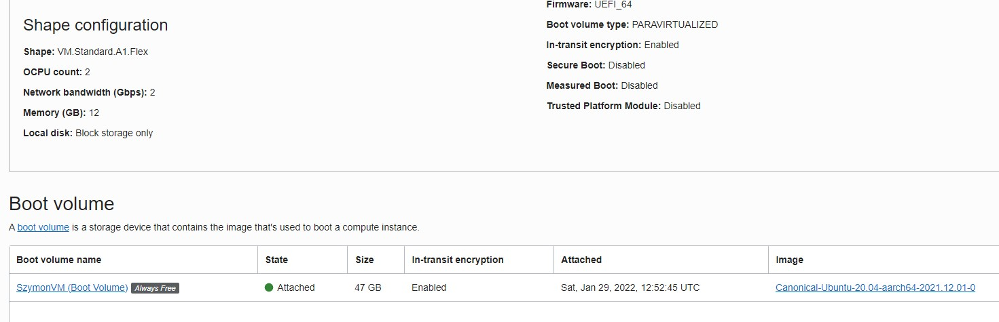

Pozostała ilość wolnego miejsca na dysku


Okazało się że Oracle udostępnia z poziomu panelu możliwość rozszerzenia dysku do max 70Gb

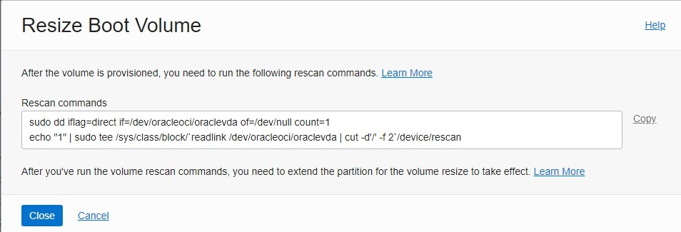

Rozszerzanie po restarcie systemu:
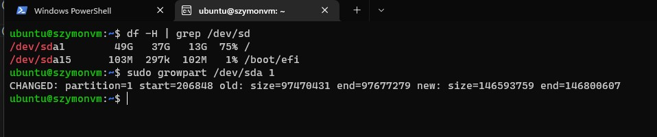

Efekt końcowy

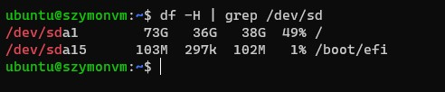


# Instalacje MiniKube

Instalacje przeprowadziłem według [instrukcji deweloperów na stronie](./https://minikube.sigs.k8s.io/docs/start/)

```bash
ubuntu@szymonvm:~$ curl -LO https://storage.googleapis.com/minikube/releases/latest/minikube_latest_arm64.deb
  % Total    % Received % Xferd  Average Speed   Time    Time     Time  Current
                                 Dload  Upload   Total   Spent    Left  Speed
100 21.1M  100 21.1M    0     0  20.1M      0  0:00:01  0:00:01 --:--:-- 20.1M
ubuntu@szymonvm:~$ sudo dpkg -i minikube_latest_arm64.deb
Selecting previously unselected package minikube.
(Reading database ... 168838 files and directories currently installed.)
Preparing to unpack minikube_latest_arm64.deb ...
Unpacking minikube (1.25.2-0) ...
Setting up minikube (1.25.2-0) ...
ubuntu@szymonvm:~$

```

Próba uruchomienia nie powiodła się ze względu na ograniczenie dockera który aktualnie był u mnie na prawach root-a

```ubuntu@szymonvm:~$ sudo minikube start
😄  minikube v1.25.2 on Ubuntu 20.04 (arm64)
✨  Automatically selected the docker driver. Other choices: ssh, none
🛑  The "docker" driver should not be used with root privileges.
💡  If you are running minikube within a VM, consider using --driver=none:
📘    https://minikube.sigs.k8s.io/docs/reference/drivers/none/

❌  Exiting due to DRV_AS_ROOT: The "docker" driver should not be used with root privileges.

ubuntu@szymonvm:~$
```

Wcześniej mogłem manipulować dockerem ze względu na wysoki poziom uprawnień roota.

docker należy do grupy docker, która działa bez problemu na root, ale aby skorzystać z niego na koncie lokalnym dodałem do niego grupę docker tym samym uzyskując dostęp do większości poleceń dockera ponieważ socket nie będzie już tworzony dla root-a a dla grupy docker do której przynależy konto lokalne

```
ubuntu@szymonvm:~$  sudo groupadd docker
groupadd: group 'docker' already exists
ubuntu@szymonvm:~$  sudo usermod -aG docker $USER
ubuntu@szymonvm:~$  newgrp docker
ubuntu@szymonvm:~$  docker run hello-world
Unable to find image 'hello-world:latest' locally
latest: Pulling from library/hello-world
7050e35b49f5: Pull complete
Digest: sha256:80f31da1ac7b312ba29d65080fddf797dd76acfb870e677f390d5acba9741b17
Status: Downloaded newer image for hello-world:latest

Hello from Docker!
This message shows that your installation appears to be working correctly.

To generate this message, Docker took the following steps:
 1. The Docker client contacted the Docker daemon.
 2. The Docker daemon pulled the "hello-world" image from the Docker Hub.
    (arm64v8)
 3. The Docker daemon created a new container from that image which runs the
    executable that produces the output you are currently reading.
 4. The Docker daemon streamed that output to the Docker client, which sent it
    to your terminal.

To try something more ambitious, you can run an Ubuntu container with:
 $ docker run -it ubuntu bash

Share images, automate workflows, and more with a free Docker ID:
 https://hub.docker.com/

For more examples and ideas, visit:
 https://docs.docker.com/get-started/

ubuntu@szymonvm:~$
```

Po tym zabiegu uruchomiłem bezproblemowo minikube

```
ubuntu@szymonvm:~$ minikube start
😄  minikube v1.25.2 on Ubuntu 20.04 (arm64)
✨  Automatically selected the docker driver. Other choices: ssh, none
👍  Starting control plane node minikube in cluster minikube
🚜  Pulling base image ...
💾  Downloading Kubernetes v1.23.3 preload ...
    > preloaded-images-k8s-v17-v1...: 419.07 MiB / 419.07 MiB  100.00% 232.38 M
    > gcr.io/k8s-minikube/kicbase: 343.11 MiB / 343.12 MiB  100.00% 14.72 MiB p
🔥  Creating docker container (CPUs=2, Memory=2900MB) ...
🐳  Preparing Kubernetes v1.23.3 on Docker 20.10.12 ...
    ▪ kubelet.housekeeping-interval=5m
    ▪ Generating certificates and keys ...
    ▪ Booting up control plane ...
    ▪ Configuring RBAC rules ...
🔎  Verifying Kubernetes components...
    ▪ Using image gcr.io/k8s-minikube/storage-provisioner:v5
🌟  Enabled addons: default-storageclass, storage-provisioner
💡  kubectl not found. If you need it, try: 'minikube kubectl -- get pods -A'
🏄  Done! kubectl is now configured to use "minikube" cluster and "default" namespace by default
ubuntu@szymonvm:~$ alias kubectl="minikube kubectl --"
ubuntu@szymonvm:~$ kubectl get po -A
    > kubectl.sha256: 64 B / 64 B [--------------------------] 100.00% ? p/s 0s
    > kubectl: 44.06 MiB / 44.06 MiB [-----------] 100.00% 206.01 MiB p/s 400ms
NAMESPACE     NAME                               READY   STATUS    RESTARTS     AGE
kube-system   coredns-64897985d-qd4ps            1/1     Running   0            36s
kube-system   etcd-minikube                      1/1     Running   0            48s
kube-system   kube-apiserver-minikube            1/1     Running   0            48s
kube-system   kube-controller-manager-minikube   1/1     Running   0            51s
kube-system   kube-proxy-pt2vg                   1/1     Running   0            36s
kube-system   kube-scheduler-minikube            1/1     Running   0            48s
kube-system   storage-provisioner                1/1     Running   1 (5s ago)   47s
ubuntu@szymonvm:~$

```

Aby uzyskać widok panelu stworzyłem tunel ssh, z powodu hostowania dashboardu na loopback 

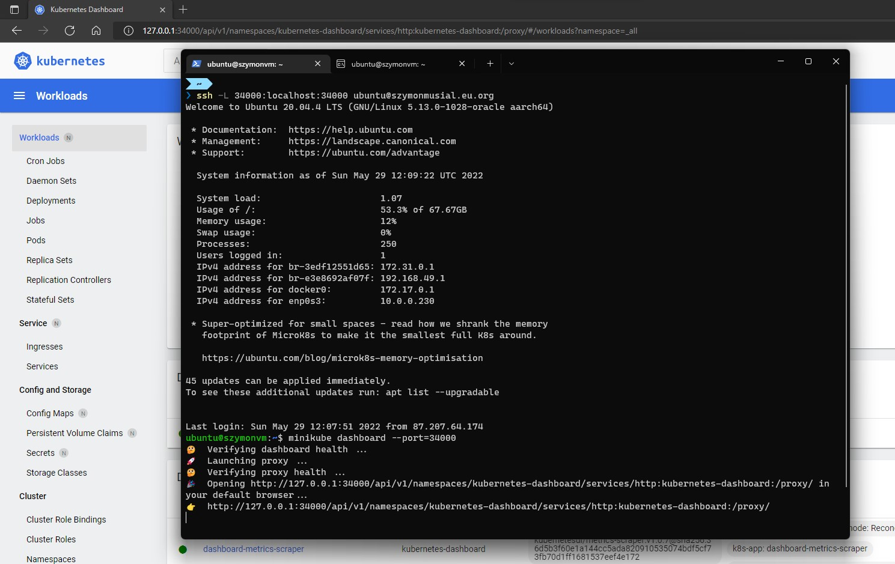


Pobierając obraz produkcyjny znajdujący się na własnym rejestrze pojawił się błąd wygaśnięcia certyfikatu, co uniemożliwiłoby pobieranie obrazu przez kubernetesa

Dlatego dokonałem uzyskania certyfikatu metodą negocjacji DNS A/AAAA txt

```
❯ docker pull szymonmusial.eu.org:10000/prodenv
Using default tag: latest
Error response from daemon: Get "https://szymonmusial.eu.org:10000/v2/": x509: certificate has expired or is not yet valid: current time 2022-05-29T12:15:44Z is after 2022-05-19T18:46:49Z

```
Po problemach z portami, firewallem, przekierowaniem uruchomiłem jednego poda korzystającego z obrazu produkcyjnego

```
ubuntu@szymonvm:~$ minikube kubectl run -- emotoprod --image=szymonmusial.eu.org:10000/prodenv --port=5000 --labels app=EmotoProdApp
pod/emotoprod created
ubuntu@szymonvm:~$
```

Pody:
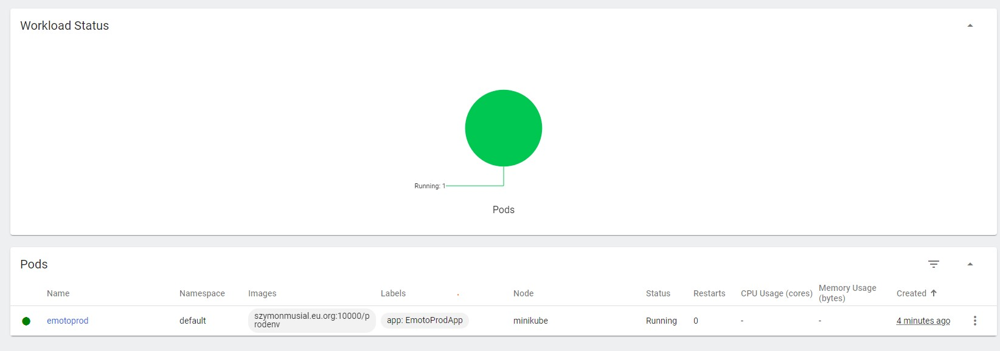
Zdarzenia:
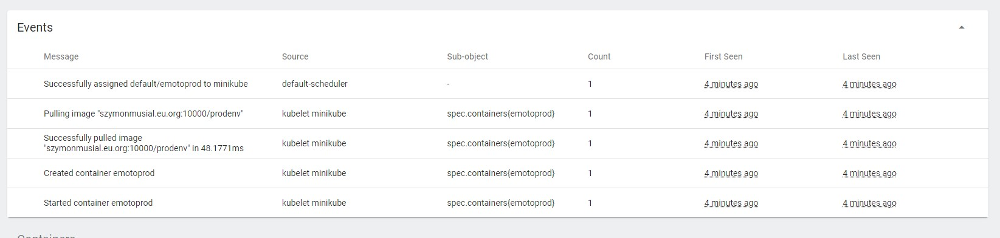

Logi aplikacji, świadczące o poprawnym uruchomieniu

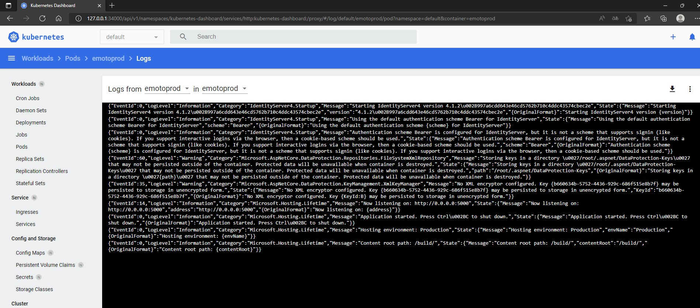

Aby uzyskać dostęp do pod-a można skorzystać z proxy, wtedy na wybranym porcie nastąpi przekierowanie ale będzie ono dostępne z karty sieciowej "localhost".

Dlatego jawnie wskazuję na adres ```0.0.0.0``` co świadczy o nasłuchiwaniu na karcie sieciowej dostępnej z zewnątrz

```
ubuntu@szymonvm:~$ kubectl port-forward emotoprod --address 0.0.0.0 8060:5000
```


Całość przełożyła się na poniższy efekt

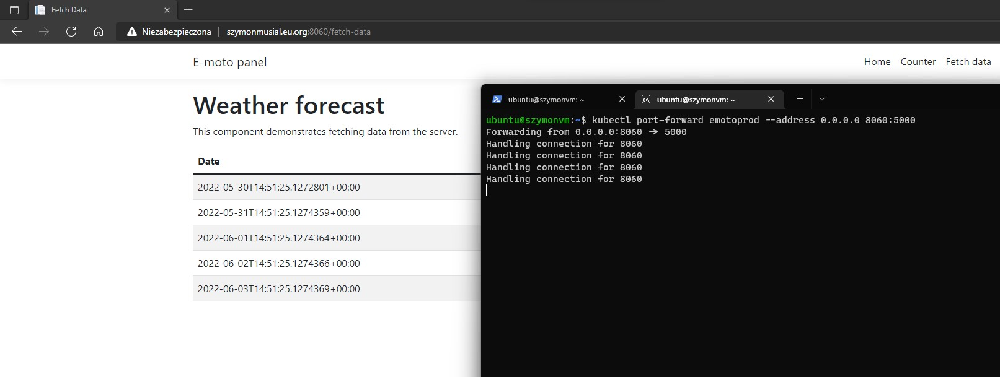

Ostatecznie zapisałem proces do pliku konfiguracyjnego. Tworzy on 3 repliki i każdorazowo podczas uruchomienia aktualizuje obraz dockerowy.

```yaml
apiVersion: apps/v1
kind: Deployment
metadata:
  name: emoto-prod
  labels:
    app: emoto-prod
spec:
  replicas: 3
  selector:
    matchLabels:
      app: emoto-prod
  template:
    metadata:
      labels:
        app: emoto-prod
    spec:
      containers:
      - name: prodenv
        image: szymonmusial.eu.org:10000/prodenv
        imagePullPolicy: Always
        ports:
        - containerPort: 5000
```

Z jenkinsem miałem analogiczne problemy jak wcześniej które wynikały one z konteneryzacji.

Podjąłem próbę instalacji pluginu kubernetesa aczkolwiek poza tym że były one z lukami bezpieczeństwa to ich konfiguracja wymagała wskazania autoryzacji serwera kubernetes który jest dostępny na localhost czyli niedostępny dla kontenera jenkinsa. 

Dlatego analogicznie jak ostatnio jenkins wysyła REST-owe zapytanie a serwer wykonuje komendy w pliku. W tym przypadku

```
kubectl rollout restart deploy emoto-prod
```

Co skutkuje pobraniem najnowszego obrazu (tymczasowe rozwiązanie) gdy jest on oznaczony że nadaje się na wgranie w systemie kontroli wersji

Przykładowo:

Commit zmieniał styl formatera logów

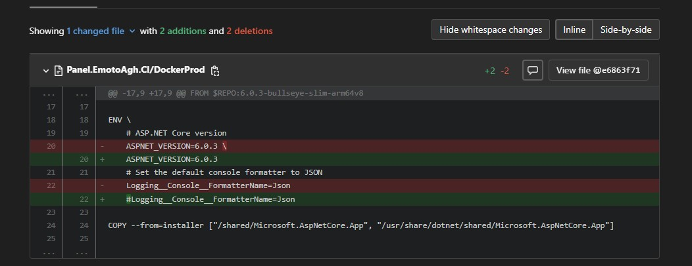

Pody:


I efekt końcowy

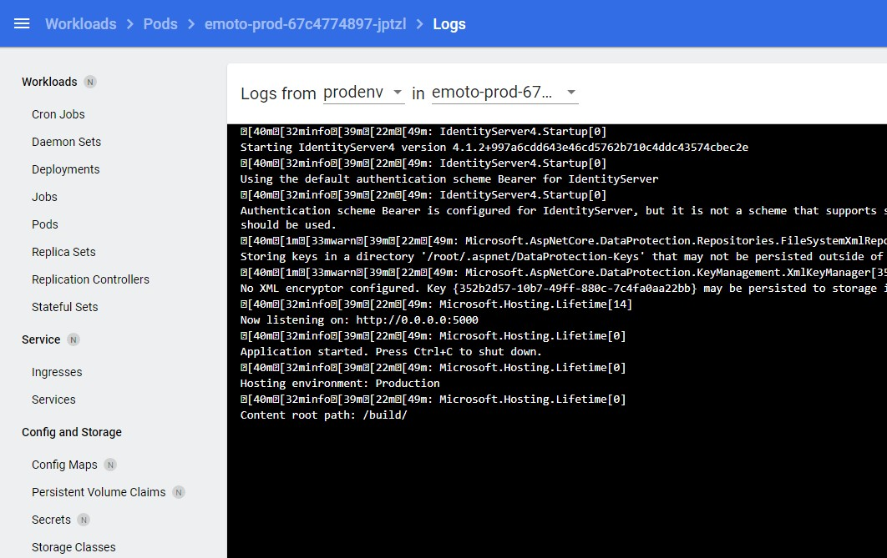
