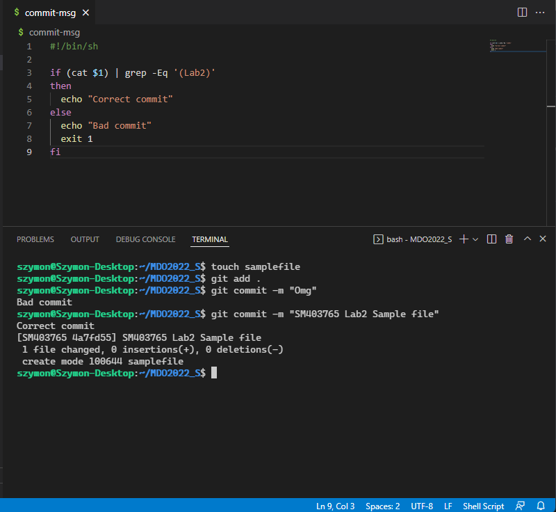

# Hooki

## Sprawdzenie tutułu commita SM403765

commit-msg
```bash
#!/bin/sh

if test $(cat $1) = SM403765
then
  echo "Correct commit"
else
  echo "Bad commit"
  exit 1
fi
```


<figcaption align = "center">Zrzut 1. Sprawdzenie zawartości brancha w commicie</figcaption>


## Sprawdzenie czy tutule commita zawiera się numer laboratorium

commit-msg

```bash
#!/bin/sh

if (cat $1) | grep -Eq '(Lab2)'
then
  echo "Correct commit"
else
  echo "Bad commit"
  exit 1
fi
```


<figcaption align = "center">Zrzut 2. Sprawdzenie zawartości numeru labów w commicie</figcaption>
