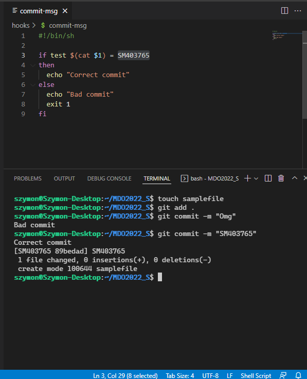
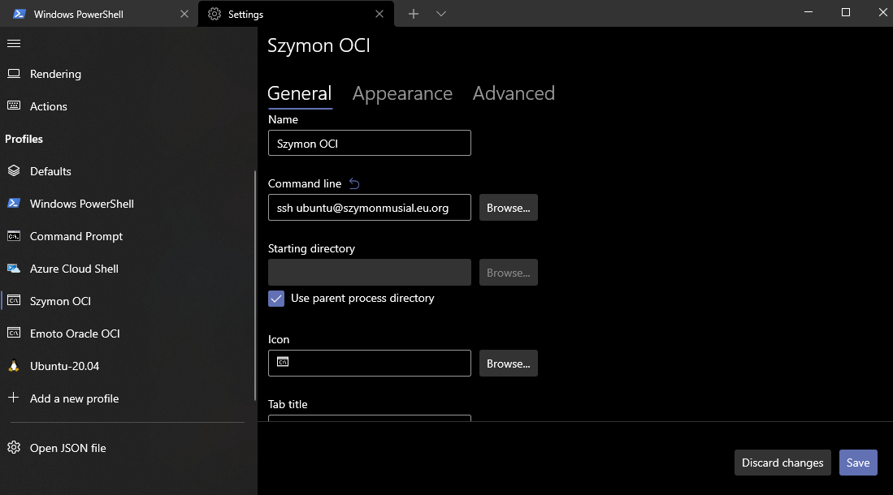
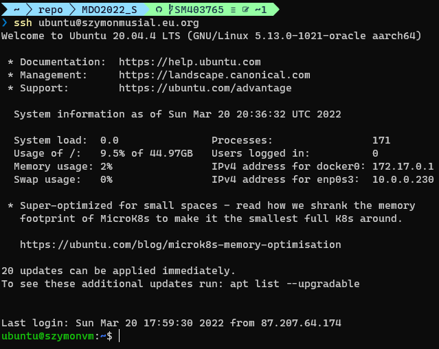
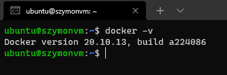
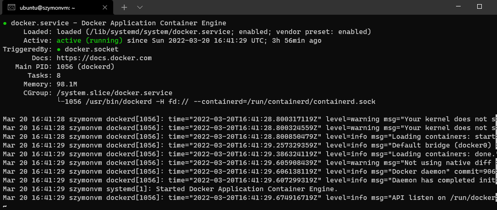
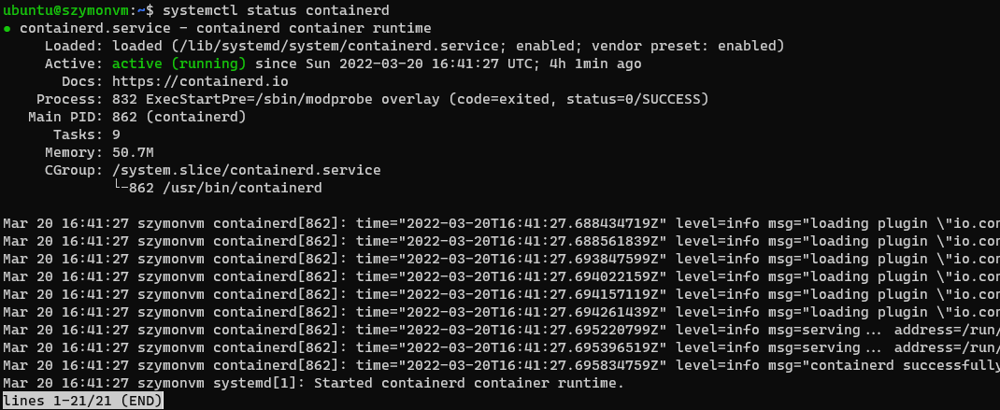
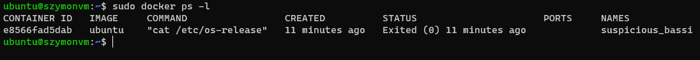
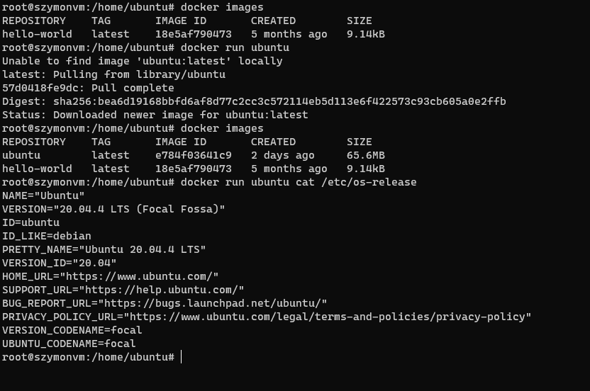
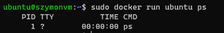
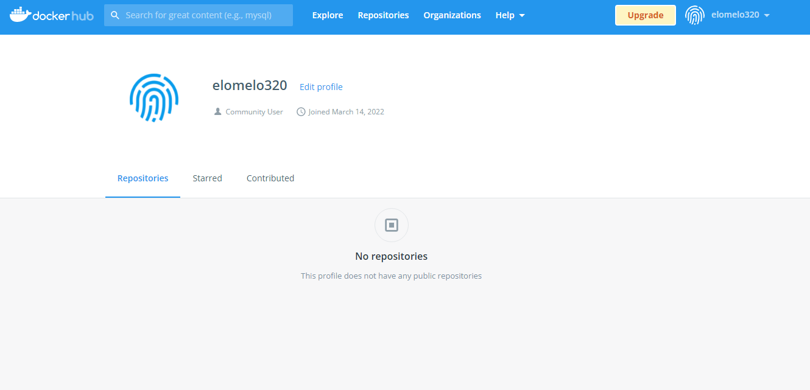

# Hooki

## Sprawdzenie tutułu commita SM403765

commit-msg
```bash
#!/bin/sh

if test $(cat $1) = SM403765
then
  echo "Correct commit"
else
  echo "Bad commit"
  exit 1
fi
```


<figcaption align = "center">Zrzut 1. Sprawdzenie zawartości brancha w commicie</figcaption>


## Sprawdzenie czy tutule commita zawiera się numer laboratorium

commit-msg

```bash
#!/bin/sh

if (cat $1) | grep -Eq '(Lab2)'
then
  echo "Correct commit"
else
  echo "Bad commit"
  exit 1
fi
```


<figcaption align = "center">Zrzut 2. Sprawdzenie zawartości numeru labów w commicie</figcaption>


# Docker

## Dostęp do maszyny



<figcaption align = "center">Zrzut 3. Konfiguracja Windows Terminal </figcaption>

## Wykazanie remote


<figcaption align = "center">Zrzut 4. Logowanie po SSH </figcaption>

## Zainstalowanie dockera


<figcaption align = "center">Zrzut 5. Wersja zainstalowanego dockera </figcaption>

## Działanie


<figcaption align = "center">Zrzut 6. status serwisu docker </figcaption>


<figcaption align = "center">Zrzut 7. status serwisu containerd </figcaption>


## Numer wersji


<figcaption align = "center">Zrzut 8. Docker ps </figcaption>



<figcaption align = "center">Zrzut 9. Ubuntu container status</figcaption>


<figcaption align = "center">Zrzut 10. Ubuntu container init PID</figcaption>

# Konto Docker Hub


<figcaption align = "center">Zrzut 11. Konto w docker Hub</figcaption>