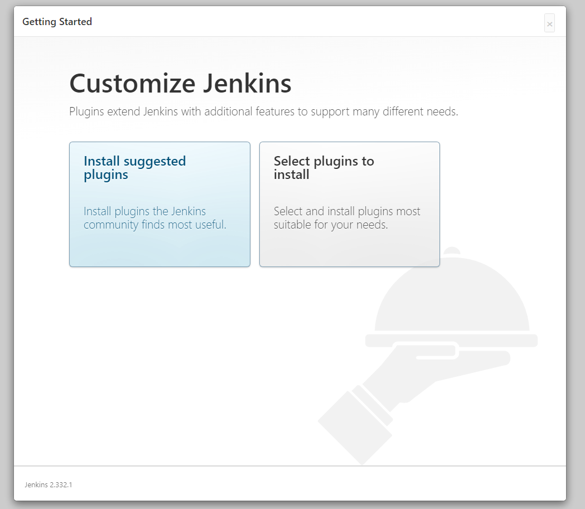
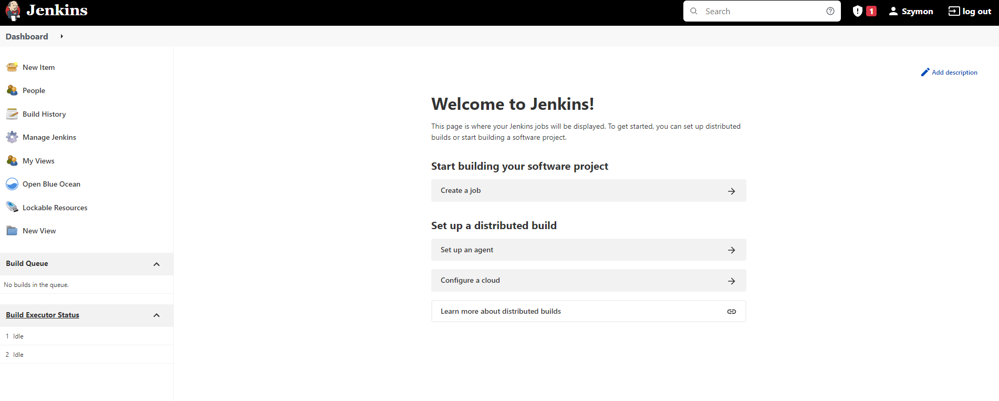

# Zachowywanie stanu

W celu skompilowania projektu w kontenerze skorzystałem z obrazu deweloperskiego niezawierającego git-a. Zastosowane w nim przygotowane paczki mogą pozwalają na skompilowanie projektu

```dockerfile
FROM ubuntu:latest

RUN apt-get update

RUN ln -fs /usr/share/zoneinfo/Europe/Warsaw /etc/localtime
RUN apt-get install -y tzdata
RUN dpkg-reconfigure --frontend noninteractive tzdata

RUN apt-get install -y libicu-dev libc6 libgcc1 libgssapi-krb5-2 libssl1.1 libstdc++6 zlib1g curl

RUN curl -SL -o dotnet.tar.gz https://dotnetcli.azureedge.net/dotnet/Sdk/6.0.103/dotnet-sdk-6.0.103-linux-arm64.tar.gz
RUN mkdir -p /usr/share/dotnet
RUN tar -zxf dotnet.tar.gz -C /usr/share/dotnet
RUN ln -s /usr/share/dotnet/dotnet /usr/bin/dotnet

RUN rm dotnet.tar.gz

RUN curl -sL https://deb.nodesource.com/setup_16.x -o /tmp/nodesource_setup.sh
RUN bash /tmp/nodesource_setup.sh

RUN apt install nodejs

RUN rm /tmp/nodesource_setup.sh


RUN dotnet --info
RUN node -v
RUN npm -v
```

Tworzenie obrazu

```bash
root@szymonvm:/home/ubuntu# sudo docker build -t devenv . -f dokerek
Sending build context to Docker daemon  704.8MB
Step 1/18 : FROM ubuntu:latest
latest: Pulling from library/ubuntu
57d0418fe9dc: Already exists
Digest: sha256:bea6d19168bbfd6af8d77c2cc3c572114eb5d113e6f422573c93cb605a0e2ffb
Status: Downloaded newer image for ubuntu:latest
 ---> e784f03641c9
Step 2/18 : RUN apt-get update
 ---> Running in a849eade8809

 # .................................

 To install additional .NET runtimes or SDKs:
  https://aka.ms/dotnet-download
Removing intermediate container 0f627f5a947c
 ---> 4bcfbfb54c35
Step 17/18 : RUN node -v
 ---> Running in e12ddc092b21
v16.14.2
Removing intermediate container e12ddc092b21
 ---> eecae3e5898b
Step 18/18 : RUN npm -v
 ---> Running in e89beeb35e1c
8.5.0
Removing intermediate container e89beeb35e1c
 ---> 6ca07de65863
Successfully built 6ca07de65863
Successfully tagged devenv:latest
root@szymonvm:/home/ubuntu#

```

Aby przekazać nieulotne dane do kontenera można skorzystać z woluminów.
Z tego powodu tworzę dwa odpowiednie przestrzenie na pliki które są montowane w systemie w podanych lokalizacjach.

Tak stworzone woluminy mogą być zamontowane w kontenerze który będzie dokonywał zapisów.


```bash

root@szymonvm:/home/ubuntu# docker volume create in
in
root@szymonvm:/home/ubuntu# docker volume create out
out
root@szymonvm:/home/ubuntu# docker volume ls
DRIVER    VOLUME NAME
local     in
local     out
root@szymonvm:/home/ubuntu# docker volume inspect in
[
    {
        "CreatedAt": "2022-04-03T11:49:44Z",
        "Driver": "local",
        "Labels": {},
        "Mountpoint": "/var/lib/docker/volumes/in/_data",
        "Name": "in",
        "Options": {},
        "Scope": "local"
    }
]
root@szymonvm:/home/ubuntu# docker volume inspect out
[
    {
        "CreatedAt": "2022-04-03T11:49:47Z",
        "Driver": "local",
        "Labels": {},
        "Mountpoint": "/var/lib/docker/volumes/out/_data",
        "Name": "out",
        "Options": {},
        "Scope": "local"
    }
]
```

Na wolumin wejściowy zostanie sklonowane repozytorium projektu. Korzysta on z kluczy shh i klienta gita zainstalowanego w systemie przez co unikam konieczności dodawania tego w kontenerze


```bash
root@szymonvm:~# cd /var/lib/docker/volumes/in/_data
root@szymonvm:/var/lib/docker/volumes/in/_data# git clone git@gitlab.com:e-moto-smart-systems-5.0/web-app.git
Cloning into 'web-app'...
remote: Enumerating objects: 2938, done.
remote: Counting objects: 100% (499/499), done.
remote: Compressing objects: 100% (442/442), done.
remote: Total 2938 (delta 288), reused 95 (delta 45), pack-reused 2439
Receiving objects: 100% (2938/2938), 13.32 MiB | 12.89 MiB/s, done.
Resolving deltas: 100% (1662/1662), done.
root@szymonvm:/var/lib/docker/volumes/in/_data#

```
Uruchamiam kontener w trybie interaktywnym korzystając z obrazu środowiska deweloperskiego.
Ponadto montuje w kontenerze stworzone wolumniny

- Wolumin ```in``` Punkt montowania /app
- Wolumin ```out``` Punkt montowania /build

Po wykonaniu tego mogę w kontenerze zobaczyć pliki projektu

```bash

root@szymonvm:/var/lib/docker/volumes/in/_data# sudo docker run -it --name kontener --mount source=in,target=/app --mount source=out,target=/build devenv
root@52f109e9e6ad:/# ls
app  bin  boot  build  dev  etc  home  lib  media  mnt  opt  proc  root  run  sbin  srv  sys  tmp  usr  var
root@52f109e9e6ad:/# cd app
root@52f109e9e6ad:/app# ls
web-app
root@52f109e9e6ad:/app# cd web-app/
root@52f109e9e6ad:/app/web-app# ls
LICENSE.md                              Panel.EmotoAgh.Backend.Sql       Panel.EmotoAgh.Frontend
Panel.EmotoAgh.Backend                  Panel.EmotoAgh.Backend.UnitTest  Panel.EmotoAgh.ServerConfiguration
Panel.EmotoAgh.Backend.DatabaseContext  Panel.EmotoAgh.CI                Panel.EmotoAgh.SignalR.Client
Panel.EmotoAgh.Backend.DbContext        Panel.EmotoAgh.Deprecated        Panel.EmotoAgh.sln
Panel.EmotoAgh.Backend.Models           Panel.EmotoAgh.E2ETest           Readme.md
Panel.EmotoAgh.Backend.SignalR          Panel.EmotoAgh.ErrorPage.503
root@52f109e9e6ad:/app/web-app#

```

Przeprowadzam standardową operację publikacji aplikacji a jako folder wyjściowy wskazuję /build co jest woluminem wyjściowym

```bash

root@52f109e9e6ad:/app/web-app/Panel.EmotoAgh.Backend# dotnet publish --configuration Relase --output /build
Microsoft (R) Build Engine version 17.0.0+c9eb9dd64 for .NET
Copyright (C) Microsoft Corporation. All rights reserved.

  Determining projects to restore...
  Restored /app/web-app/Panel.EmotoAgh.Backend.SignalR/Panel.EmotoAgh.Backend.SignalR.csproj (in 11.7 sec).
  Restored /app/web-app/Panel.EmotoAgh.Backend.Models/Panel.EmotoAgh.Backend.Models.csproj (in 2.92 sec).
  Restored /app/web-app/Panel.EmotoAgh.Backend.DatabaseContext/Panel.EmotoAgh.Backend.DatabaseContext.csproj (in 17 ms).
  Restored /app/web-app/Panel.EmotoAgh.Backend/Panel.EmotoAgh.Backend.csproj (in 18.07 sec).

 # .................................
 added 1639 packages, and audited 1640 packages in 37s

  187 packages are looking for funding
    run `npm fund` for details

  8 vulnerabilities (6 moderate, 2 high)

  To address issues that do not require attention, run:
    npm audit fix

  To address all issues (including breaking changes), run:
    npm audit fix --force
 # .................................

  > panel.emotoagh.frontend@0.1.0 build
  > react-scripts build

  Creating an optimized production build...
  Compiled successfully.

  File sizes after gzip:

    67.05 kB  build/static/js/main.6c2d5295.js
    24.43 kB  build/static/css/main.06daf35c.css
    1.44 kB   build/static/js/377.ac86b2d6.chunk.js


# .................................
  The build folder is ready to be deployed.
  You may serve it with a static server:

    npm install -g serve
    serve -s build

  Find out more about deployment here:

    https://cra.link/deployment

  Panel.EmotoAgh.Backend -> /build/

```

Zawartość zbudowanej aplikacji w kontenerze

```bash
root@52f109e9e6ad:/build# ls
AutoMapper.dll                                         NetTopologySuite.IO.GeoJSON4STJ.dll
IdentityModel.dll                                      NetTopologySuite.IO.PostGis.dll
IdentityServer4.EntityFramework.Storage.dll            NetTopologySuite.dll
IdentityServer4.EntityFramework.dll                    Newtonsoft.Json.dll
IdentityServer4.Storage.dll                            Npgsql.EntityFrameworkCore.PostgreSQL.NetTopologySuite.dll
IdentityServer4.dll                                    Npgsql.EntityFrameworkCore.PostgreSQL.dll
Microsoft.AspNetCore.Authentication.JwtBearer.dll      Npgsql.NetTopologySuite.dll
Microsoft.AspNetCore.Authentication.OpenIdConnect.dll  Npgsql.dll
Microsoft.EntityFrameworkCore.Abstractions.dll         Panel.EmotoAgh.Backend
Microsoft.EntityFrameworkCore.Relational.dll           Panel.EmotoAgh.Backend.DatabaseContext.dll
Microsoft.EntityFrameworkCore.dll                      Panel.EmotoAgh.Backend.DatabaseContext.pdb
Microsoft.Extensions.Caching.Memory.dll                Panel.EmotoAgh.Backend.Models.dll
Microsoft.IdentityModel.JsonWebTokens.dll              Panel.EmotoAgh.Backend.Models.pdb
Microsoft.IdentityModel.Logging.dll                    Panel.EmotoAgh.Backend.SignalR.dll
Microsoft.IdentityModel.Protocols.OpenIdConnect.dll    Panel.EmotoAgh.Backend.SignalR.pdb
Microsoft.IdentityModel.Protocols.dll                  Panel.EmotoAgh.Backend.deps.json
Microsoft.IdentityModel.Tokens.dll                     Panel.EmotoAgh.Backend.dll
NJsonSchema.Yaml.dll                                   Panel.EmotoAgh.Backend.pdb
NJsonSchema.dll                                        Panel.EmotoAgh.Backend.runtimeconfig.json
NSwag.Annotations.dll                                  Panel.EmotoAgh.Backend.xml
NSwag.AspNetCore.dll                                   Panel.EmotoAgh.ErrorPage.503
NSwag.Core.Yaml.dll                                    System.IdentityModel.Tokens.Jwt.dll
NSwag.Core.dll                                         YamlDotNet.dll
NSwag.Generation.AspNetCore.dll                        appsettings.Development.json
NSwag.Generation.dll                                   appsettings.json
Namotion.Reflection.dll                                web.config
NetTopologySuite.Features.dll                          wwwroot
root@52f109e9e6ad:/build#
```

Częściowa zawartość zbudowanej aplikacji w systemie hosta


```bash
root@szymonvm:/var/lib/docker/volumes/out/_data# ls
AutoMapper.dll                                         NetTopologySuite.IO.GeoJSON4STJ.dll
IdentityModel.dll                                      NetTopologySuite.IO.PostGis.dll
IdentityServer4.EntityFramework.Storage.dll            NetTopologySuite.dll
IdentityServer4.EntityFramework.dll                    Newtonsoft.Json.dll
IdentityServer4.Storage.dll                            Npgsql.EntityFrameworkCore.PostgreSQL.NetTopologySuite.dll
IdentityServer4.dll                                    Npgsql.EntityFrameworkCore.PostgreSQL.dll
Microsoft.AspNetCore.Authentication.JwtBearer.dll      Npgsql.NetTopologySuite.dll
Microsoft.AspNetCore.Authentication.OpenIdConnect.dll  Npgsql.dll

```

Uruchomienie aplikacji.
Na tym etapie uruchomiłem aplikację w systemie hosta

```bash
root@szymonvm:/var/lib/docker/volumes/out/_data# ./Panel.EmotoAgh.Backend  JWTAuthority=""  PostgreSqlConnectionString="localhost"
info: IdentityServer4.Startup[0]
      Starting IdentityServer4 version 4.1.2+997a6cdd643e46cd5762b710c4ddc43574cbec2e
info: IdentityServer4.Startup[0]
      Using the default authentication scheme Bearer for IdentityServer
info: IdentityServer4.Startup[0]
      Authentication scheme Bearer is configured for IdentityServer, but it is not a scheme that supports signin (like cookies). If you support interactive logins via the browser, then a cookie-based scheme should be used.
info: Microsoft.Hosting.Lifetime[14]
      Now listening on: http://localhost:5000
info: Microsoft.Hosting.Lifetime[0]
      Application started. Press Ctrl+C to shut down.
info: Microsoft.Hosting.Lifetime[0]
      Hosting environment: Production
info: Microsoft.Hosting.Lifetime[0]
      Content root path: /var/lib/docker/volumes/out/_data/
```


# Zakres rozszerzony - Komunikacja

Aktualnie posiadam środowisko deweloperskie którego obraz posiada rozmiar ok 1020 MB
W nim na dysku wyjściowym została zbudowana aplikacja dlatego zbędnym jest dystrybuowanie tak dużego dysku, wystarczający jest sam runtime .net 6
Który to można zbudować z dockerfile Microsoftu nawet (tym  razem) na arm64 
Rozmiar takiego obrazu to już 222 MB

```dockerfile
ARG REPO=mcr.microsoft.com/dotnet/runtime

# Installer image
FROM arm64v8/buildpack-deps:bullseye-curl AS installer

# Retrieve ASP.NET Core
RUN aspnetcore_version=6.0.3 \
    && curl -fSL --output aspnetcore.tar.gz https://dotnetcli.azureedge.net/dotnet/aspnetcore/Runtime/$aspnetcore_version/aspnetcore-runtime-$aspnetcore_version-linux-arm64.tar.gz \
    && aspnetcore_sha512='745586b64d3e01f856c366821f6fb8ca97c55b2a90ba36d528fdf99c98938574805153e7d4fff0560afe8382bea14b35ddeba391a2dc2328285f02e125c9b702' \
    && echo "$aspnetcore_sha512  aspnetcore.tar.gz" | sha512sum -c - \
    && tar -oxzf aspnetcore.tar.gz ./shared/Microsoft.AspNetCore.App \
    && rm aspnetcore.tar.gz


# ASP.NET Core image
FROM $REPO:6.0.3-bullseye-slim-arm64v8

ENV \
    # ASP.NET Core version
    ASPNET_VERSION=6.0.3 \
    # Set the default console formatter to JSON
    Logging__Console__FormatterName=Json

COPY --from=installer ["/shared/Microsoft.AspNetCore.App", "/usr/share/dotnet/shared/Microsoft.AspNetCore.App"]
```


```bash
sudo docker build -t rntenv . -f aspnetrnt
Sending build context to Docker daemon  873.4MB
Step 1/6 : ARG REPO=mcr.microsoft.com/dotnet/runtime
Step 2/6 : FROM arm64v8/buildpack-deps:bullseye-curl AS installer
bullseye-curl: Pulling from arm64v8/buildpack-deps


 ---> 0a26a2451bcd
Successfully built 0a26a2451bcd
Successfully tagged rntenv:latest

```

Do zbudowanego obrazu montuje wolumin ze zbudowaną aplikacją, udostępniam port jawnie określony 6000 i uruchamiam na kontenerze plik wykonywalny aplikacji. Wynikiem jego działania są np. informacje diagnostyczne w postaci JSONa


```json

ubuntu@szymonvm:~$ sudo docker run -it --name runtime -p 6000:6000 --mount source=out,target=/app rntenv /app/Panel.Emot
oAgh.Backend JWTAuthority=""  PostgreSqlConnectionString="localhost" --urls=http://localhost:6000/
{"EventId":0,"LogLevel":"Information","Category":"IdentityServer4.Startup","Message":"Starting IdentityServer4 version 4.1.2\u002B997a6cdd643e46cd5762b710c4ddc43574cbec2e","State":{"Message":"Starting IdentityServer4 version 4.1.2\u002B997a6cdd643e46cd5762b710c4ddc43574cbec2e","version":"4.1.2\u002B997a6cdd643e46cd5762b710c4ddc43574cbec2e","{OriginalFormat}":"Starting IdentityServer4 version {version}"}}
{"EventId":0,"LogLevel":"Information","Category":"IdentityServer4.Startup","Message":"Using the default authentication scheme Bearer for IdentityServer","State":{"Message":"Using the default authentication scheme Bearer for IdentityServer","scheme":"Bearer","{OriginalFormat}":"Using the default authentication scheme {scheme} for IdentityServer"}}
{"EventId":0,"LogLevel":"Information","Category":"IdentityServer4.Startup","Message":"Authentication scheme Bearer is configured for IdentityServer, but it is not a scheme that supports signin (like cookies). If you support interactive logins via the browser, then a cookie-based scheme should be used.","State":{"Message":"Authentication scheme Bearer is configured for IdentityServer, but it is not a scheme that supports signin (like cookies). If you support interactive logins via the browser, then a cookie-based scheme should be used.","scheme":"Bearer","{OriginalFormat}":"Authentication scheme {scheme} is configured for IdentityServer, but it is not a scheme that supports signin (like cookies). If you support interactive logins via the browser, then a cookie-based scheme should be used."}}
{"EventId":60,"LogLevel":"Warning","Category":"Microsoft.AspNetCore.DataProtection.Repositories.FileSystemXmlRepository","Message":"Storing keys in a directory \u0027/root/.aspnet/DataProtection-Keys\u0027 that may not be persisted outside of the container. Protected data will be unavailable when container is destroyed.","State":{"Message":"Storing keys in a directory \u0027/root/.aspnet/DataProtection-Keys\u0027 that may not be persisted outside of the container. Protected data will be unavailable when container is destroyed.","path":"/root/.aspnet/DataProtection-Keys","{OriginalFormat}":"Storing keys in a directory \u0027{path}\u0027 that may not be persisted outside of the container. Protected data will be unavailable when container is destroyed."}}
{"EventId":62,"LogLevel":"Information","Category":"Microsoft.AspNetCore.DataProtection.KeyManagement.XmlKeyManager","Message":"User profile is available. Using \u0027/root/.aspnet/DataProtection-Keys\u0027 as key repository; keys will not be encrypted at rest.","State":{"Message":"User profile is available. Using \u0027/root/.aspnet/DataProtection-Keys\u0027 as key repository; keys will not be encrypted at rest.","FullName":"/root/.aspnet/DataProtection-Keys","{OriginalFormat}":"User profile is available. Using \u0027{FullName}\u0027 as key repository; keys will not be encrypted at rest."}}
{"EventId":58,"LogLevel":"Information","Category":"Microsoft.AspNetCore.DataProtection.KeyManagement.XmlKeyManager","Message":"Creating key {0f2e1e57-b640-465e-9522-7c8fb314db3c} with creation date 2022-04-03 18:30:20Z, activation date 2022-04-03 18:30:20Z, and expiration date 2022-07-02 18:30:20Z.","State":{"Message":"Creating key {0f2e1e57-b640-465e-9522-7c8fb314db3c} with creation date 2022-04-03 18:30:20Z, activation date 2022-04-03 18:30:20Z, and expiration date 2022-07-02 18:30:20Z.","KeyId":"0f2e1e57-b640-465e-9522-7c8fb314db3c","CreationDate":"04/03/2022 18:30:20 \u002B00:00","ActivationDate":"04/03/2022 18:30:20 \u002B00:00","ExpirationDate":"07/02/2022 18:30:20 \u002B00:00","{OriginalFormat}":"Creating key {KeyId:B} with creation date {CreationDate:u}, activation date {ActivationDate:u}, and expiration date {ExpirationDate:u}."}}
{"EventId":35,"LogLevel":"Warning","Category":"Microsoft.AspNetCore.DataProtection.KeyManagement.XmlKeyManager","Message":"No XML encryptor configured. Key {0f2e1e57-b640-465e-9522-7c8fb314db3c} may be persisted to storage in unencrypted form.","State":{"Message":"No XML encryptor configured. Key {0f2e1e57-b640-465e-9522-7c8fb314db3c} may be persisted to storage in unencrypted form.","KeyId":"0f2e1e57-b640-465e-9522-7c8fb314db3c","{OriginalFormat}":"No XML encryptor configured. Key {KeyId:B} may be persisted to storage in unencrypted form."}}
{"EventId":39,"LogLevel":"Information","Category":"Microsoft.AspNetCore.DataProtection.Repositories.FileSystemXmlRepository","Message":"Writing data to file \u0027/root/.aspnet/DataProtection-Keys/key-0f2e1e57-b640-465e-9522-7c8fb314db3c.xml\u0027.","State":{"Message":"Writing data to file \u0027/root/.aspnet/DataProtection-Keys/key-0f2e1e57-b640-465e-9522-7c8fb314db3c.xml\u0027.","FileName":"/root/.aspnet/DataProtection-Keys/key-0f2e1e57-b640-465e-9522-7c8fb314db3c.xml","{OriginalFormat}":"Writing data to file \u0027{FileName}\u0027."}}
{"EventId":0,"LogLevel":"Information","Category":"Microsoft.AspNetCore.Server.Kestrel","Message":"Unable to bind to http://localhost:6000 on the IPv6 loopback interface: \u0027Cannot assign requested address\u0027.","State":{"Message":"Unable to bind to http://localhost:6000 on the IPv6 loopback interface: \u0027Cannot assign requested address\u0027.","address":"http://localhost:6000","interfaceName":"IPv6 loopback","error":"Cannot assign requested address","{OriginalFormat}":"Unable to bind to {address} on the {interfaceName} interface: \u0027{error}\u0027."}}
{"EventId":14,"LogLevel":"Information","Category":"Microsoft.Hosting.Lifetime","Message":"Now listening on: http://localhost:6000","State":{"Message":"Now listening on: http://localhost:6000","address":"http://localhost:6000","{OriginalFormat}":"Now listening on: {address}"}}
{"EventId":0,"LogLevel":"Information","Category":"Microsoft.Hosting.Lifetime","Message":"Application started. Press Ctrl\u002BC to shut down.","State":{"Message":"Application started. Press Ctrl\u002BC to shut down.","{OriginalFormat}":"Application started. Press Ctrl\u002BC to shut down."}}
{"EventId":0,"LogLevel":"Information","Category":"Microsoft.Hosting.Lifetime","Message":"Hosting environment: Production","State":{"Message":"Hosting environment: Production","envName":"Production","{OriginalFormat}":"Hosting environment: {envName}"}}
{"EventId":0,"LogLevel":"Information","Category":"Microsoft.Hosting.Lifetime","Message":"Content root path: /","State":{"Message":"Content root path: /","contentRoot":"/","{OriginalFormat}":"Content root path: {contentRoot}"}}

```

# Eksponowanie portu

A celu sprawdzenia przepustowości sieci korzystam z narzędzia ipref w wersji 3.

Całości tym razem dokonuje na komputerze stacjonarnym za pośrednictwem WSL2, i Docker Desktop

Uruchamiam kontener w trybie interaktywnym z serwerem ipref-a z dostępnego obrazu oraz z opublikowanymi portami 5201
```bash
❯ docker run  -it --rm --name=iperf3-server -p 5201:5201 networkstatic/iperf3 -s
Unable to find image 'networkstatic/iperf3:latest' locally
latest: Pulling from networkstatic/iperf3
5eb5b503b376: Pull complete
2cdcfe59fc45: Pull complete
Digest: sha256:e9bbc8312edff13e2ecccad0907db4b35119139e133719138108955cf07f0683
Status: Downloaded newer image for networkstatic/iperf3:latest
-----------------------------------------------------------
Server listening on 5201
-----------------------------------------------------------
```

Aby zbadać ruch potrzebuję klienta, który również został uruchomiony w kontenerze. W tym przypadku musiałem znać adres sieciowy serwera co zrobiłem poleceniem

```bash
❯ docker inspect --format "{{ .NetworkSettings.IPAddress }}" iperf3-server
172.17.0.2
```

## Łączenie z serwerem, testowanie przepustowości
Klient:

```bash
❯ docker run  -it --rm networkstatic/iperf3 -c  172.17.0.2
Connecting to host 172.17.0.2, port 5201
[  5] local 172.17.0.3 port 35442 connected to 172.17.0.2 port 5201
[ ID] Interval           Transfer     Bitrate         Retr  Cwnd
[  5]   0.00-1.00   sec  2.17 GBytes  18.6 Gbits/sec  715    669 KBytes
[  5]   1.00-2.00   sec  2.59 GBytes  22.3 Gbits/sec    2    803 KBytes
[  5]   2.00-3.00   sec  2.39 GBytes  20.5 Gbits/sec    0    963 KBytes
[  5]   3.00-4.00   sec  1.98 GBytes  17.0 Gbits/sec    1    976 KBytes
[  5]   4.00-5.00   sec  2.29 GBytes  19.7 Gbits/sec    1   1020 KBytes
[  5]   5.00-6.00   sec  2.34 GBytes  20.1 Gbits/sec    0   1.04 MBytes
[  5]   6.00-7.00   sec  2.32 GBytes  19.9 Gbits/sec   17   1.04 MBytes
[  5]   7.00-8.00   sec  2.26 GBytes  19.4 Gbits/sec  103   1.07 MBytes
[  5]   8.00-9.00   sec  2.37 GBytes  20.4 Gbits/sec   48   1.13 MBytes
[  5]   9.00-10.00  sec  2.34 GBytes  20.1 Gbits/sec    1   1.15 MBytes
- - - - - - - - - - - - - - - - - - - - - - - - -
[ ID] Interval           Transfer     Bitrate         Retr
[  5]   0.00-10.00  sec  23.1 GBytes  19.8 Gbits/sec  888             sender
[  5]   0.00-10.00  sec  23.0 GBytes  19.8 Gbits/sec                  receiver

iperf Done.
```

Wyniki po stronie serwera

```bash
Accepted connection from 172.17.0.3, port 35440
[  5] local 172.17.0.2 port 5201 connected to 172.17.0.3 port 35442
[ ID] Interval           Transfer     Bitrate
[  5]   0.00-1.00   sec  2.17 GBytes  18.6 Gbits/sec
[  5]   1.00-2.00   sec  2.59 GBytes  22.2 Gbits/sec
[  5]   2.00-3.00   sec  2.38 GBytes  20.4 Gbits/sec
[  5]   3.00-4.00   sec  1.98 GBytes  17.0 Gbits/sec
[  5]   4.00-5.00   sec  2.29 GBytes  19.7 Gbits/sec
[  5]   5.00-6.00   sec  2.35 GBytes  20.2 Gbits/sec
[  5]   6.00-7.00   sec  2.31 GBytes  19.8 Gbits/sec
[  5]   7.00-8.00   sec  2.26 GBytes  19.4 Gbits/sec
[  5]   8.00-9.00   sec  2.38 GBytes  20.5 Gbits/sec
[  5]   9.00-10.00  sec  2.34 GBytes  20.1 Gbits/sec
[  5]  10.00-10.00  sec   128 KBytes  5.43 Gbits/sec
- - - - - - - - - - - - - - - - - - - - - - - - -
[ ID] Interval           Transfer     Bitrate
[  5]   0.00-10.00  sec  23.0 GBytes  19.8 Gbits/sec                  receiver

```


## Następnie dokonuję pomiarów przepustowości między hostem (wsl2) a kontenerem

Klient:
```bash

❯ .\iperf3.exe -c 192.168.1.2
Connecting to host 192.168.1.2, port 5201
[  4] local 192.168.1.2 port 59036 connected to 192.168.1.2 port 5201
[ ID] Interval           Transfer     Bandwidth
[  4]   0.00-1.01   sec  41.8 MBytes   348 Mbits/sec
[  4]   1.01-2.01   sec  32.1 MBytes   269 Mbits/sec
[  4]   2.01-3.01   sec  30.0 MBytes   252 Mbits/sec
[  4]   3.01-4.00   sec  28.0 MBytes   236 Mbits/sec
[  4]   4.00-5.00   sec  32.0 MBytes   269 Mbits/sec
[  4]   5.00-6.00   sec  28.6 MBytes   239 Mbits/sec
[  4]   6.00-7.01   sec  35.4 MBytes   296 Mbits/sec
[  4]   7.01-8.00   sec  36.0 MBytes   304 Mbits/sec
[  4]   8.00-9.00   sec  38.6 MBytes   324 Mbits/sec
[  4]   9.00-10.00  sec  37.2 MBytes   312 Mbits/sec
- - - - - - - - - - - - - - - - - - - - - - - - -
[ ID] Interval           Transfer     Bandwidth
[  4]   0.00-10.00  sec   340 MBytes   285 Mbits/sec                  sender
[  4]   0.00-10.00  sec   336 MBytes   282 Mbits/sec                  receiver

iperf Done.
```
Wyniki po stronie serwera

```bash
Accepted connection from 172.17.0.1, port 50494
[  5] local 172.17.0.2 port 5201 connected to 172.17.0.1 port 50496
[ ID] Interval           Transfer     Bitrate
[  5]   0.00-1.00   sec  38.0 MBytes   319 Mbits/sec
[  5]   1.00-2.00   sec  32.2 MBytes   270 Mbits/sec
[  5]   2.00-3.00   sec  30.7 MBytes   257 Mbits/sec
[  5]   3.00-4.00   sec  28.1 MBytes   235 Mbits/sec
[  5]   4.00-5.00   sec  31.6 MBytes   265 Mbits/sec
[  5]   5.00-6.00   sec  28.9 MBytes   242 Mbits/sec
[  5]   6.00-7.00   sec  34.8 MBytes   292 Mbits/sec
[  5]   7.00-8.00   sec  36.7 MBytes   308 Mbits/sec
[  5]   8.00-9.00   sec  38.6 MBytes   323 Mbits/sec
[  5]   9.00-10.00  sec  36.6 MBytes   307 Mbits/sec
[  5]  10.00-10.01  sec   160 KBytes   213 Mbits/sec
- - - - - - - - - - - - - - - - - - - - - - - - -
[ ID] Interval           Transfer     Bitrate
[  5]   0.00-10.01  sec   336 MBytes   282 Mbits/sec                  receiver
```


## Ostatni test bada przepustowość między laptopem w sieci LAN a komputerem stacjonarnym na którym jest uruchomiony serwer ipref w kontenerze

Klient:

```bash
❯ .\iperf3.exe -c 192.168.1.2
Connecting to host 192.168.1.2, port 5201
[  4] local 192.168.1.6 port 50909 connected to 192.168.1.2 port 5201
[ ID] Interval           Transfer     Bandwidth
[  4]   0.00-1.01   sec  14.5 MBytes   121 Mbits/sec
[  4]   1.01-2.00   sec  11.0 MBytes  92.9 Mbits/sec
[  4]   2.00-3.01   sec  9.50 MBytes  79.4 Mbits/sec
[  4]   3.01-4.00   sec  11.4 MBytes  95.7 Mbits/sec
[  4]   4.00-5.01   sec  11.2 MBytes  94.0 Mbits/sec
[  4]   5.01-6.00   sec  12.4 MBytes   104 Mbits/sec
[  4]   6.00-7.01   sec  13.6 MBytes   113 Mbits/sec
[  4]   7.01-8.00   sec  12.9 MBytes   109 Mbits/sec
[  4]   8.00-9.01   sec  13.8 MBytes   114 Mbits/sec
[  4]   9.01-10.00  sec  13.2 MBytes   112 Mbits/sec
- - - - - - - - - - - - - - - - - - - - - - - - -
[ ID] Interval           Transfer     Bandwidth
[  4]   0.00-10.00  sec   124 MBytes   104 Mbits/sec                  sender
[  4]   0.00-10.00  sec   123 MBytes   104 Mbits/sec                  receiver

iperf Done.
```

Wyniki po stronie serwera

```bash

Accepted connection from 172.17.0.1, port 50490
[  5] local 172.17.0.2 port 5201 connected to 172.17.0.1 port 50492
[ ID] Interval           Transfer     Bitrate
[  5]   0.00-1.00   sec  14.1 MBytes   118 Mbits/sec
[  5]   1.00-2.00   sec  11.2 MBytes  93.8 Mbits/sec
[  5]   2.00-3.00   sec  9.63 MBytes  80.7 Mbits/sec
[  5]   3.00-4.00   sec  11.3 MBytes  94.7 Mbits/sec
[  5]   4.00-5.00   sec  11.3 MBytes  94.7 Mbits/sec
[  5]   5.00-6.00   sec  12.5 MBytes   105 Mbits/sec
[  5]   6.00-7.00   sec  13.6 MBytes   114 Mbits/sec
[  5]   7.00-8.00   sec  12.7 MBytes   107 Mbits/sec
[  5]   8.00-9.00   sec  13.8 MBytes   115 Mbits/sec
[  5]   9.00-10.00  sec  13.2 MBytes   111 Mbits/sec
[  5]  10.00-10.01  sec   214 KBytes   118 Mbits/sec
- - - - - - - - - - - - - - - - - - - - - - - - -
[ ID] Interval           Transfer     Bitrate
[  5]   0.00-10.01  sec   123 MBytes   103 Mbits/sec                  receiver

```

Pojawia się tutaj ten sam problem z wz. z WSL. przepustowość jest podobna do 100mbs mimo iś na laptopie mam kartę WiFi 6 intela AX201, router w standardzie wifi 5, a switche w nim 1gbs podobnie jak w komputerze karta sieciowa

# Jenkins

Tworzenie sieci, kontenera

```bash

root@szymonvm:/home/ubuntu# docker network create jenkins
72f840a17a5583cbc71e1a103402b4c3458de9aad845a6ab9ad6cda03bdec7b7
root@szymonvm:/home/ubuntu# docker run \
>   --name jenkins-docker \
>   --rm \
>   --detach \
>   --privileged \
>   --network jenkins \
>   --network-alias docker \
>   --env DOCKER_TLS_CERTDIR=/certs \
>   --volume jenkins-docker-certs:/certs/client \
>   --volume jenkins-data:/var/jenkins_home \
>   --publish 2376:2376 \
>   docker:dind \
>   --storage-driver overlay2
Unable to find image 'docker:dind' locally
dind: Pulling from library/docker
80fa7f07ec7b: Pull complete
cab8992fcbba: Pull complete
afedb10a1343: Pull complete
71f3009765e8: Pull complete
7ae115253e7c: Pull complete
4eb3afcdfd64: Pull complete
971d2cdfcd56: Pull complete
d9d864000173: Pull complete
9e9335a5b964: Pull complete
c0095e6dad21: Pull complete
e754d309d56b: Pull complete
Digest: sha256:e816908591767e57b84fec6b5edb483cfdae5309c2446d2164c4a5bde44f26b4
Status: Downloaded newer image for docker:dind
8c6b3a0bd621f8a5112d77dda38b7da78c297583c9595541366b8e014a254c65
root@szymonvm:/home/ubuntu#

```

Budowanie obrazu korzystającego z poprzedniego kontenera i zmieniającyh się dependencji zawartych w dockerfile

```bash

root@szymonvm:/home/ubuntu# docker build -t myjenkins-blueocean:2.332.1-1 . -f ./myjenkins-blueocean
Sending build context to Docker daemon  873.4MB
Step 1/8 : FROM jenkins/jenkins:2.332.1-jdk11
2.332.1-jdk11: Pulling from jenkins/jenkins


# ......................................

Step 7/8 : USER jenkins
 ---> Running in e9d9337caf6f
Removing intermediate container e9d9337caf6f
 ---> a9ff7d747908
Step 8/8 : RUN jenkins-plugin-cli --plugins "blueocean:1.25.3 docker-workflow:1.28"
 ---> Running in 92377f676516
Done
Removing intermediate container 92377f676516
 ---> 83882737278b
Successfully built 83882737278b
Successfully tagged myjenkins-blueocean:2.332.1-1
root@szymonvm:/home/ubuntu#
```

Uruchomienie jenkinsa na porcie 8070.
Port 8080 (na domenie) jest nie dostępny w sieci LAN (pseudo zabezspieczenia UPC)

Zmiana portu na 8070

```bash

root@szymonvm:/home/ubuntu# docker run --name jenkins-blueocean --rm --detach \
>   --network jenkins --env DOCKER_HOST=tcp://docker:2376 \
>   --env DOCKER_CERT_PATH=/certs/client --env DOCKER_TLS_VERIFY=1 \
>   --publish 8070:8080 --publish 50000:50000 \
>   --volume jenkins-data:/var/jenkins_home \
>   --volume jenkins-docker-certs:/certs/client:ro \
>   myjenkins-blueocean:2.332.1-1
97372c43321c9e5cdbedc54cda8e2598fc4254744ec44e36cf74378cb2b18922
```

Do poprawnego działania potrzebowałem dodać reguły firewalla

```bash

root@szymonvm:/home/ubuntu# sudo iptables -I INPUT 6 -m state --state NEW -p tcp --dport 8070 -j ACCEPT
root@szymonvm:/home/ubuntu# sudo netfilter-persistent save
run-parts: executing /usr/share/netfilter-persistent/plugins.d/15-ip4tables save
run-parts: executing /usr/share/netfilter-persistent/plugins.d/25-ip6tables save

```

Po uruchomieniu i przejściu na stronę potrzebowałe odblokować Jenkinsa.
Pobrałem hasło z basha kontenera

```bash
root@szymonvm:/home/ubuntu# docker exec -it jenkins-blueocean bash
jenkins@e2c794708829:/$ cat /var/jenkins_home/secrets/initialAdminPassword

```

## Odblokowany jenkins



## Strona powitalna 

