# Fedora

## Moim celem jest stworzenie zmodyfikowanej wersji obrazu instalacyjnego fedory zawierającej zainstalowaną jako serwis aplikację webową

## Plik odpowiedzi

Najpierw pracuję na komputerze lokalnym, wykorzystując wirtualizację przez Hyper-V ustawiając konfigurację przedstawioną poniżej

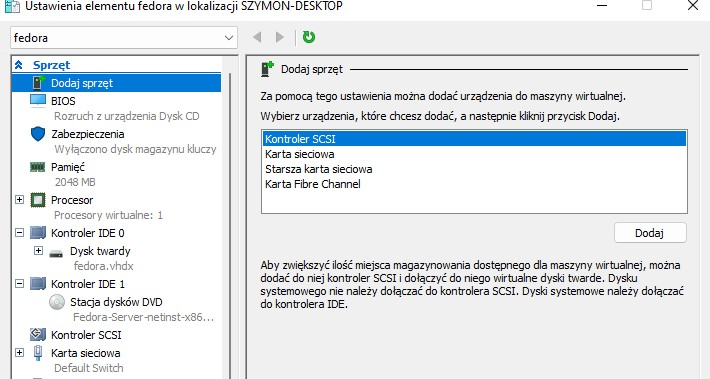


Po uruchomieniu maszyny z zamontowaną instalką .iso ustawiając kolejność bootmenu> rozruch następuje właśnie z tego nośnika. 

Uświadczyłem błąd uruchomienia graficznego instalatora. Z wziązku z tym miałem do wyboru dwie opcję:
- text
- vnc

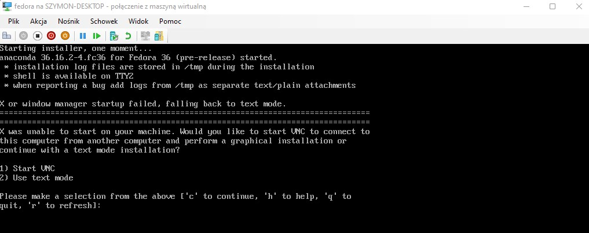


Skorzystałem z text, ustawiając wymagane opcje.
Ustawiłem partycjonowanie dysku

Stworzyłem użytkownika: ```fedora```

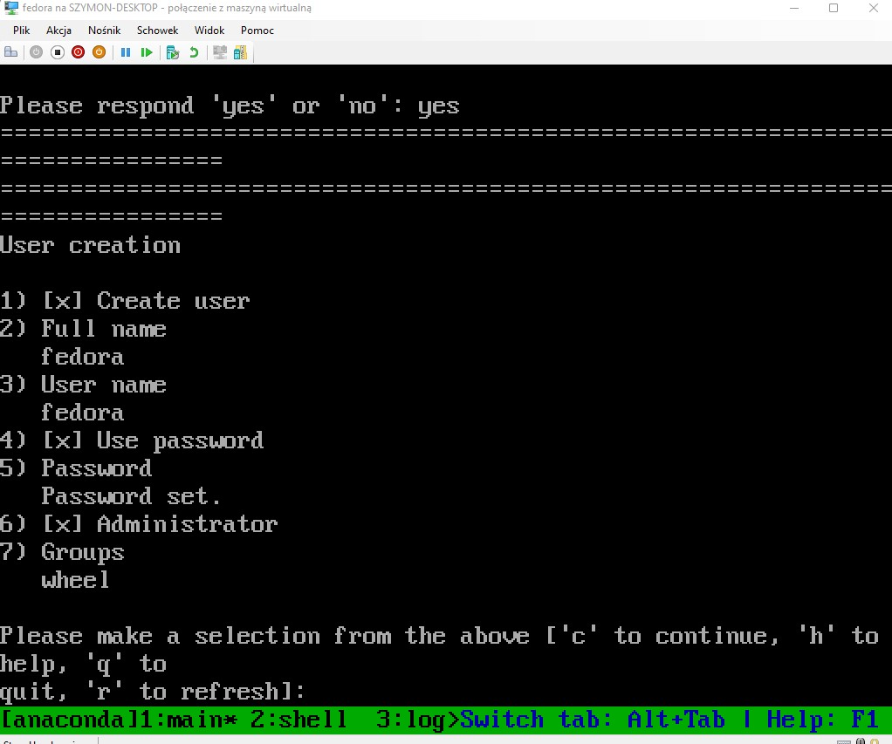

Wybrałem minimalną liczbę pakietów, ustawiłem poprawną strefę czasową


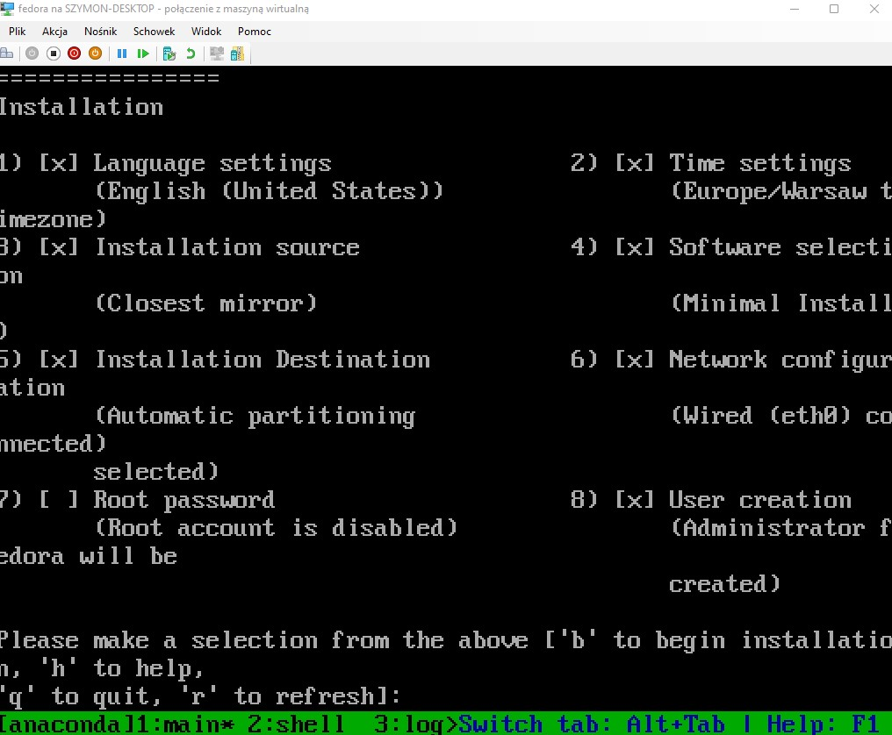


Po konfiguracji zainstalowałem system, zalogowałem się upewniając się że wszystko przebiegło pomyślnie.

Dla ułatwienia korzystania z terminala połączyłem się przez ssh, odczytując adres maszyny. 

W pliku ```/root/anaconda-ks.cfg``` znajduje się plik pozwalający odtworzyć proces instalacji systemu. Jest on podstawą do modyfikacji procesu instalacji

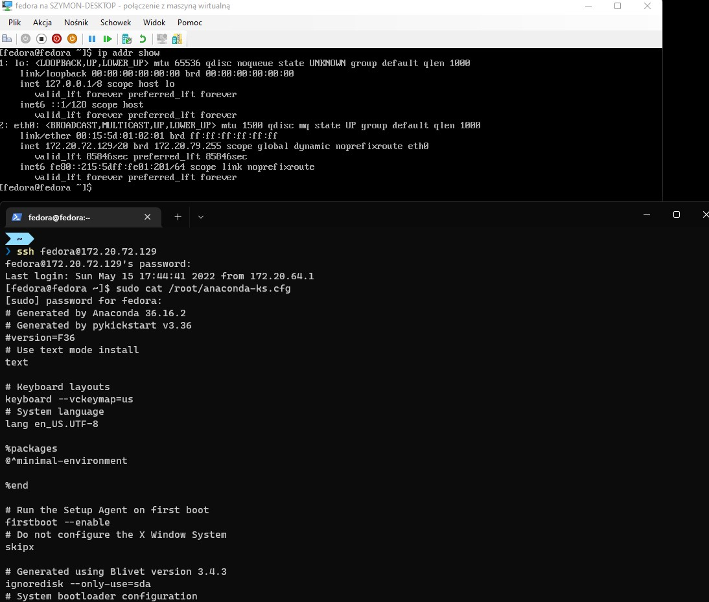

## Podstawowa modyfikacja instalacji


Plik konfiguracji instalacji należy przekazać do grub-a. Można tego dokonać poprzez wskazanie lokalizacji pliku, nawet znajdującego się na remote. Wtedy podczas instalacji należy zadbać o połączenie internetowe

Na początku do pliku konfiguracyjnego dodałem repozytoria:
```
url --mirrorlist=http://mirrors.fedoraproject.org/mirrorlist?repo=fedora-$releasever&arch=x86_64
repo --name=updates --mirrorlist=http://mirrors.fedoraproject.org/mirrorlist?repo=updates-released-f$releasever&arch=x86_64

```

Oraz dodałem hasło roota o którym zapomniałem przy instalacji:

Zmieniając z ```rootpw --lock``` na ```rootpw --iscrypted ###```

Dla celów testowych skorzystałem z kontenera dockera korzystającego z obrazu halverneus/static-file-server, wskazałem mu lokalizację z plikiem nad którym pracowałem

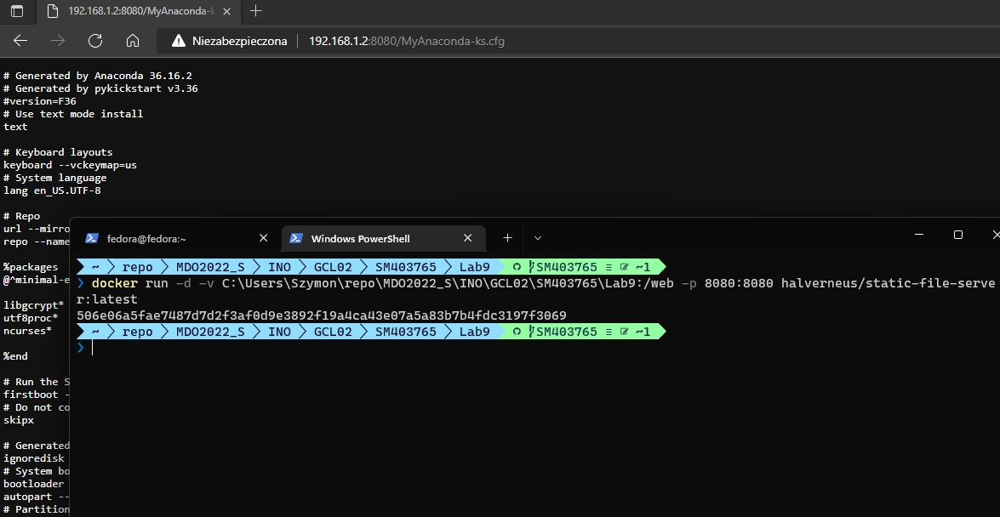


Następnie przekazuję grubowi, co potem zostaje odczytane przez instalator, plik konfiguracyjny procesu instalacji. Plik ten właśnie jest dostępny z wcześniej wspomnianego serwera
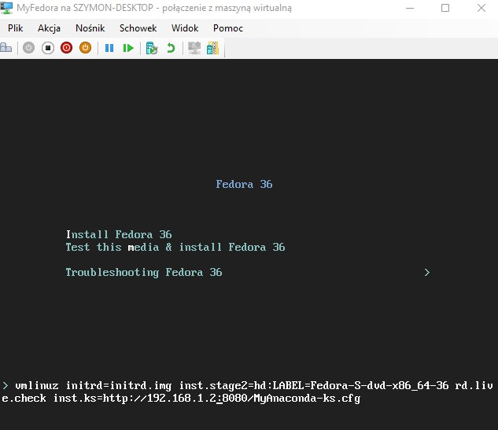

Zainstalowany system

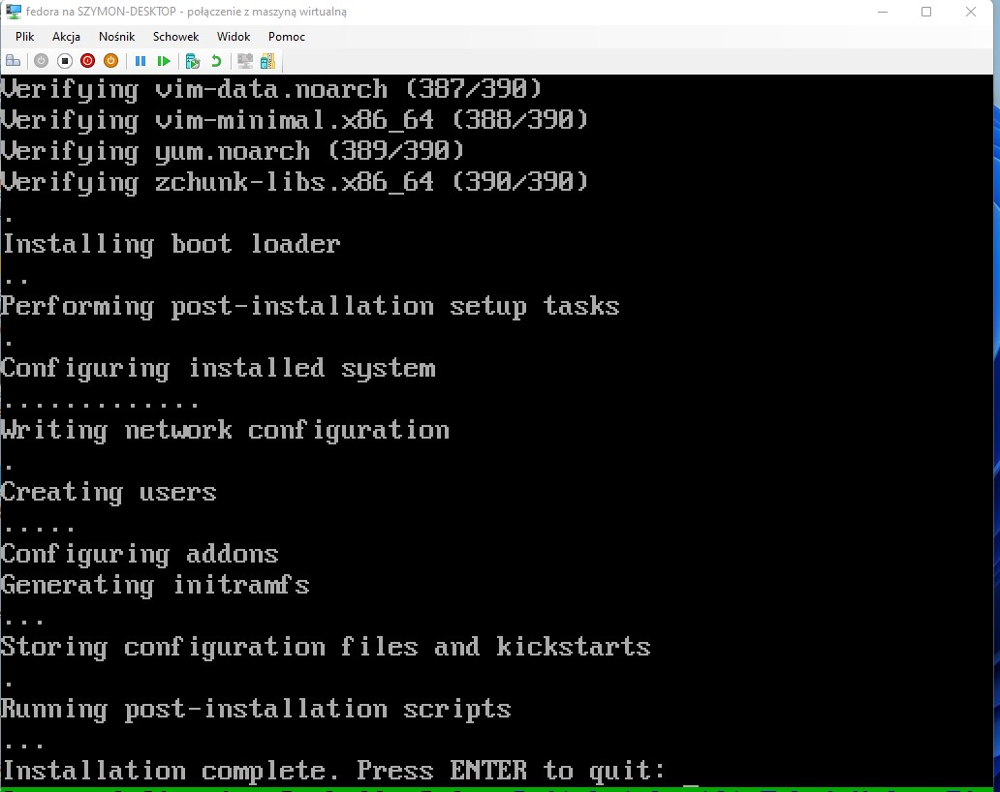

## Dalsze modyfikacje

Pierwszą próbą było umieszczenie na obrazie instalacyjnym skompilowanej aplikacji która następnie przez instalator miała być kopiowana z nośnika instalacyjnego na system, a po starcie (brak tar-a) rozpakowywana i nadzorowana przez serwis systemd.

Jednak po dłuższym czasie czasie nie rozwiązałem problemu kopiowania z /mnt/install/repo. Dla skrócenia pomijam opisanie tych godzinnych czynności


Przyjąłem strategię że ściągnę z własnego docker registry obraz produkcyjny a systemd będzie nadzorował go

Dlatego po wstępnej konfiguracji podejmuję próbę instalacji dockera

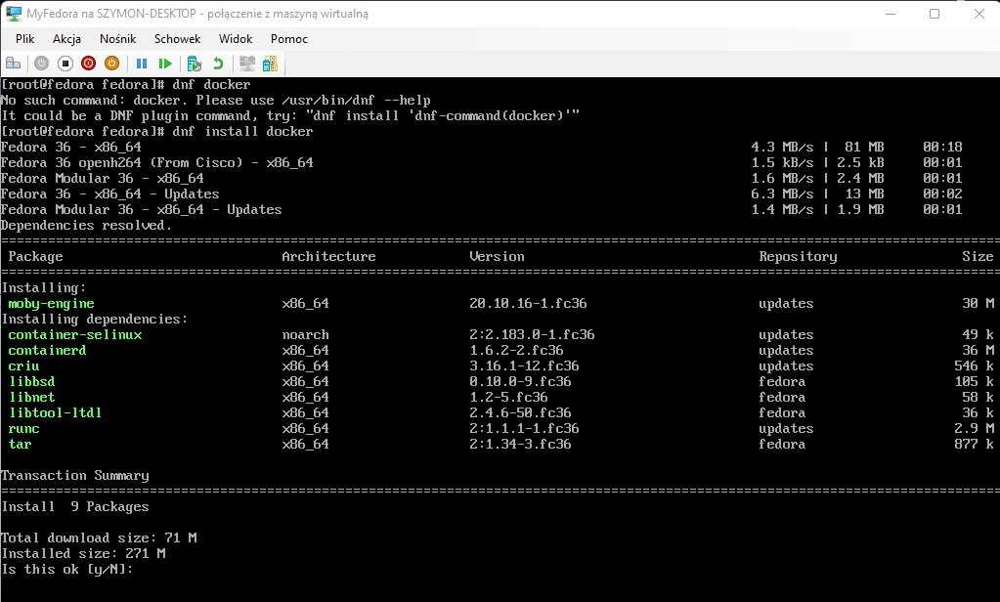

Przedstawione informację wykorzystałem do dopisania do pliku odpowiedzi wymaganych pakietów. Dodane wcześniej repozytorium pakietów zawierało informację o nich dlatego nie dodawałem innych repozytoriów

Zakładam że nowa wersja aplikacji spowoduje ponowne uruchomienie systemu dlatego tworzę serwis systemd który zatrzymuje kontener, pobiera obraz, uruchamia kontener na najnowszą obrazie

Taką konfigurację dopisuję w procesie instalacji do lokalizacji konfiguracji serwisów systemd ```/etc/systemd/system/```

Następnie aktywuję serwis używając ```systemctl``` tworzy on symlink który w efekcie spowoduje uruchomienie go przy starcie systemu. Nie uruchamiam serwisu odrazu ponieważ za chwilę restartuję maszynę

Kolejną zmianą jest wywołanie ```eject``` usuwającą nośnik dvd z systemu

Ostatecznie restartuję system, niejawnie domyślnie jest ustawiane oczekiwanie na wciśnięcie enter-a dlatego jawnie wskazuję na reboot

Tym samym bez oczekiwania na input terminala mam uruchomiony system z serwisem zawierającym aplikację


Końcowy plik konfiguracyjny 

```
# Generated by Anaconda 36.16.2
# Generated by pykickstart v3.36
#version=F36
# Use text mode install
text

# Keyboard layouts
keyboard --vckeymap=us
# System language
lang en_US.UTF-8

# Repo
url --mirrorlist=http://mirrors.fedoraproject.org/mirrorlist?repo=fedora-$releasever&arch=x86_64
repo --name=updates --mirrorlist=http://mirrors.fedoraproject.org/mirrorlist?repo=updates-released-f$releasever&arch=x86_64

%packages
@^minimal-environment

container-selinux
containerd
criu
libbsd
libnet
libtool-ltdl
runc
tar

moby-engine

%end

# Run the Setup Agent on first boot
firstboot --enable
# Do not configure the X Window System
skipx

# Generated using Blivet version 3.4.3
ignoredisk --only-use=sda
# System bootloader configuration
bootloader --location=mbr --boot-drive=sda
autopart --type=thinp
# Partition clearing information
clearpart --all --initlabel --drives=sda

# System timezone
timezone Europe/Warsaw --utc

#Root password
rootpw --iscrypted $y$j9T$3wp6IfkMqTuwcSchY98z55Gy$uC94g2XhbRWH6xetBI07KLb3sWNE0xgB7t4EG9o7k64
user --groups=wheel --name=fedora --password=$y$j9T$3wp6IfkMqTuwcSchY98z55Gy$uC94g2XhbRWH6xetBI07KLb3sWNE0xgB7t4EG9o7k64 --iscrypted --gecos="fedora"

%post

FILE=/etc/systemd/system/myservice.service

cat > $FILE <<- EOM
[Unit]
Description=My Service
After=docker.service
Requires=docker.service

[Service]
TimeoutStartSec=0
Restart=always
ExecStartPre=-/usr/bin/docker exec %n stop
ExecStartPre=-/usr/bin/docker rm %n
ExecStartPre=/usr/bin/docker pull szymonmusial.eu.org:10000/prodenv:latest
ExecStart=/usr/bin/docker run --rm --name %n \
    -p 80:5000 \
    szymonmusial.eu.org:10000/prodenv:latest

[Install]
WantedBy=default.target
EOM

systemctl enable myservice.service

docker -v
eject
%end

reboot
```


## Hosting intalacji Fedory

Ponownie skorzystałem z prostego serwera http, otworzyłem port na infrastrukturze Oracle, skonfigurowałem zaporę

```sh
docker run -d -v /home/ubuntu/img:/web -p 8060:8080 halverneus/static-file-server:latest
```

## Edycja pliku instalacyjnego

Poniżej przedstawiony jest skrypt modyfikujący instalację umieszczając w nim plik odpowiedzi, oraz zmodyfikowane rekordy uruchomieniowe.
Plik został opisany komentarzami

```sh
#!/bin/bash

cwd=$(pwd)

#pobranie obrazu, jeśli nie istnieje
cd /tmp
wget -nc -O fedora.iso https://download.fedoraproject.org/pub/fedora/linux/releases/test/36_Beta/Server/x86_64/iso/Fedora-Server-netinst-x86_64-36_Beta-1.4.iso

# Tymczasowy katalog z którego zawartości powstanie obraz
# Patch: plik konfiguracyjny instalacji
mkdir -p /tmp/myfedora
cp $cwd/MyAnaconda-ks.cfg /tmp/myfedora

# Montowanie oryginalnej instalacji
mount -t iso9660 -o loop fedora.iso /mnt

# Kopiowanie zawartości instalacji do katalogu roboczego
cd /mnt
tar cf - . | (cd /tmp/myfedora; tar xfp -)

cd /tmp/myfedora

# Edycja menu rozruchowego dla EFI, i Legacy boot

cp $cwd/grub.cfg ./EFI/BOOT
cp $cwd/isolinux.cfg ./isolinux

# Tworzenie zmodyfikowanego obrazu
mkisofs -o MyFedora.iso -b isolinux/isolinux.bin -c isolinux/boot.cat -no-emul-boot -boot-load-size 4 -boot-info-table -J -R -V "MyFedora" .

# Przeniesienie do lokalizacji serwera obrazów
mv MyFedora.iso /home/ubuntu/img

# wymontowanie
cd /tmp
umount /tmp/fedora.iso

#kasowanie 
rm -rf /tmp/myfedora
```

### Legacy boot entry

Ustawiłem w nim domyślną opcję w manu na pierwszą tj. instalację fedory
Zmniejszyłem czas na wybór opcji z 60 na 6 sekund

Ustawiłem ścieżkę pliku konfiguracyjnego na pochodzącego z dysku, wymagało to tez poprawy Labela obrazu na taki jak podano wcześniej, przy tworzeniu iso
```
  append initrd=initrd.img inst.stage2=hd:LABEL=MyFedora inst.ks=hd:LABEL=MyFedora:/MyAnaconda-ks.cfg
```

### isolinux.cfg
```
default vesamenu.c32
timeout 60

display boot.msg

# Clear the screen when exiting the menu, instead of leaving the menu displayed.
# For vesamenu, this means the graphical background is still displayed without
# the menu itself for as long as the screen remains in graphics mode.
menu clear
menu background splash.png
menu title Fedora 36
menu vshift 8
menu rows 18
menu margin 8
#menu hidden
menu helpmsgrow 15
menu tabmsgrow 13

# Border Area
menu color border * #00000000 #00000000 none

# Selected item
menu color sel 0 #ffffffff #00000000 none

# Title bar
menu color title 0 #ff7ba3d0 #00000000 none

# Press [Tab] message
menu color tabmsg 0 #ff3a6496 #00000000 none

# Unselected menu item
menu color unsel 0 #84b8ffff #00000000 none

# Selected hotkey
menu color hotsel 0 #84b8ffff #00000000 none

# Unselected hotkey
menu color hotkey 0 #ffffffff #00000000 none

# Help text
menu color help 0 #ffffffff #00000000 none

# A scrollbar of some type? Not sure.
menu color scrollbar 0 #ffffffff #ff355594 none

# Timeout msg
menu color timeout 0 #ffffffff #00000000 none
menu color timeout_msg 0 #ffffffff #00000000 none

# Command prompt text
menu color cmdmark 0 #84b8ffff #00000000 none
menu color cmdline 0 #ffffffff #00000000 none

# Do not display the actual menu unless the user presses a key. All that is displayed is a timeout message.

menu tabmsg Press Tab for full configuration options on menu items.

menu separator # insert an empty line
menu separator # insert an empty line

label linux
  menu label ^Install Fedora 36
  menu default
  kernel vmlinuz
  append initrd=initrd.img inst.stage2=hd:LABEL=MyFedora inst.ks=hd:LABEL=MyFedora:/MyAnaconda-ks.cfg

label check
  menu label Test this ^media & install Fedora 36
  kernel vmlinuz
  append initrd=initrd.img inst.stage2=hd:LABEL=MyFedora rd.live.check inst.ks=hd:LABEL=MyFedora:/MyAnaconda-ks.cfg

menu separator # insert an empty line

# utilities submenu
menu begin ^Troubleshooting
  menu title Troubleshooting Fedora 36

label basic
  menu indent count 5
  menu label Install using ^basic graphics mode
  text help
	Try this option out if you're having trouble installing
	Fedora 36.
  endtext
  kernel vmlinuz
  append initrd=initrd.img inst.stage2=hd:LABEL=MyFedora nomodeset quiet

label rescue
  menu indent count 5
  menu label ^Rescue a Fedora system
  text help
	If the system will not boot, this lets you access files
	and edit config files to try to get it booting again.
  endtext
  kernel vmlinuz
  append initrd=initrd.img inst.stage2=hd:LABEL=MyFedora inst.rescue quiet

menu separator # insert an empty line

label local
  menu label Boot from ^local drive
  localboot 0xffff

menu separator # insert an empty line
menu separator # insert an empty line

label returntomain
  menu label Return to ^main menu
  menu exit

menu end

```

Analogicznie dla efi

#### grub.cfg
```
set default="1"

function load_video {
  insmod efi_gop
  insmod efi_uga
  insmod video_bochs
  insmod video_cirrus
  insmod all_video
}

load_video
set gfxpayload=keep
insmod gzio
insmod part_gpt
insmod ext2

set timeout=60
### END /etc/grub.d/00_header ###

search --no-floppy --set=root -l 'MyFedora'

### BEGIN /etc/grub.d/10_linux ###
menuentry 'Install Fedora 36' --class fedora --class gnu-linux --class gnu --class os {
	linuxefi /images/pxeboot/vmlinuz inst.stage2=hd:LABEL=MyFedora inst.ks=hd:LABEL=MyFedora:/MyAnaconda-ks.cfg
	initrdefi /images/pxeboot/initrd.img
}
menuentry 'Test this media & install Fedora 36' --class fedora --class gnu-linux --class gnu --class os {
	linuxefi /images/pxeboot/vmlinuz inst.stage2=hd:LABEL=MyFedora rd.live.check quiet
	initrdefi /images/pxeboot/initrd.img
}
submenu 'Troubleshooting -->' {
	menuentry 'Install Fedora 36 in basic graphics mode' --class fedora --class gnu-linux --class gnu --class os {
		linuxefi /images/pxeboot/vmlinuz inst.stage2=hd:LABEL=MyFedora nomodeset quiet
		initrdefi /images/pxeboot/initrd.img
	}
	menuentry 'Rescue a Fedora system' --class fedora --class gnu-linux --class gnu --class os {
		linuxefi /images/pxeboot/vmlinuz inst.stage2=hd:LABEL=MyFedora inst.rescue quiet
		initrdefi /images/pxeboot/initrd.img
	}
}

```

## Jenkins

Wykonanie skryptu na kontenerze jenkinsa stanowi problem ze względu na problmy z montowaniem iso, tj edycją. O ile pakiety można dodać takie jak. np. wget czy pakiet edytujący iso, to ponadto pojawia się problem hostowania. Dlatego analogicznie jak w przypadku kontenera produkcyjnego na wcześniejszych zajęciach podobnie postąpiłem dla tego przypadku

Przpominając kontener jenkinsa wykonywał z kluczem zapytanie na endpoint za pomocą adresu maszyny w sieci LAN, port ten nie jest dostępny publicznie.

Host dokonuje pobrania kontenera dockera oraz dotatkowe komendy. Całość przedstawiona jest poniżej:

```sh

docker pull szymonmusial.eu.org:10000/prodenv:latest &&
systemctl restart myservice &&
cd /home/ubuntu/web-app-fork &&
git pull &&
cd Panel.EmotoAgh.CI/ISO &&
chmod +x pathISO.sh &&
./pathISO.sh &&
virsh shutdown vm &&
qemu-system-x86_64 -boot d -cdrom /home/ubuntu/img/MyFedora.iso -m 1024 -drive file=mydisk.img,index=0,media=disk,format=raw -curses -name vm

```

Skrypt zawiera część zw. z dockerem oraz pobraniem repozytorium na hosta, ustawieniu praw do skrytpu modyfikującego iso, uruchomieniu go, zrestartowanie uruchomieniu maszyny wirtualnej qemu


Wcześniej jest tworzony dysk na system, restart serwisu spowoduje reinstalację z nową wersją ponieważ qemu zamontuje obraz instalacyjny który po instalacji zostanie wysunięty

```sh
qemu-img create mydisk.img 10G
```


Endpoint
```js
const http = require('http');
const arg = process.argv[2];
const { exec } = require('child_process');

const pullChanges = () =>
    exec('docker pull szymonmusial.eu.org:10000/prodenv:latest && systemctl restart myservice && cd /home/ubuntu/web-app-fork && git pull && cd Panel.EmotoAgh.CI/ISO && chmod +x pathISO.sh && ./pathISO.sh && virsh shutdown vm && qemu-system-x86_64 -boot d -cdrom /home/ubuntu/img/MyFedora.iso -m 1024 -drive file=mydisk.img,index=0,media=disk,format=raw -curses -name vm', (err, stdout, stderr) => {
        if (err) {
        // node couldn't execute the command
        return;
        }

        // the *entire* stdout and stderr (buffered)
        console.log(`stdout: ${stdout}`);
        console.log(`stderr: ${stderr}`);
    });

const requestListener = function (req, res) {
    if(req.url != `/${arg}`)
    {
        res.writeHead(404);
        res.end()
    }
    else
    {
        pullChanges();
        res.writeHead(200);
        res.end('Ok');
    }
}

const server = http.createServer(requestListener);
server.listen(8765, "0.0.0.0", () => {
    console.log(`Server is running. Secret is ${arg}`);
});


```

Ze względu na to że maszyna oracle działa na arm64 oraz bez gui, uruchamianie trwa dosyć długo dlatego przedstawiam początkowy fragment bootowania. Ciekawa jest opcja qemu ```-curses``` która przekierowuję wyjście vga na text terminala. Podejrzewam że to też miało wpływ na wydajność

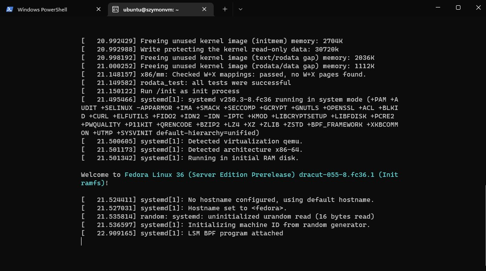


Na swoim komputerze uruchamiam pobrany obraz z : http://szymonmusial.eu.org:8060/MyFedora.iso

Uruchomiłem na maszynie HyperV, poniżej przedstawiam log z uruchomionego serwisu z aplikacją. 
Dwa pierwsze błędy występują przy pierwszym uruchomieniu, gdy nie uruchomiono jeszcze kontenera

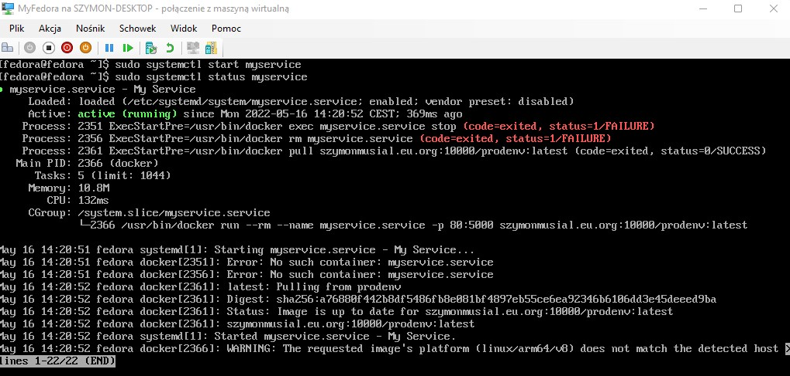