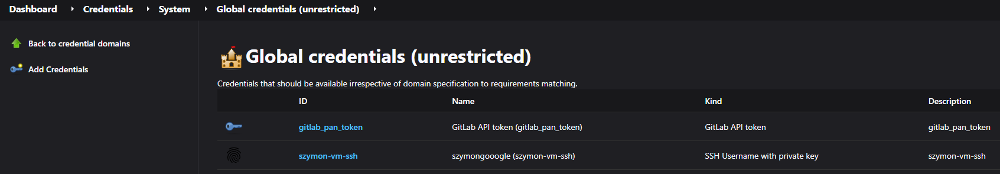
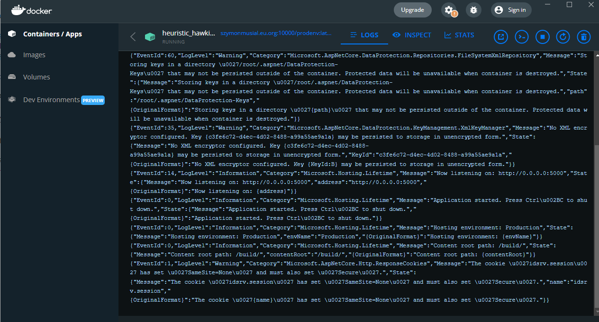
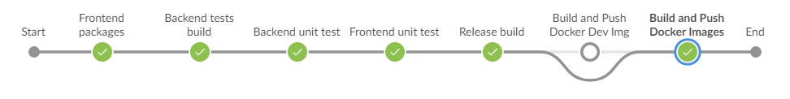
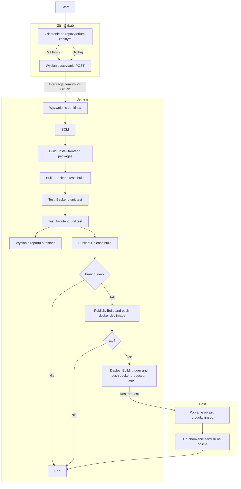
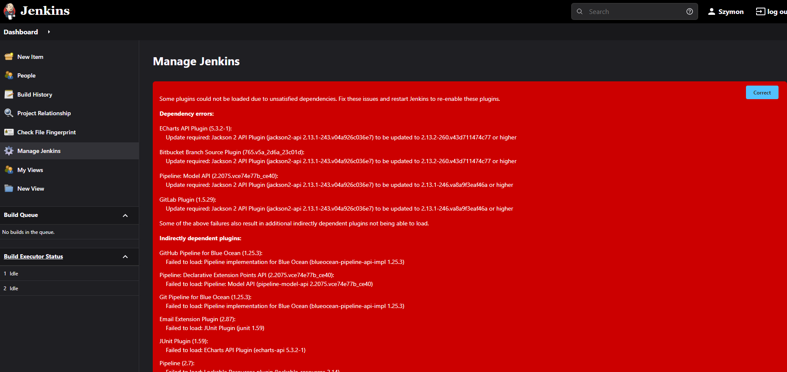
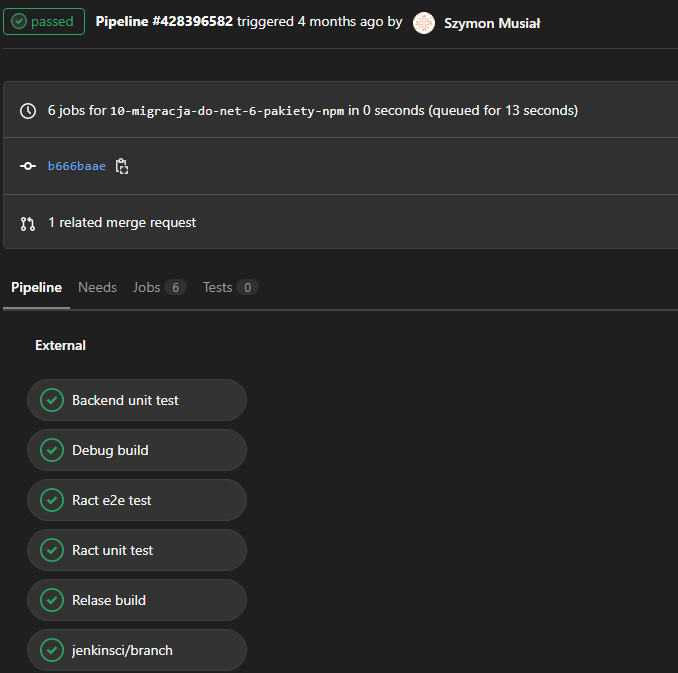

# Konteneryzacja aplikacji .net 6, React

Proces jes przeprowadzany na maszynie wirtualnej Ubuntu 20, na Oracle Cloud

Host posiada zainstalowanego dockera, na którym przeprowadzam operację

Jako serwer automatyzacji CI/CD wybrałem środowisko Jenkins, umożliwia mi ono kompilowanie, wgrywanie projektu

## Instalacja Jenkinsa

Aby uniezależnić się od środowiska instaluję Jenkinsa na kontenerach:
- Dind kontener - wykonawca
- Jenkins kontener - środowisko jenkins

Instalację przeprowadzam na podstawie [oficjalnej dokumentacji producenta](https://www.jenkins.io/doc/book/installing/docker/)

Aczkolwiek zmodyfikowałem ten proces korzystając docker-compose.yml

Budowanie obrazu z dependencjami (wg. dokumentacji)

<details>
<summary>Dockerfile</summary>

```dockerfile
FROM jenkins/jenkins:2.332.2-jdk11
USER root
RUN apt-get update && apt-get install -y lsb-release
RUN curl -fsSLo /usr/share/keyrings/docker-archive-keyring.asc \
  https://download.docker.com/linux/debian/gpg
RUN echo "deb [arch=$(dpkg --print-architecture) \
  signed-by=/usr/share/keyrings/docker-archive-keyring.asc] \
  https://download.docker.com/linux/debian \
  $(lsb_release -cs) stable" > /etc/apt/sources.list.d/docker.list
RUN apt-get update && apt-get install -y docker-ce-cli
USER jenkins
RUN jenkins-plugin-cli --plugins "blueocean:1.25.3 docker-workflow:1.28"
```
</details>
<p>

Instalacja jenkinsa, sprowadza się do uruchomienia docker-compose. Plik docker-compose zawiera instrukcję ze strony.

Kontener jenkins-blueocean buduje obraz. Przy pierwszym uruchomieniu obraz buduje się cały, a kolejnym razem pewne procesy są w podręcznych pamięciach co przyspiesza proces a przy uruchomieniu pakiety są aktualizowane

Te podejście zwalnia z obowiązku tworzenia sieci oraz voluminów.
volumin jest tworzony kiedy potrzeba, tylko jak nie istnieje.
Sieć jest każdorazowo tworzona i usuwana


<details>
<summary>Docker compose</summary>

```docker-compose
version: "3"

networks:
  docker:

volumes:
  jenkins-data:
  jenkins-docker-certs:

services:

  jenkins-docker:
    image: docker:dind
    restart: always
    networks:
      docker:
        aliases: 
          - docker
    privileged: true
    environment:
      - DOCKER_TLS_CERTDIR=/certs
    ports:
      - 2376:2376
    volumes:
      - jenkins-docker-certs:/certs/client
      - jenkins-data:/var/jenkins_home
    container_name: jenkins-docker
    command: --storage-driver=overlay2


  jenkins-blueocean:
    #image: myjenkins-blueocean
    build: .
    restart: always
    networks:
      - docker
    environment:
      - DOCKER_HOST=tcp://docker:2376
      - DOCKER_CERT_PATH=/certs/client
      - DOCKER_TLS_VERIFY=1
    ports:
      - 8070:8080
      - 50000:50000
    volumes:
      - jenkins-data:/var/jenkins_home
      - jenkins-docker-certs:/certs/client:ro
    container_name: jenkins-blueocean
    depends_on:
      - jenkins-docker

```
</details>
<p>

Uruchomienie jenkinsa 
```sh
docker-compose up -d
```

Pierwsze uruchomienie wymaga podania hasła do odblokowania jenkinsa, jest ono wyświetlane kiedy nie odłączymy docker-compose tj nie użyjemy flagi ```-d```

Kolejne uruchomienia zapewne będziemy chcieli robić w trybie nie blokującym konsoli

## Konfiguracja projektu

Jedną z początkowych rzeczy które wykonałem jest instalacja czarnego motywu.

[Pobranie, instrukcja instalacji](https://plugins.jenkins.io/dark-theme/)

### Integracja GitLab

Projekt który używam w ramach E-moto, przechowywany jest na prywatnym repozytorium. Co wiąże się z koniecznością autoryzacji, integracji Jenkinsa z GitLab-em

Do tego wykorzystuję wtyczkę [GitLab](https://plugins.jenkins.io/gitlab-plugin/) do jenkinsa.

Aby miała ona dostęp do prywatnego repozytorium, z perspektywy użytkownika należy wygenerować klucz api.

Aby to dokonać należy z profilu gitlaba przejść do:

```Awatar użytkownika > Edit profile > Access Tokens```

Wpisać dowolną nazwę tokenu np. ```jenkins-token``` zaznaczyć scope 
 ([co to?](https://docs.gitlab.com/ee/user/profile/personal_access_tokens.html#personal-access-token-scopes)): 
 - Api

 Po stworzeniu zależy go zachować, ponieważ jest on widoczny tylko raz.

 W przypadku pojawienia się zmian na repozytorium możemy w jenkinsie stworzyć zadanie, które o określonym interwale będzie pytać repozytorium o zmiany.

 Moje podejście jest inne: serwer gitlab ma możliwość wysyłania RESTowego POSTa dla określonych zdarzeń.

 Ponadto mój serwer jest dostępny z zewnątrz oraz ma odblokowany port

<details>
<summary>Przykładowy POST</summary>

```json
{
  "object_kind": "push",
  "event_name": "push",
  "before": "bc1febe3f518c58f8c43f9e220d5b248c35f32ea",
  "after": "c7bb34ddca421b25ecb86c7c0dfec19601c9deb4",
  "ref": "refs/heads/dev",
  "checkout_sha": "c7bb34ddca421b25ecb86c7c0dfec19601c9deb4",
  "message": null,
  "user_id": 4905764,
  "user_name": "Szymon Musiał",
  "user_username": "szymongooogle",
  "user_email": "",
  "user_avatar": "https://secure.gravatar.com/avatar/102c4cebf649c3d1c6ad7835ec3cc7d6?s=80&d=identicon",
  "project_id": 35073977,
  "project": {
    "id": 35073977,
    "name": "web-app-fork",
    "description": "",
    "web_url": "https://gitlab.com/szymongooogle/web-app-fork",
    "avatar_url": null,
    "git_ssh_url": "git@gitlab.com:szymongooogle/web-app-fork.git",
    "git_http_url": "https://gitlab.com/szymongooogle/web-app-fork.git",
    "namespace": "Szymon Musiał",
    "visibility_level": 0,
    "path_with_namespace": "szymongooogle/web-app-fork",
    "default_branch": "dev",
    "ci_config_path": ".gitlab-ci.yml",
    "homepage": "https://gitlab.com/szymongooogle/web-app-fork",
    "url": "git@gitlab.com:szymongooogle/web-app-fork.git",
    "ssh_url": "git@gitlab.com:szymongooogle/web-app-fork.git",
    "http_url": "https://gitlab.com/szymongooogle/web-app-fork.git"
  },
  "commits": [
    {
      "id": "c7bb34ddca421b25ecb86c7c0dfec19601c9deb4",
      "message": "collapse\n",
      "title": "collapse",
      "timestamp": "2022-04-30T14:20:35+02:00",
      "url": "https://gitlab.com/szymongooogle/web-app-fork/-/commit/c7bb34ddca421b25ecb86c7c0dfec19601c9deb4",
      "author": {
        "name": "Szymon",
        "email": "szymon_0@hotmail.com"
      },
      "added": [

      ],
      "modified": [
        "Readme.md"
      ],
      "removed": [

      ]
    }
  ],
  "total_commits_count": 1,
  "push_options": {
  },
  "repository": {
    "name": "web-app-fork",
    "url": "git@gitlab.com:szymongooogle/web-app-fork.git",
    "description": "",
    "homepage": "https://gitlab.com/szymongooogle/web-app-fork",
    "git_http_url": "https://gitlab.com/szymongooogle/web-app-fork.git",
    "git_ssh_url": "git@gitlab.com:szymongooogle/web-app-fork.git",
    "visibility_level": 0
  }
}
```
</details>

Aby tego dokonać z widoku projektu przechodzimy do:
``` Settings > Integrations``` i wybieramy ```Jenkins```

W nim wybieram:
- Active (aktywuje integracje)
- Trigger (zdarzenia wyzwalające zapytanie POST)
    - Push
    - Merge request 
    - Tag push (do tworzenia obrazów o takiej tagu odpowiadającemu git-owi)
- Jenkins server URL (serwer jenkinsa)
- Project name (u mnie: multi)
- Username, password (login jenkinsa)

I zapisuje ustawienia ```Save changes```

Użyteczną opcją jest ```Test settings``` sprawdzający poprawność ustawień

Ponadto widok ```Recent events``` zawiera ostatnie zapytanie z możliwością powtórzenia - przydatne w przypadku błędów

### Klucze Jenkins

Po odpowiednich ustawieniach Gitlaba należy uwierzytelnić jenkinsa.
W tym celu przechodząc do: ```Menage Jenkins > Menage Credentials```
dodaje klucze:

- ssh
- gitlab personal access token

#### Autoryzacja gitlab

Przechodzę do ``` Manage Jenkins > Configure System ```  przechodzę do sekcji ```Gitlab``` (wcześniej zainstalowany plugin)

Ustawiam:

- Enable authentication for '/project' end-point - wtedy autoryzuję RESTowe zapytania z GitLab-a

- Connection name - dowolna nazwa 
- Gitlab host url - https://gitlab.com/ - ponieważ korzystam z domyślnego serwera GitLab, w przypadku własnego serwera GitLab-a należy podać swój odpowiedni adres
- Credentials...

Credentials: klikamy ```Add > Jenkins``` w oknie ``` Jenkins Credentials Provider: Jenkins``` wybieram w listy ```Kind``` ustawiam: ```Gitlab ApiToken```
i uzupełniam ```ApiToken``` gdzie jest nim ```Personal access token``` wygenerowany w poprzedniej sekcji oraz nadaje mu id - tj nazwę. Klikam Add

Wtedy w Credentials pojawi się opcja wyboru klucza o nazwie zawierającej wcześniej wpisane id

Opcja Test connection sprawdza poprawność ustawień


#### Klucz ssh

Teraz zostaje dodanie klucza SSH do Jenkinsa, cel jest analogiczny do pobierania repozytorium poprzez SSH. Jenkins w pipeline dokonuje operacji na repo właśnie w ten sposób.

Dlatego należy wygenerować parę kluczy ssh, publiczny wprowadzić na dostawcę gita ( u mnie GitLab).

W jenkinsie przechodzimy do: ``` Manage Jenkins > Manage Credentials``` 
W Stores scoped to Jenkins przechodzimy do ```(global)``` (zobaczymy tam Gitlab token) i wybieramy ```Add Credentials``` W oknie wpisujemy:

- Id - nazwa credential-a
- Description - opis
- Username - użytkownik ssh
- Private key - wklejam prywatny klucz w pary wcześniej utworzonej 

Zapisuje ```Save```

Podsumowując mamy w widoku Global credentials klucze: SSH, oraz Gitlab



## Tworzenie projektu Jenkins

Będąc uwierzytelnionym przechodzę do i tworzę ```Multibranch Pipeline``` 
W nim ustawiam:
- Nazwę
- Dodaję branch source, wybieram ```Git```:
    - wpisuję ``` Project Repository``` podając adres ssh
    - Wybieram z listy ```Credentials``` wskazując na ten który przechowuje klucz SSH
    - Dodaję ```Behaviours```:
        - Discover branches
        - Discover tags (do wersjonowania obrazu odzwierciedlającego tag - wersję projektu)
- Build Configuration
    - Mode ustawiam na by JenkinsFile
    - W moim przypadku Script Path znajduje się w: ```Panel.EmotoAgh.CI/Jenkinsfile```

## Docker registy

W przypadku gdy pojawi się błąd na produkcji, lub jeśli zajdzie potrzeba pobrania wersji aplikacji na komputer prywatny najprostszą opcją będzie użycie [docker registy](https://docs.docker.com/registry/)

```sh
❯ docker image pull szymonmusial.eu.org:10000/prodenv
Using default tag: latest
latest: Pulling from prodenv
2203022c5aa9: Pull complete
a8ae7e5cbf56: Pull complete
d077986b7aac: Pull complete
d68a0891b753: Pull complete
4408d7bb216f: Pull complete
3a91026a9684: Pull complete
79b149bab23d: Pull complete
7b0f2bad7944: Pull complete
Digest: sha256:a76880f442b8df5486fb8e081bf4897eb55ce6ea92346b6106dd3e45deeed9ba
Status: Downloaded newer image for szymonmusial.eu.org:10000/prodenv:latest
szymonmusial.eu.org:10000/prodenv:latest
```



Docelowo rejestr będzie dostępny poprzez vpn

Aby uruchomić rejestr, i mieć dostęp zdalny jak w powyższym przypadku potrzebuję kluczy ssl uwierzytelnionego dostawcy. Posiadając domenę, posiadam już klucze ssl uzyskane przez [Lets Encrypt](https://letsencrypt.org/)

Po otwarciu portu 10000 w panelu clouda, konfiguruję repozytorium [z dokumentacji](https://docs.docker.com/registry/deploying/) do pliku docker-compose

<details>
<summary>Docker compose registry</summary>

```docker-compose
registry:
  restart: always
  image: registry:2
  ports:
    - 10000:5000
  volumes:
    - /etc/letsencrypt/archive/szymonmusial.eu.org:/certs
    - /data/docker-registry:/var/lib/registry
  environment:
    REGISTRY_HTTP_TLS_CERTIFICATE: /certs/fullchain1.pem
    REGISTRY_HTTP_TLS_KEY: /certs/privkey1.pem
```
</details>

W docker compose ustawiam kolejno:
- autorestart w przypadku zamknięcia
- obraz na drugą wersję docker registry
- voluminy:
    - zawierający klucze ssl znajdujące się na hoście
    - przestrzeń docker registry przechowującą obrazy
- zmienne środowiskowe wskazujące:
    - certyfikat tls
    - klucz tls

## Obraz deweloperski

Powstawanie obrazu zostało opisane na wcześniejszych zajęciach.

Cele obrazu:
- Wspierający natywną serwerową platformę: amd64
- zawierający .net 6 SDK
- zwierający NodeJs, npm

<details>
<summary>Docker file obrazu</summary>

```docker-compose
registry:
  restart: always
  image: registry:2
  ports:
    - 10000:5000
  volumes:
    - /etc/letsencrypt/archive/szymonmusial.eu.org:/certs
    - /data/docker-registry:/var/lib/registry
  environment:
    REGISTRY_HTTP_TLS_CERTIFICATE: /certs/fullchain1.pem
    REGISTRY_HTTP_TLS_KEY: /certs/privkey1.pem
```
</details>

Budowanie obrazu:
```sh
docker build -t localhost:10000/devenv . -f dokerek
docker push localhost:10000/devenv
```

Tag budowanego obrazu zawiera zdalne repozytorium obrazów, jest to połączenie kroków [wg. dokumentacji](https://docs.docker.com/registry/deploying/#copy-an-image-from-docker-hub-to-your-registry)

Zbudowany obraz, jest wypychany na repozytorium. Niejawnie docker push wypycha na docker hub, dlatego jawnie wskazuje hosta

<details>
<summary>Tworzenie obrazu</summary>

```sh
# docker build -t localhost:10000/devenv . -f dokerek
Sending build context to Docker daemon  2.052GB
Step 1/18 : FROM ubuntu:latest
 ---> e784f03641c9
Step 2/18 : RUN apt-get update
 ---> Using cache
 ---> d50ecb4b0772
Step 3/18 : RUN ln -fs /usr/share/zoneinfo/Europe/Warsaw /etc/localtime
 ---> Using cache
 ---> 01f50b005c2f
Step 4/18 : RUN apt-get install -y tzdata
 ---> Using cache
 ---> 0304406d01b4
Step 5/18 : RUN dpkg-reconfigure --frontend noninteractive tzdata
 ---> Using cache
 ---> 610242ba3e1f
Step 6/18 : RUN apt-get install -y libicu-dev libc6 libgcc1 libgssapi-krb5-2 libssl1.1 libstdc++6 zlib1g curl
 ---> Using cache
 ---> 092f997eae90
Step 7/18 : RUN curl -SL -o dotnet.tar.gz https://dotnetcli.azureedge.net/dotnet/Sdk/6.0.103/dotnet-sdk-6.0.103-linux-arm64.tar.gz
 ---> Using cache
 ---> 92d4b27ceb21
Step 8/18 : RUN mkdir -p /usr/share/dotnet
 ---> Using cache
 ---> 2b60207422ed
Step 9/18 : RUN tar -zxf dotnet.tar.gz -C /usr/share/dotnet
 ---> Using cache
 ---> b39c5f31cefd
Step 10/18 : RUN ln -s /usr/share/dotnet/dotnet /usr/bin/dotnet
 ---> Using cache
 ---> 026cdde739b9
Step 11/18 : RUN rm dotnet.tar.gz
 ---> Using cache
 ---> cc7e4ab1b92a
Step 12/18 : RUN curl -sL https://deb.nodesource.com/setup_16.x -o /tmp/nodesource_setup.sh
 ---> Using cache
 ---> 87a007ee9060
Step 13/18 : RUN bash /tmp/nodesource_setup.sh
 ---> Using cache
 ---> 03212580dfb2
Step 14/18 : RUN apt install nodejs
 ---> Using cache
 ---> 7c6b024efa99
Step 15/18 : RUN rm /tmp/nodesource_setup.sh
 ---> Using cache
 ---> 5e332c5650da
Step 16/18 : RUN dotnet --info
 ---> Using cache
 ---> cd5c86d5da98
Step 17/18 : RUN node -v
 ---> Using cache
 ---> c3eab48a5000
Step 18/18 : RUN npm -v
 ---> Using cache
 ---> 5e9aa2eca90c
Successfully built 5e9aa2eca90c
Successfully tagged localhost:10000/devenv:latest

# docker push localhost:10000/devenv
Using default tag: latest
The push refers to repository [localhost:10000/devenv]
c8c096179a7d: Layer already exists
617a88ca8860: Layer already exists
afdfefaf1067: Layer already exists
7947c75b8acb: Layer already exists
2005ffe8d61a: Layer already exists
54bd9624c9e5: Layer already exists
b6c76eb22261: Layer already exists
089a1b51859a: Layer already exists
db5389691211: Layer already exists
82966921ece8: Layer already exists
b02c4fc4e926: Layer already exists
17dd1516362d: Layer already exists
750d89c7ded8: Layer already exists
b908f8b8bc2a: Layer already exists
738194c54ed0: Layer already exists
c39eb2555d9a: Layer already exists
latest: digest: sha256:b990ae836b92ce7324e6207bac095631579a8d20073434c1c6f35f91f0e79a78 size: 3673

#docker inspect -f "{{ .Size }}" localhost:10000/devenv | numfmt --to=si
1.1G
```
</details>

## Diagramy 

Ogólny opis:

Proces budowania, testowania jest dokonywany na kontenerze bazującym na obrazie z zależnościami (dev), obraz ten jest budowany sporadycznie, raz na kilka miesięcy, podczas aktualizacji npm lub dotnet-a.

Wynikiem pozytywnych procesów budowania jest skompresowana aplikacja przesyłana na obraz zawierający runtime .net 6 z którego powstaje obraz produkcyjny uruchamiający aplikację wysyłany na lokalny rejestr dockera. 



Użytkownik/serwer uruchamiając aplikację musi tylko pobrać obraz oraz uruchomić kontener, wskazując na port do opublikowania

Diagram Piepeline



Diagram przepływu artefaktu

<div class="x-scrollable">
<div style="width: 1800px;">

```mermaid
graph TD


G[[GitLab - Pobranie repozytorium]]

Reg[[Local docker registry]]

subgraph jenkins[Kontener Jenkins, DIND]
G -->|Kod| B[Debug build, Test, Production build]

B -->|Production build, *tar.gz| P[Budowanie obrazu produkcyjnego]
Hub[[Docker Hub]] -->|.net runtime, image| P
end

subgraph Serwer, cloud

P --> |Wysłanie obrazu produkcyjnego, docker image| Reg
Reg --> |Pobranie obrazu deweloperskiego, docker image| B

H[[Hosting aplikacji]]

Reg --> |Pobranie obrazu produkcyjnego| H
G --> |Pobranie konfiguracji serwera| H 
end
```
</div>
</div>

## Opis Pipeline

<details>
<summary>Cały JenkinsFile</summary>

```jenkinsfile
pipeline {
   options 
   {
      gitLabConnection('gitlab-conn')
   }
    agent none
   stages {
        stage('Install frontend packages') {
            agent {
                docker {
                    image 'devenv'
                    args '-v /$(pwd):/source -w /source --user 0'
                }
            }
           steps {
               dir('./Panel.EmotoAgh.Frontend')
               {
                    sh 'npm install'
               }
           }
       }
       
        stage('Backend tests build') {
            agent {
                docker {
                    image 'devenv'
                    args '-v /$(pwd):/source -w /source --user 0'
                }
            }            
           steps {
               dir('./Panel.EmotoAgh.Backend.UnitTest')
               {
                    sh 'dotnet build --configuration Debug'
               }
           }
       }

        stage('Backend unit test') {
            agent {
                docker {
                    image 'devenv'
                    args '-v /$(pwd):/source -w /source --user 0'
                }
            }            
           steps {
               dir('./Panel.EmotoAgh.Backend.UnitTest')
               {
                    sh 'dotnet test --no-build --no-restore'
               }
           }
           
       }
        stage('Frontend unit test') {
            agent {
                docker {
                    image 'devenv'
                    args '-v /$(pwd):/source -w /source --user 0'
                }
            }            
           steps {
               dir('./Panel.EmotoAgh.Frontend')
               {
                    sh 'npm run testtofile'
               }
           }
           post {
                always {
                    junit '**/*junit.xml'
                }
            }
       }

        stage('Release build') {
            agent {
                docker {
                    image 'devenv'
                    args '-v /$(pwd):/source -w /source --user 0'
                }
            }            
           steps {
               dir('./Panel.EmotoAgh.Backend')
               {
                    sh 'dotnet publish --configuration Release --output ./build'
                    sh 'tar -zcvf build.tar.gz build'
               }
           }         
       }

        stage('Build and push docker dev image'){
            agent any
            when { branch "dev" }
            steps{
                script {
                    docker.withRegistry("https://szymonmusial.eu.org:10000/" ) {
                       def customImage = docker.build("prodenv",  "-f ./Panel.EmotoAgh.CI/DockerProd .")
                       customImage.push("dev")
                    }
                }
            }
        }


        stage('Build, trigger and push docker production image'){
            agent any
            when { tag "*" }
            steps{
                script {
                    def tag = sh(returnStdout: true, script: "git describe --tags \044(git rev-list --tags --max-count=1)").trim()
                    echo "Tag: ${tag}"
                    docker.withRegistry("https://szymonmusial.eu.org:10000/" ) {
                       def customImage = docker.build("prodenv",  "-f ./Panel.EmotoAgh.CI/DockerProd .")
                       customImage.push("latest")
                       customImage.push(tag)
                    }
                    sh 'curl "http://10.0.0.230:8765/secret"'
                }
            }
            post {
                failure {
                    updateGitlabCommitStatus name: 'Build, trigger and push docker production image', state: 'failed'
                }
                success {
                    updateGitlabCommitStatus name: 'Build, trigger and push docker production image', state: 'success'
                }
            } 
        }
   }
}
```
</details>

Początek zaczyna się od pobrania ustawienia wykorzystywanego do aktualizacji statusu pipeline dla GitLab-a.
Dokumentacja nie wspomina niestety o poniższym wymogu zaprezentowanym poniżej dla aktualnego typu projektu Jenkinsa

```jenkinsfile
   options 
   {
      gitLabConnection('gitlab-conn')
   }

```

[Aktualizacja przebiega w sposób tutaj opisany](https://docs.gitlab.com/ee/integration/jenkins.html#configure-the-jenkins-project)

Napotkany problem polega na aktualizacji pluginu Jackson2 ostatnimi miesiącami [Wątek](https://github.com/jenkinsci/gitlab-plugin/issues/1206)

Próby ręcznej aktualizacji na sposoby proponowane zakończyły się błędem większości pluginów



Ma irytacja javą spowodowała pominięcie tej funkcjonalności, pozostaje mi jedynie pokazać jak to kiedyś działało




Kolejna linia ```agent none``` definiująca domyślnego agenta. Dokładnie jawnie wymusza wskaznie jego.
Jest to spowodowane zawieszaniem się pipeline w przypadku gdy używałem dwóch różnych agentów

### Agent deweloperski

```jenkinsfile
agent {
  docker {
  image 'devenv'
  args '-v /$(pwd):/source -w /source --user 0'
  }
}
```

Agent ten uruchamia kontener bazując na obrazie deweloperskim, który znajduje się na hoście, ponadto ustawiam argumenty:
- ```-w``` Folder startowy - miejsce root w repozytorium
- ```-v /$(pwd):/source``` Montuje folder - aktualną ścieżkę tj. root w repozytorium
- ```--user 0``` Z powodu błędów uprawnień dostępu narzędzi ustalam użytkownika root aby nie występowały błędy, ponieważ jenkins ustala innego użytkownika

Wygenerowane polecenie jenkinsa (można tu zauważyć ustawienie user: 1000, co potem przedefiniuję ustawiając użytkownika 0 tj root)

```sh
$ docker run -t -d -u 1000:1000 -v /$(pwd):/source -w /source --user 0 -w /var/jenkins_home/workspace/multi_dev_2 -v /var/jenkins_home/workspace/multi_dev_2:/var/jenkins_home/workspace/multi_dev_2:rw,z -v /var/jenkins_home/workspace/multi_dev_2@tmp:/var/jenkins_home/workspace/multi_dev_2@tmp:rw,z -e ******** -e ******** -e ******** -e ******** -e ******** -e ******** -e ******** -e ******** -e ******** -e ******** -e ******** -e ******** -e ******** -e ******** -e ******** -e ******** -e ******** -e ******** -e ******** -e ******** -e ******** -e ******** -e ******** -e ******** -e ******** -e ******** -e ******** -e ******** -e ******** -e ******** -e ******** -e ******** -e ******** -e ******** -e ******** szymonmusial.eu.org:10000/devenv cat
```

Problemy na które się napotkałem to problemy z montowaniem woluminów, przysyłaniem na nie repozytorium, które wynikały z faktu że jenkins znajduje się już w kontenerze.

Dlatego przeszukawszy fora internetowe zdecydowałem się na rezygnację woluminów a montowanie folderów co wyeliminowało problemy i zwolniło z konieczności tworzenia woluminów itp.

### Budowqnie, testy
Poniższe kroki zostały wykonane na identycznym agencie
Ponadto każdorazowo ustawiam przez ```dir(...)``` odpowiednią ścieżkę

- W tym kroku pobieram odpowiednie pakiety wskazane w packages.json

```jenkinsfile
        stage('Install frontend packages') {
           steps {
               dir('./Panel.EmotoAgh.Frontend')
               {
                    sh 'npm install'
               }
           }
```

- Buduję projekt z testami jednostkowymi przywracając pakiety.
W momencie kiedy wystąpi błąd zostanie on zaraportowany w procesie budowania a nie testowania co wproawdzało by w błąd

```jenkinsfile
        stage('Backend tests build') {            
           steps {
               dir('./Panel.EmotoAgh.Backend.UnitTest')
               {
                    sh 'dotnet build --configuration Debug'
               }
           }
       }
```

- W krokach testujących uruchamiam testy bez budowania aplikacji

```jenkinsfile
        stage('Backend unit test') {            
           steps {
               dir('./Panel.EmotoAgh.Backend.UnitTest')
               {
                    sh 'dotnet test --no-build --no-restore'
               }
           }          
       }
```

- Budowanie testów jednostkowych Reacta jest dosyć dziwnym zabiegiem, ponieważ powstanie bundle.js który nie zostanie użyty, ponadto nie będzie on zawierał pełnych nazw zmiennych np. w przypadku wypisywania Stack Trace.

  Dlatego przeprowadzam testy frontu bez budowania wersji produkcyjnej który tworzy plik w standardzie junit zawierający raport testów, co ostatecznie i każdorazowo jest zwracane jako artefakt do Jenkinsa


```jenkinsfile

        stage('Frontend unit test') {           
           steps {
               dir('./Panel.EmotoAgh.Frontend')
               {
                    sh 'npm run testtofile'
               }
           }
           post {
                always {
                    junit '**/*junit.xml'
                }
            }
       }

````
  Fragment packages.json

  Na uwagę zasługuje tutaj skrypt testtofile który generuje wyniki w formacie junit, oraz dodatkowo raporty pokrycie kodu testami

```json
	"scripts": {
		"start": "rimraf ./build && react-scripts start",
		"build": "cross-env GENERATE_SOURCEMAP=false react-scripts build",
		"test": "cross-env CI=true react-scripts test --env=jsdom",
		"testtofile": "cross-env CI=true react-scripts test --env=jsdom --testResultsProcessor=jest-junit --collectCoverage --coverageDirectory='./' --coverageReporters='cobertura'",
		"eject": "react-scripts eject",
		"lint": "eslint ./src/",
		"pretty": "prettier --write \"./**/*.{ts,tsx,json}\""
	},

```

- Ostatnim krokiem na obrazie deweloperskim jest budowanie wersji produkcyjnej. Wykorzystuje ona .net 6 SDK oraz NodeJs, co jest zbędne na obrazie produkcyjnym.

  Wynik kompilacji jest kompresowany do łatwego przesłania.
Kompilacja nie jest self-contained ze względu na wymóg doprecyzowania platformy czego jednak chciałem uniknąć.

  Przyszłościowo chce mieć dwa obrazy produkcyjne na platformę:
  - serwera: arm64
  - deweloperów: amd64

  Wtedy wystarczy w dockerfile wskazać inną platformę alpine z .net 6 runtime, i wykorzystać ten sam build.

  Co do rozmiarów to są one podobne, wersja self-contained (musl) zawiera runtime i wymaga np. kontenera alpine.

  Aktualna wersja zawiera sam build, a wymaga kontenera z .net 6 runtime, rozwiązanie te jest bardziej skalowalne

```jenkinsfile

        stage('Release build') {          
           steps {
               dir('./Panel.EmotoAgh.Backend')
               {
                    sh 'dotnet publish --configuration Release --output ./build'
                    sh 'tar -zcvf build.tar.gz build'
               }
           }         
       }
```

### Budowanie obrazów

W tym przypadku używam juz różnych agentów. agnet ```any``` oznacza skorzystanie z agenta nie korzystającego z obrazów.

W tym też miejscu pojawił się problem czekania w nieskończoność

Ten krok jest wykonywany tylko jeśli push był wykonany na branchy dev.
Buduje on obraz zawarty w DockerFile produkcyjnym, wysyłając obraz na docker registry.

Obraz otagowany jako dev oznacza wersję kodu znajdującej się na najnowszej branchy deweloperskiej

```jenkinsfile
        stage('Build and push docker dev image'){
            agent any
            when { branch "dev" }
            steps{
                script {
                    docker.withRegistry("https://szymonmusial.eu.org:10000/" ) {
                       def customImage = docker.build("prodenv",  "-f ./Panel.EmotoAgh.CI/DockerProd .")
                       customImage.push("dev")
                    }
                }
            }
        }


```

Sytuacja jest analogiczna jak dla powyższej.

W tym przypadku na etapie konfiguracji zostało włączone uwzględnianie tagów ponieważ jeśli zadecydowano że aktualna wersja na gałęzi deweloperskiej jest odpowienim kondydatem na delploy wystarczy stworzyć tag na reporyztorim.

Ten stage jest wykonywany właśnie gdy zdarzeniem jest nowy tag. Na początku dokonuje on sprawdzenia nazwy taga.

```git rev-list``` pobiera hasha commita ```--max-count=1``` ustala jeden hash tj. ostatni

```git describe --tag``` Określa tag wymagając hasha


```sh
git describe --tags $(git rev-list --tags --max-count=1)   
3.0.0
```

Tutaj pojawia się problem z symbolem ```$``` który to jest interpretowany przez Groovy jako intepolacja stringa. Z tego powodu używam ```\044```


Następnie analogicznie jak wcześniej buduję obraz produkcyjny i tworzę dwa tagi:
- odzwierciedlający tag git-a - w ten sposób wersjonuję buildy produkcyjne
- latest - jest to niejawny domyślny tag, w ten sposób domyślnie jest pobierana najnowsza stabilna wersja produkcyjna

Ostatni krok to powiadomienie hosta o aktualizacji obrazu

Jest to rozwiązanie problemu hostowania jenkinsa w kontenerze. Uruchomiony w ten sposób kontener byłby dostępny w konenerze Dind/Jenkins, a nie hoście. Możnabyło by udostępnić port ale to zaprzecza idei koneneryzacji jenkinsa, uzalezniłbym wtedy środowisko serwera od jenkinsa

Dlatego zdecydowałem się stworzyć prosty serwer w sieci lokalnej, (clouda) zamkniętej z której to w kontenerach będzie wysyłane żądanie REST, a host obierając je pobiera obraz i restartuje serwis z zaaktualizowanym obrazem

```jenkinsfile

stage('Build, trigger and push docker production image'){
            agent any
            when { tag "*" }
            steps{
                script {
                    def tag = sh(returnStdout: true, script: "git describe --tags \044(git rev-list --tags --max-count=1)").trim()
                    echo "Tag: ${tag}"
                    docker.withRegistry("https://szymonmusial.eu.org:10000/" ) {
                       def customImage = docker.build("prodenv",  "-f ./Panel.EmotoAgh.CI/DockerProd .")
                       customImage.push("latest")
                       customImage.push(tag)
                    }
                    sh 'curl "http://10.0.0.230:8765/secret"'
                }
            }
        }

```

#### DockerFile Obrazu produkcyjnego

Pierwsza część jest oficjalnym obrazem Microsoftu, modyfikacja polega na skopiowaniu paczki z aplikacją, rozpakowaniu jej, usunięciu archiwum oraz uruchomieniu aplikacji udostępniając port z której korzysta

```dockerfile

ARG REPO=mcr.microsoft.com/dotnet/runtime

# Installer image
FROM arm64v8/buildpack-deps:bullseye-curl AS installer

# Retrieve ASP.NET Core
RUN aspnetcore_version=6.0.3 \
    && curl -fSL --output aspnetcore.tar.gz https://dotnetcli.azureedge.net/dotnet/aspnetcore/Runtime/$aspnetcore_version/aspnetcore-runtime-$aspnetcore_version-linux-arm64.tar.gz \
    && aspnetcore_sha512='745586b64d3e01f856c366821f6fb8ca97c55b2a90ba36d528fdf99c98938574805153e7d4fff0560afe8382bea14b35ddeba391a2dc2328285f02e125c9b702' \
    && echo "$aspnetcore_sha512  aspnetcore.tar.gz" | sha512sum -c - \
    && tar -oxzf aspnetcore.tar.gz ./shared/Microsoft.AspNetCore.App \
    && rm aspnetcore.tar.gz


# ASP.NET Core image
FROM $REPO:6.0.3-bullseye-slim-arm64v8

ENV \
    # ASP.NET Core version
    ASPNET_VERSION=6.0.3 \
    # Set the default console formatter to JSON
    Logging__Console__FormatterName=Json

COPY --from=installer ["/shared/Microsoft.AspNetCore.App", "/usr/share/dotnet/shared/Microsoft.AspNetCore.App"]

COPY Panel.EmotoAgh.Backend/build.tar.gz /build.tar.gz
RUN tar -xvzf /build.tar.gz
RUN rm /build.tar.gz

WORKDIR /build
ENTRYPOINT ["dotnet", "Panel.EmotoAgh.Backend.dll", "JWTAuthority=''", "PostgreSqlConnectionString='localhost'", "--urls=http://0.0.0.0:5000/"]
EXPOSE 5000

```

Rozmiar obrazu produkcyjnego
```sh
ubuntu@szymonvm:~$ sudo docker inspect -f "{{ .Size }}" szymonmusial.eu.org:10000/prodenv | numfmt --to=si
237M
```


## Serwisy

Serwis będącym serwerm node.js ma ustawiną nazwę, czas restartu gdy przestanie pracować, ścieżkę uruchomienia i wyzwalacz który ma uruchomić serwis - tj. start start systemu
```
[Unit]
Description=Watch Service

[Service]
TimeoutStartSec=0
Restart=always

ExecStart=/usr/bin/node /home/ubuntu/server.js secret

[Install]
WantedBy=default.target

```

### Kod serwera

```js
const http = require('http');
const arg = process.argv[2];
const { exec } = require('child_process');

const pullChanges = () =>
    exec('docker pull szymonmusial.eu.org:10000/prodenv:latest && systemctl restart myservice', (err, stdout, stderr) => {
        if (err) {
        // node couldn't execute the command
        return;
        }

        // the *entire* stdout and stderr (buffered)
        console.log(`stdout: ${stdout}`);
        console.log(`stderr: ${stderr}`);
    });

const requestListener = function (req, res) {
    if(req.url != `/${arg}`)
    {
        res.writeHead(404);
        res.end()
    }
    else
    {
        pullChanges();
        res.writeHead(200);
        res.end('Ok');
    }
}

const server = http.createServer(requestListener);
server.listen(8765, "0.0.0.0", () => {
    console.log(`Server is running. Secret is ${arg}`);
});

```

Serwer ten nasłuchuje na porcie 8765 oraz akceptuje endpointa przekazanego jako argument wiersza poleceń, użyłem prostego klucza aczkolwiek docelowo jest używane trudne do złamania, zmienne hasło

W momencie poprawnego zapytania endpoina uruchamiane jest pobieranie ostatniego obrazu będącym ostatnim produkcyjnym oraz restart serwisu hostującego aplikację


### Serwis aplikacji


Serwis ten wymaga uruchomionego dockera, ustawia analogiczne argumenty jak wcześniej.

Przed uruchomieniem zatrzymuje pracę kontenera, usuwa go, i uruchamia nowy korzystając z obrazu

%n zawiera pełną nazwę pliku definiującego serwis 

```
[Unit]
Description=YouTrack Service
After=docker.service
Requires=docker.service

[Service]
TimeoutStartSec=0
Restart=always
ExecStartPre=-/usr/bin/docker exec %n stop
ExecStartPre=-/usr/bin/docker rm %n
ExecStart=/usr/bin/docker run --rm --name %n \
    -p 80:5000 \
    szymonmusial.eu.org:10000/prodenv:latest

[Install]
WantedBy=default.target
```

## Obrazy lokalne docker registry

Obrazy zanjdujące się na repozytorium. Wynik REST apli docker registry v2

```json
// 20220501153803
// https://szymonmusial.eu.org:10000/v2/_catalog

{
  "repositories": [
    "devenv",
    "prodenv"
  ]
}
```

```json
// 20220501153910
// https://szymonmusial.eu.org:10000/v2/prodenv/tags/list

{
  "name": "prodenv",
  "tags": [
    "0.0.1",
    "3.0.0",
    "latest",
    "dev"
  ]
}
```

# Myśli przyszłościowe

- Przynajmniej rozwiązanie problemu z aktualizacją statusu stage pipeline. Umożliwi to integrację z Gitlabem i możliwość akceptacji Merge Requesta tylko wtedy kiedy pipeline pomyślnie przejdzie
- Ze względu na różne subdomeny stworzyłbym kontener z Apache2 hostującym subdomeny z certyfikatem. Umoziwi to przetestowanie na localhoście
- Stworzenie stage-a na kontenerze postgress np. co 2 tygodnie tworzącego snapshot-a bazy do celów testowych
- Implementacja konteneryzacji na aktualnym działającym projecie na Gitlab actions, umożliwia mi to zbieranie informacji w 1 miejscu o:
  - statusie pipeline
  - wynikach testów
  - informacji pokrycia kodu testami
  - informacji czy Merge request przechodzi poprawnie test