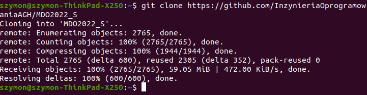
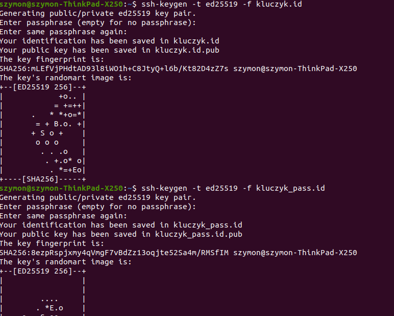
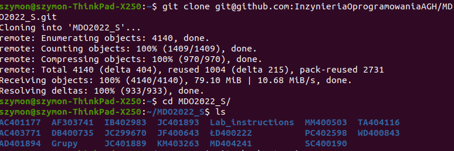
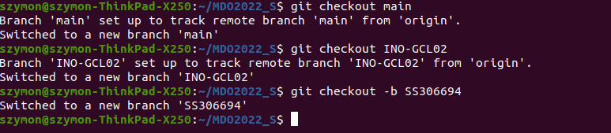
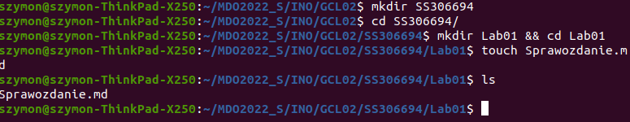
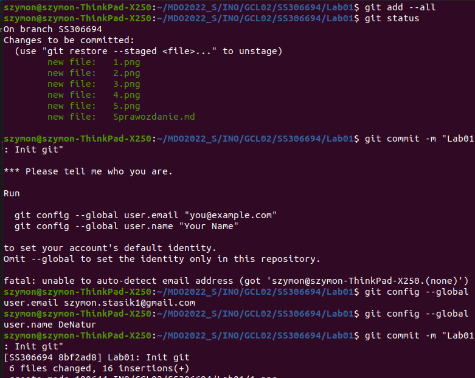
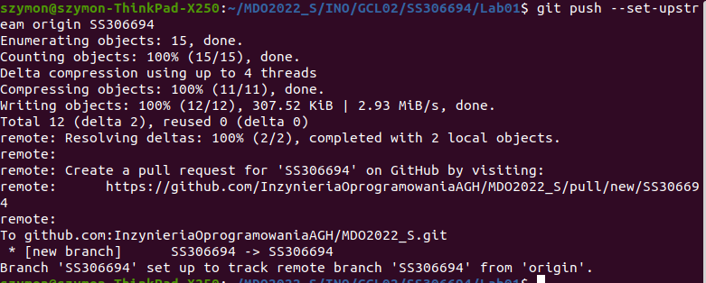
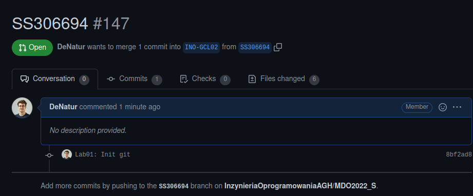

# Zajęcia 01
### 2022-03-07
---

## Wprowadzenie Git, Gałęzie, SSh

* Zainstalowano gita, obsługę kluczy SSH
* Sklonowano za pomocą HTTPS reposytorium 

* Utworzono dwa klucze SSH (jeden zabezpieczony hasłem), dodano jeden klucz jako do GitHuba i sklonowano repozytorium za pomocą SSH

* Utworzono brancha o podanej strukturze nazwy

* Pracowano na utworzonej nowej gałęzi

* Dodano commit i wysłano zmiany do zdalnego źródła
 

* Utworzono PR

