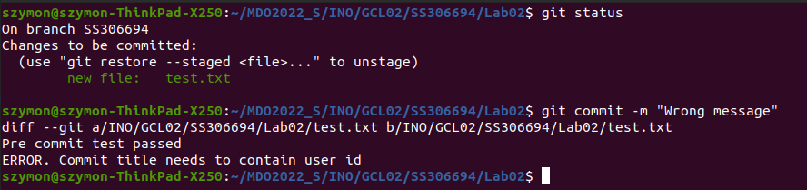
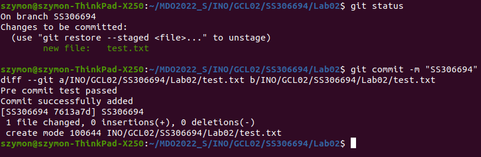
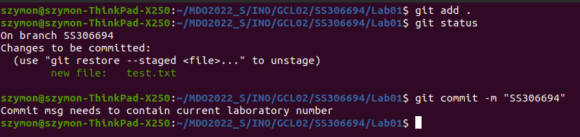
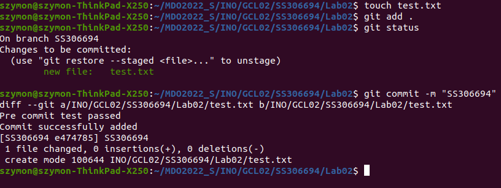
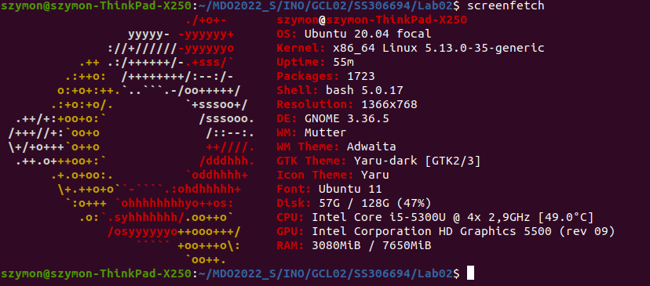
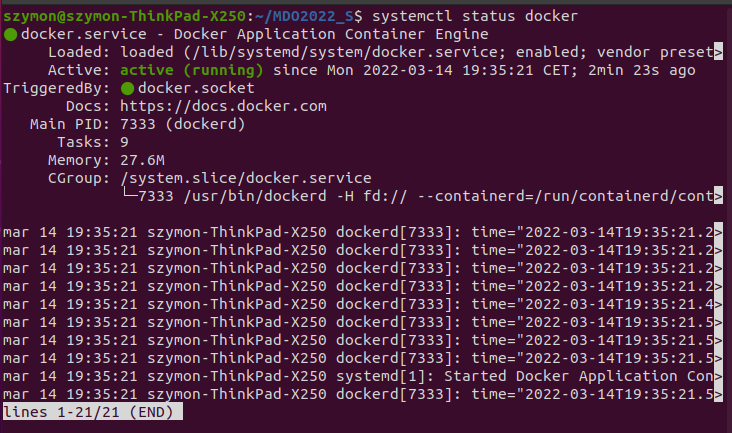
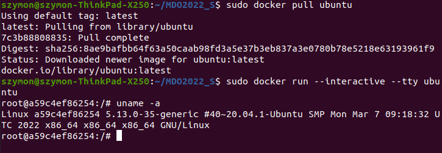
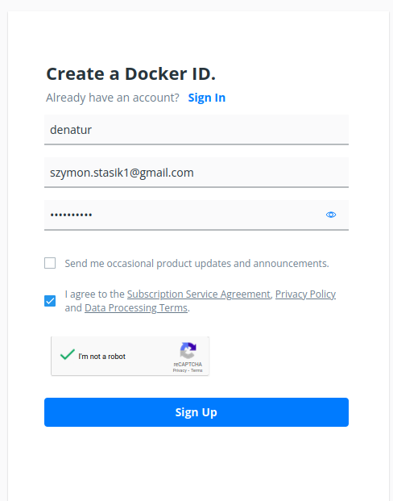
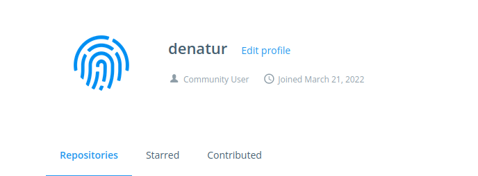

# Zajęcia 01
### 2022-03-14
---

## Hooks, heterogeniczne środowisko pracy 

* Przygotowano dwa git hooki
1. Hook sprawdzajacy, czy tytul commita nazywa sie ```<inicjaly><numer indeksu>```

    Kod Hooka:
    ```bash
    #/!bin/sh

    USER_ID="SS306694" #<inicjaly><numer indeksu>`
    #test - porównuje wartości
    #cat ${1} odczytuje wartość przekazanego parametru

    if test "$(cat ${1})" = $USER_ID 
    then
        echo "Commit successfully added"
    else
        echo "ERROR. Commit title needs to contain user id"
        exit 1
    fi
    ```
    Test sprawdzający nieprawidłowy tytuł

    

    Test sprawdzający prawidłowy tytuł
    
    

2. Hook sprawdzajacy, czy w treści commitu 

    Kod Hooka:
    ```bash
    #!/bin/sh

    #git diff --cached - strawdza zmiany do zacommitowania

    if git diff --cached | grep "Lab02"
    then
        echo "Pre commit test passed"
    else
        echo "Commit msg needs to contain current laboratory number"
        exit 1
    fi
    ```
    Test sprawdzający nieprawidłową zawartość commitu

    

    Test sprawdzający prawidłową zawartość commitu
    
    

* Używany jest natywny linux na laptopie

    

* Zainstalowano i sprawdzono czy działa docker

    

* Pobrano obraz dystrybucji linuksowej (ubuntu) i uruchomiono go

    

* Założono konto na Docker Hub

    
    
