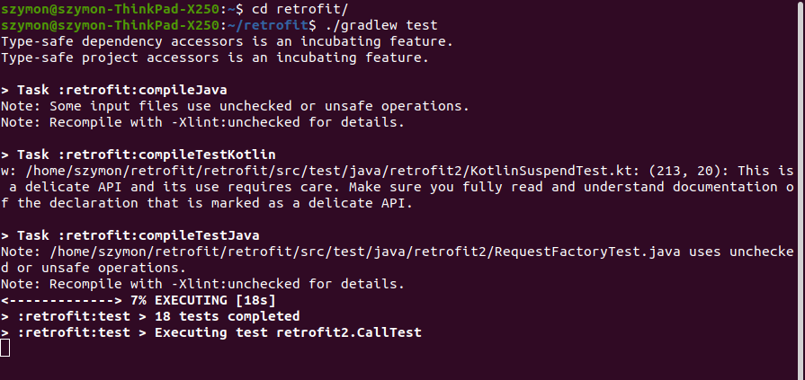
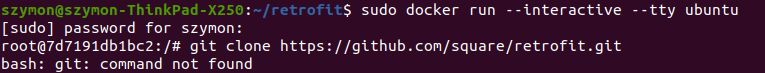
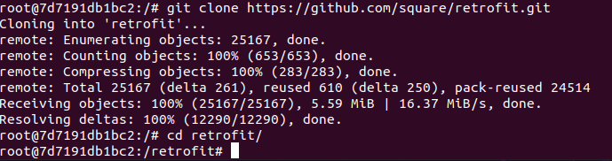
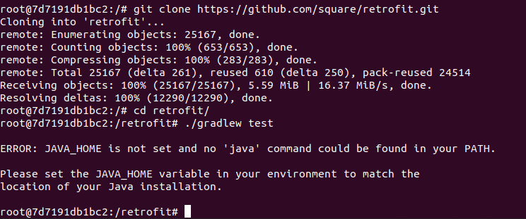
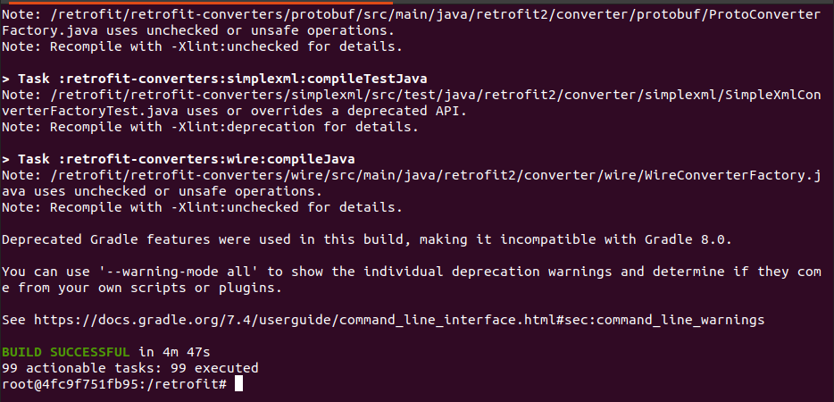
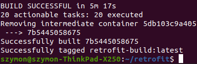
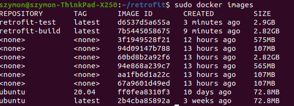
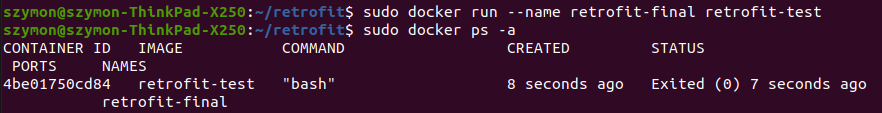

# Zajęcia 03
### 2022-03-21
---

## Docker files, kontener jak definicja etapu

Podczas tych zajęć należało przygotować kontener do tworzenia builda oraz wykonania testów wybranego oprogramowania z otwartą licencją.

### Wybór oprogramowania

Wybrałem bibliotekę ```Retrofit```, która jest znanym klientem HTTP dla natywnego Androida. Biblioteka jest pod licencją ```Apache License, Version 2.0```.

* Sklonowałem wybrane repozytorium.
```bash
$ git clone https://github.com/square/retrofit.git 
```

* Doinstalowałem wymagane zależności, javę i android-sdk.
```bash
$ sudo apt-get update
$ sudo apt-get install openjdk-11-jre-headless android-sdk
```
* Ustawiłem zmienną środowiskową ```ANDROID_SDK_ROOT``` i uruchomiłem testy jednostkowe.
```bash
$ export ANDROID_SDK_ROOT=~/Android/Sdk
$ cd retrofit
$ ./gradlew test
```


### Przeprowadzenie buildu w kontenerze

Wybrałem "wystarczający" kontener - ```ubuntu``` do którego należało doinstalować gita, javę, android sdk oraz należało ustawić zmienną środowiskową ```ANDROID_SDK_ROOT```.




Po drodze pojawiło się kilka problemów. Android-sdk najlepiej pobrać do konkretnego folderu za pomocą ```wget```, żeby w łatwy sposób ustawić zmienną środowiskową oraz pobrać konkretną wersję android-sdk. Przed uruchomieniem builda należy również zaakceptować licencje do używania android command line tools.

Wystąpił problem również przy pobieraniu javy, trzeba było wcześniej ustawić odpowiedni timezone.

Ostatecznie poprawny listing komend wyglądał tak:

```bash
$ ln -fs /usr/share/zoneinfo/Europe/Warsaw /etc/localtime
$ apt-get update
$ apt-get install -y git wget unzip openjdk-11-jre-headless
$ export ANDROID_SDK_ROOT=/opt/android-sdk
$ mkdir -p /opt/android-sdk/cmdline-tools
$ wget -q https://dl.google.com/android/repository/commandlinetools-linux-7302050_latest.zip
$ unzip *tools*linux*.zip -d /opt/android-sdk/cmdline-tools
$ mv /opt/android-sdk/cmdline-tools/cmdline-tools /opt/android-sdk/cmdline-tools/tools
$ rm *tools*linux*.zip
$ yes | ${ANDROID_SDK_ROOT}/cmdline-tools/tools/bin/sdkmanager --licenses
$ git clone https://github.com/square/retrofit.git
$ cd retrofit
$ ./gradlew assembleDebug
```


Na podstawie tego utworzyłem Dockerfile przetprowadzający build

```Dockerfile
FROM ubuntu:20.04

# Needed to set for automatic installations, here `apt-get` wanted input for timezone
RUN ln -fs /usr/share/zoneinfo/Europe/Warsaw /etc/localtime

RUN apt-get update
RUN apt-get install -y git wget unzip openjdk-11-jre-headless

# Download and install Android SDK
# https://developer.android.com/studio#command-tools
ARG ANDROID_SDK_VERSION=7302050
ENV ANDROID_SDK_ROOT /opt/android-sdk
RUN mkdir -p ${ANDROID_SDK_ROOT}/cmdline-tools && \
    wget -q https://dl.google.com/android/repository/commandlinetools-linux-${ANDROID_SDK_VERSION}_latest.zip && \
    unzip *tools*linux*.zip -d ${ANDROID_SDK_ROOT}/cmdline-tools && \
    mv ${ANDROID_SDK_ROOT}/cmdline-tools/cmdline-tools ${ANDROID_SDK_ROOT}/cmdline-tools/tools && \
    rm *tools*linux*.zip

# Android command line tools licenses need to be accepted before running
RUN yes | ${ANDROID_SDK_ROOT}/cmdline-tools/tools/bin/sdkmanager --licenses

RUN git clone https://github.com/square/retrofit.git
WORKDIR retrofit

RUN ./gradlew assembleDebug
```

Uruchomiłem build:
```bash
$ sudo docker build . -t retrofit-build
```


Następnie utworzyłem Dockerfile do uruchamiania testów

```Dockerfile
FROM retrofit-build

RUN ./gradlew test
```

Uruchomiłem build 

```bash
$ sudo docker build . -f test.Dockerfile -t retrofit-test
```


Sprawdziłem powstałe obrazy:
```bash
$ sudo docker images
```


Finalny obraz wynosi ~2.9GB. Przez wymagane dependencje obraz dość mocno się powiększył.

Uruchomiłem kontener i sprawdziłem kod wyjściowy
```bash
$ sudo docker run --name retrofit-final retrofit-test
$ sudo docker ps -a
```


Kontener zakończył pracę z kodem "0" co oznacza, że zakończył się poprawnie.

### Dyskusje

Taki kontener nadaje się do wdrążenia jako kontener wykonujący testy jednostkowe i jest częścią pipelinu.

Zbudowany program można publikować na dwa sposoby. Jako pakiet .JAR - przez co mógłby być biblioteką javy i dołączany do projektu Androidowego/Javy lub jako .AAR już jak biblioteka przygotowana bezpośrednio do Androida i dodawana jako moduł do projektu.

Przy publikacji jednak należałoby jednak stworzyć trzeci kontener tworzący pakiet i publikujący do opowiedniego repozytorium.


