# Zajęcia 04
### 2022-04-01

## Zachowanie stanu

* Przygotowałem wolumin wejściowy i wyjściowy: ```volumein```, ```volumeout```

    ```bash
    $ docker volume create volumein
    $ docker volume create volumeout
    ```
    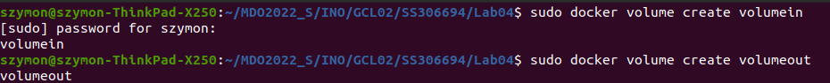

* Sprawdziłem informację, które zostaną użyte w dalszej części zadania: ścieżki voluminów
    ```bash
    $ docker inspect volumein
    $ docker inspect volumeout
    ```
    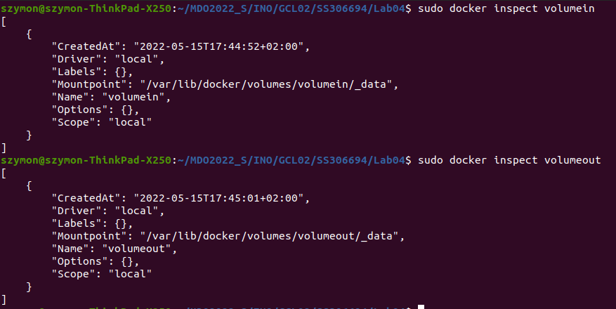
    Ścieżka zamontowania prowadząca do ```volumein``` = ```"/var/lib/docker/volumes/volumein/_data"```

    ```volumeout``` = ```"/var/lib/docker/volumes/volumeout/_data"```
    
* Z racji mnogości wymaganych dependencji stworzyłem nowy obraz z niezbędnymi wymaganiami wstępnymi, ale bez gita

    ```Dockerfile
    FROM ubuntu:20.04

    # Needed to set for automatic installations, here `apt-get` wanted input for timezone
    RUN ln -fs /usr/share/zoneinfo/Europe/Warsaw /etc/localtime

    RUN apt-get update
    RUN apt-get install -y wget unzip openjdk-11-jre-headless

    # Download and install Android SDK
    # https://developer.android.com/studio#command-tools
    ARG ANDROID_SDK_VERSION=7302050
    ENV ANDROID_SDK_ROOT /opt/android-sdk
    RUN mkdir -p ${ANDROID_SDK_ROOT}/cmdline-tools && \
        wget -q https://dl.google.com/android/repository/commandlinetools-linux-${ANDROID_SDK_VERSION}_latest.zip && \
        unzip *tools*linux*.zip -d ${ANDROID_SDK_ROOT}/cmdline-tools && \
        mv ${ANDROID_SDK_ROOT}/cmdline-tools/cmdline-tools ${ANDROID_SDK_ROOT}/cmdline-tools/tools && \
        rm *tools*linux*.zip

    # Android command line tools licenses need to be accepted before running
    RUN yes | ${ANDROID_SDK_ROOT}/cmdline-tools/tools/bin/sdkmanager --licenses
    ```

* Następnie sklonowałem repozytorium na volumin wejściowy

    Aby przejść do miejsca zamontowania przeszedłem na superusera
    ```bash
    $ sudo su
    ```
    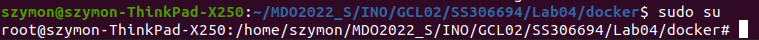
    Następnie przeszedłem do danego katalogu
    ```bash
    $ cd /var/lib/docker/volumes/volumein/_data
    ```
    I sklonowałem repozytorium ```retrofit```
    ```bash
    $ git clone https://github.com/square/retrofit.git
    ```
    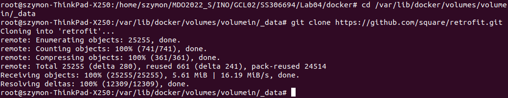
* Uruchomiłem kontener z zamonowanymi voluminami
    ```bash
    $ sudo docker run -it --name androidVolume --mount source=volumein,target=/volin --mount source=volumeout,target=/volout android-without-git
    ```
    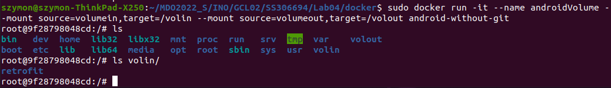
* Sprawdziłem czy voluminy są poprawnie zamontowane
    ```bash
    $ ls
    $ ls volin/
    ```
    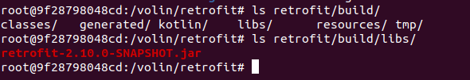
* Uruchomiłem build
    ```bash
    $ cd volin/retrofit
    $ ./gradlew jar
    ```
    
* Sprawdziłem wytworzony plik jar i skopiowałem na volumin wyjściowy
    ```bash
    $ ls retrofit/build/libs/
    $ cp retrofit/build/libs/retrofit-2.10.0-SNAPSHOT.jar ../../volout
    ```
    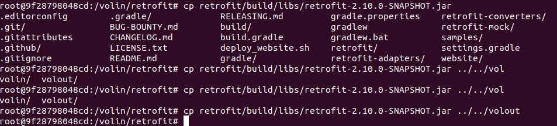
* Sprawdziłem czy po wyjściu z kontenera pliki się zachowały
    ```bash
    $ sudo su
    $ cd /var/lib/docker/volumes/volumeout/_data
    $ ls
    ```
    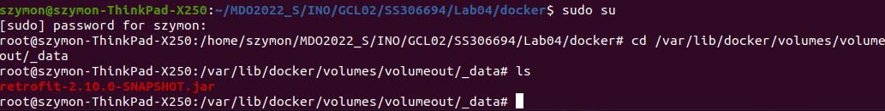
## Eksponowanie portu

* Pobrałem obraz dockerowy ```iperf3```
    ```bash
    $ docker pull networkstatic/iperf3
    ```
    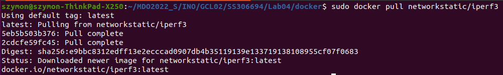
* Uruchomiłem kontener wraz z eksponowaniem portu 8008
    ```bash
    $ sudo docker run --name server-iperf3 -it networkstatic/iperf3 -p 8008:8008 -s
    ```
    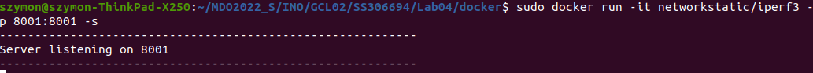
* Zainstalowałem ```iperf3``` na hoscie
    ```bash
    $ sudo apt-get install iperf3
    ```
    
* Sprawdziłem ip adres serwera.
    ```bash
    $ docker container list
    $ docker inspect 3a587db03f6f
    ```
    
    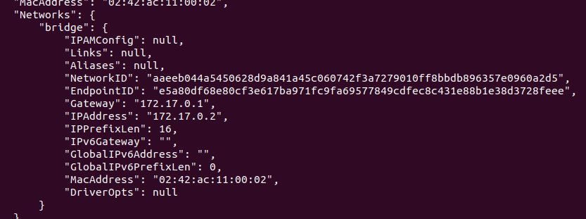
* Uruchomiłem kontener klienta
    ```bash
     sudo docker run  --rm --name client--iperf3 -it networkstatic/iperf3 -c 172.17.0.2 -p 8008:8008
    ```
    Log z klienta
    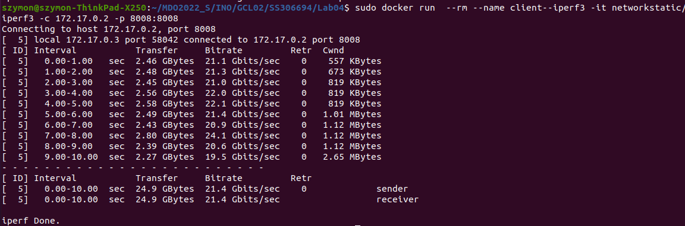

    Log z serwera
    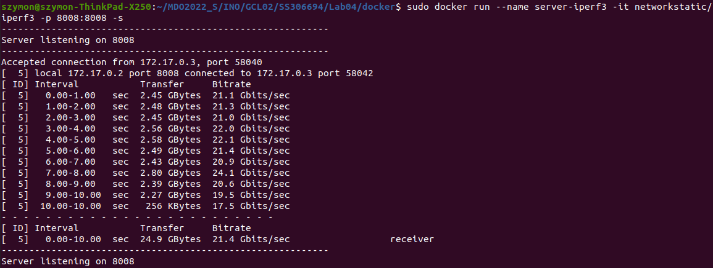
* Połączenie host do kontenera
    ```bash
    iperf3 -c 172.17.0.2 -p 8008
    ```

    Log z hosta
    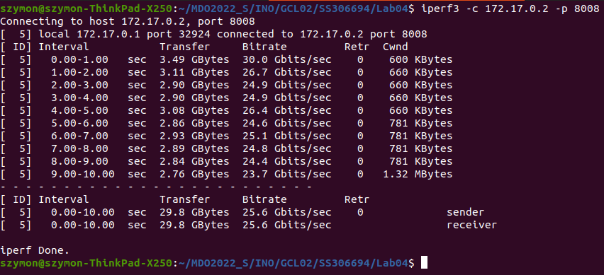

    Log z serwera
    

Przepustowość połączenia kontenera z hostem jest większa niż połączenie kontenera z innym kontenerem.

## Instalacja Jenkins
    
* Zapoznałem się z dokumentacją  https://www.jenkins.io/doc/book/installing/docker/

* Stworzyłem ```bridge network``` w dockerze

    ```bash
    $ docker network create jenkins
    ```
    

* Uruchomiłem obraz ```docker:dind```

    ```bash
    $ docker run \
        --name jenkins-docker \
        --rm \
        --detach \
        --privileged \
        --network jenkins \
        --network-alias docker \
        --env DOCKER_TLS_CERTDIR=/certs \
        --volume jenkins-docker-certs:/certs/client \
        --volume jenkins-data:/var/jenkins_home \
        --publish 2376:2376 \
        docker:dind \
        --storage-driver overlay2
    ```
    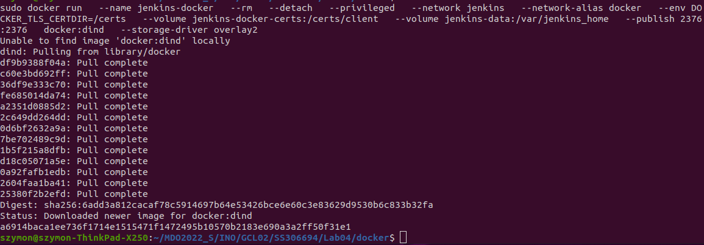
* Zrobiłem customowy obraz Jenkins

    ```Dockerfile
    FROM jenkins/jenkins:2.332.3-jdk11
    USER root
    RUN apt-get update && apt-get install -y lsb-release
    RUN curl -fsSLo /usr/share/keyrings/docker-archive-keyring.asc \
    https://download.docker.com/linux/debian/gpg
    RUN echo "deb [arch=$(dpkg --print-architecture) \
    signed-by=/usr/share/keyrings/docker-archive-keyring.asc] \
    https://download.docker.com/linux/debian \
    $(lsb_release -cs) stable" > /etc/apt/sources.list.d/docker.list
    RUN apt-get update && apt-get install -y docker-ce-cli
    USER jenkins
    RUN jenkins-plugin-cli --plugins "blueocean:1.25.3 docker-workflow:1.28"
    ```

* Stworzyłem nowy docker image 

    ```bash
    $ sudo docker build -f jenkins.Dockerfile -t myjenkins-blueocean:2.332.3-1 .
    ```
    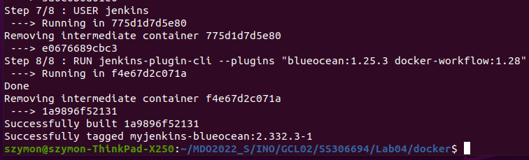
* Uruchomiłem customowy obraz

    ```bash
    $ docker run \
        --name jenkins-blueocean \
        --restart=on-failure \
        --detach \
        --network jenkins \
        --env DOCKER_HOST=tcp://docker:2376 \
        --env DOCKER_CERT_PATH=/certs/client \
        --env DOCKER_TLS_VERIFY=1 \
        --publish 8080:8080 \
        --publish 50000:50000 \
        --volume jenkins-data:/var/jenkins_home \
        --volume jenkins-docker-certs:/certs/client:ro \
        myjenkins-blueocean:2.332.3-1 
    ```
    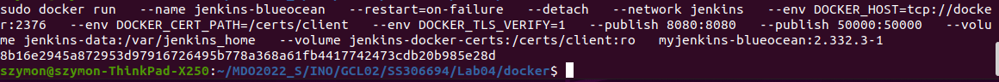
    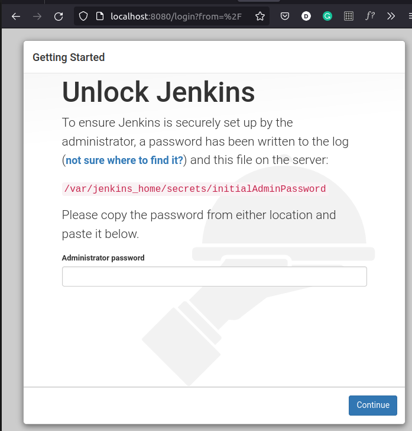
* Wyszukałem hasło i zainstalowałem rekomendowane wtyczki
    
* Stworzyłem pierwszego user admina
    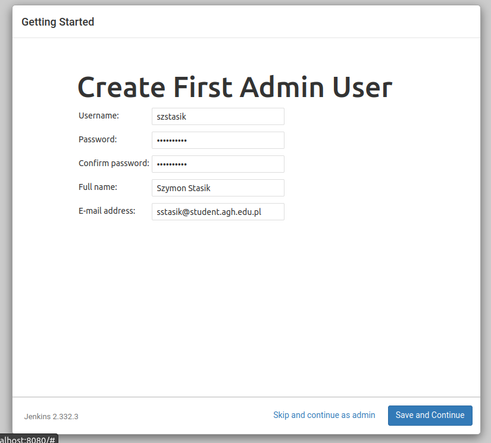
* Zakończyłem instalację
    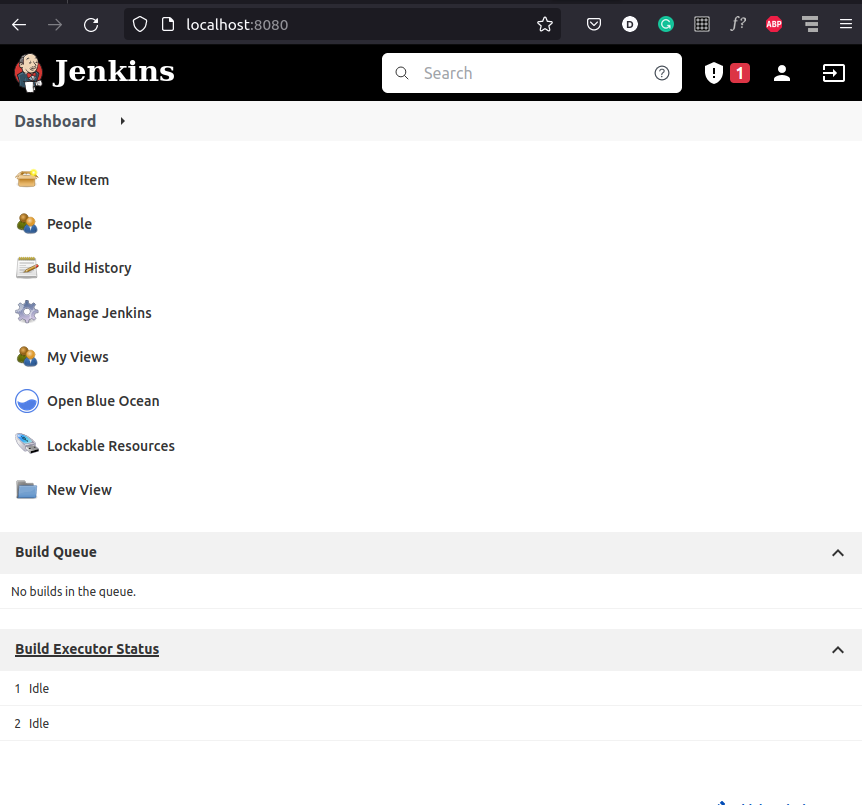