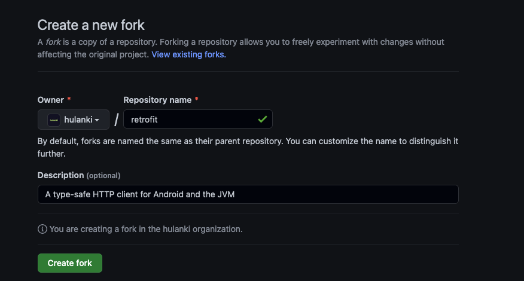
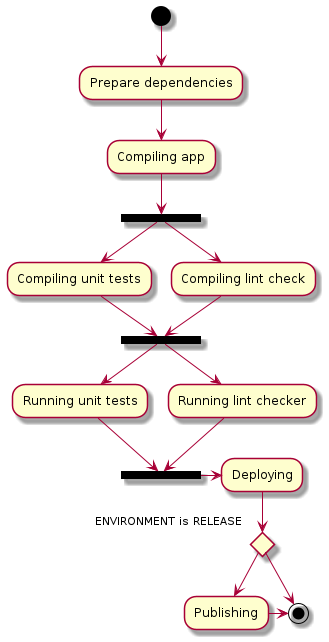
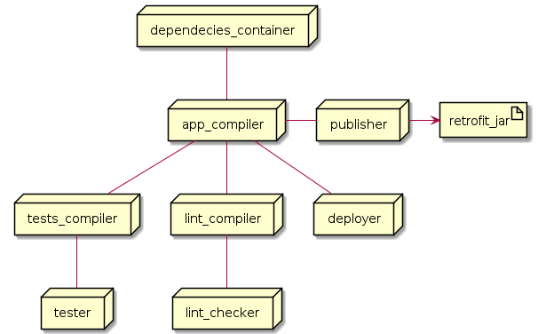
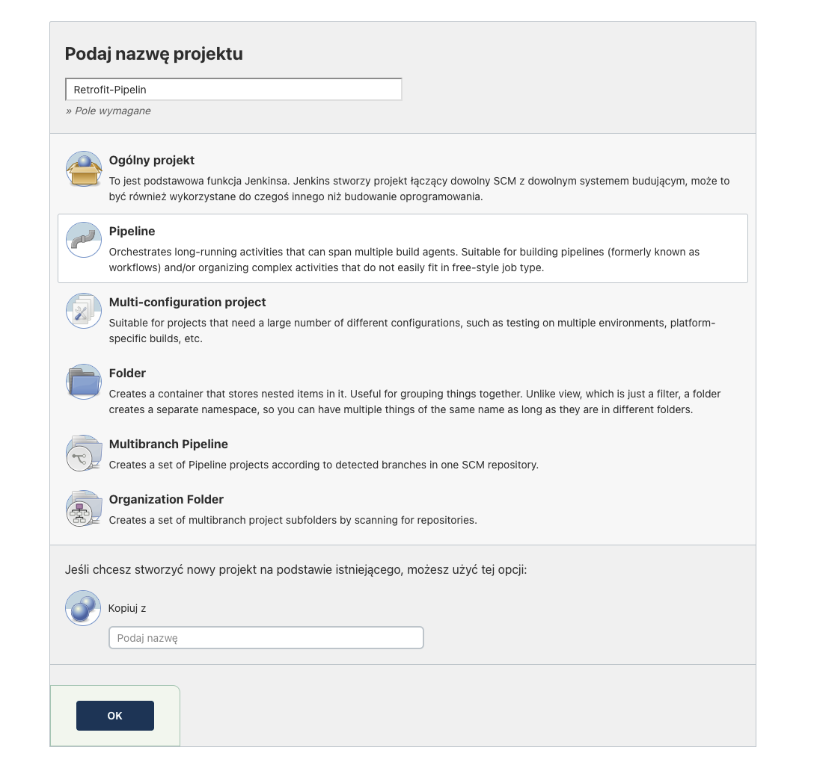
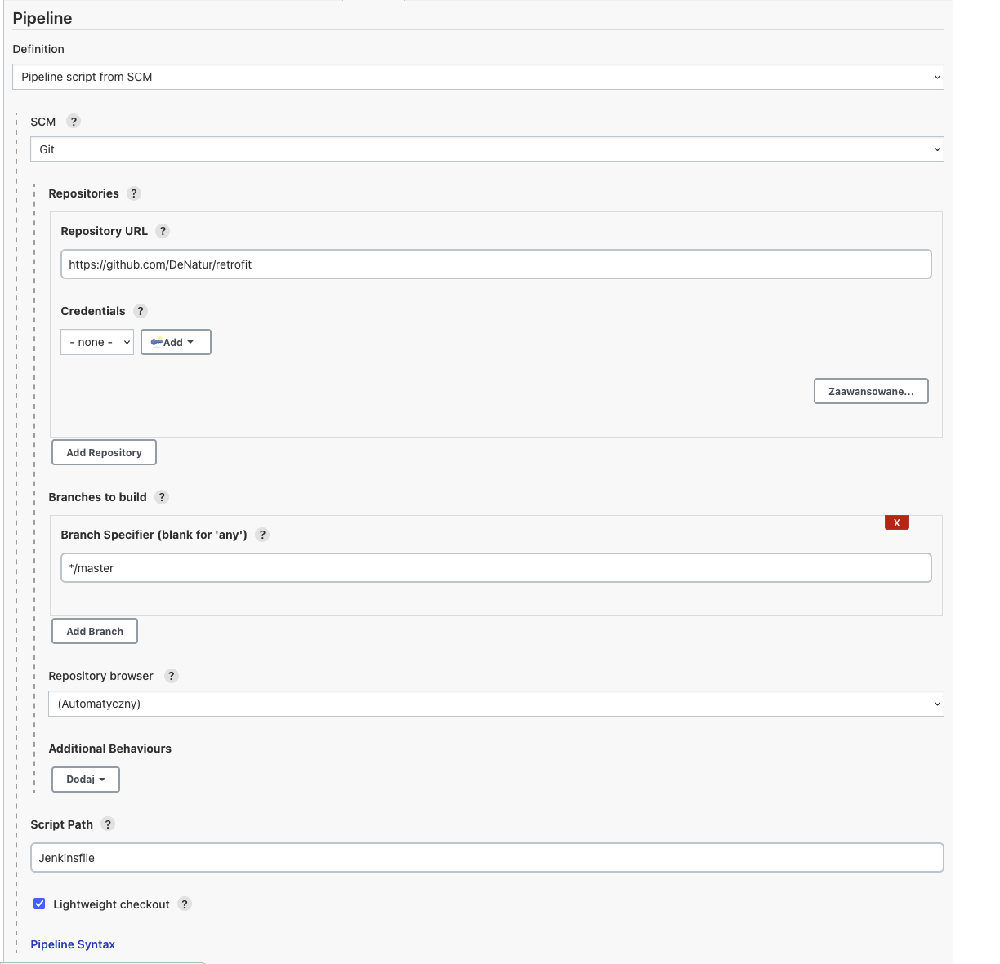
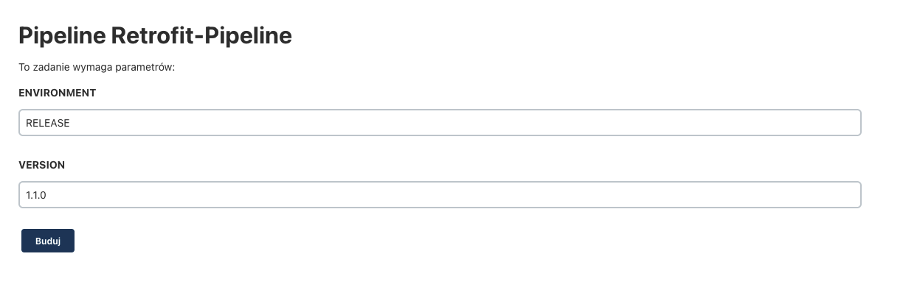
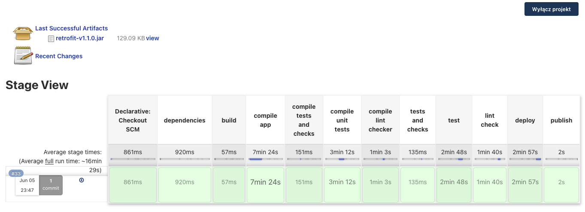
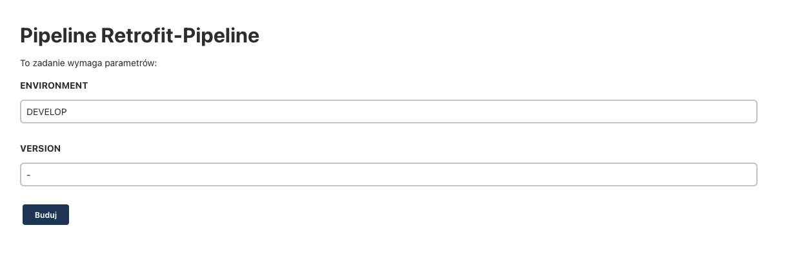
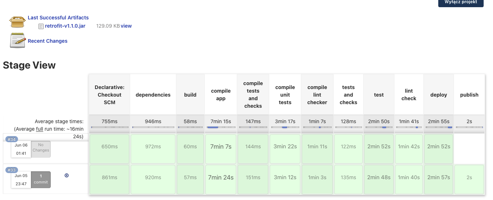

# Metodyki Devops - Przygotowanie pipelinu
## Szymon Stasik

## 1. Informacje wstępne

Podany pipeline jest przygotowany na bazie projektu retrofit, który jest biblioteką udostępniającą klient HTTP dla projektów napisanych w Javie i na Androida. Oryginale repozytorium znajduje się tutaj: https://github.com/square/retrofit.

Na potrzeby przygotowania tego konkretnego zrobiłem fork projektu: https://github.com/DeNatur/retrofit, gdzie:

* Dodałem pliki `DockerFile`, które odpowiadają odpowiednim etapom pipelinu
* Dodałem pliki `JenkinsFile` do zadeklarowania procesów pipelinu
* Zmodyfikowałem plik `build.gradle` w pakiecie `samples`, aby było możliwe przeprowadzenie kroku `Deploy` (więcej informacji [tutaj](#fork-projektu))

Podany pipeline miał jak najbardziej reprezentować rzeczywisty workflow jaki jest wykorzystywany w projektach. Przy tworzeniu projektów androidowych często przeprowadzane oprócz `unit tests` są przeprowadzane `lint checks` i `instrumented tests`.
Te ostatnie z racji tego, że są testami, które wykorzystują system Androidowy nie zostały dodane do tego pipelinu. Jeżeli jednak chcielibyśmy dodać takie testy można do tego wykorzystać Firebase Test lab.
Oferuje on możliwość odpalenia aplikacji/testów na rzeczywistym urządzeniu/emulatorze, które znajdują się w chmurze Googla. Jest to jednak rozwiązanie kosztowne.

Aby bardziej odzwierciedlić rzeczywisty workflow podany pipeline powinien być triggerowany za pomocą akcji na gitcie. W tym przypadku nie jest ustawiony taki trigger. Nie znalazłem sposobu użycia webhooku bez wyeksponowania instancji Jenkinsa na świat. Moja była uruchamiana całkowiecie lokalnie.

## 2. Wymagania przed przygotowaniem pipelinu

W danym projekcie wykorzystuję kontenery `docker:dind` oraz ` myjenkins-blueocean:2.332.3-1` przygotowane wcześniej. Można znaleźć instrukcję stworzenia tych kontenerów w `INO/GCL02/SS306694/Lab04/Sprawozdanie.md`

### Fork projektu

* Jak wspomniałem wcześniej zrobiłem fork projektu https://github.com/square/retrofit

    

* Dodałem modyfikację do pliku `samples/build.gradle`

    Jedną z możliwości przeprowadzenia kroku deploy jest uruchomienie aplikacji. W przypadku bilbioteki, która jest klientem HTTP, a nie aplikacją jest to trudniejsze do osiągnięcia.

    Postanowiłem użyć do tego jednego z przykładów użycia biblioteki. Klasa `SimpleService` w pakiecie `samples` zawiera kod, który używa zbudowanego klienta HTTP - retrofit do pobrania listy kontrybutorów projektu.


    Aby łatwe było uruchomienie tego projektu za pomocą `gradle` dodałem podany kod.
    ```gradle
    plugins {
        id "application"
    }
    apply plugin: 'java-library'
    apply plugin : "java" 

    ext {
        javaMainClass = "com.example.retrofit.SimpleService"
    }

    application {
        mainClassName = javaMainClass
    }
    ```

    Następnie za pomocą:
    ```bash
    ./gradlew samples:run
    ``` 
    można uruchomić klasę `SimpleService` i sprawdzić działanie biblioteki `retrofit`.

## 3. Przygotowanie pipelinu

### UML pipelinu

* Diagram Aktywności

    


* Diagram Wdrożenia

    

### Utworzenie nowego projektu w Jenkinsie

* Przeszedłem do dashboardu Jenkinsa
* Nacisnąłem "Nowy projekt"
* Podałem nazwę nowego projektu i wybrałem typ "Pipeline"
    
    

* Następnie w zakładce "Pipeline" wybrałem opcję "Definition" = "Pipeline script from SCM"
* Jako SCM wybrałem "Git"
* W Repository URL wpisałem fork projektu retrofit - w moim przypadku https://github.com/DeNatur/retrofit
* I zapisałem pipeline

    

### Przygotowanie pliku Jenkinsfile

* Całość pliku Jenkinsfile:

```Jenkinsfile
    pipeline {
        agent any
        parameters {
            string(name: "ENVIRONMENT", defaultValue: "RELEASE")
            string(name: "VERSION", defaultValue: "1.0.0")
        }
        stages {

            stage("dependencies") {
                steps {
                    sh 'echo "Prepare Dependencies..."'
                    sh 'docker build -f dependencies.DockerFile -t dependencies .'
                }
            }
            stage("build") {
                stages {
                    stage("compile app") {
                        steps {
                            sh 'echo "Compiling app..."'
                            sh 'docker build --no-cache -f compileapp.DockerFile -t app-compiler .'
                        }
                    }
                    stage("compile tests and checks") {
                        parallel {
                            stage("compile unit tests") {
                                steps {
                                    sh 'echo "Compiling unit tests..."'
                                    sh 'docker build --no-cache -f compileunittests.DockerFile -t test-compiler .'
                                }
                            }
                            stage("compile lint checker") {
                                steps {
                                    sh 'echo "Compiling lint check..."'
                                    sh 'docker build --no-cache -f compilelintcheck.DockerFile -t lint-compiler .'
                                }
                            }
                        }
                    }
                }
            }

            stage("tests and checks") {
                parallel {
                    stage("test") {
                        steps {
                            sh 'echo "Testing..."'
                            sh 'docker build -f test.DockerFile -t tester .'
                        }
                    }
                    stage("lint check") {
                        steps {
                            sh 'echo "Checking lint..."'
                            sh 'docker build -f lint.DockerFile -t lint-checker .'
                        }
                    }
                }

            }

            stage("deploy") {
                steps {
                    sh 'echo "Deploying ..."'
                    sh 'docker build -f deploy.DockerFile -t deployer .'
                }
            }

            stage("publish") {
                when {
                    expression { 
                        return params.ENVIRONMENT == 'RELEASE'
                    }
                }

                steps {
                    sh 'echo "Publishing ..."'
                    sh 'docker run --name publisher -v $PWD:/retrofit/retrofit/temp app-compiler bash -c \"mv retrofit/build/libs/retrofit* /retrofit/retrofit/temp/\"'
                    sh "mv retrofit*.jar retrofit-v${params.VERSION}.jar"
                    archiveArtifacts artifacts: '*.jar'
                    sh 'echo "Cleaning remaining artifacts"'
                    sh 'rm *.jar'
                }
            }
        }
    }
```

### Parameters

Użyłem parametrów pipelinu do tego, aby móc określić czy dane uruchomienie pipelinu powinno wygenerować artefakt biblioteki Retrofit oraz określić wersję bilbioteki.

```Jenkisfile
    parameters {
        string(name: "ENVIRONMENT", defaultValue: "RELEASE")
        string(name: "VERSION", defaultValue: "1.0.0")
    }
```

Składnia:

```string(name: "ENVIRONMENT", defaultValue: "RELEASE")```

-  początek określa typ parametru (w tym przypadku `string`)
    
    Można również użyć `text`, `booleanParam`, `choice`, `password`

- `name` - nazwa parametru,
- `defaultValue` - wartość domyślna,
- `description` - opis parametru

### Dependencies

Krok Dependencies zawiera zbudowanie obrazu, który dostarcza wymagane depencencje do użycia przy budowaniu projektu "Retrofit", takie jak: JDK, androidSDK.

DockerFile użyty w tym kroku. Większy opis użytego DockerFile znajduje się w `INO/GCL02/SS306694/Lab03/Sprawozdanie.md`

Etap w Jenkinsie:
```Jenkinsfile
stage("dependencies") {
    steps {
        sh 'echo "Prepare Dependencies..."'
        sh 'docker build -f dependencies.DockerFile -t dependencies .'
    }
}
```

Plik dependencies.DockerFile:
```Dockerfile
FROM ubuntu:20.04

# Needed to set for automatic installations, here `apt-get` wanted input for timezone
RUN ln -fs /usr/share/zoneinfo/Europe/Warsaw /etc/localtime

RUN apt-get update
RUN apt-get install -y wget unzip openjdk-11-jre-headless git

# Download and install Android SDK
# https://developer.android.com/studio#command-tools
ARG ANDROID_SDK_VERSION=7302050
ENV ANDROID_SDK_ROOT /opt/android-sdk
RUN mkdir -p ${ANDROID_SDK_ROOT}/cmdline-tools && \
    wget -q https://dl.google.com/android/repository/commandlinetools-linux-${ANDROID_SDK_VERSION}_latest.zip && \
    unzip *tools*linux*.zip -d ${ANDROID_SDK_ROOT}/cmdline-tools && \
    mv ${ANDROID_SDK_ROOT}/cmdline-tools/cmdline-tools ${ANDROID_SDK_ROOT}/cmdline-tools/tools && \
    rm *tools*linux*.zip

# Android command line tools licenses need to be accepted before running
RUN yes | ${ANDROID_SDK_ROOT}/cmdline-tools/tools/bin/sdkmanager --licenses
```

- `docker build -f dependencies.DockerFile -t dependencies .` 

    Z pliku `dependencies.DockerFile` wskazanego przez flagę `-f` tworzy obraz o nazwie `dependencies` wskazaną przez flagę `-t`

    W tym przypadku nie jest dodana opcja `--no-cache`, która nie zapisuje pamięci cache obrazu. Nie potrzebujemy jej, gdyż dependencje wymagane do projektu nie będą się zmieniać.

### Build

Krok Build kompiluje najpierw kod biblioteki, a następnie bazując na skompilowanej bibliotece równocześnie kompiluje testy jednostkowe oraz lint checkera.

Wybrano uruchomienie kompilacja lint checkera oraz testów jednostkowych po to, aby zaoszczędzić czas i przyspieszyć działanie pipelinu. Oba etapy są odrębne od siebie.

Etap w Jenkinsie:
```Jenkinsfile
stage("build") {
    stages {
        stage("compile app") {
            steps {
                sh 'echo "Compiling app..."'
                sh 'docker build --no-cache -f compileapp.DockerFile -t app-compiler .'
            }
        }
        stage("compile tests and checks") {
            parallel {
                stage("compile unit tests") {
                    steps {
                        sh 'echo "Compiling unit tests..."'
                        sh 'docker build --no-cache -f compileunittests.DockerFile -t test-compiler .'
                    }
                }
                stage("compile lint checker") {
                    steps {
                        sh 'echo "Compiling lint check..."'
                        sh 'docker build --no-cache -f compilelintcheck.DockerFile -t lint-compiler .'
                    }
                }
            }
        }
    }
}
```

`parallel` pozwala na zadeklarowanie etapów, które mają się równolegle wykonać

W tym przypadku dodano opcję `--no-cache` do polecenia `docekr build`, aby nie zapisywać wyniku obrazu w pamięci cache. Jest to związane z napotkanym problemem przy zmianie kodu na repozytorium, opisany jest [tutaj](#brak-pamięci). 

Plik `compileapp.DockerFile`

```Dockerfile
FROM dependencies:latest

RUN git clone https://github.com/DeNatur/retrofit

WORKDIR retrofit

RUN ./gradlew assemble
```

Dany plik dockerfile jest budowany tylko na bazie dependencji. Pobiera on dodatkowo aktualny projekt z gita oraz buduje go.

Plik `compileunits.DockerFile`

```Dockerfile
FROM app-compiler:latest

RUN ./gradlew compileTestJava
```

Dany plik dockerfile jest budowany na bazie obrazu `app-compiler`, ponieważ wymaga on zbudowanych projektów biblioteki i kompiluje on testy

Plik `compilelintcheck.DockerFile`

```Dockerfile
FROM app-compiler:latest

RUN ./gradlew compileLint
```

Dany plik dockerfile jest budowany na bazie obrazu `app-compiler`, ponieważ wymaga on zbudowanych projektów biblioteki i kompiluje linta.

### Tests and checks

Krok Tests and checks uruchamia skompilowane testy oraz linta równolegle. Ponownie wybrano uruchamianie jednocześnie, ponieważ pozwala zaoszczędzić to czas oraz oba kroki nie zależą od siebie, jak widać na stworzonym wyżej diagramie wdrożenia.

Etap w Jenkinsie:
```Jenkinsfile
stage("tests and checks") {
    parallel {
        stage("test") {
            steps {
                sh 'echo "Testing..."'
                sh 'docker build -f test.DockerFile -t tester .'
            }
        }
        stage("lint check") {
            steps {
                sh 'echo "Checking lint..."'
                sh 'docker build -f lint.DockerFile -t lint-checker .'
            }
        }
    }
}
```

W tym przypadku nie jest dodana opcja `--no-cache`, która nie zapisuje pamięci cache obrazu. Nie potrzebujemy jej, gdyż wykonanie lint checku oraz testów bazuje na obrazach, które będą się zmieniać.

Plik `test.DockerFile`:
```Dockerfile
FROM test-compiler:latest

RUN ./gradlew test
```

Bazuje na obrazie, który ma już skompilowane testy, dlatego, żeby w tym etapie wystarczyło je tylko uruchomić.

Plik `lint.DockerFile`:
```Dockerfile
FROM lint-compiler:latest

RUN ./gradlew lint
```
Bazuje na obrazie, który ma już skompilowane lint checki, dlatego, żeby w tym etapie wystarczyło je tylko uruchomić.

### Deploy

Krok deploy bazuje na skompilowanej bibliotece. Uruchamia ona opisany [tutaj](#fork-projektu) kod, który jest prostym przykładem użycia biblioteki. 

Etap w Jenkinsie:
```
stage("deploy") {
    steps {
        sh 'echo "Deploying ..."'
        sh 'docker build -f deploy.DockerFile -t deployer .'
    }
}
```

W tym przypadku nie jest dodana opcja `--no-cache`, która nie zapisuje pamięci cache obrazu. Nie potrzebujemy jej, gdyż wykonanie deployu, które będą się zmieniać.

Plik `deploy.DockerFile`

```Dockerfile
FROM app-compiler:latest

RUN ./gradlew samples:run
```

### Publish

Krok publish wyciąga utworzony plik `.jar` biblioteki, nadaje mu odpowiednią wersję oraz ustawia jako artefakt. Ten etap jest wykonywany tylko, jeżeli chcemy aby dany pipeliny wytworzył nową wersję. Zazwyczaj jest to tworzone na branchu `release/`, więc aby to zasymulować przekazywany jest parametr `ENVIRONMENT`, który jeżeli ma wartość `RELEASE` to wykonuje kroki w tym etapie.

Etap w Jenkinsie:
```
stage("publish") {
    when {
        expression { 
            return params.ENVIRONMENT == 'RELEASE'
        }
    }

    steps {
        sh 'echo "Publishing ..."'
        sh 'docker run --name publisher -v $PWD:/retrofit/retrofit/temp app-compiler bash -c \"mv retrofit/build/libs/retrofit* /retrofit/retrofit/temp/\"'
        sh "mv retrofit*.jar retrofit-v${params.VERSION}.jar"
        archiveArtifacts artifacts: '*.jar'
        sh 'echo "Cleaning remaining artifacts"'
        sh 'rm *.jar'
    }
}
```

`when` - if statement, jeżeli zwraca `true` to dany krok się wykonuje. 

`docker run --name publisher -v $PWD:/retrofit/retrofit/temp app-compiler bash -c \"mv retrofit/build/libs/retrofit* /retrofit/retrofit/temp/\"`

Dane polecenie tworzy i uruchamia kontener na baze obrazu `app-compiler`, który ma w sobie stworzony już plik `.jar`. za pomocą flagi `-v` montuje wolumin w miejscu `/retrofit/retrofit/temp` oraz kopiuje do tego miejsca zbudowany plik `.jar`. Dzięki temu jest on dostępny w instancji jenkinsa.

Następnie nadaję nazwę artefaktowi zgodnie z podaną w parametrach wersją.

Ustawiam jako artefakt i czyszczę pozostałości, po to, aby nie przeszkadzały, gdy ponownie zostanie wykonany publish.

## 3. Uruchomienie pipelinu

Pipeline można uruchomić z poziomu UI. Należy nacisnąć przycisk "Uruchom z parametrami"

### Uruchomienie RELEASE

Przykładowe uruchomienie z pokazaniem przebiegu publikacji artefaktu

Należy ustawić `ENVIRONOMENT` na `RELEASE` oraz wpisać wersję. W tym przypadku wybrałem wersję `1.1.0`



Następnie pipeline się buduje i po zbudowaniu pokazuje czas każdego z etapów oraz wygenerowany artefakt jako ostani.



Przykładowe uruchomienie bez przebiegu publikacji artefaktu

Należy ustawić `ENVIRONMENT` na `DEVELOP`, w miejscu `VERSION` nie trzeba nic zmieniać



Następnie pipeline się buduje i po zbudowaniu pokazuje czas każdego z etapów. Ostatnio wygenerowany artefakt nadal pokazuje jako ten z poprzedniego budowania, gdzie użyto `ENVIRONMENT` jako `RELEASE` i etap `publish` pominięto.



## 4. Wnioski z projektu

Jenkins to potężne narzędzie pozwalające zautomatyzować tworzenie projektu jak i jego publikację. Dzięki niemu można zdecydowanie wcześniej wychwycić masę problemów, które pojawiają się przy tworzeniu projektów. Zarówno uruchamianie testów jak i publikacja wersji zautomatyzowana daje ogrom możliwości.

Osobiście nie korzystałem wcześniej z Jenkinsa. Deklaratywny sposób tworzenia Pipelinu daje dużą swobodnę w wyborze narzędzie i deklaracji kroków.

Wcześniej jeżeli chodzi o tworzenie pipelinu to korzystałem z gotowych narzędzi dostarczonych przez Githuba lub Gitlaba. Są plusy korzystania z zdeklarowanego od początku do końca przeze mnie pipelinu. Pozwala to mieć dużo większą kontrolę, mam świadomość co dokładnie się w nich dzieje, a modyfikacja jest prosta.

Jednym minusem, który spostrzegłem tworząc projekt to zdziwiłem się, że kroki, które są wykonywanie równolegle w `Stage View` są pokazane jakby były wykonane po sobie. Przeszkadza to w odbiorze pipelinu i niepotrzebnie przedłuża widok.  

## 5. Napotkane problemy

### Brak Pamięci

Dodając aktywnie zmiany na repozytorium projektu przez dłuższy czas nie mogłem zrozumieć dlaczego nie pojawiają się one w pipelinie. Okazało się, że przez pamięć cache, korzystałem cały czas z tej samej wersji repozytorium, nie aktualizowało się. Rozwiązaniem było dodanie opcji `--no-cache` przy tworzeniu obrazów, które nie mogły zapisać stanu.

### Uruchomienie konteneru docker in docker

Powracając do pracy nad projektem zapominałem, że trzeba dodatkowo uruchomić kontener `docker:dind`, aby było możliwe uruchamianie pipelinów

### Nazywanie artefaktu

Przy nazywaniu artefaktów nie wiedziałem dlaczego nie mogę odpowiednio sformatować outputu. Jest to drobnostka, ale sprawiła, że wiele czasu poświęciłem na zauważenie tego.

Przy uruchamianiu polecenia sh `[content]` w Jenkinsfile, aby można było poprawnie sformatować treść komendy należy użyć podwójnego cudzysłowia "" zamiast ``