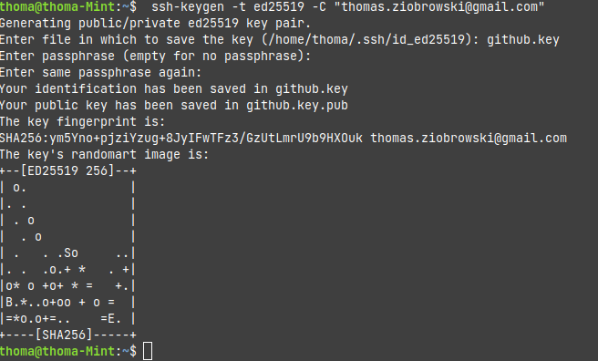
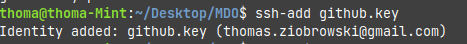
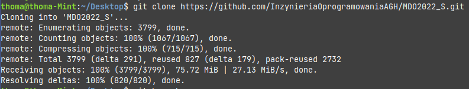
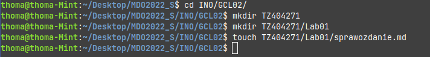
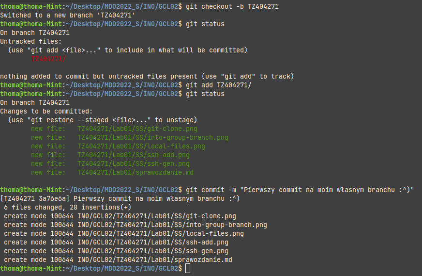
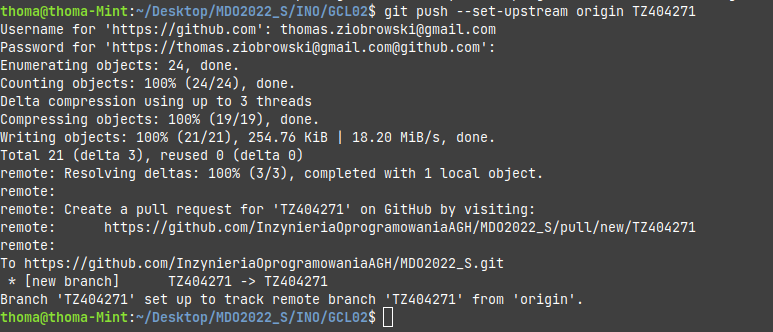
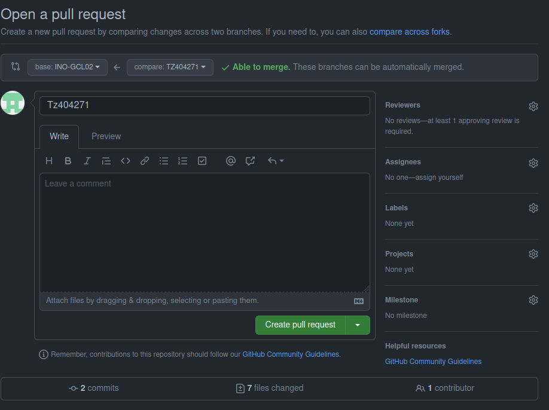

# Sprawozdanie 1 - Tomasz Ziobrowski

### 1. Zainstalowanie klienta git.
- wykorzystując komendę `sudo apt install git` zainstloawno wersję cli klienta git
- należało wygenerować klucz SSH wykorzystując polecenie `ssh-keygen -t ed25519 -c "thomas.ziobrowski@gmail.com"` w wyniku czego otrzymano klucz publiczny oraz prywatny


- uzyskany klucz publiczny został przypisany do github w ustawieniach konta
- nastepnie należało ustawić dane użytkownika git, pod którymi jest podpisywany podczas operacji 
```console
git config --global user.email "thomas.ziobrowski@gmail.com"
git config --global user.name "ziobrowskyy"

```
- należało również dodać klucz komendą `ssh-add`




### 2. Uruchomienie terminala/konsoli i wykonanie operacji klonowania repozytrorium
- komendą `git clone https://github.com/InzynieriaOprogramowaniaAGH/MDO2022_S.git` wykonano klonowanie repozytorium do aktualnego katalogu



### 3. Otwarcie i zapoznanie się z dokumentem pierwszego ćwiczenia laboratoryjnego
- zmieniono aktualnego brancha na grupowego wykorzystując komendę `git chceckout INO-GCL02`
- w lokalizacji `INO/GCL02/` utworzono katalog `TZ404271` w którym powstał plik `sprawozdanie.md` w komendą `touch`. Utworzono również katalog `SS` w którym będą przechowywane wszystkie utwrzonone zrzuty ekranu
- dodano do sprawozdania opis poprzednich kroków
 


### 4. Tworzenie nowego brancha oraz pierwszy commit
- utworzono nowego brancha o odpowiedniej nazwie złożonej z inicjałów oraz z numeru indkesu komendą `git checkout -b TZ404271`
- kolejnym krokiem było dodanie mojego katalogu, zawierającego wszystkie utworzone pliki do śledzenia poprzez `git add TZ404271`
- w tym momencie można było utworzyć pierwszy commit wraz z komentarzem `git commit -m "komentarz jest na screenie niżej"`
- nastþenie wykonano zrzut ekranu, który nastpenie dodano do śledzenie oraz dodano kolejnego commita, który go zaierał



### 5. Wykonanie pull requesta zmian
- należało zrobić push brancha. Pojawił się komunikat, że nie ma w remote repozytorium brancha o takiej nazwie, więc należało go utworzyć poprzez `git push --set-upstream origin TZ404271`




- nastepnie za pomocą przeglądarki utworzono pull request
