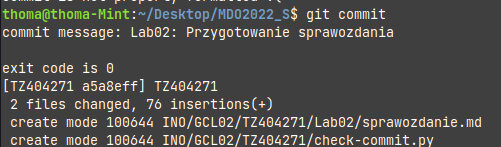
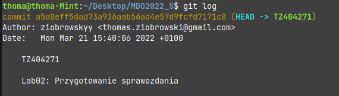
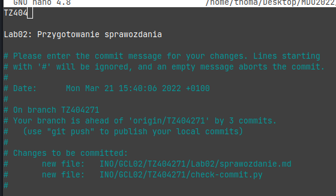
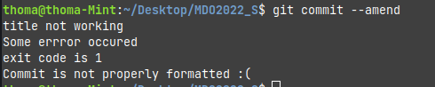

# Sprawozdanie 2 - Tomasz Ziobrowski

## 1. Przygotowanie git hooka oraz umieszczenie go w sprawozdaniu

* Pierwszy krokiem było zlokalizowanie folderu `.git/hooks` w którym przechowywane są skrypty, które uruchamiane są podczas różnych faz/operacji git.
* W tym folderu skopiowano plik `commit-msg.sample` i nadano nazwę `commit-msg`, w celu dalszej modyfikacji. Usunięcie prefiksu *sample* z nazwy pliku powoduje uruchomienie danego skrytpu.
* Do skryptu dodano następujący kod:
```bash
python3 ./INO/GCL02/TZ404271/check-commit.py $1
exit_code=$?
echo "exit code is $exit_code"
if [ $exit_code != 0 ];
then
	echo >&2 "Commit is not properly formatted :("
	exit 1
fi
```
* uruchamiano przez niego nastepujący skrypt python, który sprawdzał popranwość formatowania tytułu commita oraz jego treści.
```python
import sys
import os
import re

if __name__ == "__main__":
    path = sys.argv[1]
    student_alias = "TZ404271"
    lab_regex = "[L|l]ab\d{2,}"
    
    try:
        with open(path) as commit:
            commit_title = commit.readline()
            if student_alias not in commit_title:
                print("title not working")
                sys.exit(1)
            
            commit.readline()
            commit_message = commit.readline()
            print("commit message:", commit_message)
            result = re.match(lab_regex, commit_message)
            if result is None:
                print("message not working")
                sys.exit(1)
    except:
        print("Some errror occured")
        sys.exit(1)

    sys.exit(0)

```
## 2. Hook w akcji

* pierwszy commit, który utworzono został tak zformatowany, aby pomyślnie przeszedł test


* wpisując komendę `git log` mozna zobaczyć poprzednie commity, które zostały pomyślnie sprawdzone


* następnym krokiem była próba modyfikacja tego commita za pomocą `git commit --amend`, w celu sprawdzenia weryfikacji niepoprawnych danych commita. W tym celu zmieniono tytuł oraz zapisano.

* zgodnie z oczekiwaniami ten commit nie został przepuszczony dalej



