# Sprawozdanie 3 - Tomasz Ziobrowski

## Zadanie 1. 

W tym zadaniu należało wybrać projekt, który przede wszystkim byłby otwartoźródłowy, na odpowiedniej licencji, oraz posiadał odpowiednie narzędzia do budowania oraz testowania.

Uznałem, że idelanie do tego celu nada się projekt Node-owy, ze względu na łatwość instalacji programów, oraz zględny brak prolemów z kompatybilnością.

Jako repozytorium testowe wybrano projekt **_avajs_**, który znajduje się pod adresem [GitHub](https://github.com/avajs/avac).

* jako podstawowy kontener do pracy wybrano `ubuntu:latest`.  
W celu pobrania odpowiedniego obrazu na dockera wykonano polecenie:  
`sudo docker pull ubuntu`.

* następnym krokiem było odpalenie kontenera w trybie interaktywnym (TTL) w celu przetestowania "na żywo", w jaki sposób można skonfigurować projekt  
`sudo docker run -it ubuntu`

* dobrym krokiem jest rozpoczęcie od uruchomienia `apt update -y` aby zaktualizować package obecne na maszynie oraz pobrać aktulane URL hostingów. Flaga `-y` pozwala na automatyczną akceptacje paczek do instalacji/upgrejdu - będzie to przydatne, gdy proces będziemy aktualizować poprzez Dockerfile.

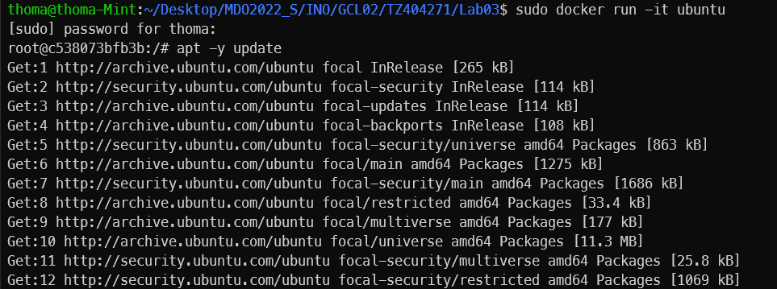

* Instalacja pakietów node oraz git do sklonowania repozytorium komendą `apt install -y git nodejs npm`:    

```console
root@83d1e817c7c9:/# apt install -y git nodejs npm 
Reading package lists... Done
Building dependency tree       
Reading state information... Done
The following additional packages will be installed:
  binutils binutils-common (...)
```

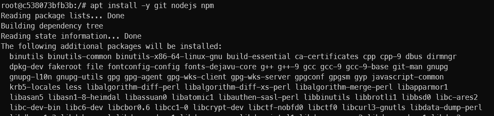

* w trakcie intalacji pojawia się formularz wyboru strefy czasowej pakieru tzdata, co później zostanie omówione w dalszym szcególe


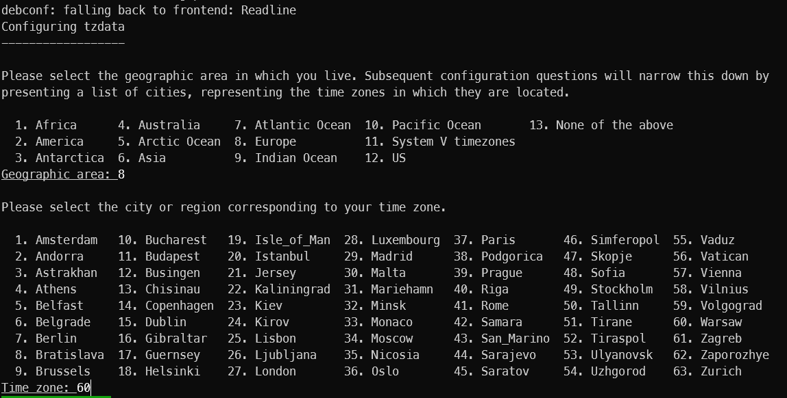

* następenie można było już sklonować repozytorium poprzez HTTPS oraz przejśc można było do tegoż katalogu

```bash
git clone https://github.com/avajs/ava.git
cd ./ava
```

* można więc przejść do instalacji projektu za pomocą npm (Node Package Manager), który wykorzystuje zdefiniowną strukturę zależnośći w piku `package.json`, w celu pobrania wszysktich koniecznych dependency. W tymteż pliku zwykle znadjują się również skrypty do uruchomienia appki w wersji release/dev oraz uruchomienia budowania jeśli to konieczne lub testów. Każdy ze skrytów uruchamiania się w następujący sposób: `npm run "nazwa_skryput"`

```bash
# pobranie zależnośći/instalacja projektu
npm install

# testowe uruchomienie testow
npm run test
```

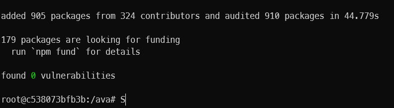


* Uruchomienie testów

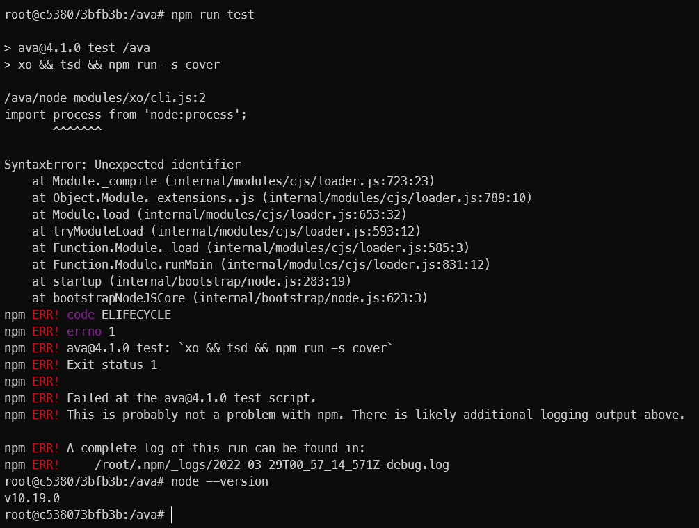

* niestety uruchomienie testów nie przebiegło pomyślnie, co jak się okazalo było kwestią nierpawidlowej wersji nodejs, która została zaciągnięta przez *apt*. Należało więc manualnie zainstalować nowszą wersję - w tym przypadku będzie to najnowsza stable 17.8

```bash
# dociągnięcie wgeta w celu pobierania plikw 
apt install -y wget
# pobranie skryptu instalacyjnego nodejs
wget https://deb.nodesource.com/setup_17.x
# nadawnie praw do wykonania
chmod +x ./setup_17.x
# uruchoienie skryptu
./setup_17.x
# mozna znowu zainstalować nodejs tym razem w poprawnej wersji
apt install -y nodejs
```
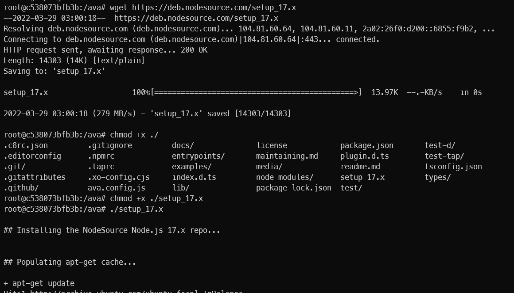

* po aktualizacji NodeJS, należało wyczyścić cache, forder `node_modules` oraz przeinstalować na nowo projekt

```bash
# usuwanie pozostałości poprzenich wersji
rm -rf node_modules package-lock.json
npm cache clena --force

# reinstalacja
npm install
```

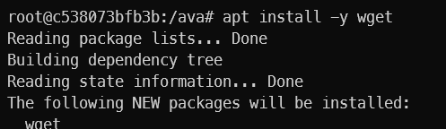

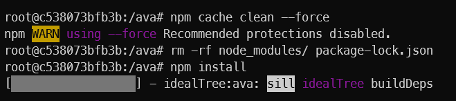


* po wykonaniu powyższych kroków można było przejść do próby uruchomienia testóœ (jak poprzednio, komendą `npm run test`), kóre zostały poprawnie uruchomione

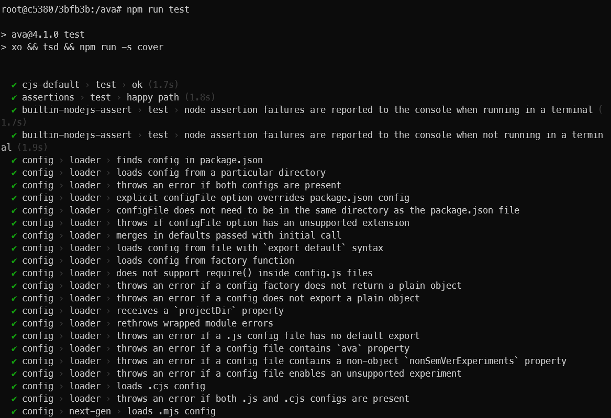


## 2. Utworzenie kontenerów Docker

* kroki z pozyższego kroku skonsolidowano do pliku `touch ava/Dockerfile`, który zawierał przepis na stworzenie kontenera z zaisntalowanym programem.  
NOTE: Poniższa wersja zaweira również fixa do intalacji paczki tzdata, która bez tego przerywa instalację w celu wyboru strefy czasowej. 

```dockerfile
FROM ubuntu:latest # ubuntu:latest jako kontener bazowy

# fix tzdata (got that from https://grigorkh.medium.com/fix-tzdata-hangs-docker-image-build-cdb52cc3360d)
ENV TZ=Europe/Berlin
RUN ln -snf /usr/share/zoneinfo/$TZ /etc/localtime && echo $TZ > /etc/timezone

RUN apt update -y && apt install -y git npm wget

# this step is to pull newest version of nodejs (17.8) from official repo,
# because apt for some unexplainded reason keeps installing version 10.2 :-))
RUN wget https://deb.nodesource.com/setup_17.x
RUN chmod +x ./setup_17.x
RUN ./setup_17.x
RUN apt install -y nodejs

RUN git clone https://github.com/avajs/ava.git

WORKDIR  /ava # zmiana katalogu na ten z pobranym repo

RUN npm install
```

* z folderu zajęć uruchomiono build kontenera poleceniem `sudo docker build -t ava:1.0 ./ava`

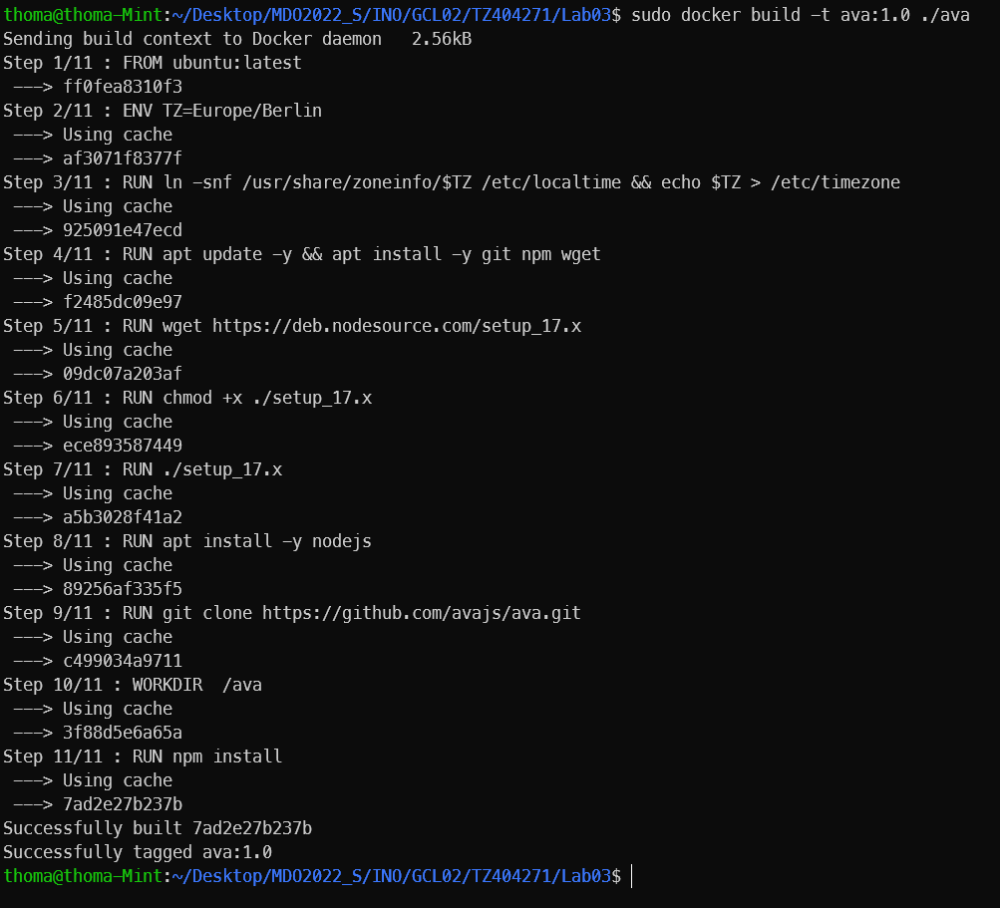

* nastepnie uruchomiono ten kontener poleceniem `sudo docker run -it ava:1.0`, z flagą it, aby sprawdzić czy poprawnie zainstalowano program, w tym przypadku sprawdzając wersję NodeJS

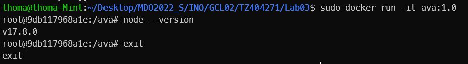

* kolejnym kontenerem, bazującym na poprzenio utworzonym był odpowiedzialny za testy. Utworzono więc kolejny plik `touch ava-test/Dockerfile`, w którym umieszczono przepis na kolejny kontener

```dockerfile
FROM ava:1.0 # wybiranie porpzenio utworzonego obrazu

WORKDIR /ava # zmiana katalogu roboczego (odpowiednik cd w bash)

CMD ["npm", "run", "test"] # uruchomienie testów
```

* Jak poprzednio zbudowano obraz komendą `sudo docker build -t ava-test:1.0 ./ava-test`

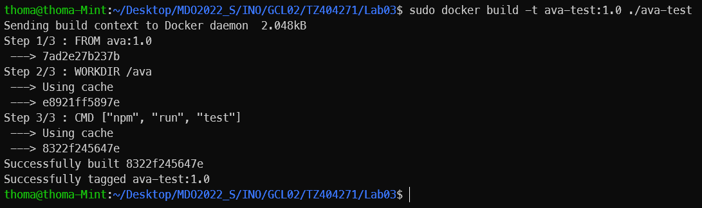

* Na koniec uruchomiono kontener testujący i sprawdzaono czy popranie uruchamiane są testy poprzez `sudo docker run ava-test:1.0`. Sam ten proces potrwał dość długo, więc wrzucono ponięzej jedynie screeny początku oraz końca testów.

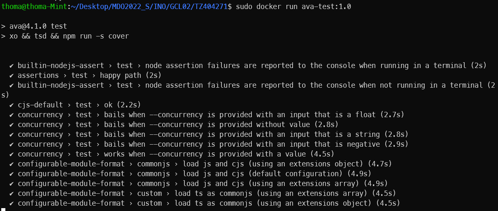

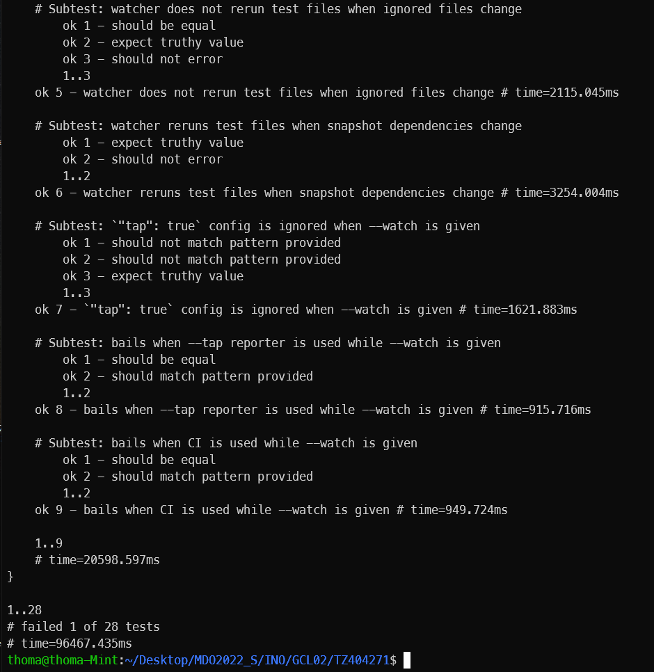