# Sprawozdanie 3 - Tomasz Ziobrowski

## Przygotowanie zadania

W folderze `TZ404271` utworzono katalog laboratorium, w którym będzie odbywana praca na rzecz tych zajęć. Przygotowano również plik sprawozdania oraz katalog w którym będą przechowywane zrzuty ekranu.

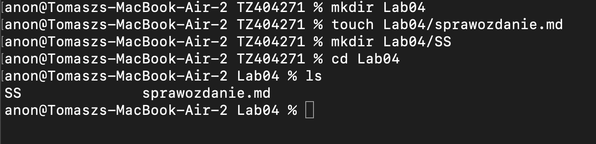


## Zadanie 1 - zachowywanie stanu


Przygotowano wolimin wejściowy oraz wyjściowy, które nazwano kolejno `input-volume` oraz `output-volume` za pomocą polecenia `docker volume "nazwa woluminu"`

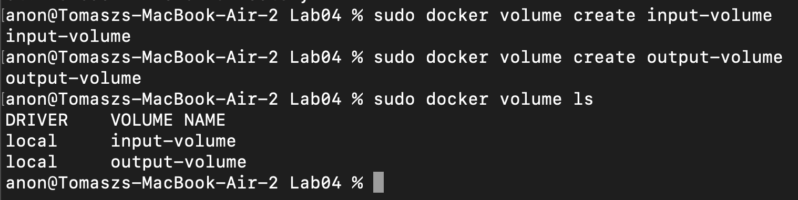

Następnie w celu uruchomienia kontenera wraz z voluminami wykorzystano komendę `docker run -v "nazwa woluminu":"punkt montowania woluminu" "nazwa kontenera bazowego"`, który w tym przypadku wyglądał nastepująco:

`docker run -it -v input-volume:/input-volume -v output-volume:/output-volume fedora:lastest`

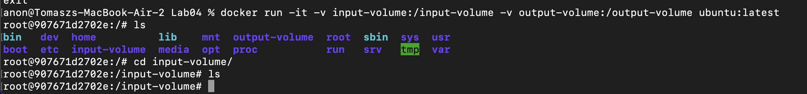

Jak widać powyżej voluminy obecnie są puste, więc należało przekopiować potrzebne pliki do niego.

W tym celu na maszynie hosta sklonowano repozytorium, które nastepnie skpiowano do voluminu korzystając z polecenia `docker cp "żródło" "id-kontnera":"lokalizacja"`. Polecenie w tym przypadku wyglądało następującco: `docker cp ava 907671d2702e:/input-volume`. Jest to możliwe z tego względu, że przy uruchomieniu te woluminy są już zamontowane i jak są podpięte do uruchomionego kontenera mamy do nich swobodny dostęp.

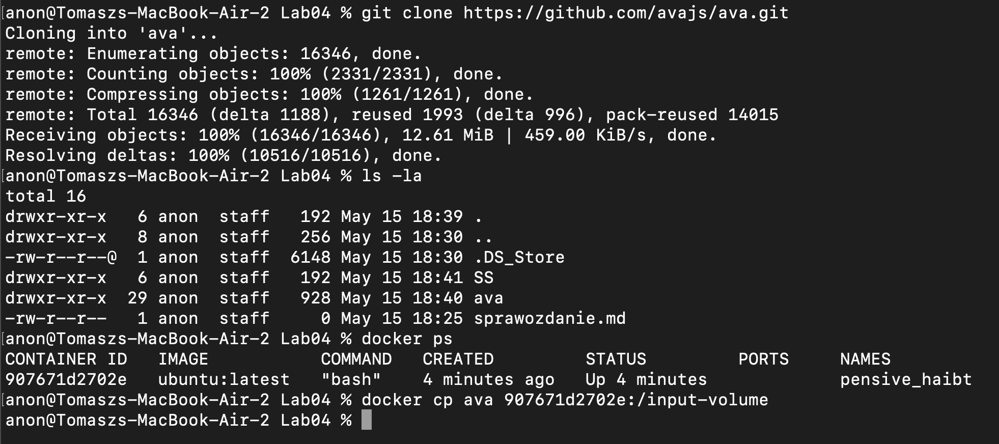

Po skopiowaniu:
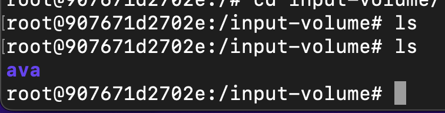

Następnie zainstalowano na kontenerze wszyskie potrzebne dependencje, czyli dla tej konkretnej konfiguracji jedynie node

`dnf install -y nodejs`

Nastepnym krokiem było skopiowanie plików projektu z voluminu wejściowego do wyjściowego. Z racji tego, że jest to projekt NodeJS, niezbędne będą wszystkie pliki w katalogu, do którego budowany będzie projekt.

`cp -rf /input-volume/ava /output-volume/`

Następnie zbudowano projekt poleceniem `npm install` oraz urucomiono testy `npm run test`, aby sprawdzić, czy instalacja przebiegła pomyślnie.


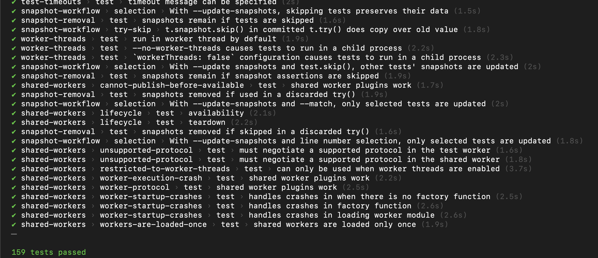 

Aby zweryfikować, czy dane w woluminach zostały poprawnie zapisane i "nie są stracone" uruchomiono ponownie kontener tym samym poleceniem co poprzednio i sprawdzono zawartosc woluminów.


## Zadanie 2 - eksponowanie portu

Należało przygotować kontener, który będzie pełnił rolę serwera progrmau iperf3. W tym celu utworzono kontener feodory, który miał odsłonięte porty 5201 TCP oraz UDP. Składnia jest nastepująca `docker run [opcje] -p "port kontenera":"port hosta"`

`docker run -it -p 5201:5201 -p 5201:5201/udp fedora:latest`

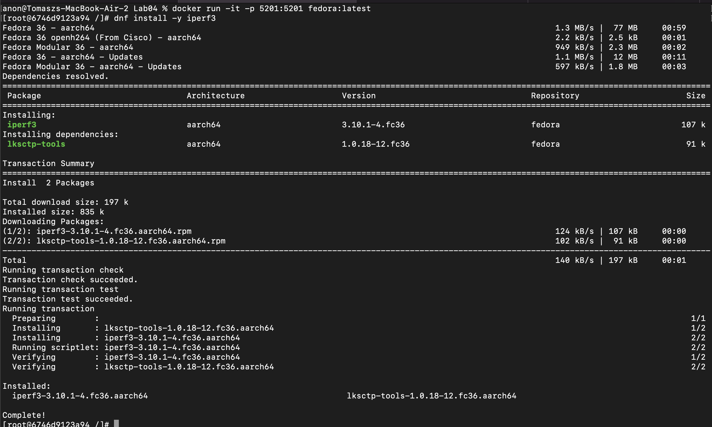

Sprawdzono również IP kontenera
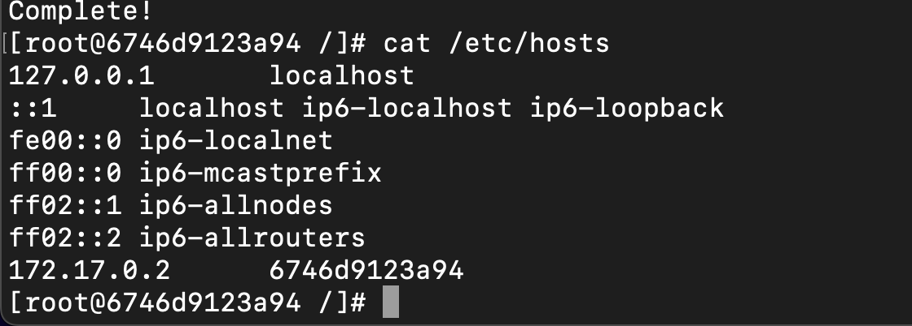

Oraz uruchomiono serwer iperf3 za pomocą polecenia `iperf3 -s`
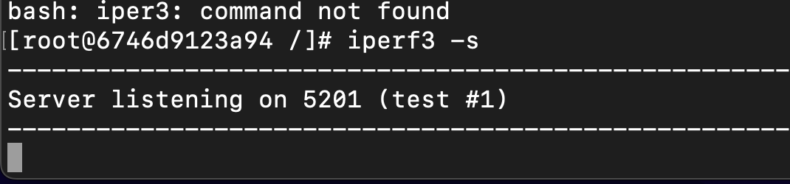

Kolejnym krokiem było utworzenie drugiego kontnera oraz zaintalowanie na niego programu iperf3. W tym celu również wykorzystano fedorę w wersji latest.

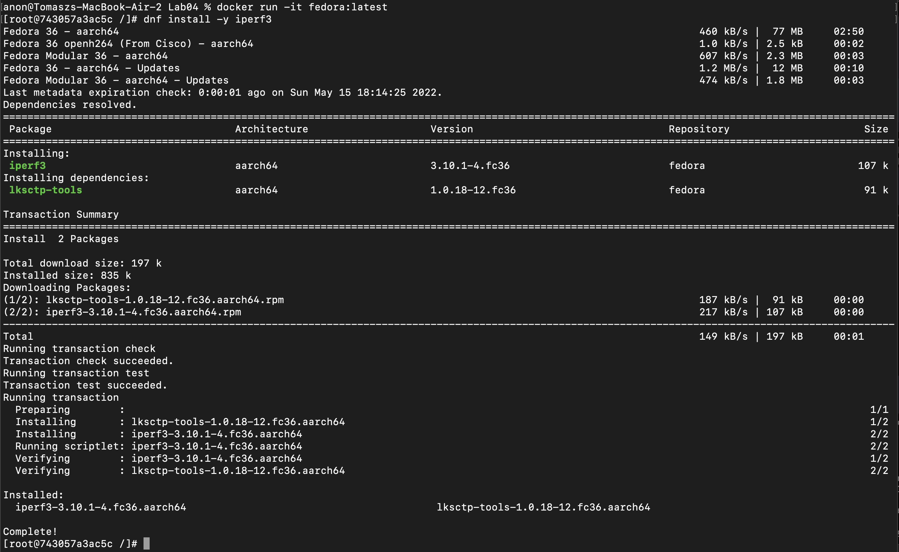

Dwa kontenery muszą działać jednocześnie, aby możliwe było wykonanie testu.

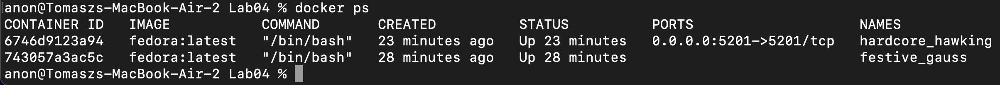

Aby uruchomić test należy wykonać polecenie `iperf3 -c "ipserwera"`

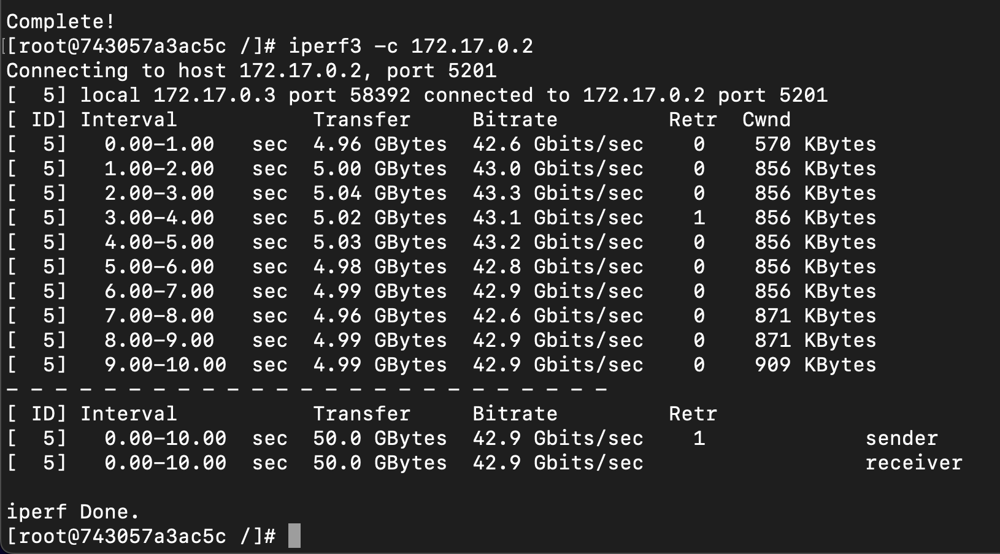

Nastepnie na komputerze hoście również zainstalowano iperf3 za pomocą brew oraz również przeprowadzono testy.

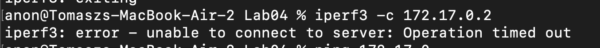

Po wielu próbach okazało się, że nie mogę dostać się do kontenera poprzez jego adres IP, tylko przez localhost.

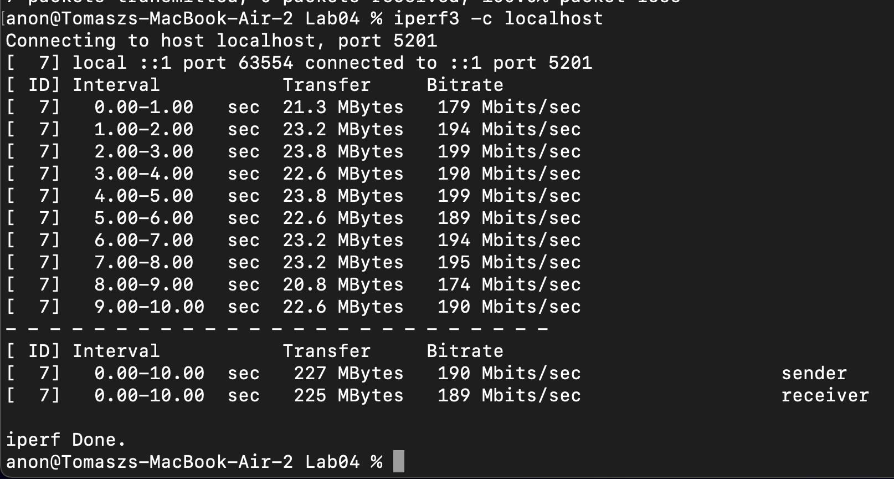

Wyciągnięto logi z kontenera za pomocą polecenia `docker logs "id kontenera"`

```
anon@Tomaszs-MacBook-Air-2 Lab04 % docker logs 838c5c66e468
[root@838c5c66e468 /]# dnf install iperf3
Fedora 36 - aarch64                                                                                               644 kB/s |  77 MB     02:02    
Fedora 36 openh264 (From Cisco) - aarch64                                                                         1.3 kB/s | 2.5 kB     00:01    
Fedora Modular 36 - aarch64                                                                                       275 kB/s | 2.3 MB     00:08    
Fedora 36 - aarch64 - Updates                                                                                     482 kB/s |  12 MB     00:25    
Fedora Modular 36 - aarch64 - Updates                                                                             519 kB/s | 1.8 MB     00:03    
Dependencies resolved.
==================================================================================================================================================
 Package                              Architecture                    Version                                Repository                      Size
==================================================================================================================================================
Installing:
 iperf3                               aarch64                         3.10.1-4.fc36                          fedora                         107 k
Installing dependencies:
 lksctp-tools                         aarch64                         1.0.18-12.fc36                         fedora                          91 k

Transaction Summary
==================================================================================================================================================
Install  2 Packages

Total download size: 197 k
Installed size: 835 k
Is this ok [y/N]: y
Downloading Packages:
(1/2): lksctp-tools-1.0.18-12.fc36.aarch64.rpm                                                                     40 kB/s |  91 kB     00:02    
(2/2): iperf3-3.10.1-4.fc36.aarch64.rpm                                                                            43 kB/s | 107 kB     00:02    
--------------------------------------------------------------------------------------------------------------------------------------------------
Total                                                                                                              60 kB/s | 197 kB     00:03     
Running transaction check
Transaction check succeeded.
Running transaction test
Transaction test succeeded.
Running transaction
  Preparing        :                                                                                                                          1/1 
  Installing       : lksctp-tools-1.0.18-12.fc36.aarch64                                                                                      1/2 
  Installing       : iperf3-3.10.1-4.fc36.aarch64                                                                                             2/2 
  Running scriptlet: iperf3-3.10.1-4.fc36.aarch64                                                                                             2/2 
  Verifying        : iperf3-3.10.1-4.fc36.aarch64                                                                                             1/2 
  Verifying        : lksctp-tools-1.0.18-12.fc36.aarch64                                                                                      2/2 

Installed:
  iperf3-3.10.1-4.fc36.aarch64                                         lksctp-tools-1.0.18-12.fc36.aarch64                                        

Complete!
[root@838c5c66e468 /]# cat /etc/host
cat: /etc/host: No such file or directory
[root@838c5c66e468 /]# cat /etc/hosts
127.0.0.1	localhost
::1	localhost ip6-localhost ip6-loopback
fe00::0	ip6-localnet
ff00::0	ip6-mcastprefix
ff02::1	ip6-allnodes
ff02::2	ip6-allrouters
172.17.0.2	838c5c66e468
[root@838c5c66e468 /]# iperf3 -s
-----------------------------------------------------------
Server listening on 5201 (test #1)
-----------------------------------------------------------
Accepted connection from 172.17.0.3, port 58450
[  5] local 172.17.0.2 port 5201 connected to 172.17.0.3 port 58452
[ ID] Interval           Transfer     Bitrate
[  5]   0.00-1.00   sec  4.83 GBytes  41.5 Gbits/sec                  
[  5]   1.00-2.00   sec  4.94 GBytes  42.4 Gbits/sec                  
[  5]   2.00-3.00   sec  4.94 GBytes  42.4 Gbits/sec                  
[  5]   3.00-4.00   sec  4.88 GBytes  41.9 Gbits/sec                  
[  5]   4.00-5.00   sec  4.92 GBytes  42.3 Gbits/sec                  
[  5]   5.00-6.00   sec  4.97 GBytes  42.7 Gbits/sec                  
[  5]   6.00-7.00   sec  5.00 GBytes  43.0 Gbits/sec                  
[  5]   7.00-8.00   sec  4.97 GBytes  42.7 Gbits/sec                  
[  5]   8.00-9.00   sec  5.03 GBytes  43.2 Gbits/sec                  
[  5]   9.00-10.00  sec  5.02 GBytes  43.1 Gbits/sec                  
[  5]  10.00-10.00  sec  3.25 MBytes  29.4 Gbits/sec                  
- - - - - - - - - - - - - - - - - - - - - - - - -
[ ID] Interval           Transfer     Bitrate
[  5]   0.00-10.00  sec  49.5 GBytes  42.5 Gbits/sec                  receiver
-----------------------------------------------------------
Server listening on 5201 (test #2)
-----------------------------------------------------------
Accepted connection from 172.17.0.1, port 62988
[  5] local 172.17.0.2 port 5201 connected to 172.17.0.1 port 62990
[ ID] Interval           Transfer     Bitrate
[  5]   0.00-1.00   sec  19.2 MBytes   161 Mbits/sec                  
[  5]   1.00-2.00   sec  23.6 MBytes   198 Mbits/sec                  
[  5]   2.00-3.00   sec  23.2 MBytes   195 Mbits/sec                  
[  5]   3.00-4.00   sec  23.2 MBytes   194 Mbits/sec                  
[  5]   4.00-5.00   sec  23.4 MBytes   197 Mbits/sec                  
[  5]   5.00-6.00   sec  22.8 MBytes   191 Mbits/sec                  
[  5]   6.00-7.00   sec  23.0 MBytes   193 Mbits/sec                  
[  5]   7.00-8.00   sec  22.9 MBytes   192 Mbits/sec                  
[  5]   8.00-9.00   sec  21.1 MBytes   177 Mbits/sec                  
[  5]   9.00-10.00  sec  22.8 MBytes   191 Mbits/sec                  
[  5]  10.00-10.00  sec  96.0 KBytes   197 Mbits/sec                  
- - - - - - - - - - - - - - - - - - - - - - - - -
[ ID] Interval           Transfer     Bitrate
[  5]   0.00-10.00  sec   225 MBytes   189 Mbits/sec                  receiver
-----------------------------------------------------------
Server listening on 5201 (test #3)
-----------------------------------------------------------
```

Wyniki wskazały, że prędkość przesyłu pomiędzy kontenerem a maszyną jest o wiele niższa niz to ma miejsce w przypadku komunikacji kontener-kontener.

## Zadanie 3 - intalacja Jenkins

Korzystając z instrukcji w dokumetacji przeprowadzono instalację programu Jenkins w środowisku Docker.

Pierwszym krokiem było utworzenie sieci typu bridged komendą `docker network create jenkins`


Następnie można było wyświetlić sieci poleceniem `docker network ls`


Następnie pobrano obraz docker:dind korzystając z komendy `docker run`


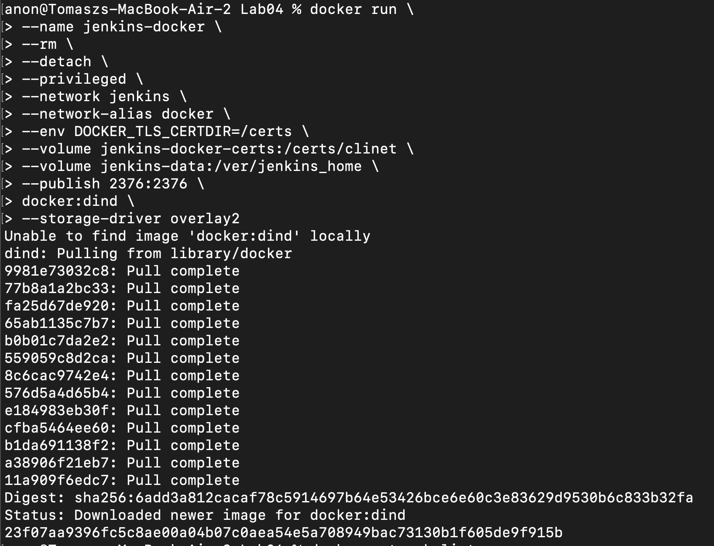

Kolejnym krokiem było utworzenie pliku `Dockerfile`, który zawierał przepis na utworzenie własnego kontenera docker.

```dockerfile
FROM jenkins/jenkins:2.332.3-jdk11
USER root
RUN apt-get update && apt-get install -y lsb-release
RUN curl -fsSLo /usr/share/keyrings/docker-archive-keyring.asc \
  https://download.docker.com/linux/debian/gpg
RUN echo "deb [arch=$(dpkg --print-architecture) \
  signed-by=/usr/share/keyrings/docker-archive-keyring.asc] \
  https://download.docker.com/linux/debian \
  $(lsb_release -cs) stable" > /etc/apt/sources.list.d/docker.list
RUN apt-get update && apt-get install -y docker-ce-cli
USER jenkins
RUN jenkins-plugin-cli --plugins "blueocean:1.25.3 docker-workflow:1.28"
```

Korzystając z powyższego pliku Dockerfile zbudowano obraz komendą `docker build -t my-jenkins:1.0 .`

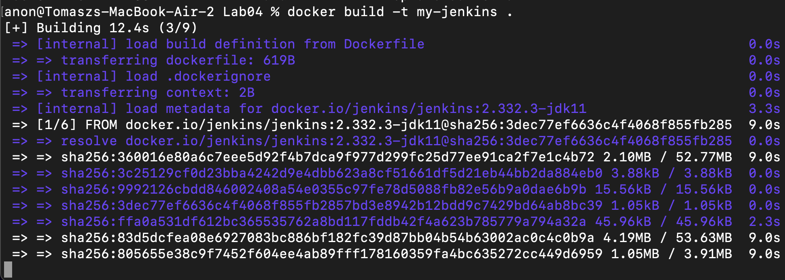
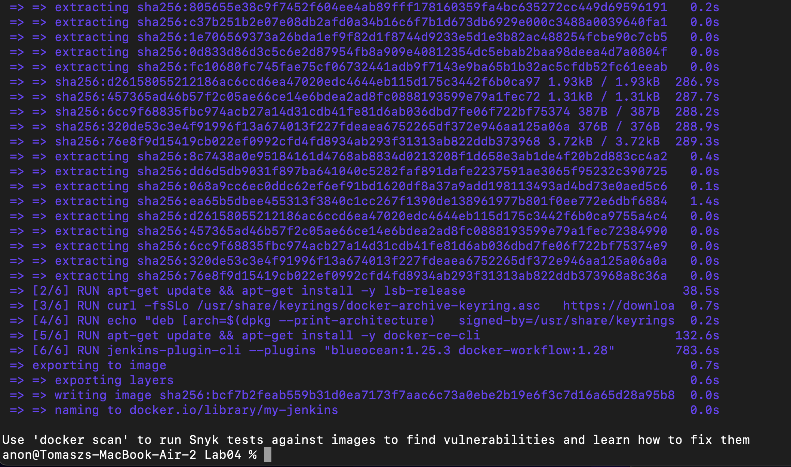

Pozostało jedynie zweryfikować poprawnośc poprzednich kroków uruchamiając komendę `docker run`, która miała na odpalenie kontenera z jenkinsem, oraz opublikowanie go na określonym porcie - w tym wypadku był to 8080 oraz 50000.

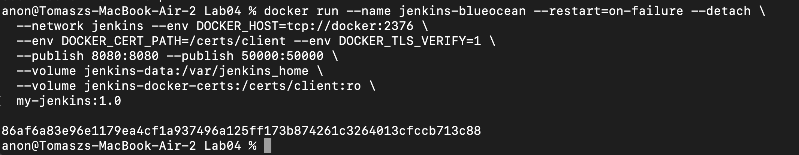

Po połączeniu się z panelem jenkinsa z przeglądarki pod adresem `localhost:8080` ukazał się komunikat o konieczności podania hasła weryfikującego, które należało pobrać z logów kontenera jenkinsa.

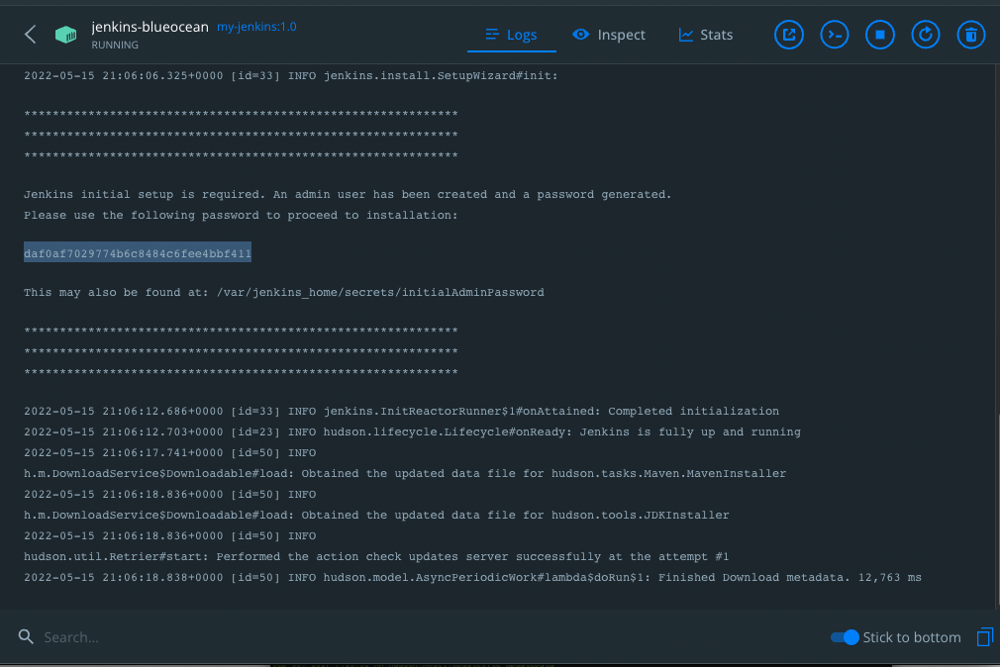

Po wpisaniu hasła (poprawnego!) można było przejść do konfiguracji komponentów Jenkins, gdzie wybrano domyślne - zalecane.


Po instalacji można było utworzyć customowe konto adminikstratora, co też zostało uczynione.

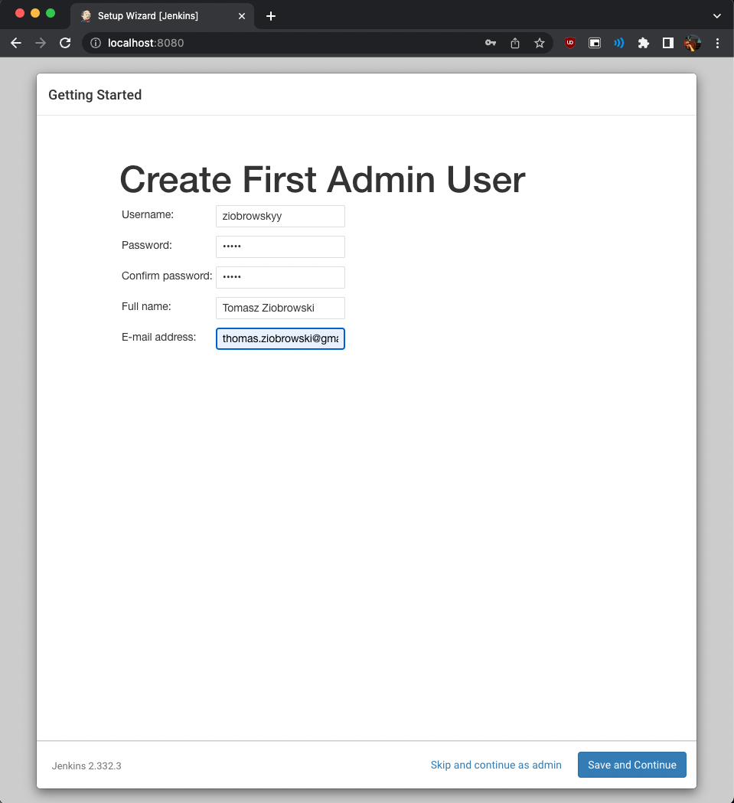

Po tym korku można było przejść do korzystania z Jenkinsa, który prawidłowo został skonfigurowany.

