# Laboratorium 5 - projekt, Tomasz Ziobrowski

## 1. Przygorowanie zadania

### Przygotowanie pipeline'a oraz SCM

Do pracy wykorzystnao instancję Jenkins działającą jako kontener Dockera przygotowaną podczas poprzedniego zadania.

W panelu Jenkinsa utworzono nowy pipeline, który nazwano "ruru".

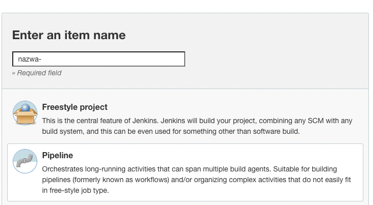

W zaawansowanej sekcji ustawień pipeline'a dodano pobieranie skryptu (oraz innych plików) z SCM (Srouce Control Management), który w tym przypadku było sforkowane repozytrium projektu na [githubie](http://github.com/Ziobrowski/ava). Ustawiono również gałąź, z której były zaciągnae zmiany.

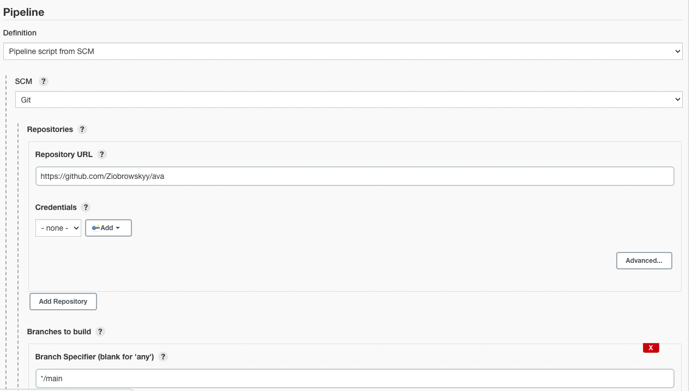

Należało również podać ścieżkę do pliku Jenkinsfike, ktory również znajdował się w tym repozytorium.


### Zarys Jenkinsfile

W pliku jenkinsfile przygotowano etapy w bloku `steps`, które zostaną uruchomione podczas budowania rurociagu, oraz w bloku `parameters` będą znajdowały się parametry builda.

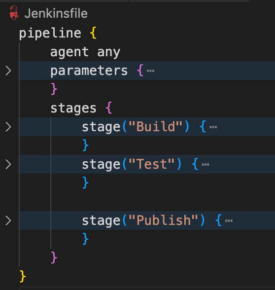


### Parametry builda

Każdy z parametrów budowania ma swój własny typ taki jak boolean, string, choice czy również password. W przypadku tego pipeline'a wybrano jedynie parametry typu bool, oraz string. Były one wykorzystane następnie do ustawień takich akcji jak publikowanie, numer wersji builda (major oraz minor) czy token do poratlu NPM.
Każdy z parametrów ma format nastepujący:

```
<typ_parametru>(name: <nazwa_parametru>, defaultValue: <wartosc_domyślna>, description: <opis_parametru>)
```

Pole description jest opcjonalne i w przypadku nie podania go, zostanie wykorzystany jako label nazwa parametru.

```Jenkinsfile
parameters {
    booleanParam(name: "PUBLISH", defaultValue: true, description: "Check to publish build to npm")
    string(name: "VERSION_MAJOR", defaultValue: "1", description: "Major version of build to be published")
    string(name: "VERSION_MINOR", defaultValue: "0", description: "Minor version of build to be published")
    string(name: "TOKEN", defaultValue: "", description: "Provide npm access token, else one in .env file is used")
}
```

Okno wprowadzania parametrów nieznacznie różni się w zależności od tego czy jest wykorzystywany interfejs Blueocean czy Jenkinsa standardowy do odpalenia budowania.

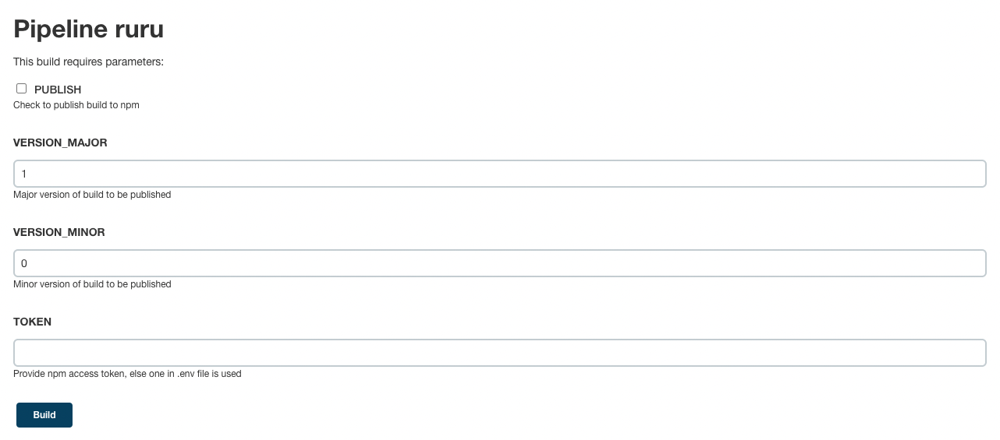

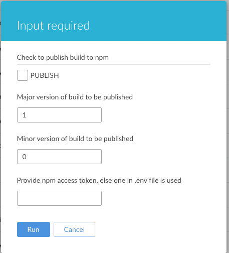

Przykładowe wykorzystnaie parametru w kodzie wygląda następująco:

```Jenkinfile
pipeline {
    parameters {
        string(name: "PARAM_1", defaultValue: "test")
    }
    stages {
        stage("Stage 1") {
            steps {
                echo "${params.PARAM_1}"
            }
        }
    }
}
```

## 2. Stage "Build"

Celem tego etapu było przygotowanie środowiska programu oraz jego instalacja.

W tym celu wykorzystano plik `Dockerfile`, który znajdował się również repozytorium projektu a w Jenkinsie pod ścieżką `/ava/Dockerfile`.

Do projektu wykorzystano multi-stage Dockcerfile, aby móc uniknąć tworzenia wielu plików dockera.

```Dockerfile
FROM node:latest AS build
RUN git clone https://github.com/Ziobrowskyy/ava.git
WORKDIR /ava
RUN npm install

FROM build AS test
WORKDIR /ava
CMD npm run test
```

Jak można zauważyć, jest to bardzo prosty skrypt, który nie wymaga zbyt wiele kroków.


W pliku `Jenkinsfile` jedynym krokiem było utworzenie obrazu dockera poleceniem `docker build --target build -t ava/build:latest .`, który przygotowywał obraz gotowego środowiska wraz z zaintalowanym programem. Obraz ten był później wykorzystany do kroku testowania oraz publish.

```Jenkinsfile
pipeline {
    (...)
    stages {
        stage("Build") {
            steps {
                sh "docker build --target build -t ava/build:latest ."
            }
        }
        (...)
    }
}
```

### Działający stage Build

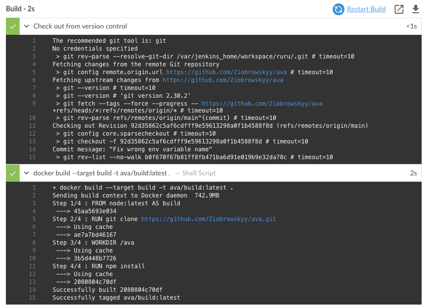

## 3. Stage "Test"

Kod Jenkisfile:

```Jenkinsfile
(...)
        Stage("Test") {
            steps {
                sh "docker build --target test -t ava/test:latest ."
                sh "docker run ava/test:latest"
            }
        }
(...)
```

Kod Dockerfile:

```Dockerfile
FROM build AS test
WORKDIR /ava
CMD npm run test
```

W tym kroku wykorzystany jest obraz z kroku build. W fazie budowania następuje jedynie ustawienie odppowiedniego katalogu roboczego, zaś podoczas `docker run` nastepuje wywołanie skryptu testującego aplikację poprzez `npm run test`.

### Działający stage Test

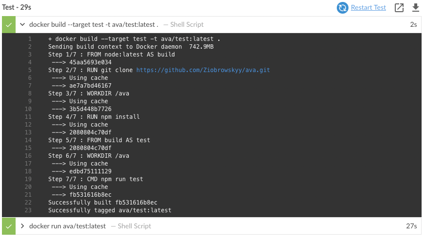

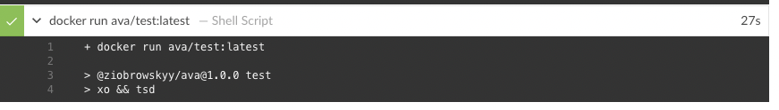

## 4. Stage "Deploy"

Aplikacja wykorzystana do tego projektu, tj. Ava jest biblioteką, któą wykorzystuje się w projektach npm i służy do testowania aplikacji. Z tego względu nie ma możliwości uruchomienia jej w kroku `Deploy`, gdyż musiałaby być najpierw zainstalowana i dociągnięta jako dependency do innego projektu, a dopiero potem uruchomiona.

Z tego też względu w pipeline pominięto krok `Deploy`.

## 5. Stage "Publish"

Pełny kod Jenkinsfile dla tego kroku:

```Jenkinsfile
(...)
        stage("Publish") {
            when {
                environment(name: "PUBLISH", value: "true")
            }
            agent {
                docker {
                    image "ava/build:latest"
                    args "-u root"
                }
            }
            steps {
                sh "git config user.email thomas.ziobrowski@gmail.com"
                sh "git config user.name Ziobrowskyy"
                script {
                    if(params.TOKEN.equals("")) {
                        echo "Using .env file token"
                        load "$JENKINS_HOME/.env"
                        sh "echo '//registry.npmjs.org/:_authToken=${NPM_TOKEN}' >> ~/.npmrc"
                    } else {
                        echo "Using param token"
                        sh "echo '//registry.npmjs.org/:_authToken=${params.TOKEN}' >> ~/.npmrc"
                    }
                }
                sh "npm version ${params.VERSION_MAJOR}.${params.VERSION_MINOR}.${BUILD_NUMBER}"
                sh "npm publish --access public"
            }
        }
(...)
```

Do warunkowego publiskowania stage wykorzystano parametr pipeline typu boolean `PUBLISH` oraz klauzulę when.
```
when {
    environment(name: "PUBLISH", value: "true")
}
```

Działa ona w ten sposób, że w momencie gdy jej zwartość zostanie zewaluowana na true, to tylko wtedy dany Stage jest uruchamiany. W tym przypadku sprawdzana jest wartość zmiennej `PUBLISH` czy jest równa `TRUE`.

Następnie jako **agent**, czyli środkowisko na rzecz którego będą wykonywane komendy w `bloku steps` wykorzystano kontener dockera utworzony w kroku `Build`.

```Jenkinsfile
agent {
    docker {
        image "ava/build:latest"
        args "-u root"
    }
}
```
```Jenkinsfile
steps {
    // Zalogowanie się go konta git - potrzebne do kroku npm version
    sh "git config user.email thomas.ziobrowski@gmail.com"
    sh "git config user.name Ziobrowskyy"
    // Sprawdzenie czy token npm został podany jako parametr pipeline 
    // orz przygotowanie pliku .npmrc, potrzebnego do autoryzacji npm publish
    script {
        if(params.TOKEN.equals("")) {
            // Zaciągnięcie wartości zmiennej środowiskowej z pliku .env
            echo "Using .env file token"
            load "$JENKINS_HOME/.env"
            sh "echo '//registry.npmjs.org/:_authToken=${NPM_TOKEN}' >> ~/.npmrc"
        } else {
            // Wykorzystnaie tokenu podanego jako parametr 
            echo "Using param token"
            sh "echo '//registry.npmjs.org/:_authToken=${params.TOKEN}' >> ~/.npmrc"
        }
    }
    // Ustawienie wybranej wersji artefaktu
    sh "npm version ${params.VERSION_MAJOR}.${params.VERSION_MINOR}.${BUILD_NUMBER}"
    // Opubliwkowanie programu do npm
    sh "npm publish --access public"
}
```

Większość kroków, k†óre wykonano w kolejnych krokach stage'a po krótce opisano jako komentarze powyżej. Całą procedurę publiskowania do npm mozna podzielić na kilka etapów:
* ustawienie nazwy użytkownika oraz email git (`git config user.[email|name] <wartość>`), które są potrzebene do nastpęngo ustawienia wersji aplickacji komendą `npm version`
* przygotowanie pliku `.npmrc`, który jest wymagany do autoryzacji uzytkownika w npm. W ten sposób wiadomo, kto jest autorem danego repo do opubliskowania. W celu autoryzacji wykorzystywany jest token npm.
    - aby wygenrować token, należy wejść w ustaienia konta na stronie (npm)[npmjs.com], a następnie wejść w zakładkę `Aceess tokens`. Wyświetlają się tam wygenrowane tokeny, oraz opcja utworzenia nowego
    
    - przy generowaniu tokenu należy podać nazwę, która umożliwi późniejszą jego identyfikację oraz wybrać prawa, które będą przyznae po zalogowaniu z wykorzytaniem tegż oto tokenu. W naszym przypadku należy wybrać opcję `publish`, ponieważ będziemy chcieli opubliskować z pipeline'a nasz projekt do npm.
    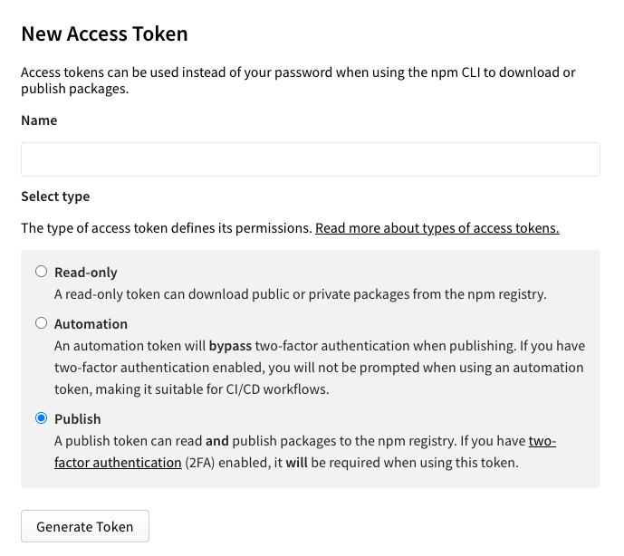
* zakładając, że token jest dos†epny jako zmienna należy przygotować plik `.npmrc` komendą `echo '//registry.npmjs.org/:_authToken=${NPM_TOKEN}' >> ~/.npmrc`, która umieści adres registry npm oraz token autoryzacyjny w tym pliku
    - Oprócz przekazania tokenu jako paramtetr pipeline' jest możliwość użycia pliku `.env` w katalogu głównym Jenkinsa. Przygotowujemy w następujący sposób plik:
    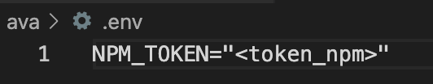

    - następnie należy go wysłać do kontenera Jenkinsa
    
    - można go odczytać z pliku Jenkinsfile wykorzystując komendę `load <sciezka_do_pliku>`, a nastepnie wykorzystać jako zmienną środowiskową jak tu:
    ```Jenkinsfile  
    load "$JENKINS_HOME/.env" //zawartość pliku .env: NPM_TOKEN="<token>"
    sh "echo '//registry.npmjs.org/:_authToken=${NPM_TOKEN}' >> ~/.npmrc"
    ```
* kolejnym krokiem będzie ustawienie odpowiedniej wersji programu do publikacji wykorsztując komendę `npm version <nr_wersji>`, gdzie numer wersji musi zawierać 3 cyrfy oddzielone kropkami w formacie `<MAJOR>.<MINOR>.<FIX>`. 
    - numer wersji major oraz minor pobrano jako paramtetr pipeline'a a jako ostatnią wartość użyto numer builda Jenkinsa jako `npm version ${params.MAJOR}.${params.MINOR}.{BUILD_NUMBER}`
* opublikowanie projektu do repozytorium npm komendą `npm publish --access public`
    - zakładając że token npm podany wcześniej jest prawidłowy oraz nastąpiłą porawnie autoryzacjia użytkownika krok ten powinien przebiec prawidlowo
    - numer wersji opubliskowanego progrmau nie moze się różnić, ponieważ inaczej może nastąpic bląd
    - posiadając jedynie darmowe konto na npm należy publiskować projekty jako publiczne z flagą `--access public`, inaczej wystąpi bład w tym kroku 

### Działający stage Publish

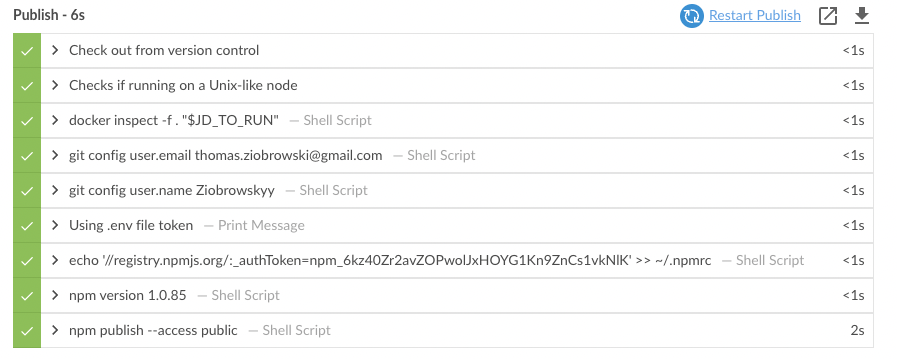

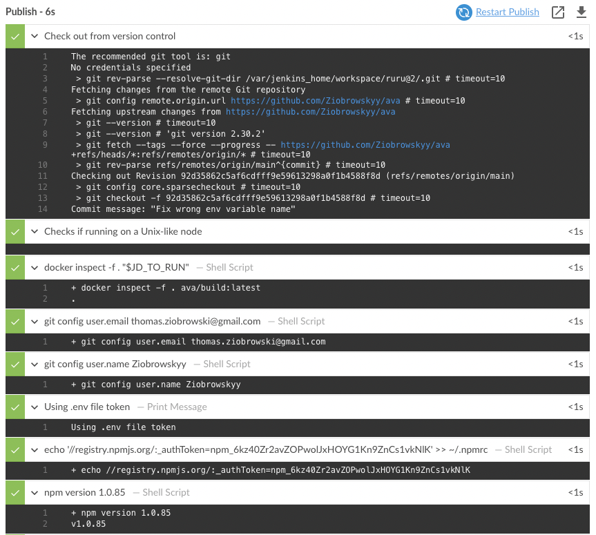

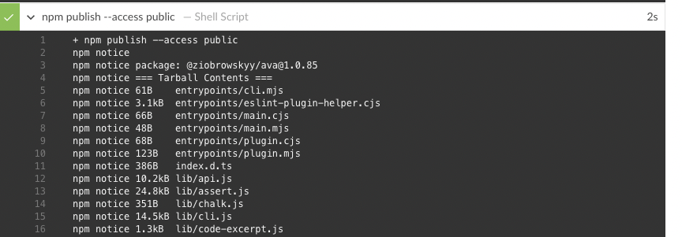

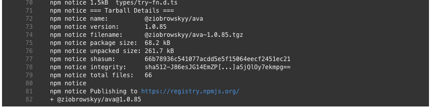

### Dzialajacy build pipeline'a

Gotowy plik Jenkinsfile:
```Jenkinsfile
pipeline {
    agent any
    parameters {
        booleanParam(name: "PUBLISH", defaultValue: true, description: "Check to publish build to npm")
        string(name: "VERSION_MAJOR", defaultValue: "1", description: "Major version of build to be published")
        string(name: "VERSION_MINOR", defaultValue: "0", description: "Minor version of build to be published")
        string(name: "TOKEN", defaultValue: "", description: "Provide npm access token, else one in .env file is used")
    }
    stages {
        stage("Build") {
            steps {
                sh "docker build --target build -t ava/build:latest ."
            }
        }
        stage("Test") {
            steps {
                sh "docker build --target test -t ava/test:latest ."
                sh "docker run ava/test:latest"
            }
        }

        stage("Publish") {
            
            when {
                environment(name: "PUBLISH", value: "true")
            }
            agent {
                docker {
                    image "ava/build:latest"
                    args "-u root"
                }
            }
            steps {
                sh "git config user.email thomas.ziobrowski@gmail.com"
                sh "git config user.name Ziobrowskyy"
                script {
                    if(params.TOKEN.equals("")) {
                        echo "Using .env file token"
                        load "$JENKINS_HOME/.env"
                        sh "echo '//registry.npmjs.org/:_authToken=${NPM_TOKEN}' >> ~/.npmrc"
                    } else {
                        echo "Using param token"
                        sh "echo '//registry.npmjs.org/:_authToken=${params.TOKEN}' >> ~/.npmrc"
                    }
                }
                sh "npm version ${params.VERSION_MAJOR}.${params.VERSION_MINOR}.${BUILD_NUMBER}"
                sh "npm publish --access public"
            }
        }
    }
}

```


* wraz z publish

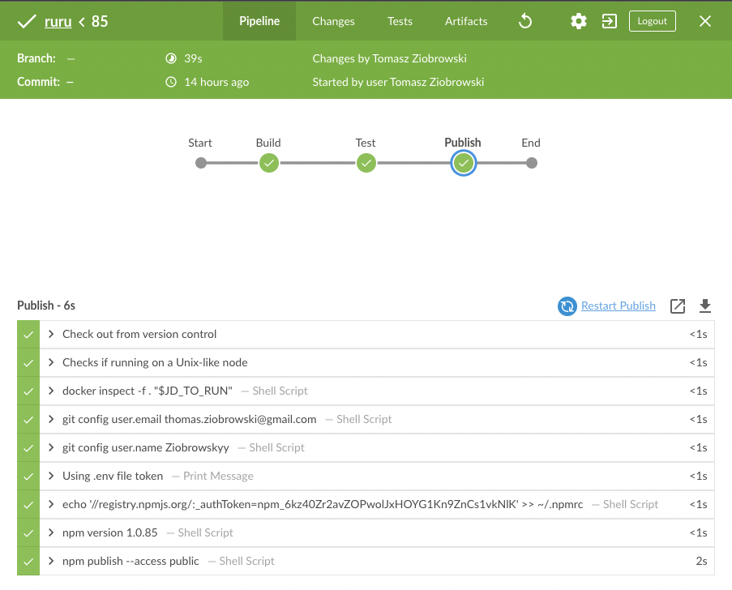
* bez publish

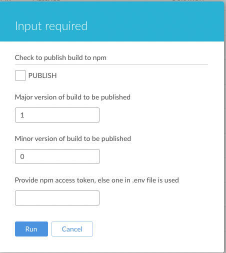

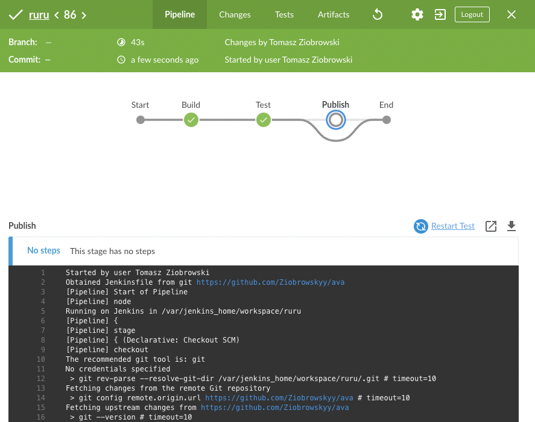

## 6. Napotkane problemy

* Jednym z natrętnie mnie spotykających problemów podczas rezalizacji tego projektu była konieczność pamietania, cyz podczas uruchomienie jenkisa, działa również kontener dina Dockera. Errory, które się w przeciwnym wypadku pojawiały były bardzo niepomocne i sprawiały wiele problemów, ponieważ ciężko było je wyszukać w internecie :^( Dopiero w momencie poddanaia się i reinsatacji Jenkisa na nowo odkryłem, że własnie dockerowy dind był źródłem kłopotów i frustracji.
    - zmarnowany czas: 4-5h
* W przypadku Jenkisa i paramterów budowania, od roku 2018 nie potrafią naprawić aktualizacji tychże paramterów. Kilkukrotne odpalanie pipeline'a nie rozwiązywało problemu z cachowaniem poprzednich parametów. Tak samo uruchamianie ponowne Jenkisa nie przyniosło spodziewanych rezultatów. Rozwiązanie było takie, że należało w interfejsu Blueocean przejść do standardowego, tam odpalić jescze raz build (a czaem nie trzeba było) i magicznie pojawiały się już zaktualizaowane paramery (???). Po odpaleniu builda ze standardowego UI i przejściu z powrotem na Blueocean tam również były one zaktualizowane.
    - zmarnowany czas: 2h