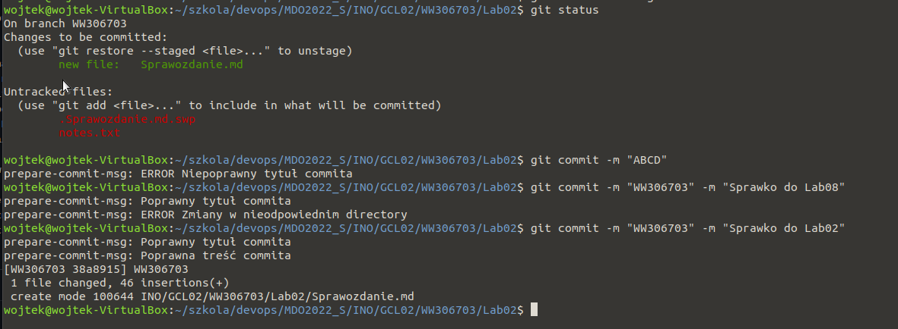
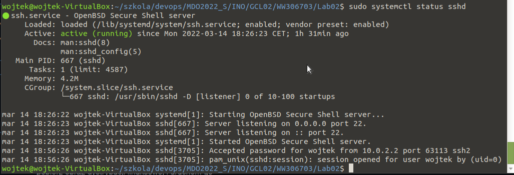
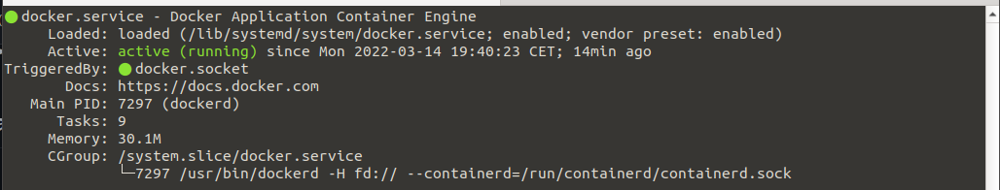
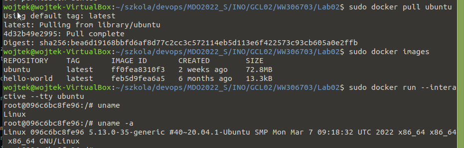

1. Przygotuj git hook, który rozwiąże najczęstsze problemy z commitami
* hook sprawdzający, czy tytuł commita nazywa się ```<inicjały><numer indeksu>```
* hook sprawdzającym, czy w treści commita pada numer labu, właściwy dla zadania

Oba podpunkty zadania zrealizowano przy pomocy skryptu pisanego w Python. Wykorzystano do tego hook ```/.git/hooks/prepare-commit-msg```. Przykładowe działanie skryptu przedstawiono na obrazie poniżej.



2. Umieść hook w sprawozdaniu w taki sposób, aby dało się go przeczytać
```
#!/usr/bin/env python3

import sys, re
from subprocess import check_output

commit_msg_filepath = sys.argv[1]

with open(commit_msg_filepath, 'r') as f:
    title = f.readline()
    content = f.read().strip()

    if "WW306703" in title:
        print("prepare-commit-msg: Poprawny tytuł commita")

        result = re.search(r"Lab(\d\d)", content)
        if result:
            lab_number = result.group(1)
            diff_numstat = str(check_output(['git', 'diff', '--cached', '--numstat']), 'utf-8').strip()

            result = re.search(r"Lab(\d\d)", diff_numstat)
            if result:
                changes = set(result.groups())
                if len(changes) == 1 and lab_number in changes:
                    print("prepare-commit-msg: Poprawna treść commita")
                    sys.exit(0)
                else:
                    print("prepare-commit-msg: ERROR Zmiany w nieodpowiednim directory")
                    sys.exit(1)
            else:
                print("prepare-commit-msg: ERROR Pusty commit")
                sys.exit(1)
        else:
            print("prepare-commit-msg: ERROR Brak numeru laboratoriów w treści commita")
            sys.exit(1)
    else:
        print("prepare-commit-msg: ERROR Niepoprawny tytuł commita")
        sys.exit(1)
```
3. Rozpocznij przygotowanie środowiska Dockerowego
* zapewnij dostęp do maszyny wirtualnej przez zdalny terminal (nie "przez okienko")

Dostęp zapewniono poprzez przekierowanie portów maszyny wirtualnej. Na obrazie poniżej przedstawiam status usługi ```sshd```. Dwa ostatnie zapisy w logach pokazują połączenie z hosta.



* zainstaluj środowisko dockerowe w stosowany systemie operacyjnym

Instalacja odbyła się poprzez wykonanie następujących poleceń:
```
sudo apt install apt-transport-https ca-certificates curl software-properties-common
curl -fsSL https://download.docker.com/linux/ubuntu/gpg | sudo apt-key add -
sudo add-apt-repository "deb [arch=amd64] https://download.docker.com/linux/ubuntu focal stable"
sudo apt install docker-ce
```

4. Działanie środowiska
* wykaż, że środowisko dockerowe jest uruchomione i działa (z definicji)

Na obrazie poniżej przedstawiono wydruk polecenia ```sudo systemctl status docker```.



* wykaż działanie w sposób praktyczny (z własności):
* * pobierz obraz dystrybucji linuksowej i uruchom go
* * wyświetl jego numer wersji

Na obrazie poniżej przedstawiono kroki potrzebne do wykonania polecenia. Uruchomienie kontenera poprzez opcje ```sudo docker run --interactive --tty ubuntu``` pozwala na interaktywne działanie na uruchomionym kontenerze.



5. Załóż konto na Docker Hub


