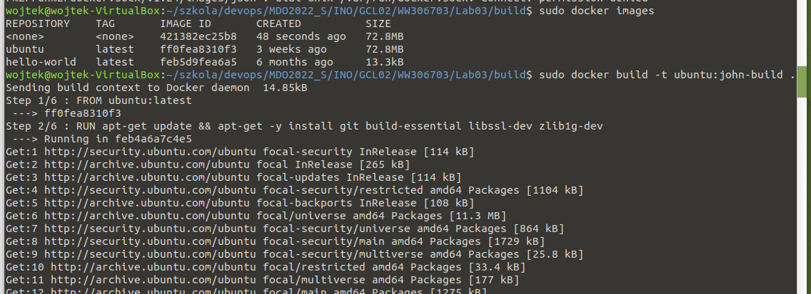
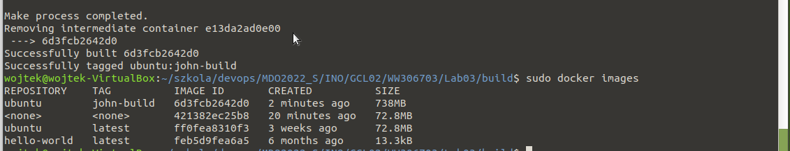
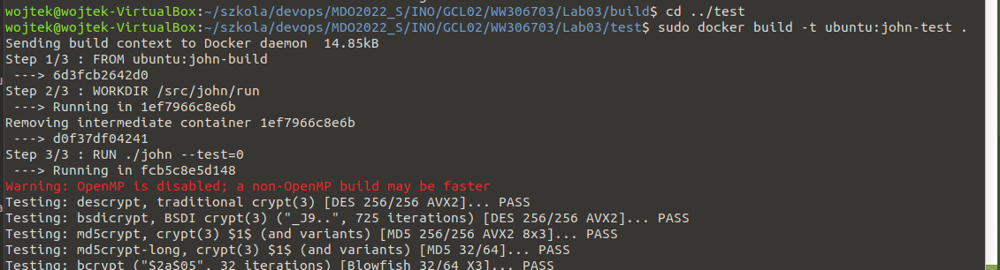
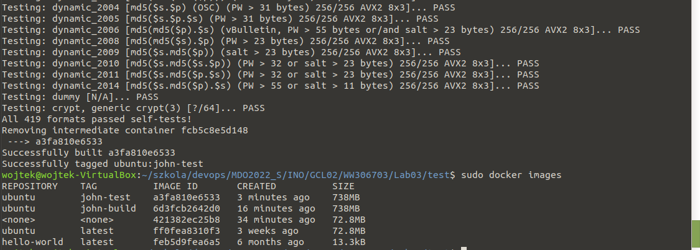

### Wybór oprogramowania na zajęcia
* Wybrano oprogramowanie [John the Ripper jumbo](https://github.com/openwall/john) dystrybuowane na licencji GNU GPL v2.0
* * Repozytorium sklonowano


* * Zainstalowano zależności i przeprowadzono build programu (według kroków określonych w [doc/INSTALL-UBUNTU](https://github.com/openwall/john/blob/bleeding-jumbo/doc/INSTALL-UBUNTU)


* * Uruchomiono testy dołączone do oprogramowania


### Przeprowadzenie buildu w kontenerze
* Budowa obrazu zawierającego build programu
* * Napisano plik `build/Dockerfile`, przeprowadzający budowanie programu (wraz z instalacją zależności). Kontener bazuje na obrazie `ubuntu`.
```
FROM ubuntu:latest
# dependecies
RUN apt-get update && apt-get -y install git build-essential libssl-dev zlib1g-dev
# get source
WORKDIR /src
RUN git clone https://github.com/openwall/john -b bleeding-jumbo john
# build
WORKDIR /src/john/src
RUN ./configure && make -s clean && make -sj4
```

* * Uruchomienie buildu poleceniem `sudo docker build -t ubuntu:john-build .`, jako context dla dockera podając bieżący folder.





* Budowa kontenera przeprowadzającego testy
* * Napisano plik `test/Dockerfile` budujący nowy obraz bazujący na `ubuntu:john-build`.
```
FROM ubuntu:john-build
WORKDIR /src/john/run
RUN ./john --test=0
``` 

* * Budowa obrazu testującego.





