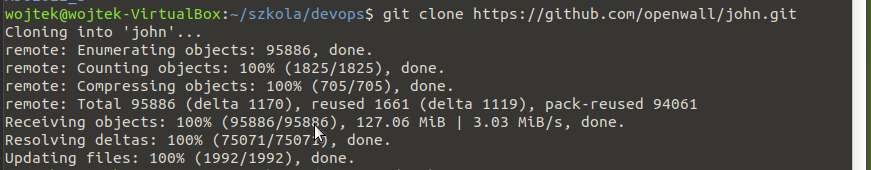
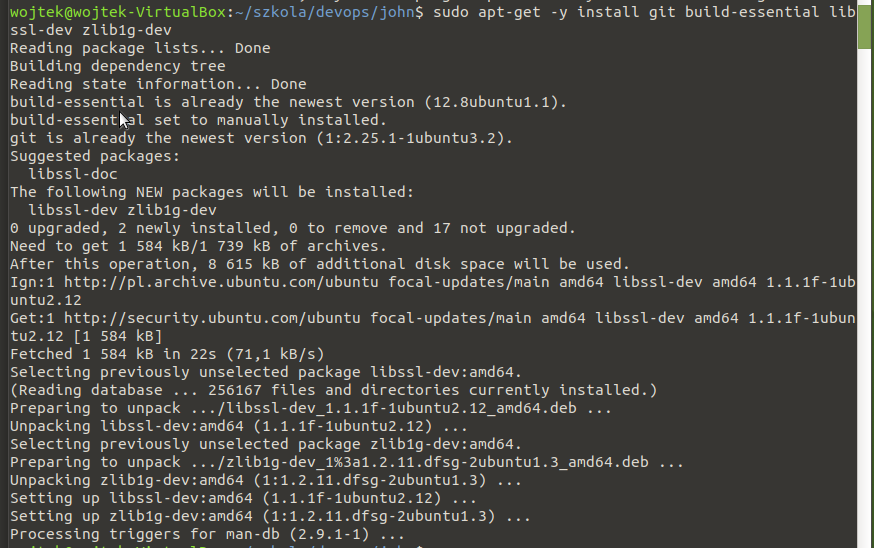
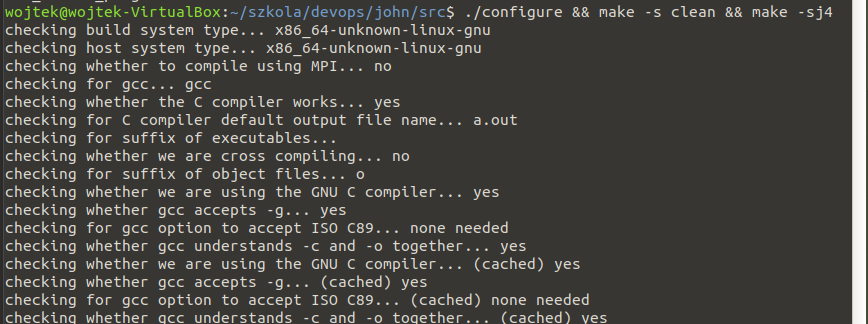
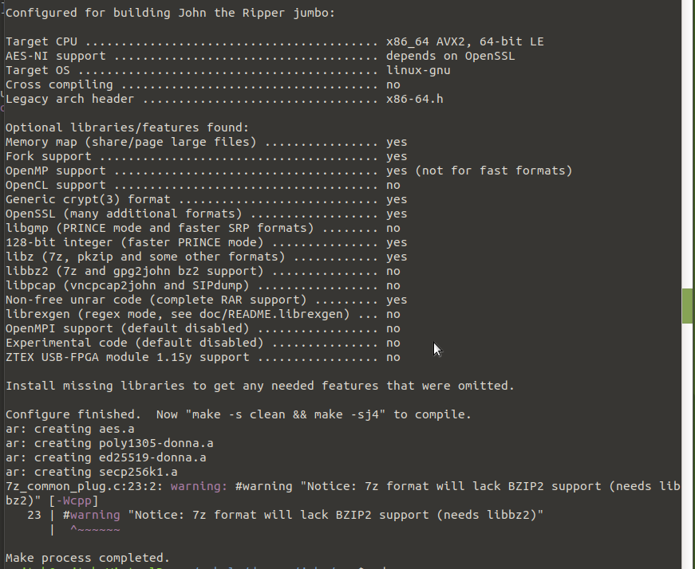
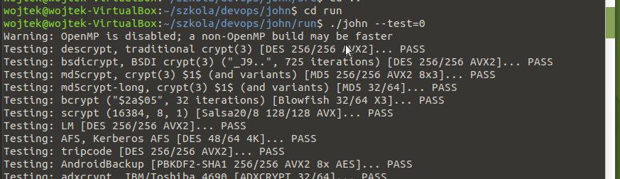
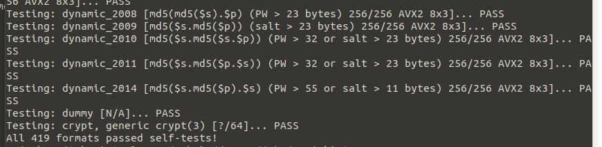

### Wybór oprogramowania na zajęcia
* Wybrano oprogramowanie [John the Ripper jumbo](https://github.com/openwall/john) dystrybuowane na licencji GNU GPL v2.0
* * Repozytorium sklonowano

* * Zainstalowano zależności i przeprowadzono build programu (według kroków określonych w [doc/INSTALL-UBUNTU](https://github.com/openwall/john/blob/bleeding-jumbo/doc/INSTALL-UBUNTU)

* * Uruchomiono testy dołączone do oprogramowania

