## 1. Zainstaluj klienta Git i obsługę kluczy SSH
Instalacja git: `sudo pacman -S git`  
Aktualna wersja git jest aktualna, więc nie nadpisuję tej wersji.
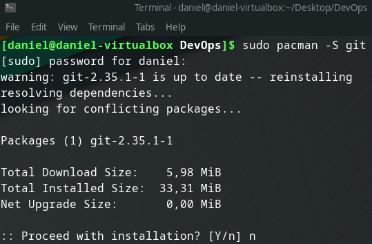

Sprawdzenie aktualnej wersji git: `git --version`  
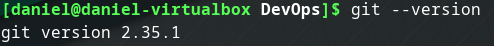

Sprawdzenie, czy narzędzie SSH jest zainstalowane: `ssh -V`   
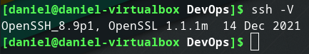

## 2. Sklonuj repozytorium https://github.com/InzynieriaOprogramowaniaAGH/MDO2022_S za pomocą HTTPS  
**Sklonowanie repozytorium:** `git clone https://github.com/InzynieriaOprogramowaniaAGH/MDO2022_S`
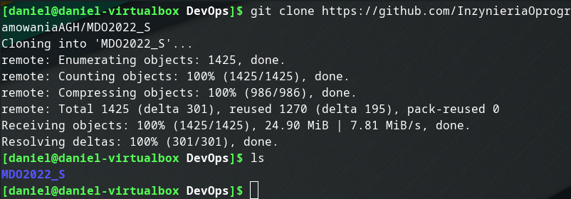

## 3. Upewnij się w kwestii dostępu do repozytorium jako uczestnik i sklonuj je za pomocą utworzonego klucza SSH
- Utwórz dwa klucze SSH, inne niż RSA, w tym co najmniej jeden zabezpieczony hasłem  
Utworzenie klucza: `ssh-keygen -t ed25519 -f my_key`
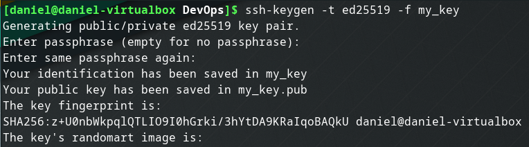
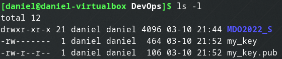
- Skonfiguruj klucz SSH jako metodę dostępu do GitHuba.  
Dodanie klucza do agenta ssh: `ssh-add my_key`
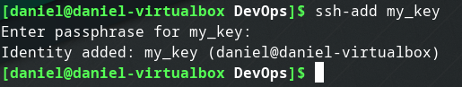  
Po przejściu do ustawień konta, dodałem nowy klucz ssh: 
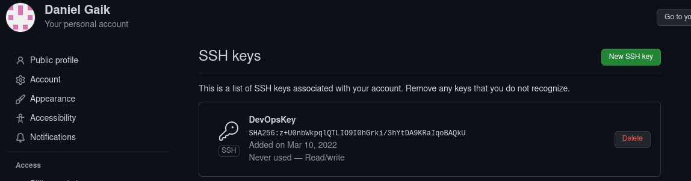  
- Sklonuj repozytorium z wykorzystaniem protokołu SSH.  
Stare repozytorium usunąłem w celu pobrania go ponownie przez ssh: `rm -r MDO2022_S/`  
Sklonowanie repozytorium poprzez ssh: `git clone git@github.com:InzynieriaOprogramowaniaAGH/MDO2022_S.git`  
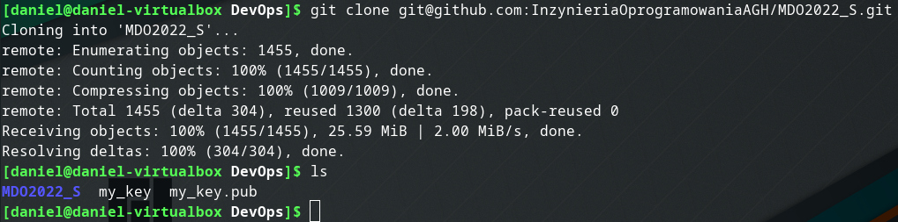
## 4. Przełącz się na gałąź main, a potem na gałąź swojej grupy (pilnuj gałęzi i katalogu!)  
Aby przełączyć się na gałąź main, musiałem najpierw przejść do katlogu z repozytorium przy użyciu polecenia `cd MD02022_s/`, a następnie przełączyć się na gałąź main `git checkout main` i kolejno na gałąź grupy `git checkout ITE-GCL03`  
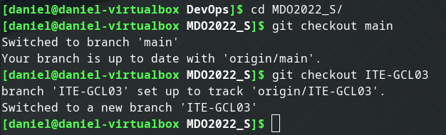  
Sprawdzenie na jakiej gałęzi się znajduję przy użyciu polecenia `git branch`  
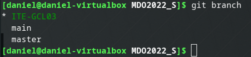  
## 5. Utwórz gałąź o nazwie "inicjały & nr indeksu" np. KD232144. Miej na uwadze, że odgałęziasz się od brancha grupy!  
Utworzenie nowej gałęzi z inicjałami i indeksem: `git checkout -b DG401340`  
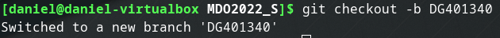
Sprawdzenie aktualnego brancha poleceniem: `git branch`  
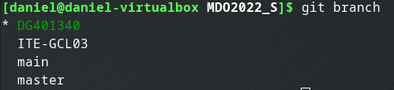  
## 6. Rozpocznij pracę na nowej gałęzi  
W katalogu właściwym dla grupy utworzenie nowego katalogu z inicjałami, a następnie utworzenie katalogu Lab01. Następnie  katalogu tym umieszczane jest sprawozdanie razem ze zrzutami ekranu.  
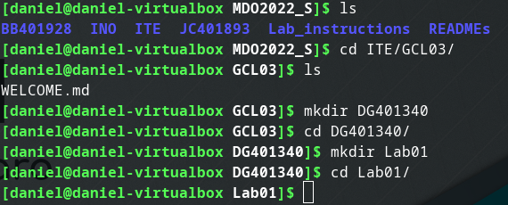  
Kolejno wykonane polecenia:  
`cd ITE/GCL03/`  
`mkdir DG401340`  
`cd DG401340`  
`mkdir Lab01/`  
Zawartość katalogu po skopiowaniu plików:  
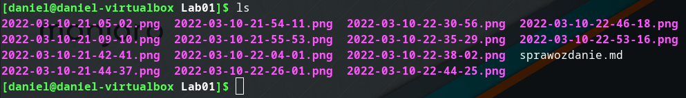  
Dodatnie zmian:  
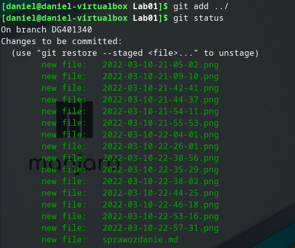  
Utworzenie commita i wysłanie zmian do zdalnego źródła:  
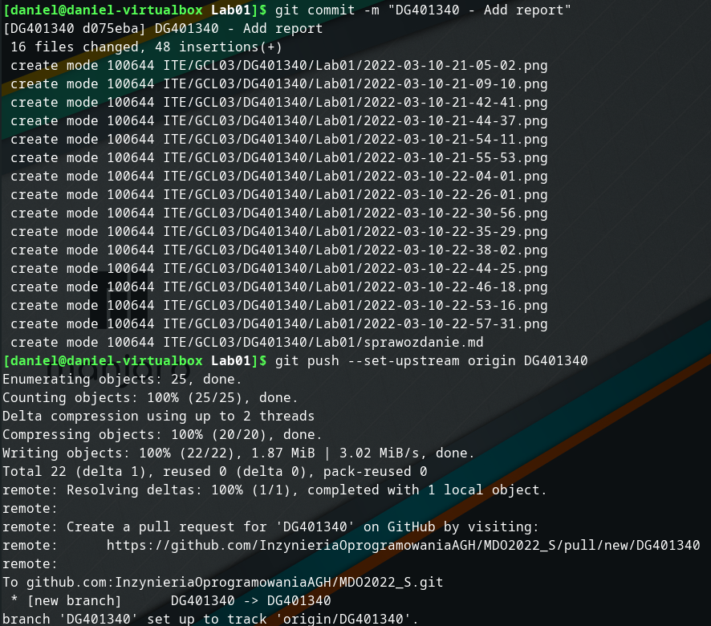
Próba wciągnięcia swojej gałęzi do gałęzi grupowej:  
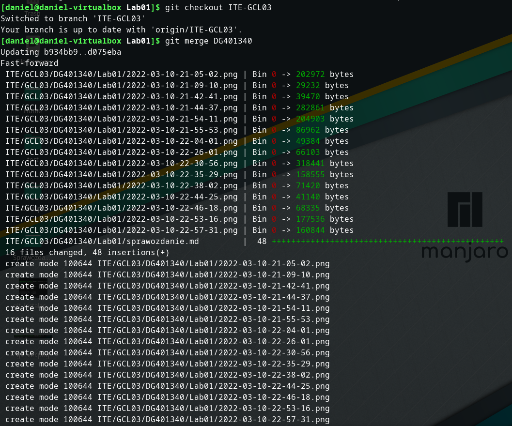  
Branche nie zostały złączone:  
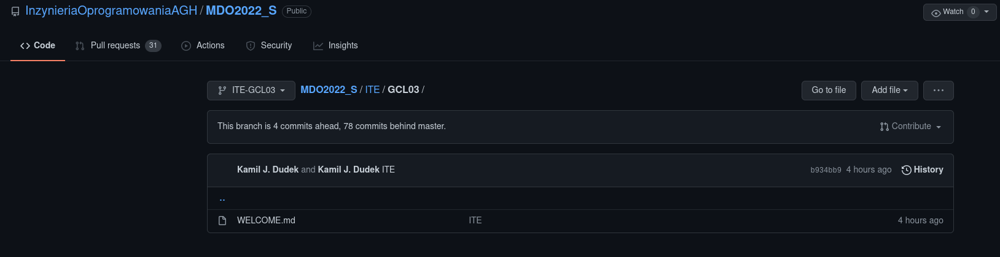  
## 7. Sprawozdane zostało zaktualizowane i wstawiłem pull request do gałęzi grupowej.