## 1. Przygotuj git hook, który rozwiąże najczęstsze problemy z commitami
* hook sprawdzający, czy tytuł commita nazywa się ```<inicjały><numer indeksu>``` 
  Na samym początku należało wejść do katalogu hooks w naszym lokalnym repozytorium, który znajduje się w katalogu .git. (Będąc w bazowym katalogu naszego repozytorium wpisujemy polecenie ```cd .git/hooks/```). Następnie w tym katalogu należało utworzyć plik commit-msg poleceniem ```touch commit-msg``` i do utworzonego pliku wkleić następujący skrypt:
```bash
#!/bin/sh

test -n "$(grep 'DG401340' ${1})" || {
        echo >&2 "ERROR: Commit title has to contain DG401340"
        exit -1
}
test -n "$(grep 'Lab02' ${2})" || {
        echo >&2 "ERROR: Commit message has to contain Lab02"
        exit -1
}
```  
Aby umożliwić naszemu skryptowi działanie musimy nadać mu odpowiednie uprawnienia co robimy poleceniem: ```chmod +x commit-msg```  
Dzięki temu tworząc commita z tytułem bez DG401340, commit ten nie zostanie utworzony. Jeżeli commit nie będzie zawierał w treści Lab02 to też nie zostanie on utworzony. Prezentacja działania znajduje się na poniższym zrzucie ekranu:    


* hook sprawdzający, czy w treści commita pada numer labu, właściwy dla zadania   
Hook jest przedstawiony w poprzednim punkcie. 1 hook sprawdza obie te rzeczy.

## 2. Umieść hook w sprawozdaniu w taki sposób, aby dało się go przejrzeć   
Hooki umieszone w punkcie 1.

## 3. Rozpocznij przygotowanie środowiska Dockerowego  
* zapewnij dostęp do maszyny wirtualnej przez zdalny terminal (nie "przez okienko")  
Na samym początku należy zainstalować OpenSSH, dzięki czemu będziemy mogli uruchomić serwis sshd, zrobimy to poleceniem: ```sudo pacman -S openssh```.  
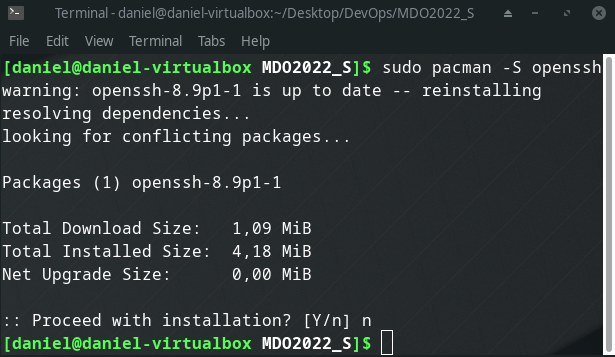  
Orzymałem informację zwrotną, że openssh jest aktualne, więc anulowałem instalację.  
Należy teraz sprawdzić, czy serwis sshd działa: ```sudo systemctl status sshd.service```  
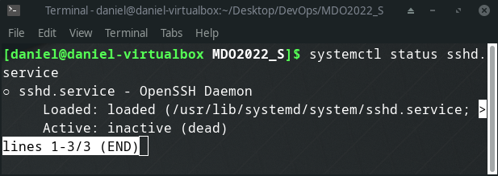  
Usługa jest niekatywna więc należy ją włączyć: ```sudo systemctl enable sshd.service``` (polecenie to aktywuje usługę, ale jej nie włącza. Dzięki temu poleceniu przy każdym uruchomieniu systemu, usługa będzie uruchamiana automatycznie). ```sudo systemctl start sshd.service``` (to polecenie uruchamia usługę).  
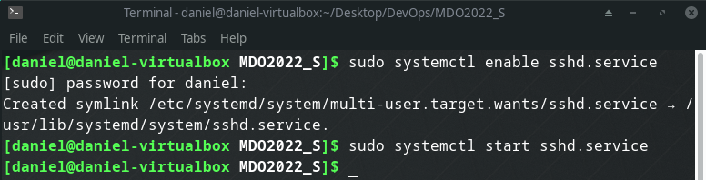  
Sprawdzenie, czy usługa jest uruchomiona: ```sudo systemctl status sshd.service```  
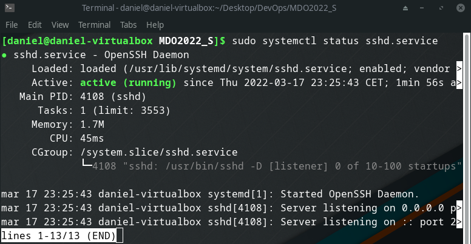  
Teraz należy sprawdzić jakie ip posiada nasza vm: ```ip address```  
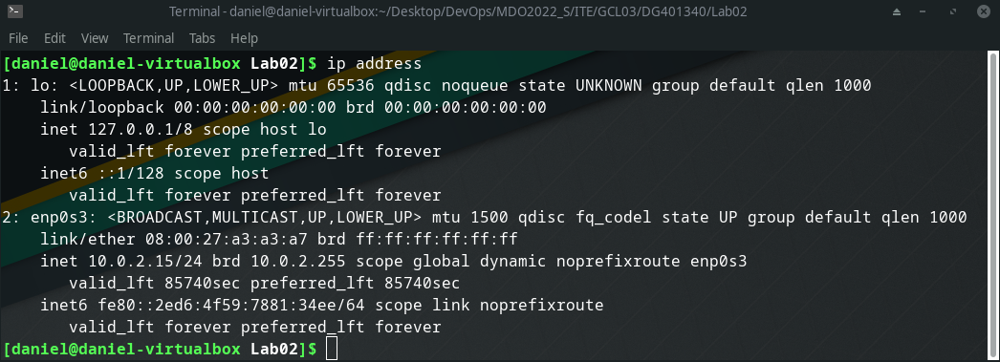  
Adres ip vm podany jest w punkcie 2, po słowie inet i wynosi on w moim przypadku: 10.0.2.15  
Teraz na naszym komputerze (poza vm) możemy sprawdzić czy nasza maszyna wirtualna jest osiągalna. W przypadku systemu windows uruchamiamy PowerShell i wpisujemy polecenie ```ping <ip_vm>```, czyli w moim przypadku ```ping 10.0.2.15```:  
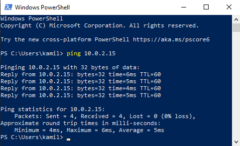  
Maszyna jest osiągalna, ale jeszcze nie połączymy się do niej poprzez port ssh. Musimy zezwolić na łączenie się do maszyny poprzez port ssh. Więc wracamy do terminala naszej maszyny wirtualnej i wpisujemy polecenie ```sudo ufw allow ssh```, które otwiera nam port. Następnie musimy uruchomić firewalla, tak żeby wcześniej dodana reguła działała: ```sudo ufw enable```. Aby sprawdzić czy firewall działa i czy reguła została dodana wpisujemy ```sudo ufw status```.  
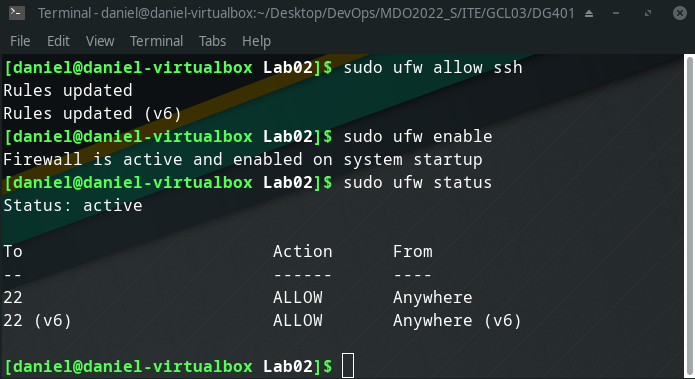  
Wracamy teraz do naszego bazowego systemu i wykonujemy ostatnią rzecz, która umoliwi nam połączenie się przez port ssh z vm. Musimy ustawić przekierowanie portów w maszynie wirtualnej. Robimy to przechodząc do ustawień danej maszyny wirtualnej następnie zakładka Sieć, rozwijamy zaawansowane i klikamy przycisk przekierowanie portów. W okienku, które nam wyskoczyło dodajemy następujący rekord:  
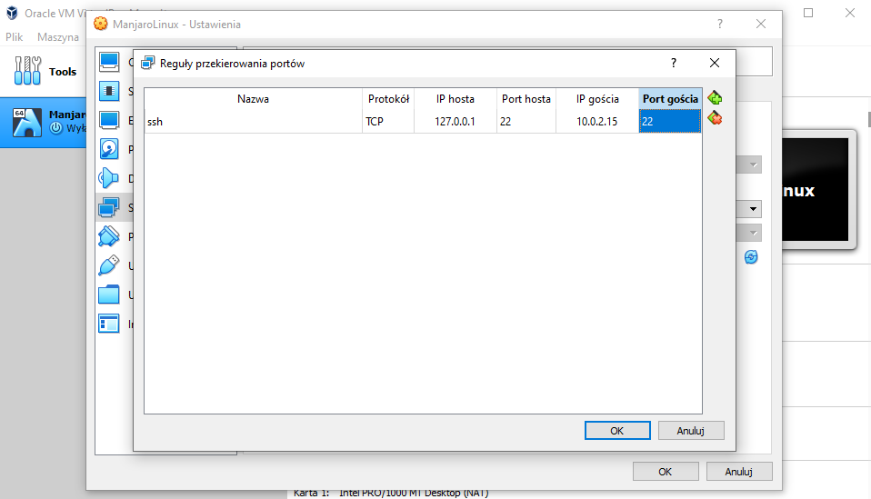  
  Na tym etapie możemy się już połączyć z naszą maszyną wirtualną poprzez ssh. Przechodzimy do powershella i wpisujemy ```ssh daniel@127.0.0.1``` (127.0.0.1 zamiast ip maszyny, ponieważ w poprzednim kroku zrobiliśmy przekierowanie portu, które umożliwia komunikację z maszyną wirtualną po ssh):  
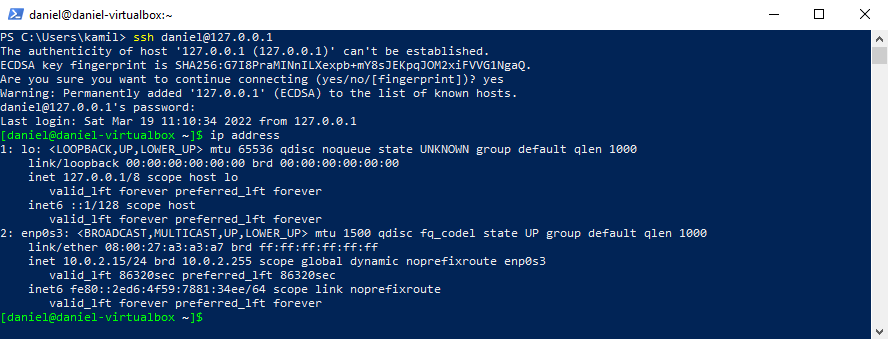  
Zrzut ekranu przedstawia pomyślnie połączenie się z maszyną wirtualną poprzez ssh. Dowodem jest wyświetlenie ip maszyny wirtualnej w konsoli PowerShell.


* zainstaluj środowisko dockerowe w stosowanym systemie operacyjnym  
Instalacja dockera: ```sudo pacman -S docker```  
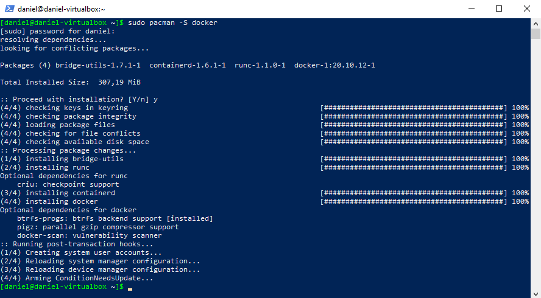 
  Następnie należy włączyć dockera co robimy poleceniami ```sudo systemctl enable docker``` (włączenie, żeby docker uruchamiał się wraz ze startem systemu). ```sudo systemctl start docker``` (włączenie usługi). Możemy teraz sprawdzić, czy docker jest uruchomiony poleceniem: ```sudo systemctl status docker```.  
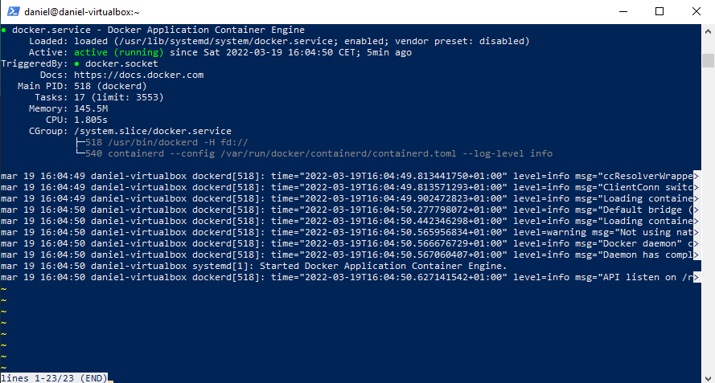 

## 4. Działanie środowiska  
* wykaż, że środowisko dockerowe jest uruchomione i działa (z definicji)  
Na zrzucie ekranu przedstawionym wyżej widać, że usługa jest uruchomiona i działa. Dodatkowo poniżej przedstawiam zrzut ekranu, które pokazuje uruchomienie aplikacji testowej hello-world na dockerze: ```sudo docker run hello-world```  
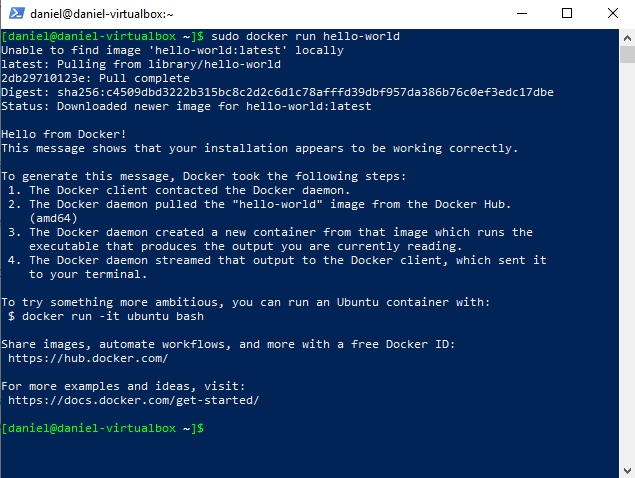  
* wykaż działanie z sposób praktyczny (z własności):  
  * pobierz obraz dystrybucji linuksowej i uruchom go  
  Ściągnięcie obrazu: ```sudo docker pull ubuntu```  
  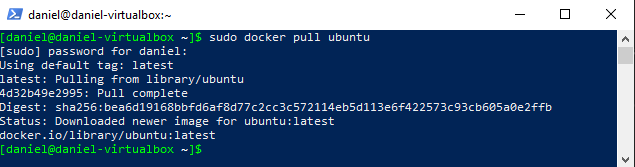  
  Uruchomienie kontenera w sposób interaktywny: ```sudo docker run --name ubun -it ubuntu```  
  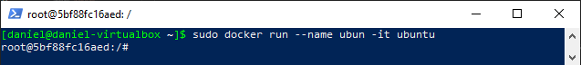  
  * wyświetl jego numer wersji  
  Sprawdzenie wersji, przy użyciu poleceni: ```uname -a``` oraz ```cat /etc/lsb-release```:  
  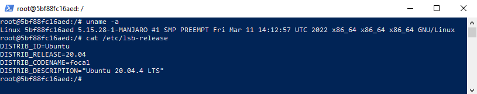  

## 5. Załóż konto na Docker Hub
Posiadam już założone konto na Docker Hub:  
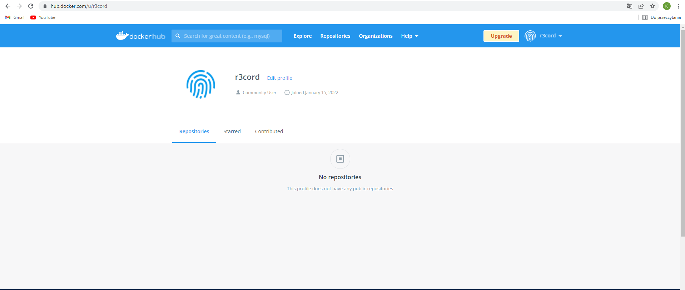  


