## Wybór oprogramowania na zajęcia:  
* Znalezione repozytorium z otwartą licencją i dopowiednimi narędziami do budowania (java, maven):  
https://github.com/DiscordSRV/DiscordSRV 
  
* Sklonuj niniejsze repozytorium, przeprowadź build programu (doinstaluj wymagane zależności):  
Sklonowanie repozytorium ```git clone https://github.com/DiscordSRV/DiscordSRV```:  
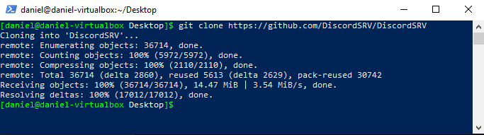  
Doinstalowanie potrzebnych zależności, Javy 17 oraz Mavena:  
Java (```sudo pacman -S jdk17-openjdk```):  
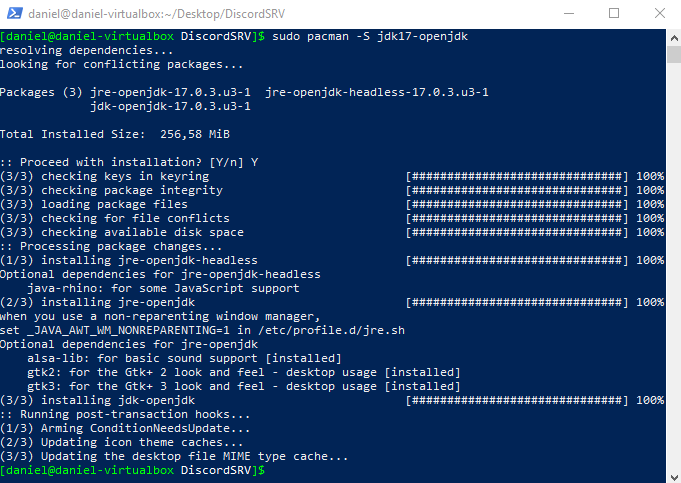  
Maven (```sudo pacman -S maven```):  
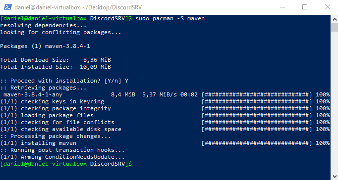  
Przeprowadzenie buildu programu (```sudo mvn clean package```):  
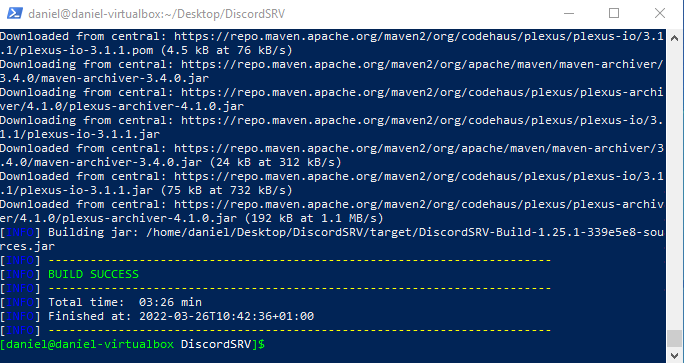  
Zaprezentowano tylko pomyślne ukończenie budowania, ponieważ budowanie trwało bardzo długo i pobierało wiele zależności.  
* Uruchom testy jednostkowe dołączone do repozytorium:  
Uruchomienie testów poleceniem ```mvn test```:  
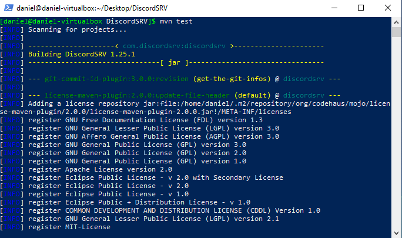  
Pomyślne wykonanie testów:  
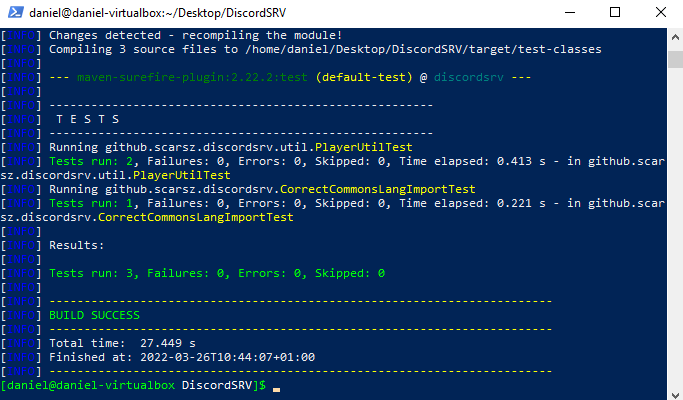  
  
## 1. Wykonaj kroki build i test wewnątrz wybranego kontenera bazowego. Tj. wybierz "wystarczający" kontener, np ubuntu dla aplikacji C lub node dla Node.js  
Wybranym kontenerem bazowym jest ubuntu:jammy, do którego doinstalowywane są potrzebne pakiety.  
* uruchom kontener  
Pobranie odpowiedniego kontenera poleceniem: ```sudo docker pull ubuntu:jammy``` i uruchomienie go interaktywnie: ```sudo docker run --name build -it ubuntu:jammy```  
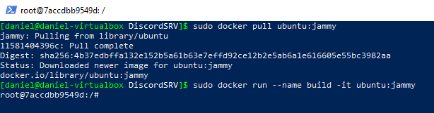  
  
* podłącz do niego TTY celem rozpoczęcia interaktywnej pracy  
Podłączenie się do niego znajduje się w poprzednim punkcie
  
* zaopatrz kontener w wymagania wstępne (jeżeli proces budowania nie robi tego sam)  
Na samym początu należy zaktualizować repozytorium pakietów poleceniem: ```apt-get update```:  
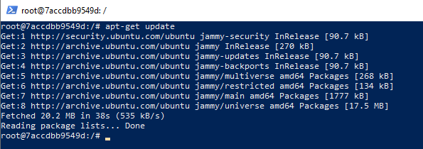  
Następnie dodałem zmienną środowiskową (```export TZ=Europe/Warsaw```) i potem zainstalowałem potrzebne patkiety (```apt-get install -y tzdata git openjdk-17-jdk maven```):  
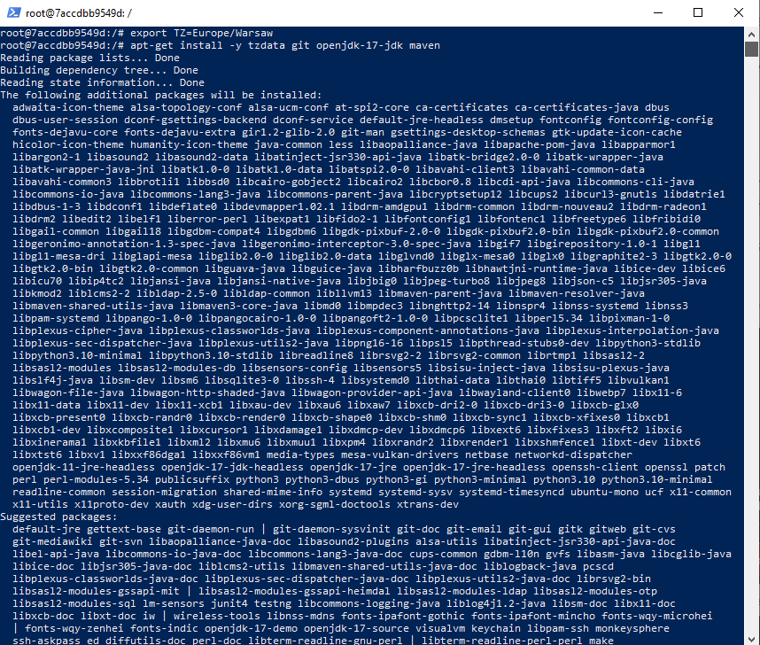  
* sklonuj repozytorium  
Sklonowanie repozytorium poleceniem ```git clone https://github.com/DiscordSRV/DiscordSRV```
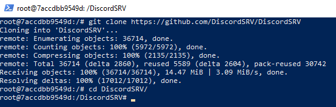  
* uruchom build  
Aby uruchomić budowanie należy przejść do katalogu z repozytorium ```cd DiscordSRV``` i następnie uruchomić budowanie przy użyciu mavena: ```mvn clean package```   
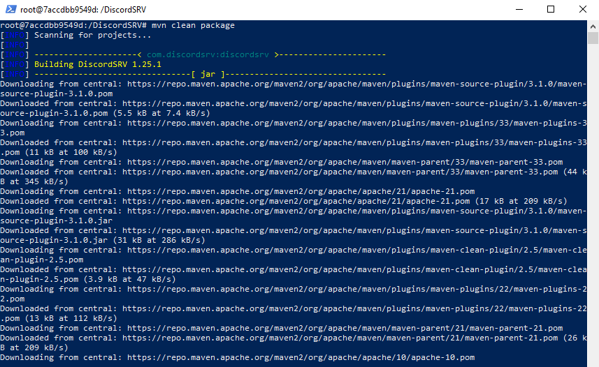  
Zbudowanie przebiegło pomyślnie:  
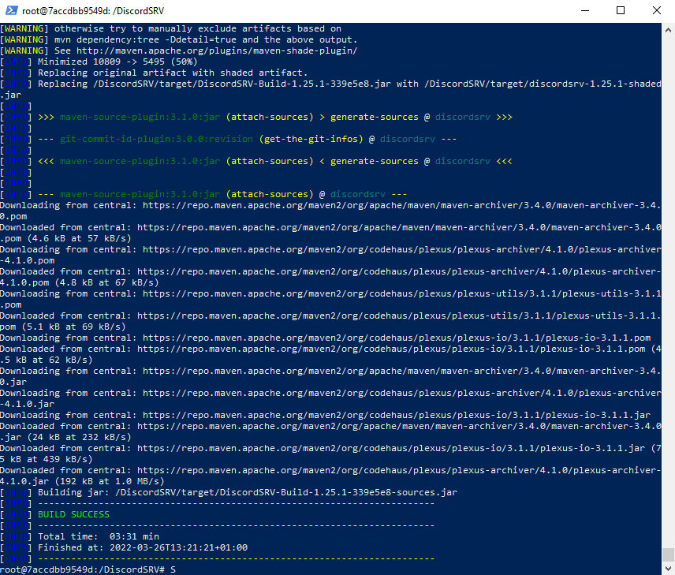  
* uruchom testy  
Uruchomienie testów przy użyciu mavena:  ```mvn test```. Pomyślne przejście testów prezentuje zrzut ekranu poniżej:  
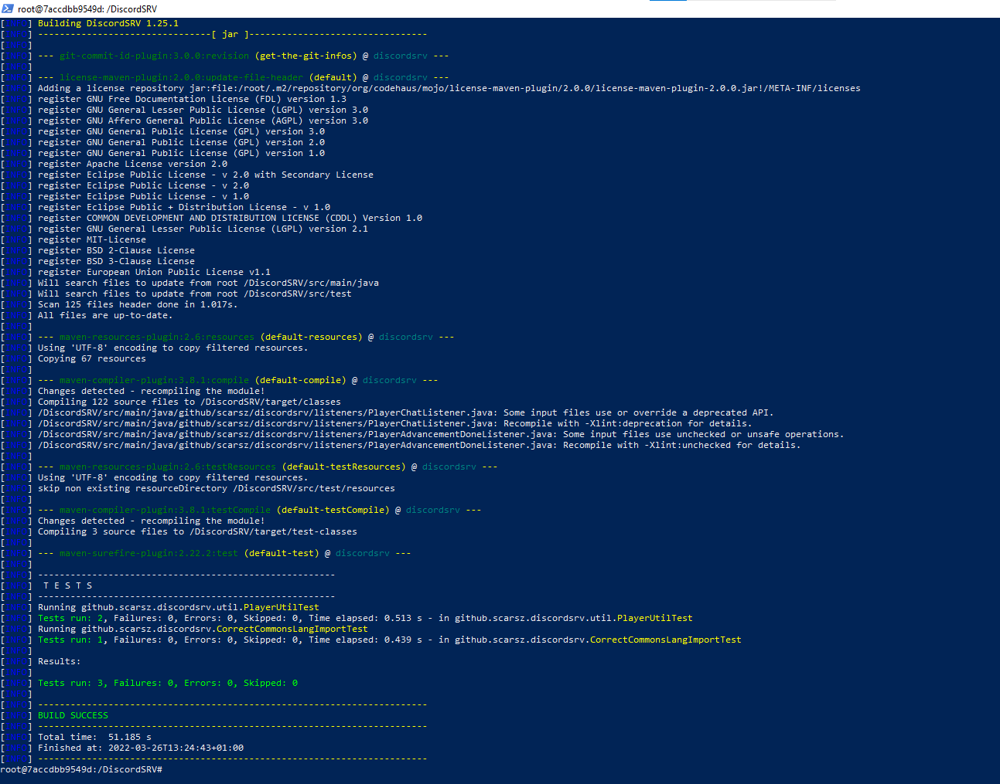  
  
## 2. Stwórz dwa pliki Dockerfile automatyzujące kroki powyżej, z uwzględnieniem następujących kwestii  
* Kontener pierwszy ma przeprowadzać wszystkie kroki aż do builda  
Dockerfile:  
```dockerfile
FROM ubuntu:jammy

ARG DEBIAN_FRONTEND=noninteractive
ENV TZ=Europe/Warsaw

RUN apt-get update
RUN apt-get install -y tzdata git openjdk-17-jdk maven

RUN git clone https://github.com/DiscordSRV/DiscordSRV.git
WORKDIR DiscordSRV

RUN mvn clean package

```  
Zbudowanie Dockerfile do obrazu poleceniem ```sudo docker build -t build:latest . -f ./Dockerfile-BUILD```. Poniżej znajduje się zrzut ekranu z pomyślnym zbudowaniem obrazu co wykazało polecenie ```sudo docker images```:  
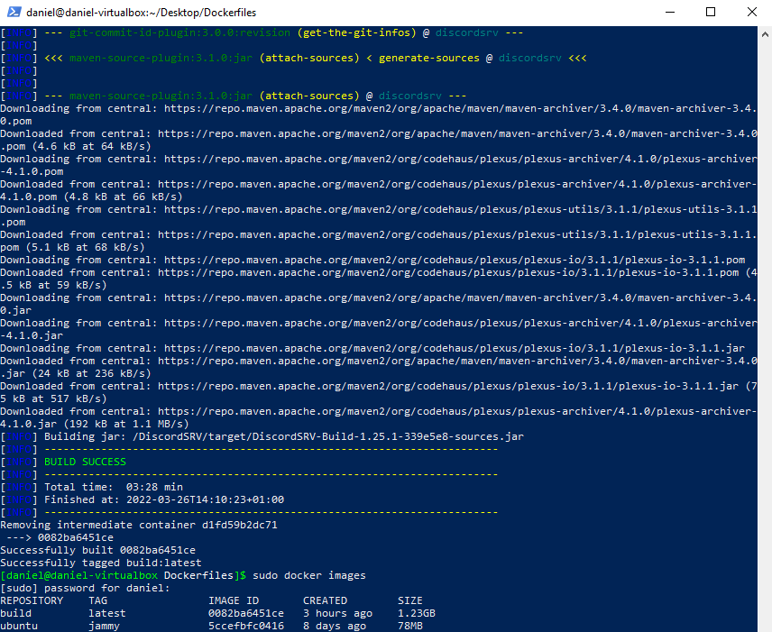  
(obraz utworzony 3h temu, ponieważ miałem miałem małą przerwę pomiędzy buildem, a wyświetleniem obrazów)  
  
* Kontener drugi ma bazować na pierwszym i wykonywać testy  
Dockerfile:  
```Dockerfile
FROM build:latest

RUN mvn test
```  
Zbudowanie Dockerfile do obrazu poleceniem ```sudo docker build -t test:latest . -f ./Dockerfile-TEST```.  
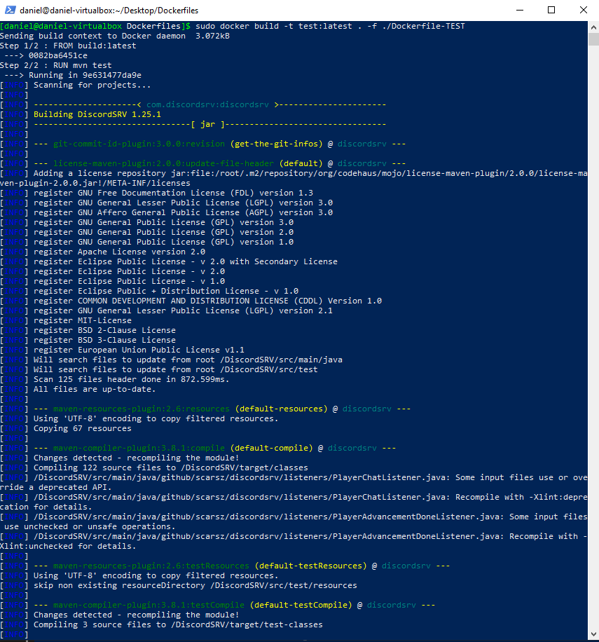  
  
Obraz został pomyślnie zbudowany.  
  
  ## 3. Wykaż, że kontener wdraża się i pracuje poprawnie. Pamiętaj o różnicy między obrazem a kontenerem. Co pracuje w takim kontenerze?  
  Odpalenie obu zbudowanych obrazów: ```sudo docker run build:latest``` oraz ```sudo docker run test:latest```. Aby wyświetlić uruchomione obrazy należy wpisać ```sudo docker ps -a```. Na zrzucie ekranu zamieszonym poniżej widać to, że oba kontenery wdrożyły i uruchomiły się poprawnie. Od razu po włączeniu wyłączyły się, ponieważ nie mają żadnego zadania do wykonania. Poprawne uruchomienie kontenerów można stwierdzić po kodzie wyjścia, który wynosi 0, czyli wszystko przebiegło pomyślnie.  
  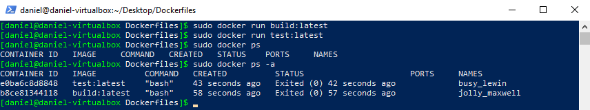  


