## 1. Zachowywanie stanu  
* Przygotuj woluminy wejściowy i wyjściowy, o dowolnych nazwach, i podłącz je do kontenera bazowego, z którego rozpoczynano poprzednio pracę  
Utworzenie woluminów i ich wyświetlenie:  
```console
sudo docker volume create in_volume
sudo docker volume create out_volume
sudo docker volume ls
```  
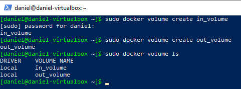  
Podłączenie ich do kontenera bazowego, z którego rozpoczynano poprzednio pracę (ubuntu):  
```console
sudo docker run -it --name ubuntu --mount source=in_volume,target=/in --mount source=out_volume,target=/out ubuntu:jammy
```  
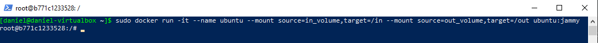  
* Uruchom kontener, zainstaluj niezbędne wymagania wstępne (jeżeli istnieją), ale bez gita  
Kontener został uruchomiony interaktywnie w poprzednim punkcie. W celu zainstalowania niezbędnych wymagań należało użyć następujących poleceń:  
```console
apt-get update
apt-get install openjdk-17-jdk maven
```  
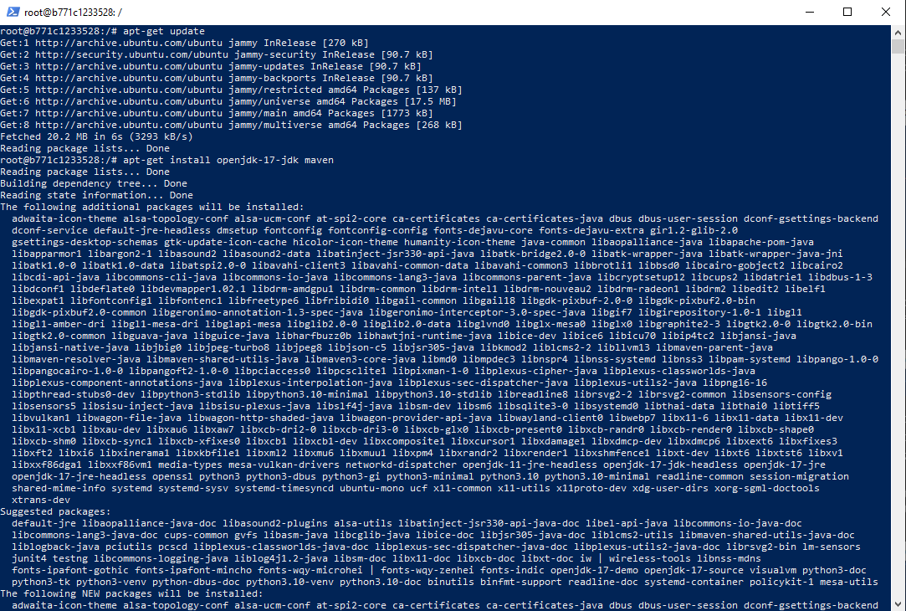  
* Sklonuj repozytorium na wolumin wejściowy  
Aby sklonować repozytorium na wolumin wejściowy, musimy wyjść z kontenera do hosta lub połączyć się do hosta poprzez nowy terminal (bez wyłączania kontenera) i następnie z poziomu hosta sklonować repozytorium, ponieważ nasz kontener nie posiada zainstalowanego gita, a według polecenia nie możemy go doinstalować. Aby mieć dostęp do katalogu z woluminem należy użyć polecenia: ```sudo -s```, a następnie sklonować repozytorium poleceniem:  
```console
git clone https://github.com/DiscordSRV/DiscordSRV.git /var/lib/docker/volumes/in_volume/_data/
```  
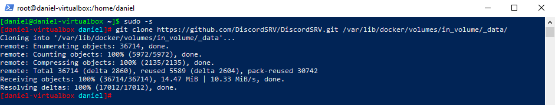  
Dowód prawidłowego sklonowania repozytorium do woluminu wejściowego:  
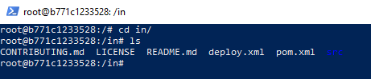  
* Uruchom build w kontenerze  
Należy wejść do katalogu in (nasz wolumin wejścowy) poleceniem ```cd in```, a następnie uruchomić następujące polecenie do zbudowania projektu:  
```console
mvn clean package
```  
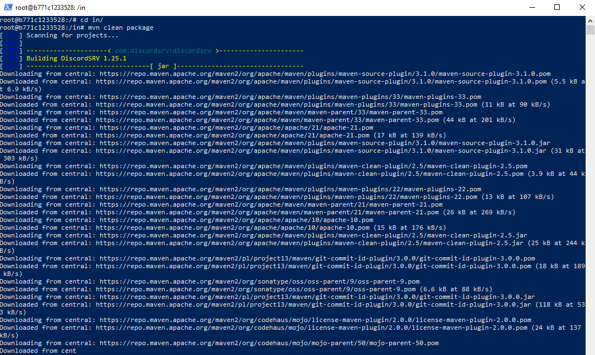  
Budowanie przebiegło pomyślnie
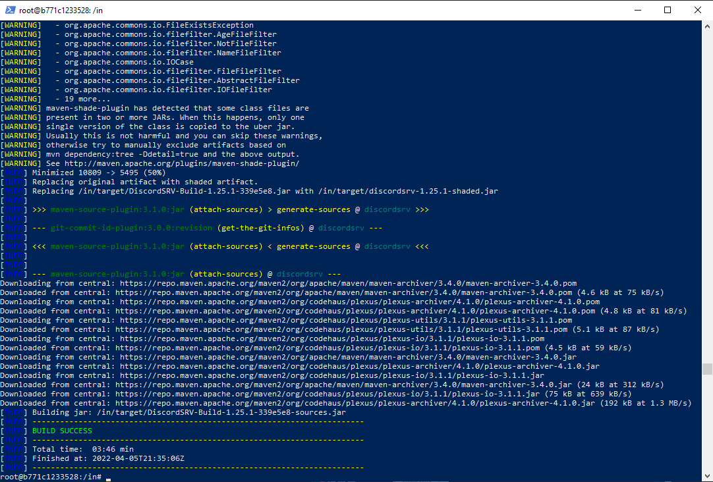  
* Zapisz powstałe/zbudowane pliki na woluminie wyjściowym  
Należy to zrobić następującym poleceniem (będąc w katalogu, w którym zbudowaliśmy projekt):  
```console
cp -r target/ /out/
```   
  
Dowód na to, że pliki znajdują się w odpowiednim miejscu:  
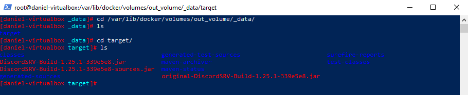  
## 2. Eksponowanie portu
* Uruchom wewnątrz kontenera serwer iperf (iperf3)  
Na samym początku należy pobrać kontener z serwerem iperf: ```sudo docker pull clearlinux/iperf```  
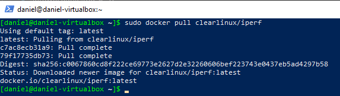  
Następnie uruchamiamy serwer iperf w kontenerze poleceniem: ```sudo docker run -it --rm --name=iperf -p 5201:5201 clearlinux/iperf -s```  
   
* Połącz się z nim z drugiego kontenera, zbadaj ruch  
Na samym początku musimy sprawdzić ip kontenera, na którym chodzi serwer poleceniem: ```sudo docker inspect iperf```  
  
Następnie uruchamiamy kontener, który się łączy do naszego serwera poleceniem: ```sudo docker run -it --rm --name=iperf_client clearlinux/iperf -c 172.17.0.2```. Poniżej przedstawione jest pomyślne zbadanie ruchu.  
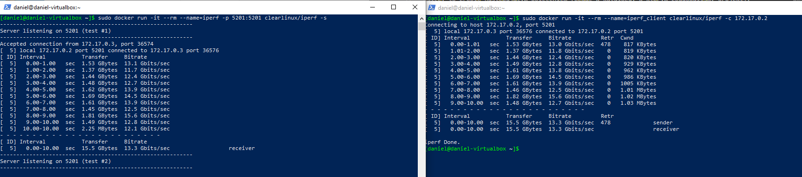  
* Połącz się spoza kontenera (z hosta i spoza hosta)  
Zainstalowanie iperf3 na hoście:  
```sudo pamac install iperf3```  
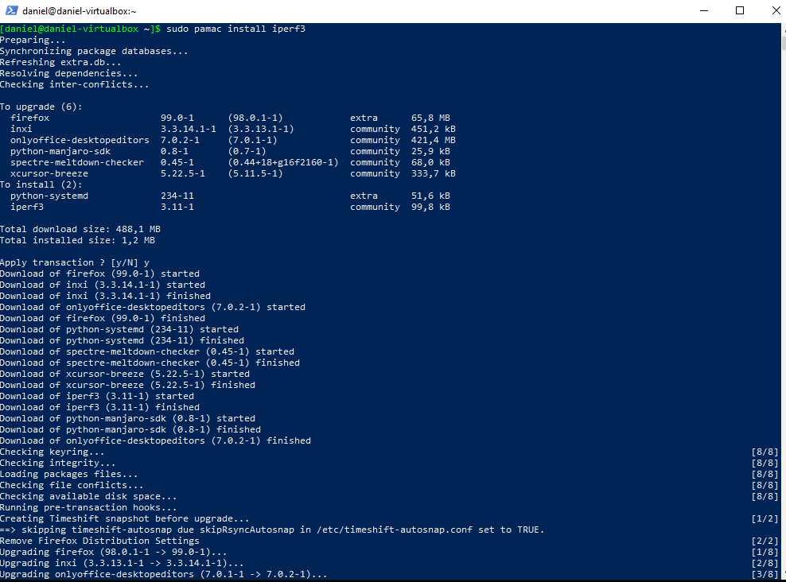  
Zbadanie połączenie pomiędzy hostem a kontenerem: ```iperf3 -c 172.17.0.2 -t 30 -p 5201```:  
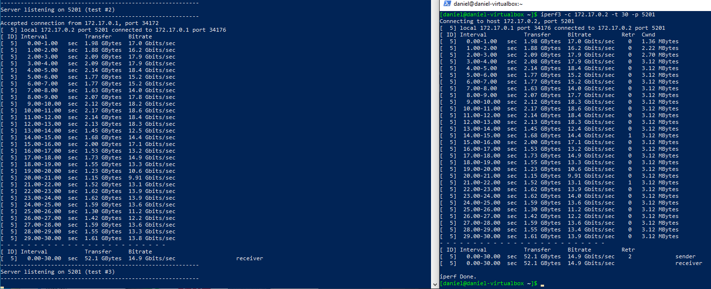  
Musiałem pobrać program iperf na Windowsa ze strony: https://iperf.fr/iperf-download.php#windows, a nstępnie go wypakować. Na VirtualBoxie używam sieci podłączonej do NAT, przez co aby komunikować się z maszyną wirtualną muszę użyć port forwardingu:  
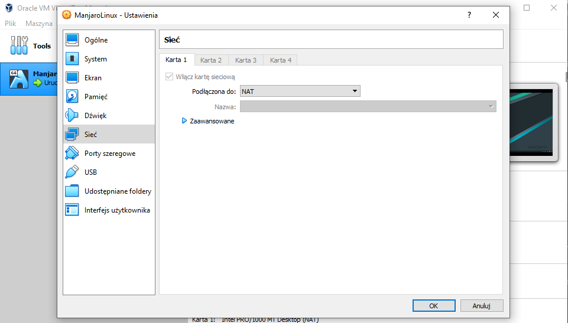  
Ustawiony port forwarding wygląda następująco (Ustawienia -> Sieć -> Zaawansowane -> Przekierowania portów):  
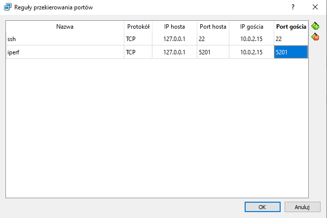  
Wykonanie testu połączenia z poziomu Windowsa do kontenera wykonujemy poleceniem: ```.\iperf3.exe -c 127.0.0.1 -t 30 -p 5201```, będąc w katalogu z programem iperf.  
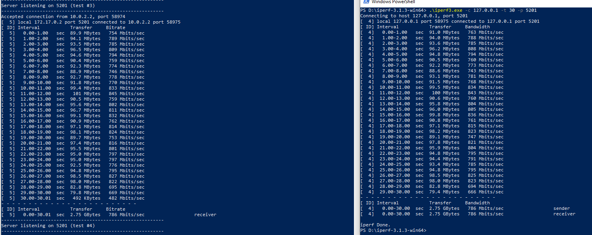  
* Przedstaw przepustowość komunikacji  

| Rodzaj połączenia      | Przepustowość |
| ---------------------- | ------------- |
| kontener - kontener    | 13.3 Gbits/s  |
| host - kontener        | 14.9 Gbits/s  |
| poza hostem - kontener | 786 Mbits/s   |

## 3. Instancja Jenkins  
* Zapoznaj się z dokumentacją https://www.jenkins.io/doc/book/installing/docker/  
Zapoznałem się ;)  
* Przeprowadź instalację skonteneryzowanej instancji Jenkinsa z pomocnikiem DIND  
Na samym początku należy utworzyć nową sieć w dockerze poleceniem: ```sudo docker network create jenkins```  
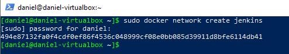  
Następnie uruchamiamy konener dockera DIND:  
```
sudo docker run \
  --name jenkins-docker \
  --rm \
  --detach \
  --privileged \
  --network jenkins \
  --network-alias docker \
  --env DOCKER_TLS_CERTDIR=/certs \
  --volume jenkins-docker-certs:/certs/client \
  --volume jenkins-data:/var/jenkins_home \
  --publish 2376:2376 \
  docker:dind \
  --storage-driver overlay2
```  
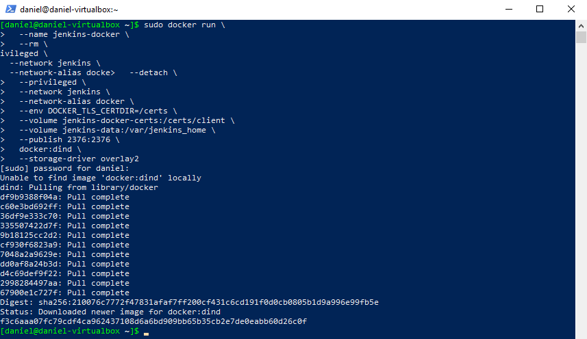  
Kolejnym krokiem jest utworzenie obrazu jenkinsa na podstawie następującego Dockerfile'a:  
```docker
FROM jenkins/jenkins:2.332.2-jdk11
USER root
RUN apt-get update && apt-get install -y lsb-release
RUN curl -fsSLo /usr/share/keyrings/docker-archive-keyring.asc \
  https://download.docker.com/linux/debian/gpg
RUN echo "deb [arch=$(dpkg --print-architecture) \
  signed-by=/usr/share/keyrings/docker-archive-keyring.asc] \
  https://download.docker.com/linux/debian \
  $(lsb_release -cs) stable" > /etc/apt/sources.list.d/docker.list
RUN apt-get update && apt-get install -y docker-ce-cli
USER jenkins
RUN jenkins-plugin-cli --plugins "blueocean:1.25.3 docker-workflow:1.28"
```  
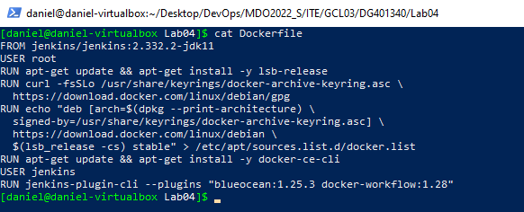  
Zbudowanie obrazu następującym poleceniem:  
```sudo docker build -t myjenkins-blueocean:2.332.2-1 .```  
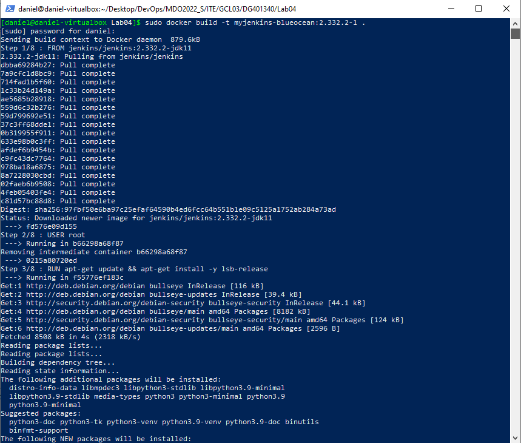  
Pomyślne zbudowanie:  
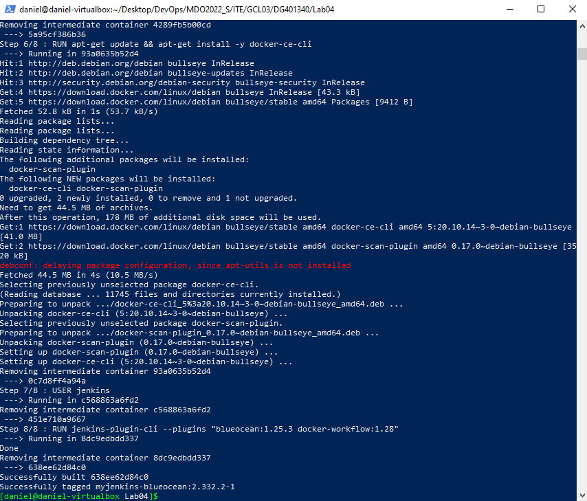  
* Zainicjalizuj instację, wykaż działające kontenery, pokaż ekran logowania  
Aby zainicjalizować instancję musimy użyć polecenia:  
```
sudo docker run \
  --name jenkins-blueocean \
  --rm \
  --detach \
  --network jenkins \
  --env DOCKER_HOST=tcp://docker:2376 \
  --env DOCKER_CERT_PATH=/certs/client \
  --env DOCKER_TLS_VERIFY=1 \
  --publish 8080:8080 \
  --publish 50000:50000 \
  --volume jenkins-data:/var/jenkins_home \
  --volume jenkins-docker-certs:/certs/client:ro \
  myjenkins-blueocean:2.332.2-1 
```  
  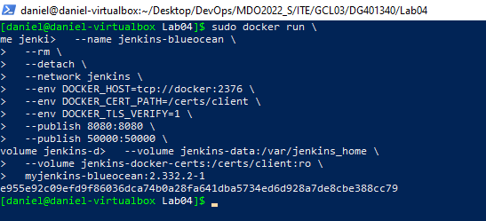  
  Do wykazania działania konenerów możemy użyć polecenia ```sudo docker ps```  
  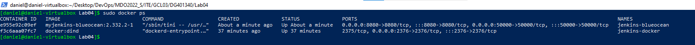  
  Jak widać na wyżej załączonym zrzucie ekranu, oba kontenery działają poprawnie.  
    
Aby mieć dostęp do strony Jenkinsa poprzez url http://localhost:8080/, musiałem jeszcze dodać przekierowanie portu 8080, w taki sam sposób jak to robiłem w przypadku portu. Efekt wygląda następująco:  
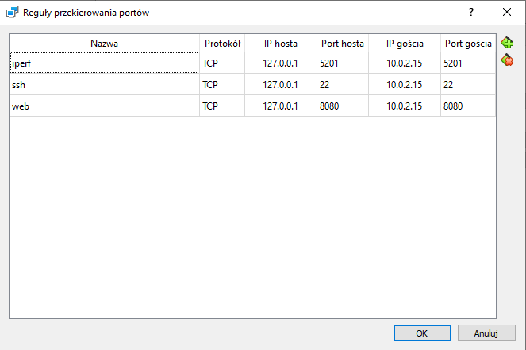  
Strona po wejściu na wcześniej wspomniany URL wygląda następująco:  
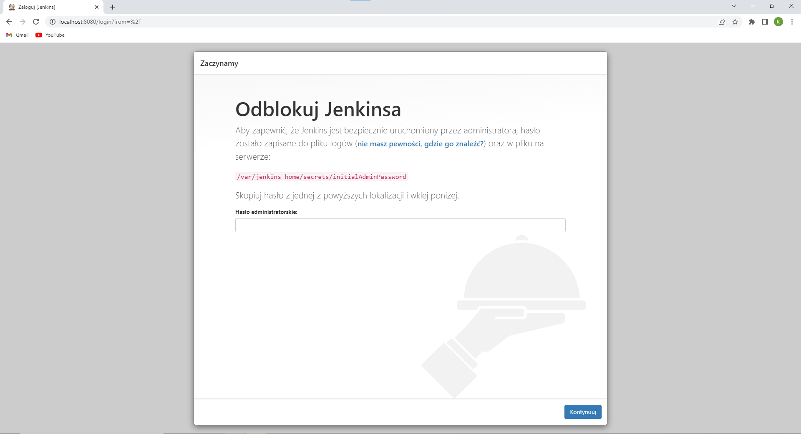  
Aby pozyskać hasło administratorskie należy użyć polecenia ```sudo docker exec jenkins-blueocean cat /var/jenkins_home/secrets/initialAdminPassword```  
Dowód pomyślnego wpisania hasła:  
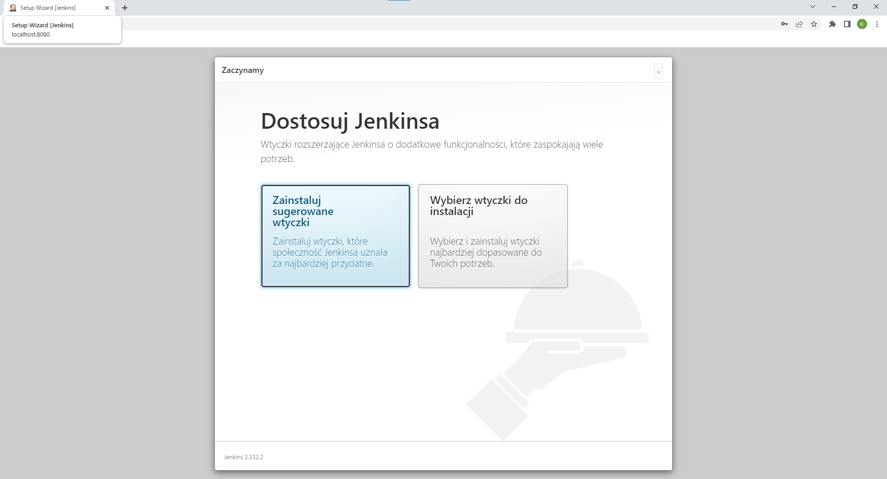  
Po odpowiedniej konfiguracji jenkinsa mamy dostęp do następującego panelu:  
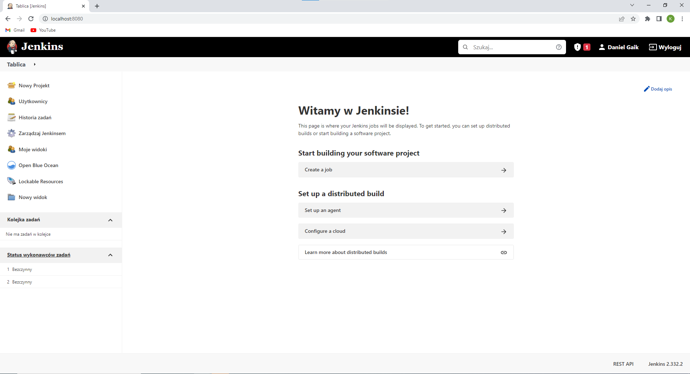  

