## 1. Projekt i jego cel
Celem projektu było utworzenie jenkinsowego pipeline'a, dzięki któremu możemy przeprowadzić zautomatyzowany build, test, deploy oraz publish wybranego oprogramowania. Wybranym repozytorium jest https://github.com/DiscordSRV/DiscordSRV, jest to plugin do gry minecraft (instalowany na serwerze gry minecraft), który umożliwa integrację czatu gry z czatem na serwerze discord. Jest on napisany w Javie.

## 2. Utworzenie projektu i przygotowanie pipeline
### **Wymagania**
Wymaganiem wejściowym jest posiadanie poprawnie skonfigurowanego Jenkinsa. Można to zrobić na podstawie tego poradnika https://www.jenkins.io/doc/book/installing/docker/ lub na podstawie następującego sprawozdania zaczynając od punktu 3 https://github.com/InzynieriaOprogramowaniaAGH/MDO2022_S/blob/DG401340/ITE/GCL03/DG401340/Lab04/Sprawozdanie.md.  

### **Utworzenie projektu i konfiguracja pipeline** 
Aby utworzyć projekt należy, kliknąć przycisk "Nowy Projekt" znajdujący się po lewej strony.  
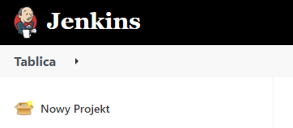  
Następnie wyświetli się nam okno, w którym musimy podać nazwę projektu i wybrać opcję "Pipeline", a następnie kliknąć przyciś "OK".   
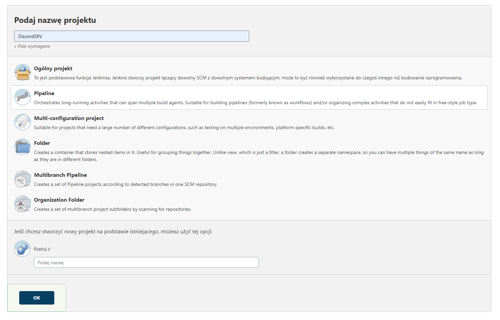  
W kolejnym oknie musimy skonfigurować nasz pipeline. Pierwszą rzeczą, którą musimy zrobić to w sekcji "General" zaznaczenie checkboxa "GitHub project", gdzie następnie w pole "Project url" wklejamy link do następującego repozytorium https://github.com/DiscordSRV/DiscordSRV/.  
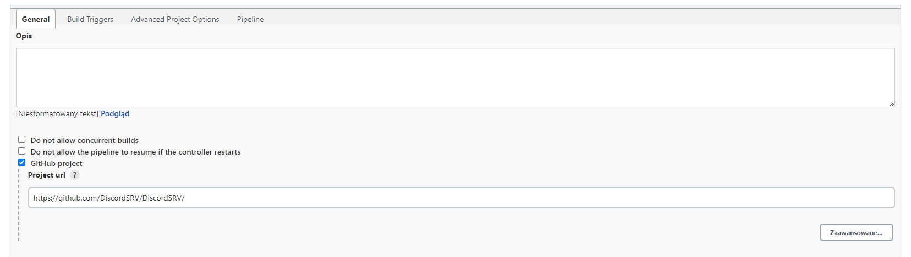  
Następnym krokiem jest przejście do sekcji "Pipeline", gdzie w "Definition" wybieramy "Pipeline script from SCM", w "SCM" wybieramy "Git", w "Repositories" wklejamy link do następującego repozytorium: https://github.com/InzynieriaOprogramowaniaAGH/MDO2022_S/ (Credentials nie są potrzebne). W "Branch Specifier" wpisujemy "DG401340", "Repository browser" zostawiamy na "(Automatyczny)", w polu "Script Path" wklejamy "ITE/GCL03/DG401340/Lab05/Jenkinsfile" i na sam koniec ODZNACZAMY checkbox "Lightweight checkout". Gdy to wszystko mamy ustawione, klikamy przycisk "Zapisz".    
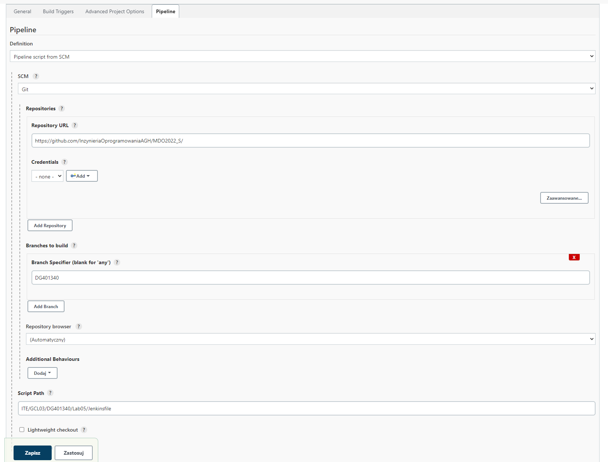  
Po tych wszystkich krokach przywita nas nowa strona, na której po lewej stronie klikamy przycisk "Uruchom", co spowoduje uruchomienie naszego pipeline.  
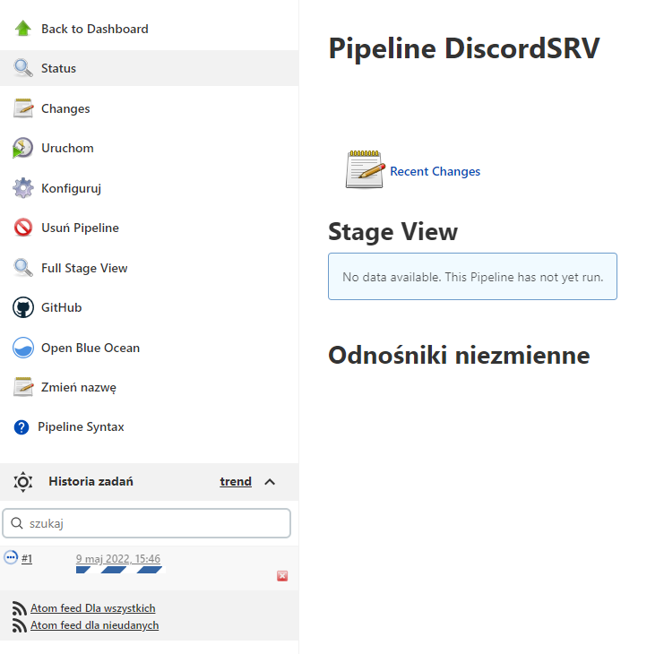  
Gdy pipieline dobiegnie do końca możemy zauważyć, że nie został utworzony żaden artefakt, jest to spowodowane tym, że przy pierwszym odpaleniu nie mamy jeszcze możliwości ustawienia parametrów, które są zaciągane z pliku Jenkinsfile. Dlatego też pierwsze uruchomienie możemy przerwać po pomyślnym kroku "Declarative: Checkout SCM", lub poczekać do ukończenia joba (co trwa około 10 minut). Pomyślne ukończenie joba bez opublikowania artefaktów, wygląda następująco (artefakt nie został opublikowany, ponieważ domyślnie checkbox "promote" jest ustawiony na false):  
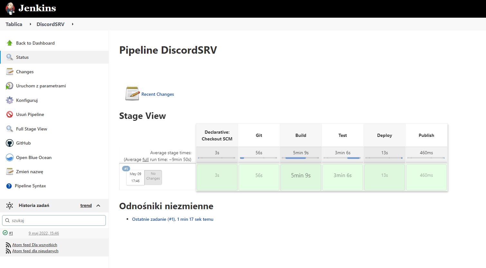  
W celu opublikowania artefaktu musimy uruchomić joba ponowanie, ale teraz możemy zauważyć, że zamiast przycisku "Uruchom" jest przycisk "Uruchom z parametrami", który należy kliknąć.  
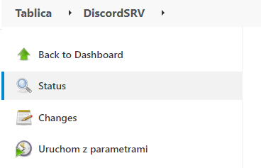  
Wyświetli się nam nowa strona, na której możemy zaznaczyć checkbox "promote" i wpisać wersję w "version". W przypadku poprawnego wykonania się poprzednich kroków, w kroku "Publish", do nazwy pliku .jar na samym początku zostanie dopisana określona wersja oraz zostanie on opublikowany jako artefakt.  
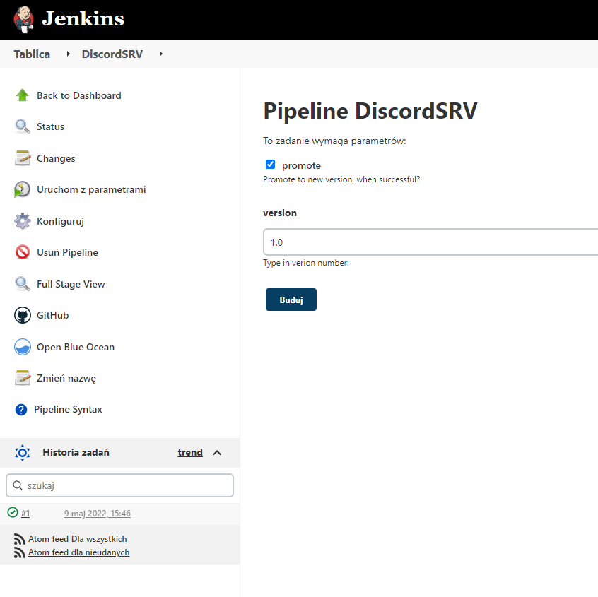  
Gdy job zostanie pomyślnie ukończony i odświeżymy stronę, będziemy mogli zauważyć opublikowany artefakt, pod napisem "Last Successful Artifacts". Na samym początku nazwy pliku możemy zauważyć wersję, którą podaliśmy w parametrze.  
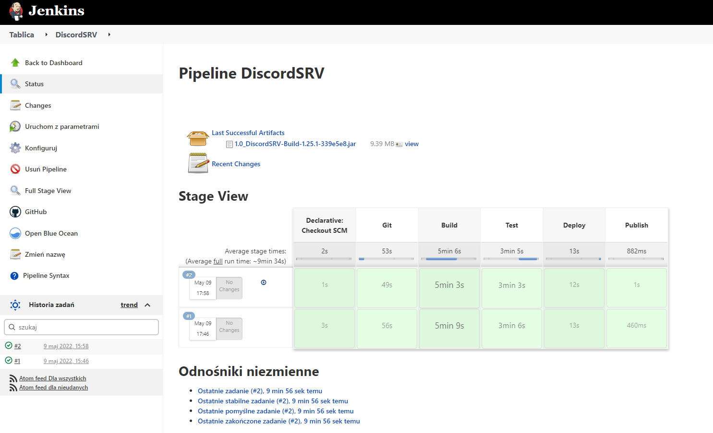  
W tym momencie nasz pipeline jest poprawnie skonfigurowany i możemy automatycznie buildować, testować, deployować i publishować nasz projekt.

## 3. Opisanie konkretnych etapów pipeline
* ### **Git**
**Cel:**  
Wykonanie clone projektu, który chcemy zbudować przy użyciu kontenera, który zapisuje dane na woluminie.
    
**Wykonanie:**  
Budowany jest obraz kontenera na postawie następujacego Dockerfile:  
```Dockerfile
FROM bitnami/git:latest AS git
WORKDIR volume_in
CMD ["sh", "-c", "rm -rf /volume_in/* && git clone https://github.com/DiscordSRV/DiscordSRV.git"]
```  
Następnie obraz ten jest uruchamiany z dołączeniem woluminu wejściowego. W momencie uruchomienia kontenera czyszczony jest wolumin, dzięki czemu można wykonać ponownie clone repozytorium. Obrazem bazowym dla tego kontenera jest bitnami/git:latest, ponieważ zapewnia on podstawową funkcjonalność git'a.  
* ### **Build**
**Cel:**  
Zbudowanie wcześniej sklonowanego projektu.  
  
**Wykonanie:**  
Jako, że sklonowany projekt został napisany w Javie z użyciem Mavena, to na obrazie Mavena będzie bazował nasz kontener. Tak jak w poprzednim przypadku zostal zbudowany obraz na podstawie następującego Dockerfile:  
```Dockerfile
FROM maven:3.8.5-openjdk-17 AS build
CMD ["sh", "-c", "mvn -f /volume_in/DiscordSRV/pom.xml clean package && cp -r /volume_in/DiscordSRV/target ./volume_out && ls ./volume_out"]
```  
Zbudowany obraz uruchamiany jest z dołączeniem woluminów: wejściowego i wyjściowego. Po uruchomieniu kontenera wywoływane jest polecenie, dzięki któremu projekt jest kompilowany, a następnie pliki wynikowe są kopiowane na wolumin wejściowego na wyjściowy.  
* ### **Test**
**Cel:**  
Wykonanie testow jednostkowych dostępnych w projecie. Jeżeli testy wykonają się pomyślnie to pipeline przejdzie dalej, a jeżeli nie to pipeline zostanie przerwany.  
  
**Wykonanie:**  
Budowany jest obraz kontenera na podstawie następującego Dockerfile:  
```Dockerfile
FROM build:latest AS test
CMD ["mvn", "-f", "/volume_in/DiscordSRV/pom.xml", "test"]
```  
Budowany kontenera bazuje na obrazie służącym do budowania projektu (zbudowanym w kroku "Build"), dzięki czemu mamy dostęp do mavena. W momencie uruchomienia kontenera uruchamiane są testy, a sam kontener ma podpięty wolumin wejściowy, na którym wykonywane są testy.  
* ### **Deploy**
**Cel:**  
Celem tego etapu miało być wdrożenie zbudowanego pluginu na serwer minecraft, ale takie rozwiązanie nie zostało wybrane, ponieważ jest ono dosyć skomplikowane i nie ma łatwego sposobu na to żeby zweryfikować, czy plugin został poprawnie uruchomiony (wdrożony) na serwerze, więc taki deploy nie ma sensu (weryfikowane by było tylko to, czy serwer został uruchomiony, a nie czy plugin się uruchomił). Dlatego też jako deploy, zostało przyjęte sprawdzenie, czy wygenerowany plik .jar zawiera plik plugin.yml, który jest wymagany do poprawnego działania pluginu i bez tego pliku plugin nie zostanie uruchomiony na serwerze.  
  
**Wykonanie:**  
Na tym etapie wynik budowania projektu jest kopiowany z woluminu wyjściowego do hosta. Zostało to osiągnięte poprzez uruchomienie kontenera z obrazu busybox, dzięki czemu nie waży on za dużo, a posiada także podstawowe funkcjonalności, dzięki czemu możemy skopiować wyniki z woluminu wyjściowego do hosta. Następnie na hoście wyniki kompilacji są filtrowane i zostawiany jest tylko plik .jar, który zadziała na serwerze minecraft (pliki z sources i original w nazwie nie będą działały na serwerze). Kolejnym krokiem jest sprawdzenie, czy wybrany plik .jar zawiera w sobie plik plugin.yml, jeżeli tak to uznajemy, że deploy przebiegł pomyślnie. Brak tego pliku uznajemy za niepomyślny deploy.
* ### **Publish**  
**Cel:**  
Celem tego etapu jest opublikowanie zbudowanego projektu. Końcowym plikiem, który należy udostępnić jest plik .jar, ktory należy umieścić w folderze plugins na działającym serwerze minecraft. Plik ten dodawany jest jako artefakt tylko w momencie, gdy parametr promote jest ustawiony jako true i do początku nazwy pliku dodawana jest określona w parametrach wersja.  
  
**Wykonanie:**  
Gdy parametr promote jest true (zaznaczony jest checkbox promote w momencie uruchomienia joba), to do początku nazwy pliku dodawana jest wersja określona w parametrach i następnie plik ten dodawany jest i publikowany jako artefakt. Gdy zmienna promote jest false, to wyswietlana jest informacja o tym, że wszystko przebiegło pomyślnie, ale nowa kompilacja nie jest promowana do nowej wersji.  

## 4. Diagram aktywności  
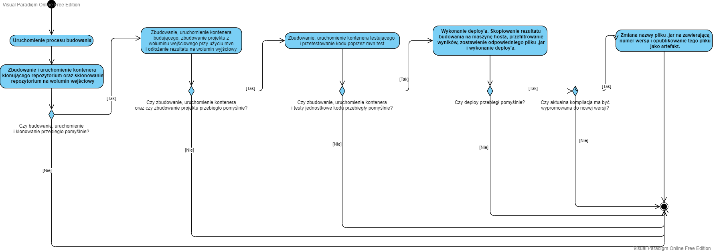  
## 5. Diagram wdrożenia  
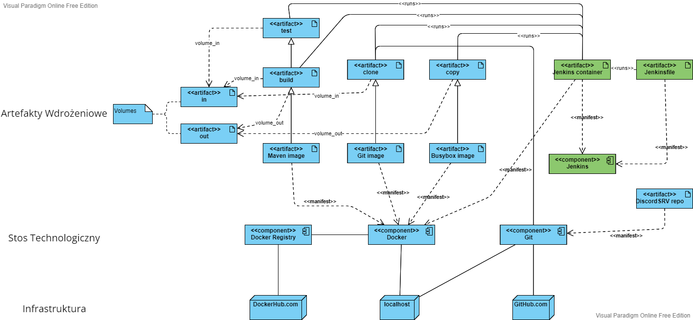  