### Przygotowanie systemu do wdrożeń
* Zainstaluj dwie maszyny wirtualne w tej samej sieci  

Wykorzystałem maszyny zainstalowane potrzebne podczas poprzednich laboratoriów, ponieważ są one w tej samej sieci.
* Zainstaluj ansible ```dnf --assumeyes install ansible```  

Ansible zostało zainstalowane pomyślnie:  
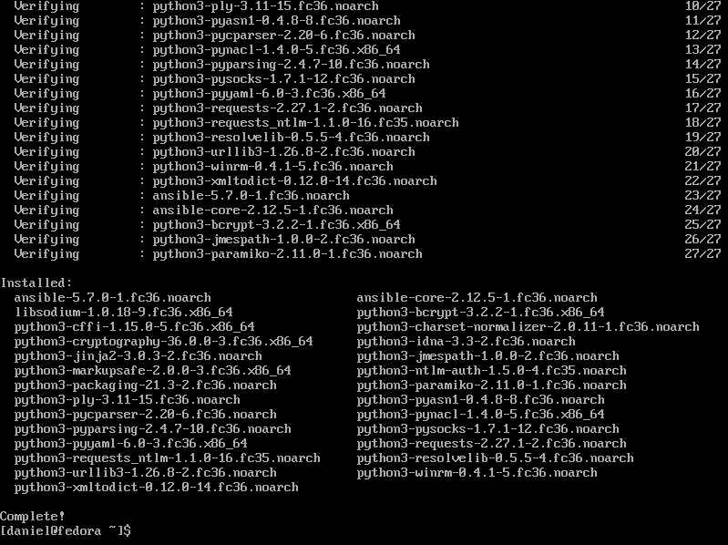  
* Stwórz plik inwentaryzacji  

Następnie edytowałem domyślny plik inwentaryzacji poleceniem ```sudo nano /etc/ansible/hosts```. Plik po edycji, wyglądał następująco:  
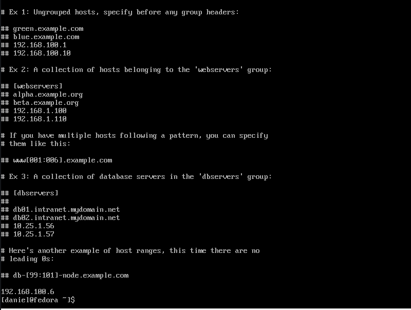  
* Połącz się z drugą maszyną poprzez ping  

Wykonałem pierwsza próbę połączenia się z drugą maszyną poprzez ping ```sudo ansible all -i /etc/ansible/hosts -m ping```. Próba ta skończyła się niepowodzeniem:  
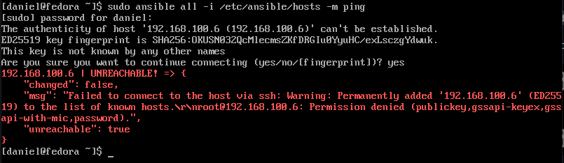  
W celu naprawienia tego błędu edytowałem ponownie plik inwentaryzacji tak, aby zawierał on nazwę użytkownika i odpowiednie hasła. Po zmianach plik ten wygląda następująco:  
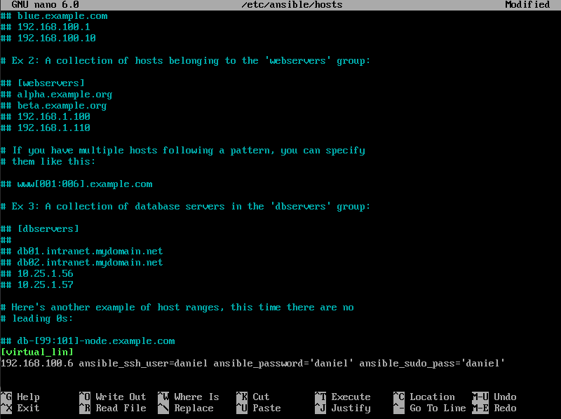  
Próbując ponownie połączyć się poprzez ping napotkałem na kolejny błąd:  
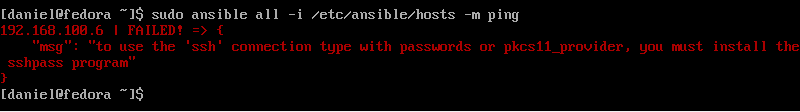  
Aby go naprawić należało zainstalować pakiet sshpass (na maszynie wysyłającej ping), co należało zrobić poleceniem ```sudo dnf --assumeyes install sshpass```  
  
Przy kolejnej próbie połączenia się poprzez ping, wszystko przebiegło pomyślnie:  
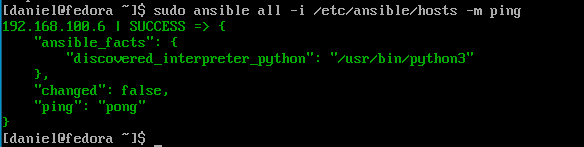  

### Zakres rozszerzony
* Skonfiguruj uwierzytelnianie askpass kluczami ssh  

Klucz na hoście został utworzony poleceniem: ```ssh-keygen -t ed25519 -f my_key```. Następnie zawartość klucza publicznego ```cat my_key.pub``` została przepisana do drugiej maszyny do pliku ```~/.ssh/authorized_keys``` (należało utworzyć katalog ```mkdir ~/.ssh```, a nasteępnie dodać zawartość klucza ```nano ~/.ssh/authorized_keys```):  
  
Po wróceniu do pierwszej maszyny, na której generowaliśmy klucz musimy go dodać do agenta ssh. Należy go uruchomić poleceniem ```eval `ssh-agent -s` ```, a następnie ```ssh-add my_key```:  
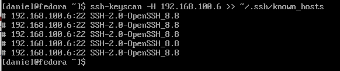  

### Repozytoria
* Stwórz playbook

Utworzyłem playbook następującym poleceniem ```sudo touch /etc/ansible/install_discordsrv.yml```, następnie go edytowałem ```sudo nano /etc/ansible/install_discordsrv.yml```, po czym końcowa zawartość wygląda następująco:  
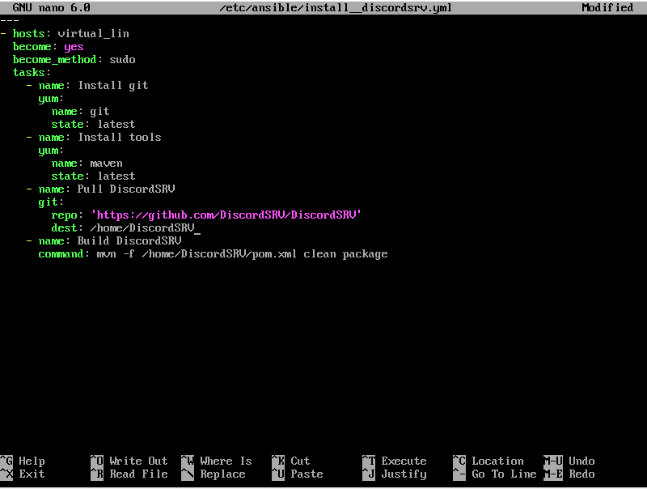  
```yml
---
- hosts: virtual_lin
  become: yes
  become_method: sudo
  tasks:
    - name: Install git
      yum:
        name: git
        state: latest
    - name: Install tools
      yum:
        name: maven
        state: latest
    - name: Pull DiscordSRV
      git:
        repo: 'https://github.com/DiscordSRV/DiscordSRV'
        dest: /home/DiscordSRV
    - name: Build DiscordSRV
      command: mvn -f /home/DiscordSRV/pom.xml clean package
```
Następnie próba uruchomienia playbook'a poleceniem ```ansible-playbook /etc/ansible/install_discordsrv.yml``` zakończyła się niepowodzeniem:  
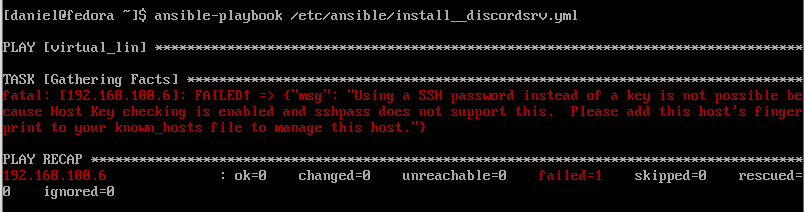  
W celu naprawienia tego błędu należało dodać fingerprint drugiej maszyny do pliku known_hosts. Należało to zrobić poleceniem ```ssh-keyscan -H 192.168.1.162 >> ~/.ssh/known_hosts```  
  
Po tej zmianie ponowne uruchomienie playbook'a zakończyło się sukcesem:  
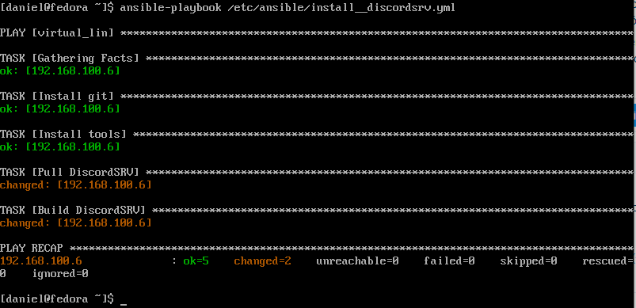  

#### Zakres rozszerzony
* Wyprowadź własne repozytorium (W przypadku systemd-nspawn, lokalne repozytorium instalacyjne systemu)  

Lokalne repozytorium instalacyjne systemu należy utworzyć za pomocą następującego polecenia: ```sudo dnf --assumeyes --installroot=/var/lib/spawns/systemd_repo --releasever=36 --disablerepo='*' --enablerepo=fedora --enablerepo=updates install fedora-release dnf passwd vim-minimal glibc-minimal* systemd```  
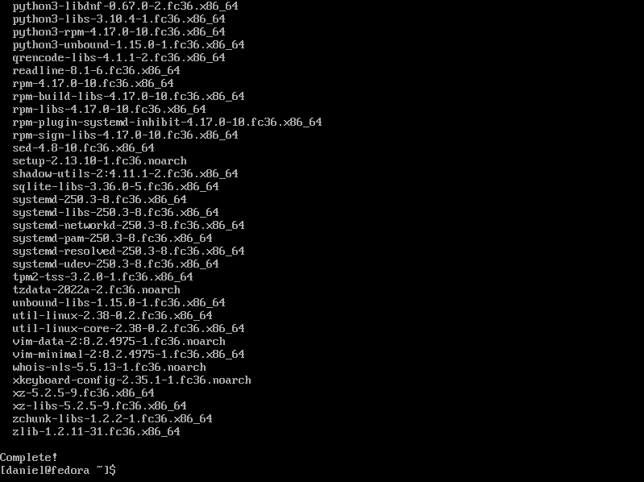  

### nspawn
* Zainstaluj kontener systemd na maszynie docelowej przy użyciu repozytorium via Ansible  

Aby to osiągnąć został utworzony następujący playbook ```sudo nano /etc/ansible/install_systemd.yml```:  
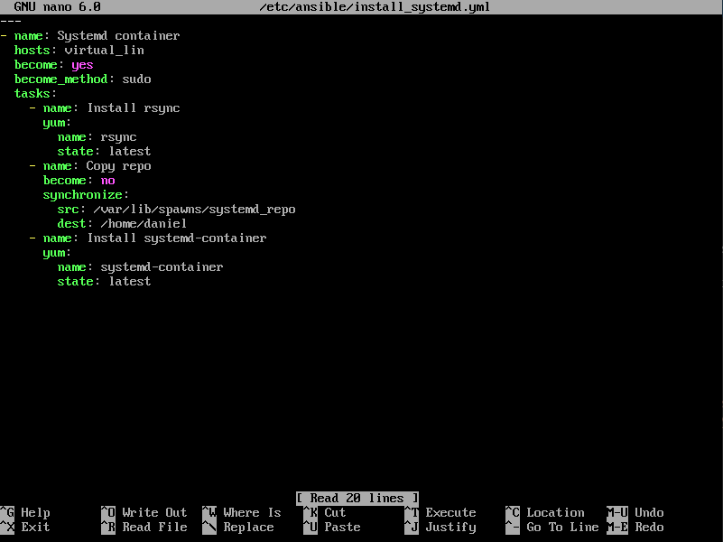  
```yml
---
- name: Systemd container
  hosts: virtual_lin
  become: yes
  become_method: sudo
  tasks:
    - name: Install rsync
      yum:
        name: rsync
        state: latest
    - name: Copty repo
      become: no
      synchronize:
        src: /var/lib/spawns/systemd_repo
        dest: /home/daniel
    - name: Install systemd-container
      yum:
        name: systemd-container
        state: latest
```  
W celu skopiowania plików został użyty rsync (synchronize), a nie copy, ponieważ copy jest strasznie wolne i synchronize wykonuje się o wiele szybciej. Podczas zadania kopiowania plików musiałem ustawić become na no, ponieważ jeżeli tego nie zrobiłem to rsync na maszynie docelowej pytał o hasło mimo użycia kluczy ssh i podawania hasła w /etc/ansible/hosts. Teoretycznie jest to błąd, ktory został naprawiony w 2016 roku (https://github.com/ansible/ansible-modules-core/issues/2156), ale wygląda na to, że znowu wkradł się on do kolejnych wersji ansible. Ważne jest to, aby użytkownik przy pomocy którego logujemy się do maszyny docelowej miał uprawnienia do pisania w określonym katalogu docelowym.   
Aby playbook ten zadziałał należy także zainstalować rsync'a na maszynie, która uruchamia ansible. Zrobimy to poleceniem ```dnf --assumeyes install rsync```.  
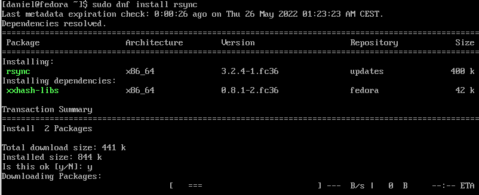  
Uruchomienie tego playbook'a poleceniem ```sudo ansible-playbook /etc/ansible/install_systemd.yml``` (ważne w tym przypadku jest sudo, aby mieć pełen dostep do plików w katalogu /var/lib/spawns/systemd_repo) poskutowało jego pomyślnym wykonaniem:  
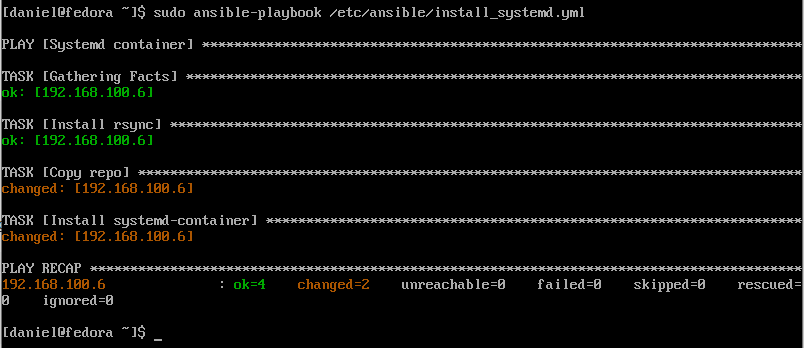  
* Uruchom (lokalnie)  

Po przejściu do terminala maszyny docelowej, aby uruchomić kontener należy użyc następujące polecenie ```sudo systemd-nspawn --user=root --ephemeral --directory=/home/daniel/systemd_repo```. (Lub tak jak na zrzucie ekranu prześć do katalogu /home/daniel i argument --directory określić jako ./systemd_repo)  
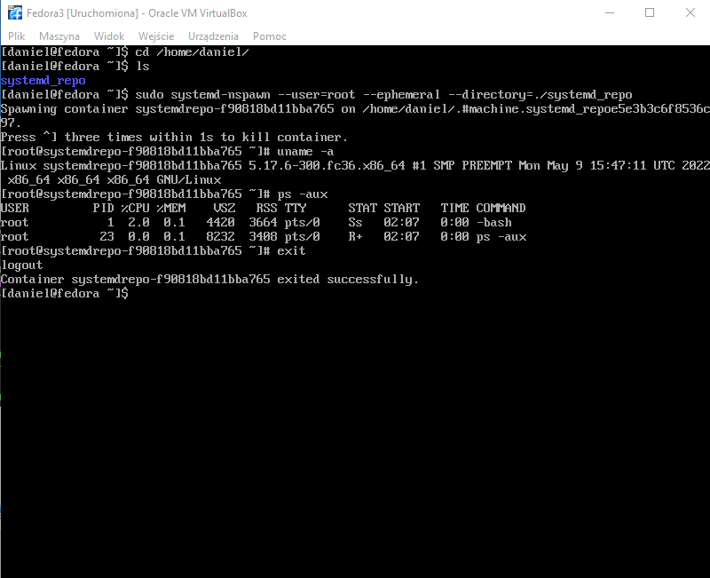  
