## Instalacja klastra Kubernetes
 * **Zaopatrz się w implementację stosu k8s: minikube**

Zaopatrzenie się w implementację: `curl -LO https://storage.googleapis.com/minikube/releases/latest/minikube-linux-amd64`  

 * **Przeprowadź instalację, wykaż poziom bezpieczeństwa instalacji**

Instalacja: `sudo install minikube-linux-amd64 /usr/local/bin/minikube`  
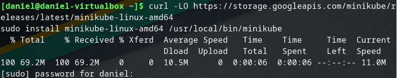  
Sprawdzenie poprawności instalacji: `minikube version`  
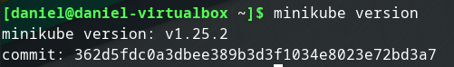  

 * **zaopatrz się w polecenie kubectl**  

Pobranie kubectl: `curl -LO "https://dl.k8s.io/release/$(curl -L -s https://dl.k8s.io/release/stable.txt)/bin/linux/amd64/kubectl"`  
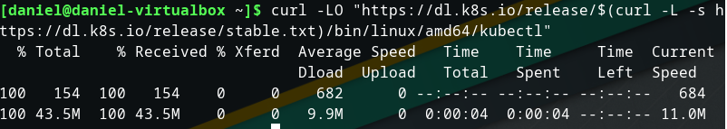  
Pobranie checksum kubectl: `curl -LO "https://dl.k8s.io/$(curl -L -s https://dl.k8s.io/release/stable.txt)/bin/linux/amd64/kubectl.sha256"`  
Sprawdzenie checksum kubectl: `echo "$(cat kubectl.sha256)  kubectl" | sha256sum --check`  
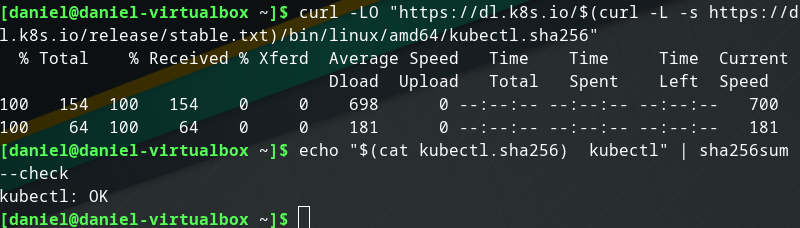  
Instalacja kubectl: `sudo install -o root -g root -m 0755 kubectl /usr/local/bin/kubectl`  
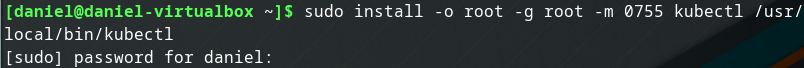  
Sprawdzenie wersji kubectl: `kubectl version --client`  
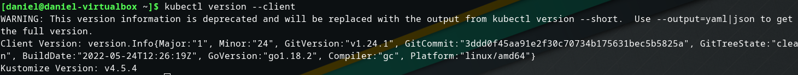  

 * **Uruchom Kubernetes, pokaż działający kontener/worker**

Aby poprawnie uruchomić Kubernetes, należy dodać użytkownika do nowo utworzonej grupy docker: `sudo groupadd docker`, `sudo usermod -aG docker $USER`, `newgrp docker`  
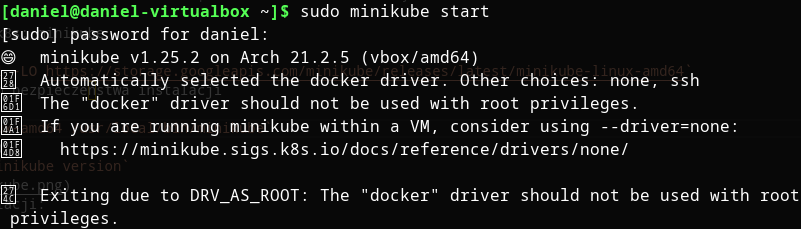  
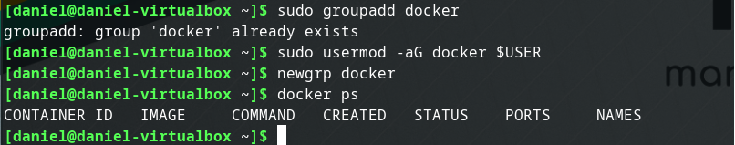  
Uruchomienie Kubernetes: `minikube start`  
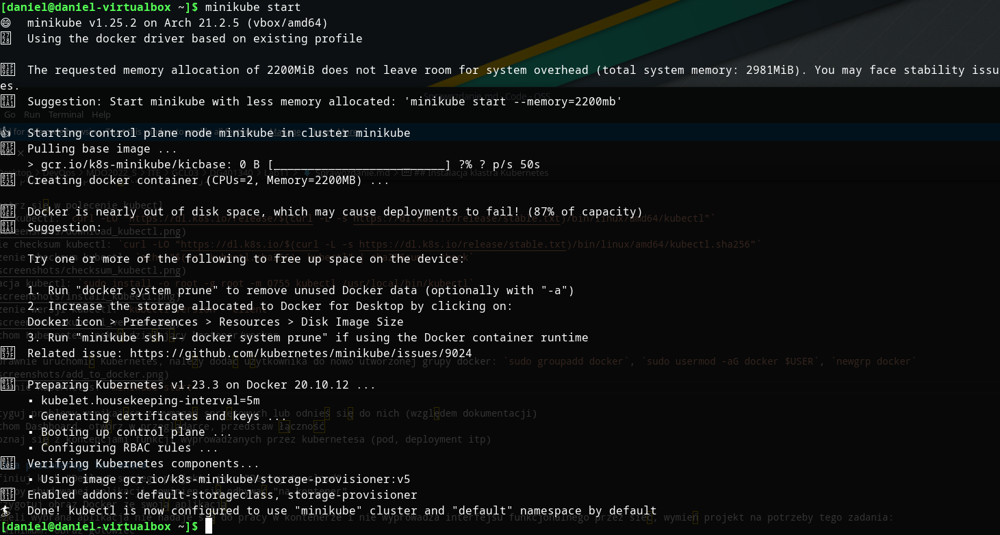  
Sprawdzenie dostępu do klastra i dodanie aliasu:  `kubectl get po -A`, `alias kubectl="minikube kubectl --"`
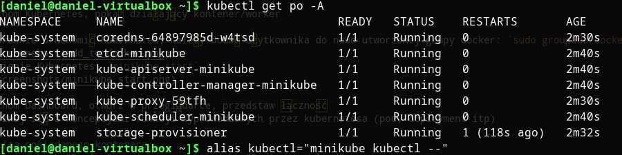  

 * **Uruchom Dashboard, otwórz w przeglądarce, przedstaw łączność** 

Uruchomienie dashboardu:  `minikube dashboard`  
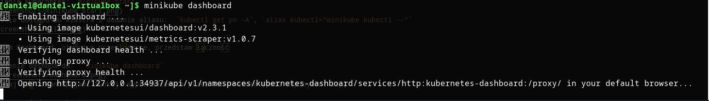  
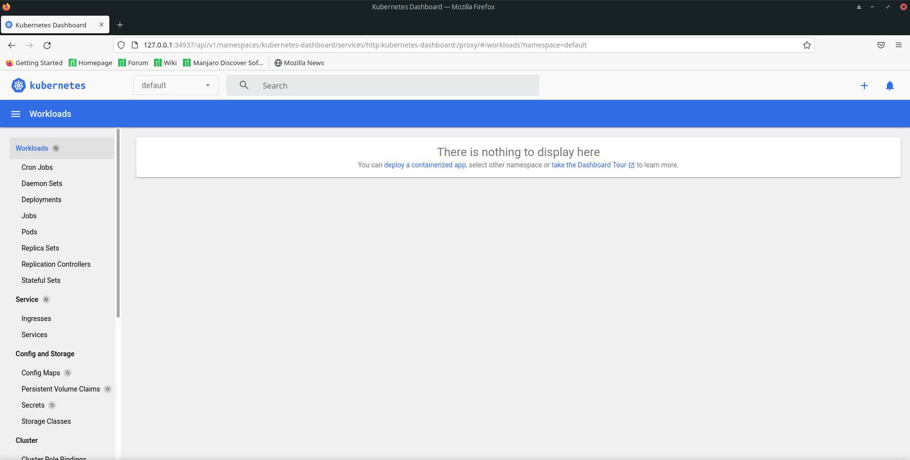  
 
## Analiza posiadanego kontenera
Wybrana aplikacja na projekt nie nadaje się do pracy w kontenerze, ponieważ jest to plugin do gry Minecraft, którego nie da się odpalić jako osobna aplikacja w kontenerze. Dlatego też do wykonania tego zadania wybrano inny obraz kontenera, którym jest [itzg/minecraft-server](https://hub.docker.com/r/itzg/minecraft-server). 
   
## Uruchamianie oprogramowania
 * Kontener uruchomiony w minikubie zostanie automatycznie ubrany w pod.

Uruchomienie poda: `minikube kubectl run -- mc --image=itzg/minecraft-server --port 25565 --labels app=mc --env="EULA=TRUE"`. Ustawiona zmienna środowiskowa jest wymagana w celu poprawnego uruchomienia serwera minecraft.  
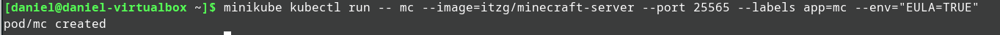  
 * Przedstaw że pod działa (via Dashboard oraz kubectl)  

Via Dashboard:  
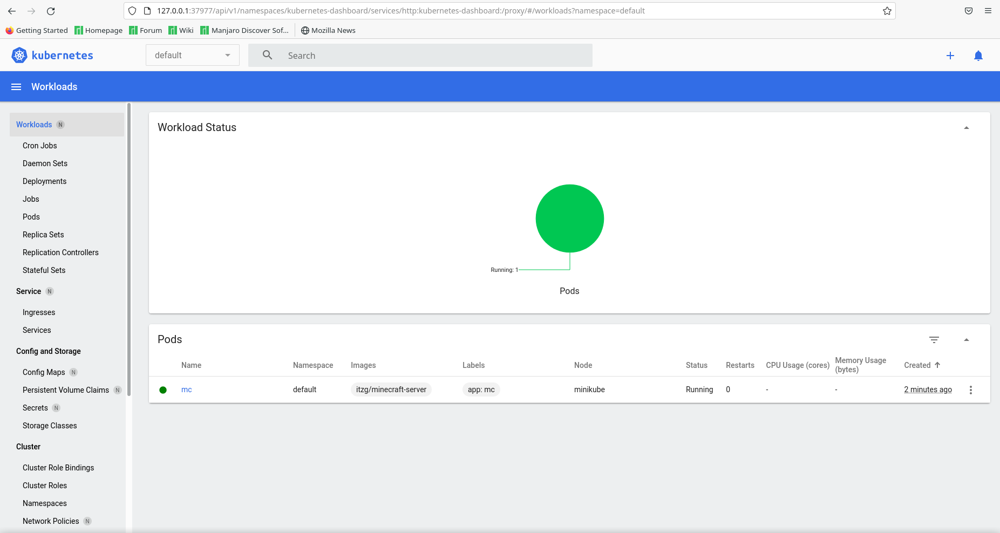  
Via kubectl: `kubectl get pods`, `kubectl describe pod mc`  
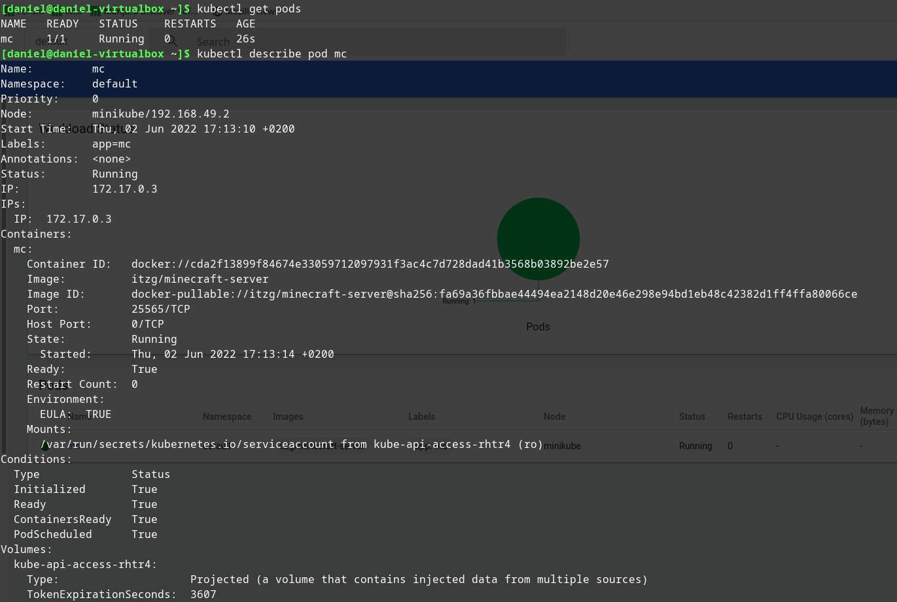  
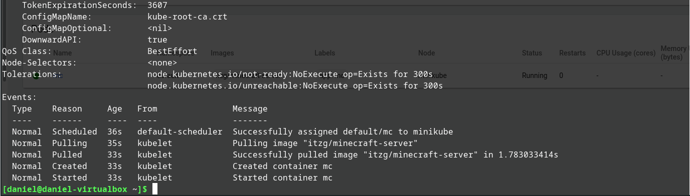  
 * Wyprowadź port celem dotarcia do eksponowanej funkcjonalności

Wyprowadzenie portu: `kubectl port-forward mc 25565:25565`  
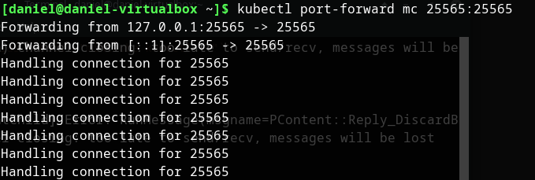  
 * Przedstaw komunikację z eskponowaną funkcjonalnością  

Przedstawienie funkcjonalności poprzez dodanie serwera do listy serwerów:  
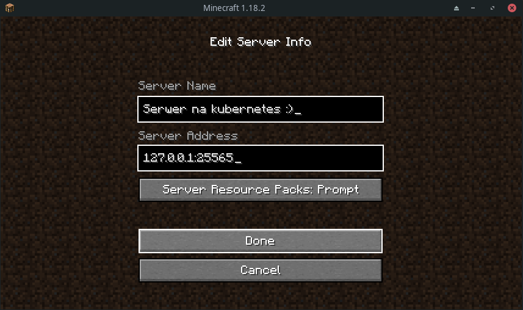  
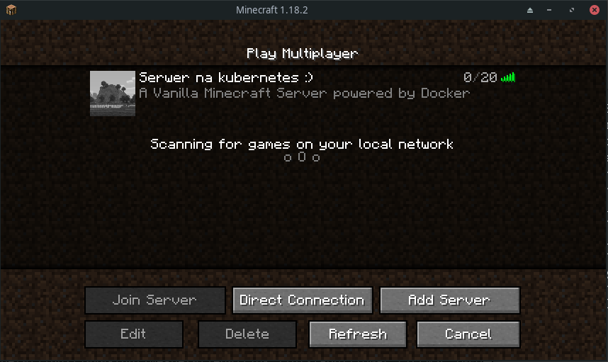  

## Przekucie wdrożenia manualnego w plik wdrożenia (wprowadzenie)
Utworzenie pliku wdrożenia razem z replikami [deployment.yml](./deployment.yml):  
```yml
apiVersion: apps/v1
kind: Deployment
metadata:
  name: mc
spec:
  replicas: 2
  selector:
    matchLabels:
      app: mc
  template:
    metadata:
      labels:
        app: mc
    spec:
      containers:
      - name: mc
        image: itzg/minecraft-server
        ports:
        - containerPort: 25565
        env:
          - name: EULA
            value: "TRUE"
```
  
```kubectl apply``` na pliku: `kubectl apply -f deployment.yml` i sprawdzenie działania podów: `kubectl get pods`  
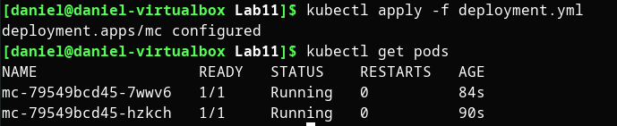  
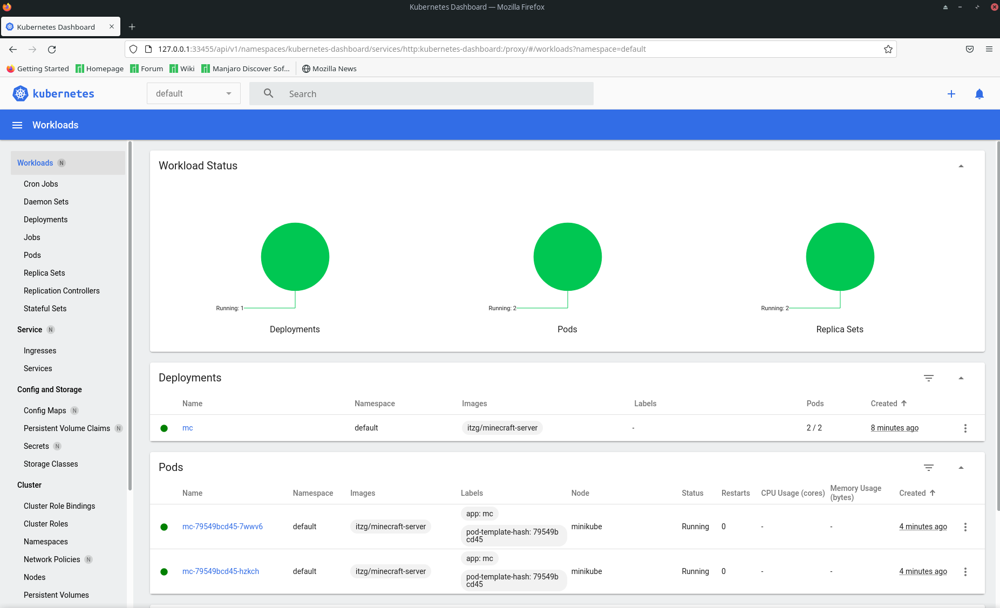  
