## Konwersja wdrożenia ręcznego na wdrożenie deklaratywne YAML
 * Wdrożenie z poprzednich zajęć zapisane jako plik, wzbogacone o 4 repliki ([Deployment](./deployment.yml)):  

 ```yml
apiVersion: apps/v1
kind: Deployment
metadata:
  name: mc
spec:
  replicas: 4
  selector:
    matchLabels:
      app: mc
  template:
    metadata:
      labels:
        app: mc
    spec:
      containers:
      - name: mc
        image: itzg/minecraft-server
        ports:
        - containerPort: 25565
        env:
          - name: EULA
            value: "TRUE"
 ```
 * Rozpoczęcie wdrożenia za pomocą ```kubectl apply -f deployment.yml```  i zbadanie stanu ```kubectl rollout status -f deployment.yml```:  

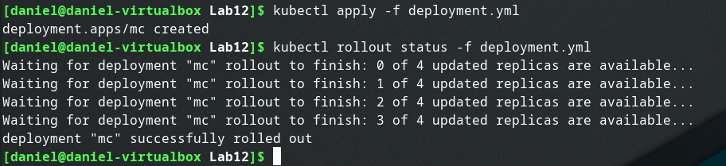  
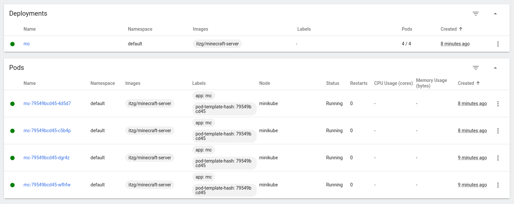  

## Przygotowanie nowego obrazu
 * Wybranie obrazu:  

Został wybrany obraz z DockerHub, ponieważ mój projekt nie wyprowadzał portów, przez co był niekompatybilny z zadaniami. Wybrany projekt to: [itzg/minecraft-server](https://hub.docker.com/r/itzg/minecraft-server), jedna wersja to latest (ta bez określonego tagu), a druga to 2022.3.0.

 * Przygotuj wersję obrazu, którego uruchomienie kończy się błędem

Aby uruchomienie wybranego obrazu zakończyło się niepowodzeniem, w moim przypadku wystarczy edytować plik ([Deployment](./deployment.yml)) i usunąć z niego zmienną środowiskową "EULA", spowoduje to, że kontener poprawnie nie wtanie i będzie się on restartował w nieskończoność. Dodatkowo do pliku deployment.yml należy dodać dwie dodatkowe opcje spec: ```minReadySeconds: 55 progressDeadlineSeconds: 60```, dzięki nim po 60 sekundach ciągłego restartowania kontenerów, deployment zwróci błąd, który będzie można wykryć w skrypcie. Końcowa wersja pliku deployment.yml dla kontenerów nieuruchamiających się wygląda następująco ([deployment_error.yml](./deployment_error.yml)):
```yml
apiVersion: apps/v1
kind: Deployment
metadata:
  name: mc
spec:
  minReadySeconds: 55
  progressDeadlineSeconds: 60
  replicas: 2
  selector:
    matchLabels:
      app: mc
  template:
    metadata:
      labels:
        app: mc
    spec:
      containers:
      - name: mc
        image: itzg/minecraft-server:2022.3.0
        ports:
        - containerPort: 25565
```
Bład pokazujący ciągłe uruchamianie się kontenera w pętli:  
  

## Zmiany w deploymencie
 * Aktualizuj plik YAML z wdrożeniem i przeprowadzaj je ponownie po zastosowaniu następujących zmian:
   * zwiększenie replik

Zwiększenie replicas z 4 na 5 i ponowne użycie polecenia ```kubectl apply```.
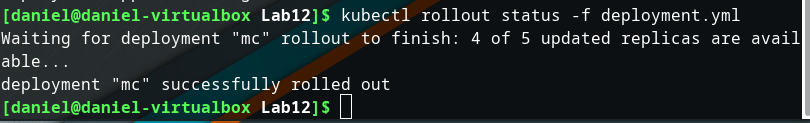  
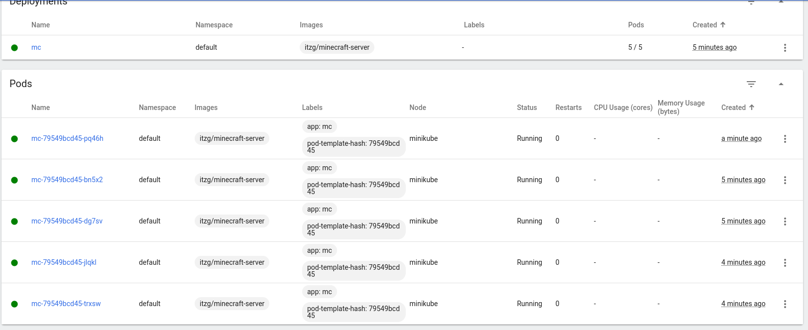   

   * zmniejszenie liczby replik do 1

Zmniejszenie replicas z 5 na 1 i ponowne użycie polecenia ```kubectl apply```. Prezentacja zmiany z dashboard (liczba podsów 5/1, a potem 1/1).  
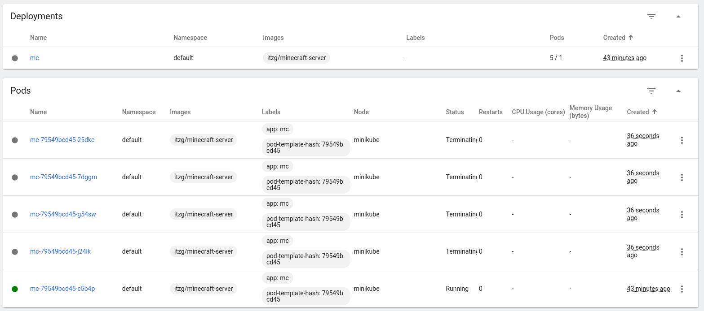  
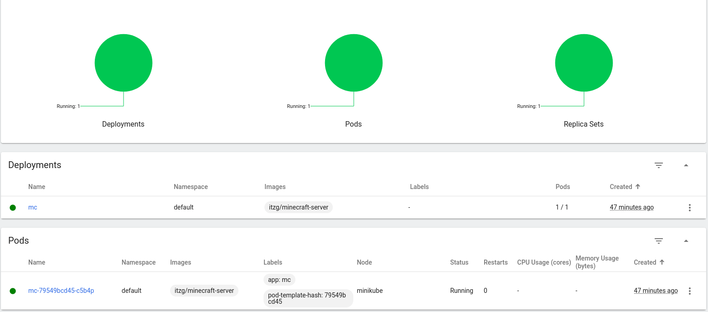  

   * zmniejszenie liczby replik do 0

Zmniejszenie replicas z 1 na 0 i ponowne użycie polecenia ```kubectl apply```.  
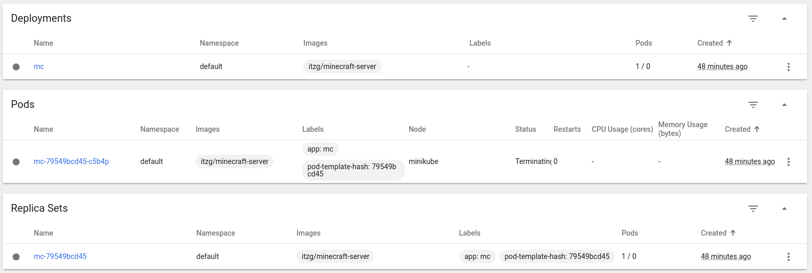  
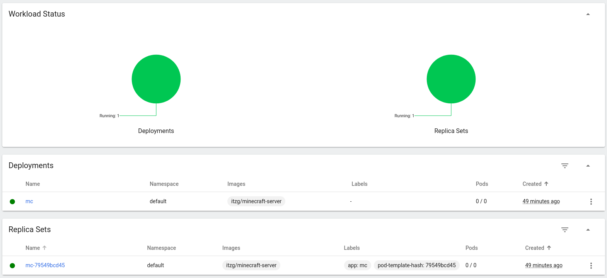  

   * Zastosowanie nowej wersji obrazu  

Zmiana image na: ```image: itzg/minecraft-server:latest``` oraz zwiększenie replicas na 2 z 0.  
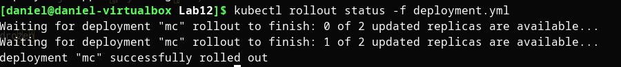  

   * Zastosowanie starszej wersji obrazu  

Zmiana image na: ```image: itzg/minecraft-server:2022.3.0```. 
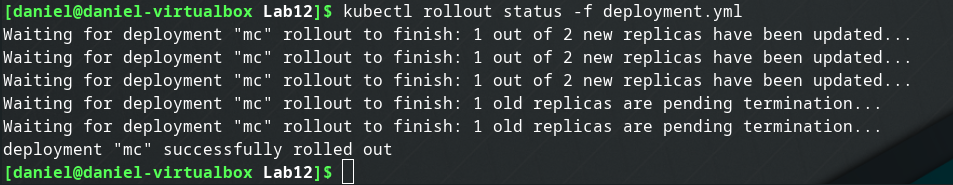  

 * Przywracaj poprzednie wersje wdrożeń za pomocą poleceń  

Aby wyświetlić historię wdrożeń zostało użyte polecenie ```kubectl rollout history deployment/mc```, po wybraniu wdrożenia użyto polecenia ```kubectl rollout undo deployment/mc  --to-revision 1```:  
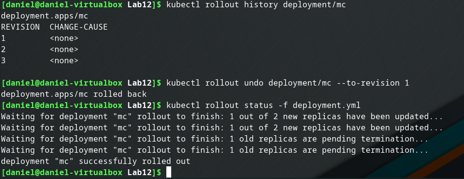  

## Kontrola wdrożenia
 * Napisz skrypt weryfikujący, czy wdrożenie "zdążyło" się wdrożyć (60 sekund) - [deploy.sh](./deploy.sh)

```sh
kubectl apply -f deployment.yml
sleep 60
kubectl rollout status deployment/mc
if [[ "$?" -ne 0 ]] then
    echo "deployment failed!"
else
    echo "deployment succeeded"
fi
```  
Po usunięciu działającego deploya, uruchomiono skrypt w celu przetestowania jego działania dla sprawnych kontenerów ```./deploy.sh```:  
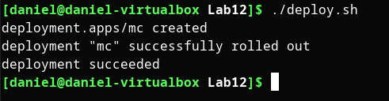   
Ponownie usunięto działającego deploya i uruchomiono skrypt, ale tym razem dla niedziałających kontenerów (Po usunięciu zmiennej środowiskowej EULA oraz dodaniu dwóch opcji w sekcji spec w deployment.yml, tak jak to opisano wyżej. Użyto edytowanego pliku [deployment.yml](./deployment.yml), który po edycji wyglądał jak [deployment_error.yml](./deployment_error.yml), przywrócono go do początkowej wersji, w celu wrzucenia obu wersji na repozytorium):  
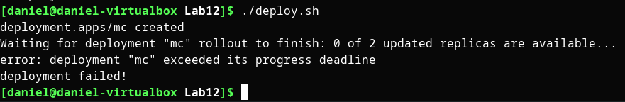   

 
## Strategie wdrożenia
 * Przygotuj wersje wdrożeń stosujące następujące strategie wdrożeń
   * Recreate

Do pliku deployment'u należało w sekcji spec dopisać strategię o typie Recreate:  
```yml
  strategy:
    type: Recreate
```
Cały plik można znaleźć tutaj: [deployment_recreate.yml](./deployment_recreate.yml)  
Efekty uruchomienia:  
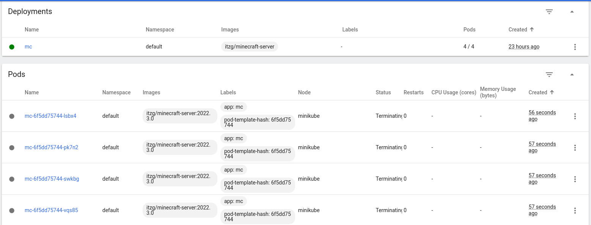  
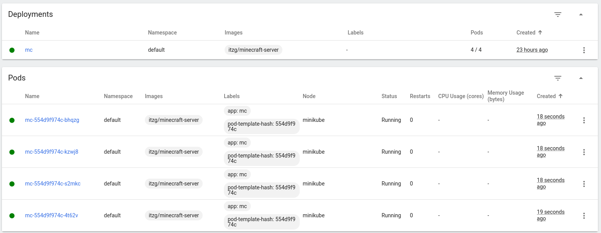  
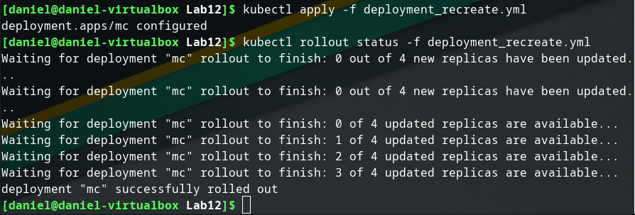  
Jak można zaobserwować na wyżej załączonych zrzutach ekranu, strategia recreate działa tak, że usuwa wszystkie istniejące pody, a po ich usunieciu uruchamia nowe z nową wersją oprogramowania.

   * Rolling Update

Do pliku deployment'u należało w sekcji spec należało dopisać:  
```yml
  strategy:
    type: RollingUpdate
    rollingUpdate:
      maxSurge: 1
      maxUnavailable: 1
```
Dodatkowo edytowano wersję obrazu na starszą (2022.3.0), aby deployment wprowadzał jakieś zmiany, ponieważ w innym przypadku od razu stwierdzi, że został on poprawnie wdrożony. Cały plik wdrożenia - [deployment_rollingupdate.yml](./deployment_rollingupdate.yml) 
Efekty uruchomienia:  
  
  
Po obserwacji zrzutów ekranu (i przeczytaniu dokumentacji) można zauważyć, że strategia ta nie usuwa wszystkich podów jednocześnie. Poprzez opcję ```maxUnavailable``` określiłem, że jedynie 1 pod może być niedostępny podczas wdrażania, co widać na pierwszym zrzucie ekranu (1 pod ma status Terminating, a tylko 3 z 4 działają poprawnie). Reszta podów (3) działa ciągle na starym obrazie, a dwa nowe pody uruchamiane są z nowym obrazem. Uruchamiane są dwa, ponieważ ```maxSurge``` jest ustawione na wartość 1, czyli 1 dodatkowy pod może być tworzony ponad określoną ilość (w tym przypadku 5/4). Na zrzucie ekranu widać 3 działające pody (na starym obrazie), 1 w stanie terminating oraz 2 w stanie tworzenia, czyli 3 + 2 = 5, więc ```maxSurge: 1``` nie zostało przekroczone i tylko jeden dodatkowy pod jest uruchamiany (pod ze statusem terminating, nie jest wliczany w działające). Czyli dzięki tej strategii, aplikacja nie posiada przerwy w działaniu (zawsze jakiś pod działa) tak jak to jest w przypadku strategii Recreate, gdzie aplikacja nie jest dostępna w momencie uruchamiania wszystkich podów, po usunięciu poprzednich.
  
   * Canary Deployment workload

Poprzedni deployment został usunięty i zostały utworzone nowe dwa pliki: [deployment_canary.yml](./deployment_canary.yml) oraz [deployment_canary2.yml](./deployment_canary2.yml). Dodano do nich w sekcji template.metadata dwie nowe opcje: ```track: new``` oraz ```version: "2.0"``` (track i version są różne dla tych dwóch deploymentów). Najpierw uruchamiany jest [deployment_canary.yml](./deployment_canary.yml), a potem [deployment_canary2.yml](./deployment_canary2.yml), czego efekt można zaobserwowac poniżej:  
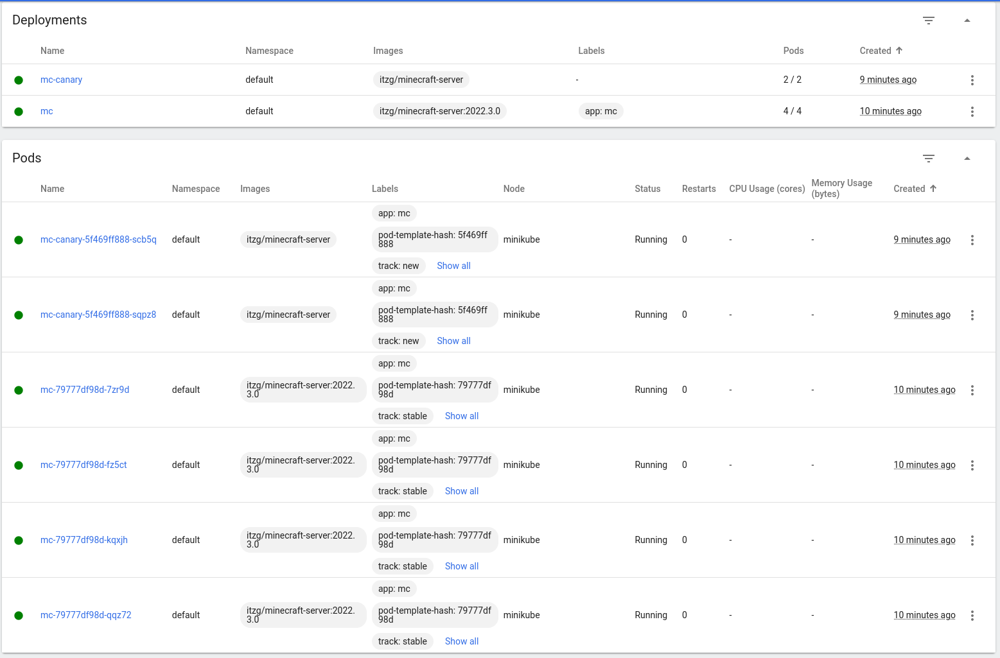  
  
Jak można zauważyć na dołączonych zrzutach ekranu, obie wersje działają równolegle (4 pody na starej wersji i 2 pody na nowej wersji), ale mają różne tagi (stara wersja "stable", a nowa "new"). W tym momencie ruch pomiędzy tymi podami powinien zostać rozdystrybuowany poprzez serwis (jest to także plik .yml tak jak deployment, tylko kind to Service, a nie Deployment, a w se;ectorze wybiera się odpowiednie tagi, aby klient miał dostep do danej wersji oprogramowania - prosta wersja), który odpowiednią ilość ruchu (np. 5%) przekierowywuje na nową wersję, lub osoby które chcą korzystać z nowej wersji. Gdy nowa wersja działa poprawnie i nie powoduje żadnych błędów, to coraz większa częśc ruchu jest przekierowywana na nowe pody, wraz ze zwiększaniem ich ilości, aż do momentu, gdy stara wersjia może zostać wyłączona. Zaletą takiej strategii w porownaniu do np. Blue/Green Deployment jest taka, że nie przekierowywuje się całego ruchu na nową wersję, tylko stopniowo zwiększa się ilość nowych użytkowników na nowej wersji wraz ze wzrostem stabilności wersji (po przetestowaniu przez mały procent ludzi), dzięki czemu większa część klientów nie będzie musiała korzystać z nowej wersji oprogramowania, która może zawierać błedy. W Blue/Green Deployment po przekierowaniu całego ruchu na nową wersję, może się okazać, że zawiera ona jakiś krytyczny błąd, który sprawi, że wszyscy klienci nie będą mogli korzystać z aplikacji, aż do ponownego przełączenia na starą wersję. Kubernetes nie dostarcza wbudowanej strategii Canary i należy ją samemu zaimplementować.

 * Zaobserwuj i opisz różnice
Różnice zostały opisane zaraz pod zrzutami ekranu z efektem.